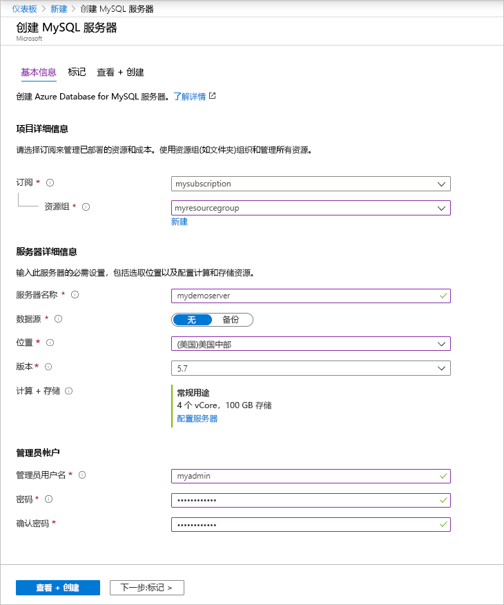
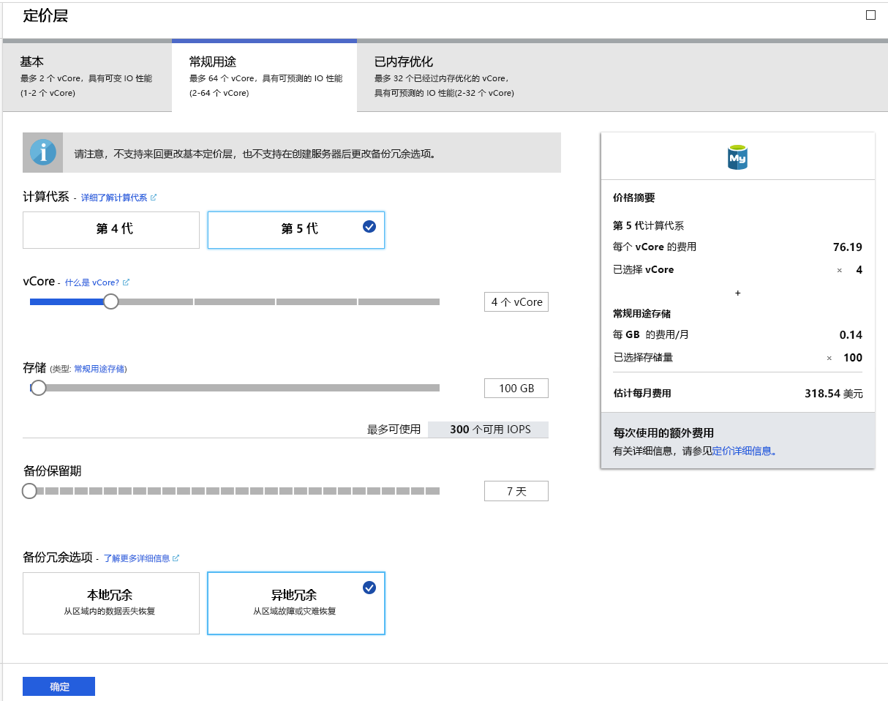

# <a name="create-an-azure-database-for-mysql-server-by-using-the-azure-portal"></a>使用 Azure 门户创建 Azure Database for MySQL 服务器

Azure Database for MySQL 是一种托管服务，可用于在云中运行、管理和缩放高可用性的 MySQL 数据库。 此快速入门介绍如何使用 Azure 门户在大约五分钟内创建 Azure Database for MySQL 服务器。  

如果还没有 Azure 订阅，可以在开始前创建一个[免费 Azure 帐户](https://azure.microsoft.com/free/)。

## <a name="sign-in-to-the-azure-portal"></a>登录到 Azure 门户
打开 Web 浏览器，然后访问 [Azure 门户](https://portal.azure.com/)。 输入登录到门户所需的凭据。 默认视图是服务仪表板。

## <a name="create-an-azure-database-for-mysql-server"></a>创建 Azure Database for MySQL 服务器
创建 Azure Database for MySQL 服务器时，请使用定义好的一组[计算和存储资源](./concepts-compute-unit-and-storage.md)。 请在 [Azure 资源组](../azure-resource-manager/resource-group-overview.md)中创建该服务器。

按照以下步骤创建 Azure Database for MySQL 服务器：

1. 选择门户左上角的“创建资源”按钮 (+)。

2. 选择“数据库” > “Azure Database for MySQL”。 还可以在搜索框中键入“MySQL”以查找该服务。

   

3. 使用以下信息填写“新服务器详细信息”窗体：
   
   

    **设置** | 建议的值 | 字段说明 
    ---|---|---
    服务器名称 | 唯一的服务器名称 | 选择用于标识 Azure Database for MySQL 服务器的唯一名称。 例如，mydemoserver。 域名 *.mysql.database.azure.com* 将追加到所提供的服务器名称后面。 服务器名称只能包含小写字母、数字和连字符 (-) 字符。 必须包含 3 到 63 个字符。
    订阅 | 订阅 | 选择要用于服务器的 Azure 订阅。 如果有多个订阅，请选择要计费的资源所在的订阅。
    资源组 | myresourcegroup | 提供新的或现有的资源组名称。    资源组|myresourcegroup| 新的资源组名称，或订阅中的现有资源组。
    选择源 | *空白* | 选择“空白”可从头开始创建新服务器。 （如果要从现有 Azure Database for MySQL 服务器的异地备份创建服务器，请选择“备份”）。
    服务器管理员登录名 | myadmin | 连接到服务器时需使用的登录帐户。 管理员登录名不能是“azure_superuser”、“admin”、“administrator”、“root”、“guest”或“public”。
    密码 | *由用户选择* | 为服务器管理员帐户提供新密码。 必须包含 8 到 128 个字符。 密码必须包含以下字符类别中的三类：英文大写字母、英文小写字母、数字 (0-9) 以及非字母数字字符（!、$、#、% 等）。
    确认密码 | *由用户选择*| 确认管理员帐户密码。
    Location | *离用户最近的区域*| 选择最靠近用户或其他 Azure 应用程序的位置。
    版本 | 最新版本| 最新版本，有特定要求（即需要其他版本）的除外。
    定价层 | **常规用途**、**第 4 代**、**2 个 vCore**、**5 GB**、**7 天**、**异地冗余** | 新服务器的计算、存储和备份配置。 选择“定价层”。 接下来，选择“常规用途”选项卡。*第 4 代*、*2 个 vCore*、*5 GB*和 *7 天*分别是**计算的代**、**vCore**、**存储**和**备份保留期**的默认值。 可以按原样保留这些滑块。 若要在异地冗余存储中启用服务器备份，请从**备份冗余选项**中选择“异地冗余”。 若要保存此定价层选择，请选择“确定”。 下一个屏幕截图捕获了这些选择。
  
    > [!IMPORTANT]
    > 在此处指定的服务器管理员登录名和密码是以后在本快速入门中登录到服务器及其数据库所必需的。 请牢记或记录此信息，以后会使用到它。
    > 

   

4.  选择“创建”以预配服务器。 预配可能需要长达 20 分钟的时间。
   
5.  在工具栏上选择“通知”（钟形图标）以监视部署过程。
   
  默认情况下，将在服务器下创建以下数据库：**information_schema**、**mysql**、**performance_schema** 和 **sys**。

## <a name="configure-a-server-level-firewall-rule"></a>配置服务器级防火墙规则

Azure Database for MySQL 服务在服务器级别创建防火墙。 除非创建了防火墙规则来为特定的 IP 地址打开防火墙，否则此防火墙会阻止外部应用程序和工具连接到服务器和服务器上的任何数据库。 

1.   部署完成后，找到服务器。 可以根据需要进行搜索。 例如，从左侧菜单选择“所有资源”。 然后键入服务器名称（例如 **mydemoserver**），以搜索新创建的服务器。 从搜索结果列表中选择服务器名称。 服务器的“概述”页面随即打开，其中提供了用于进一步配置的选项。

2. 在服务器页中，选择“连接安全性”。

3.  在“防火墙规则”标题下，选择“规则名称”列中的空白文本框，开始创建防火墙规则。 

   对于本快速入门，请在每个列的框中填充以下值，启用到服务器的所有 IP 地址：

   规则名称 | 起始 IP | 结束 IP 
   ---|---|---
   AllowAllIps |  0.0.0.0 | 255.255.255.255
   
   

   允许所有 IP 地址是不安全的。 提供此示例是为了简单起见，但在实际方案中，需了解为应用程序和用户添加的准确的 IP 地址范围。 

4. 在“连接安全性”页的上部工具栏中，选择“保存”。 等到指示更新已成功完成的通知出现后，再继续操作。 

   > [!NOTE]
   > 连接到 Azure Database for MySQL 时，经端口 3306 进行通信。 如果尝试从企业网络内部进行连接，则可能不允许经端口 3306 的出站流量。 如果是这样，则无法连接到服务器，除非 IT 部门打开了端口 3306。
   > 

## <a name="get-the-connection-information"></a>获取连接信息
若要连接到数据库服务器，需提供完整的服务器名称和管理员登录凭据。 你此前可能已在本快速入门文章中记下这些值。 如果没有记下这些值，可以在 Azure 门户的服务器“概览”页或“属性”页中轻松地找到服务器名称和登录信息。

若要查找这些值，请执行以下步骤： 

1. 打开服务器的“概览”页。 记下“服务器名称”和“服务器管理员登录名”。 

2. 将光标悬停在每个字段，然后复制图标就会显示在文本右侧。 根据需要选择复制图标即可复制这些值。

在此示例中，服务器名称是 **mydemoserver.mysql.database.azure.com**，服务器管理员登录名是 **myadmin@mydemoserver**。

## <a name="connect-to-mysql-by-using-the-mysql-command-line-tool"></a>使用 mysql 命令行工具连接到 MySQL
可以通过多个应用程序连接到 Azure Database for MySQL 服务器。 

让我们先使用 [mysql](https://dev.mysql.com/doc/refman/5.7/en/mysql.html) 命令行工具来演示如何连接到该服务器。 也可根据此处所述使用 Web 浏览器和 Azure Cloud Shell，不安装其他软件。 如果已通过本地方式安装了 mysql 实用程序，也可从该处进行连接。

1. 通过 Azure 门户右上角的终端图标 (**>_**) 启动 Azure Cloud Shell。


2.  Azure Cloud Shell 会在浏览器中打开，可以在其中键入 bash shell 命令。

   

3. 在 Cloud Shell 提示符下键入 mysql 命令行，连接到 Azure Database for MySQL 服务器。

    若要借助 mysql 实用程序连接到 Azure Database for MySQL 服务器，请使用以下格式：

    ```bash
    mysql --host <fully qualified server name> --user <server admin login name>@<server name> -p
    ```

    例如，以下命令连接到示例服务器：

    ```azurecli-interactive
    mysql --host mydemoserver.mysql.database.azure.com --user myadmin@mydemoserver -p
    ```

    mysql 参数 |建议的值|说明
    ---|---|---
    --host | *服务器名称* | 此前在创建 Azure Database for MySQL 服务器时使用过的服务器名称值。 示例服务器为 **mydemoserver.mysql.database.azure.com**。请使用完全限定的域名 (\*.mysql.database.azure.com)，如示例中所示。 如果不记得服务器名称，请按上一部分的步骤操作，以便获取连接信息。 
    --user | 服务器管理员登录名 |此前在创建 Azure Database for MySQL 服务器时提供的服务器管理员登录用户名。 如果不记得用户名，请按上一部分的步骤操作，以便获取连接信息。 格式为 username@servername。
    -p | 等待系统提示 |如果系统提示，请提供在创建服务器时提供的密码。 注意，键入密码字符时，这些字符不会显示在 bash 提示符处。 输入密码后，选择 Enter。

   连接后，mysql 实用程序会显示 `mysql>` 提示符，提示你键入命令。 

   下面是 mysql 输出示例：

    ```bash
    Welcome to the MySQL monitor.  Commands end with ; or \g.
    Your MySQL connection id is 65505
    Server version: 5.6.26.0 MySQL Community Server (GPL)
    
    Copyright (c) 2000, 2017, Oracle and/or its affiliates. All rights reserved.
    
    Oracle is a registered trademark of Oracle Corporation and/or its
    affiliates. Other names may be trademarks of their respective
    owners.

    Type 'help;' or '\h' for help. Type '\c' to clear the current input statement.
    
    mysql>
    ```
    > [!TIP]
    > 如果未将防火墙配置为允许 Azure Cloud Shell 的 IP 地址，则会出现以下错误：
    >
    > 错误 2003 (28000): 不允许 IP 地址为 123.456.789.0 的客户端访问服务器。
    >
    > 若要解决此错误，请确保服务器配置符合本文“配置服务器级防火墙规则”部分相关步骤的要求。

4. 若要确保连接正常，请在 mysql> 提示符处键入 `status`，以便查看服务器状态。

    ```sql
    status
    ```

   > [!TIP]
   > 有关其他命令，请参阅 [MySQL 5.7 参考手册--第 4.5.1 章](https://dev.mysql.com/doc/refman/5.7/en/mysql.html)。

5.  在 mysql> 提示符处键入以下命令，创建空数据库：
    ```sql
    CREATE DATABASE quickstartdb;
    ```
    该命令可能需要一定的时间才能完成。 

    在 Azure Database for MySQL 数据库中，可创建一个或多个数据库。 可以选择为每个服务器创建单一数据库来使用所有资源，还可以创建多个数据库来共享资源。 可以创建的数据库数目没有限制，但多个数据库共享相同的服务器资源。 

6. 通过在 mysql > 提示符处键入以下命令来列出数据库：

    ```sql
    SHOW DATABASES;
    ```

7.  键入 `\q`，然后选择 Enter 键，退出 mysql 工具。 完成后即可关闭 Azure Cloud Shell。

现在，你已连接到 Azure Database for MySQL 服务器并创建空白用户数据库。 请转到下一部分进行类似的练习。 下一练习使用另一常用工具（即 MySQL Workbench）连接到同一服务器。

## <a name="connect-to-the-server-by-using-the-mysql-workbench-gui-tool"></a>使用 MySQL Workbench GUI 工具连接到服务器
若要使用 GUI 工具 MySQL Workbench 连接到服务器，请执行以下步骤：

1.  打开客户端计算机上的 MySQL Workbench 应用程序。 可以从 [Download MySQL Workbench](https://dev.mysql.com/downloads/workbench/)（下载 MySQL Workbench）下载并安装 MySQL Workbench。

2. 创建新连接。 单击“MySQL 连接”标题旁边的加号 (+) 图标。

3. 在“设置新连接”对话框的“参数”选项卡上，输入服务器连接信息。占位符值作为示例显示。 请将“主机名”、“用户名”和“密码”替换为自己的值。

   

    |设置 |建议的值|字段说明|
    |---|---|---|
     连接名称 | 演示连接 | 此连接的标签。 |
    连接方法 | 标准 (TCP/IP) | 标准 (TCP/IP) 就足够了。 |
    主机名 | *服务器名称* | 此前在创建 Azure Database for MySQL 服务器时使用过的服务器名称值。 示例服务器为 **mydemoserver.mysql.database.azure.com**。请使用完全限定的域名 (\*.mysql.database.azure.com)，如示例中所示。 如果不记得服务器名称，请按上一部分的步骤操作，以便获取连接信息。|
     端口 | 3306 | 连接到 Azure Database for MySQL 服务器时需要使用的端口。 |
    用户名 |  服务器管理员登录名 | 此前在创建 Azure Database for MySQL 服务器时提供的服务器管理员登录信息。 示例用户名为 myadmin@mydemoserver。 如果不记得用户名，请按上一部分的步骤操作，以便获取连接信息。 格式为 username@servername。
    密码 | 你的密码 | 选择“在保管库中存储...”按钮来保存密码。 |

4. 选择“测试连接”以测试是否所有参数均已正确配置。 然后选择“确定”以保存连接。 

    > [!NOTE]
    > 默认情况下，SSL 是在服务器上强制实施的，需要额外配置才能成功进行连接。 有关详细信息，请参阅[配置应用程序中的 SSL 连接性以安全连接到 Azure Database for MySQL](./howto-configure-ssl.md)。 就本快速入门来说，若要禁用 SSL，请转到 Azure 门户。 然后选择“连接安全性”页，禁用“强制实施 SSL”连接切换按钮。

## <a name="clean-up-resources"></a>清理资源
可以通过两种方式清理在快速入门中创建的资源。 可以删除 [Azure 资源组](../azure-resource-manager/resource-group-overview.md)，其中包括资源组中的所有资源。 若要保持其他资源原封不动，请只删除单服务器资源。

> [!TIP]
> 本教程系列中的其他快速入门教程是在本文的基础上制作的。 如果打算继续使用快速入门，请不要清除在本快速入门中创建的资源。 如果不打算继续，请执行以下步骤，删除通过本快速入门创建的所有资源。
>

若要删除包括新建服务器在内的整个资源组，请执行以下步骤：

1.  在 Azure 门户中查找资源组。 在左侧菜单中选择“资源组”，然后选择资源组的名称（例如 myresourcegroup 示例）。

2.  在资源组页上，选择“删除”。 然后在框中键入确认删除的资源组的名称（例如 myresourcegroup 示例），再选择“删除”。

若只删除新创建的服务器，请执行以下步骤：

1.  在 Azure 门户中找到服务器（如果尚未将其打开）。 在 Azure 门户左侧的菜单中，选择“所有资源”。 然后搜索所创建的服务器。

2.  在“概览”页上，选择“删除”。 

   

3.  确认要删除的服务器的名称，并显示其下受影响的数据库。 在框中键入服务器名称（例如 **mydemoserver**）。 选择“删除”。

## <a name="next-steps"></a>后续步骤

> [!div class="nextstepaction"]
> [设计第一个 Azure Database for MySQL 数据库](./tutorial-design-database-using-portal.md)

