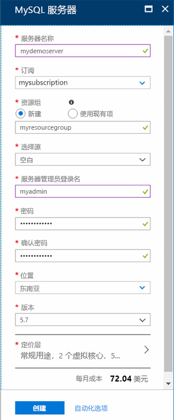
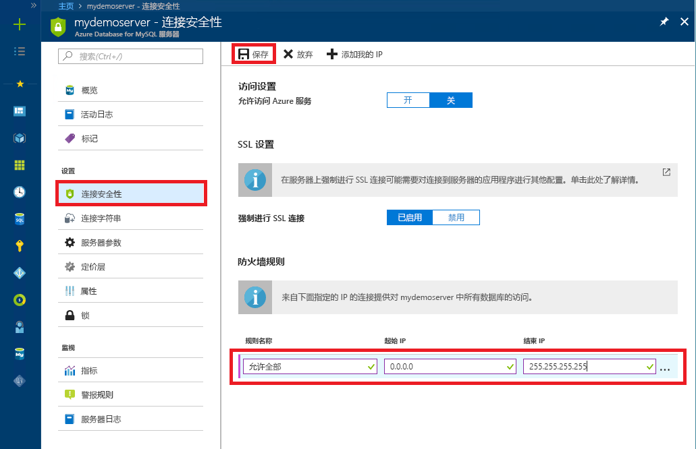

# <a name="tutorial-design-an-azure-database-for-mysql-database-using-the-azure-portal"></a>教程：使用 Azure 门户设计 Azure Database for MySQL 数据库

Azure Database for MySQL 是一种托管服务，可用于在云中运行、管理和缩放高可用性的 MySQL 数据库。 使用 Azure 门户可以轻松管理服务器和设计数据库。

本教程介绍如何使用 Azure 门户完成以下操作：

> [!div class="checklist"]
> * 创建 Azure Database for MySQL
> * 配置服务器防火墙
> * 使用 mysql 命令行工具创建数据库
> * 加载示例数据
> * 查询数据
> * 更新数据
> * 还原数据

如果还没有 Azure 订阅，可以在开始前创建一个[免费 Azure 帐户](https://azure.microsoft.com/free/)。

## <a name="sign-in-to-the-azure-portal"></a>登录到 Azure 门户

打开最喜爱的 Web 浏览器，然后访问 [Microsoft Azure 门户](https://portal.azure.com/)。 输入登录到门户所需的凭据。 默认视图是服务仪表板。

## <a name="create-an-azure-database-for-mysql-server"></a>创建 Azure Database for MySQL 服务器

创建 Azure Database for MySQL 服务器时，会使用定义好的一组[计算和存储资源](./concepts-compute-unit-and-storage.md)。 将在 [Azure 资源组](https://docs.microsoft.com/azure/azure-resource-manager/resource-group-overview)中创建服务器。

1. 选择门户左上角的“创建资源”按钮 (+)  。

2. 选择“数据库”   >   “Azure Database for MySQL”。 如果在“数据库”  类别下找不到 MySQL 服务器，请单击“查看全部”  显示所有可用的数据库服务。 还可以在搜索框中键入“Azure Database for MySQL”  快速查找该服务。
   
   

3. 单击“Azure Database for MySQL”  磁贴。 填写 Azure Database for MySQL 窗体。
   
   

    **设置** | **建议的值** | **字段说明**
    ---|---|---
    服务器名称 | 唯一的服务器名称 | 选择用于标识 Azure Database for MySQL 服务器的唯一名称。 例如，mydemoserver。 域名 *.mysql.database.azure.com* 将追加到所提供的服务器名称后面。 服务器名称只能包含小写字母、数字和连字符 (-) 字符。 必须包含 3 到 63 个字符。
    订阅 | 订阅 | 选择要用于服务器的 Azure 订阅。 如果有多个订阅，请选择要计费的资源所在的订阅。
    资源组 |  myresourcegroup | 提供新的或现有的资源组名称。
    选择源 | *空白* | 选择“空白”  可从头开始创建新服务器。 （如果要从现有 Azure Database for MySQL 服务器的异地备份创建服务器，请选择“备份”  ）。
    服务器管理员登录名 | myadmin | 连接到服务器时需使用的登录帐户。 管理员登录名不能是“azure_superuser”、“admin”、“administrator”、“root”、“guest”或“public”。      
    密码 | *由用户选择* | 为服务器管理员帐户提供新密码。 必须包含 8 到 128 个字符。 密码必须包含以下三个类别的字符：英文大写字母、英文小写字母、数字 (0-9)和非字母数字字符（!, $, #, % 等）。
    确认密码 | *由用户选择*| 确认管理员帐户密码。
    位置 | *离用户最近的区域*| 选择最靠近用户或其他 Azure 应用程序的位置。
    版本 |  最新版本| 最新版本，有特定要求（即需要其他版本）的除外。
    定价层 | **常规用途**、**第 5 代**、**2 个 vCore**、**5 GB**、**7 天**、**异地冗余** | 新服务器的计算、存储和备份配置。 选择“定价层”。  接下来，选择“常规用途”  选项卡。“第 5 代”、“2 个 vCore”、“5 GB”和“7 天”分别是“计算代”、“vCore”、“存储”和“备份保留期”的默认值。         可以将这些滑块保留原样。 若要在异地冗余存储中启用服务器备份，请从**备份冗余选项**中选择“异地冗余”  。 若要保存此定价层选择，请选择“确定”  。 下一个屏幕截图捕获了这些选择。

   

   > [!TIP]
   > 启用“自动增长”  后，当接近分配的限制时，服务器会增加存储空间，而不会影响工作负荷。

4. 单击“查看 + 创建”  。 可单击工具栏上的“通知”  按钮以监视部署过程。 部署最多可能需要 20 分钟。

## <a name="configure-firewall"></a>配置防火墙

Azure Databases for MySQL 受防火墙保护。 默认情况下，将拒绝与服务器和服务器内数据库的所有连接。 首次连接到 Azure Database for MySQL 之前，请配置防火墙以添加客户端计算机的公共网络 IP 地址（或 IP 地址范围）。

1. 单击新创建的服务器，并单击“连接安全性”  。

   
2. 可以“添加我的 IP”  或在此处配置防火墙规则。 创建规则后请记得单击“保存”  。
现在可以使用 mysql 命令行工具或 MySQL Workbench GUI 工具连接服务器。

> [!TIP]
> Azure Database for MySQL 通过端口 3306 进行通信。 如果尝试从企业网络内部进行连接，则该网络的防火墙可能不允许经端口 3306 的出站流量。 如果是这样，则无法连接到 Azure MySQL 服务器，除非 IT 部门打开了端口 3306。

## <a name="get-connection-information"></a>获取连接信息

从 Azure 门户获取 Azure Database for MySQL 服务器的完全限定**服务器名称**和**服务器管理员登录名**。 使用 mysql 命令行工具通过完全限定的服务器名称连接到服务器。

1. 在 [Azure 门户](https://portal.azure.com/)中，单击左侧菜单中的“所有资源”  ，键入名称，然后搜索“Azure Database for MySQL 服务器”。 选择服务器名称以查看详细信息。

2. 在“概述”  页上，记下**服务器名称**和**服务器管理员登录名**。 可以单击每个字段旁边的“复制”按钮，将其复制到剪贴板。
   

在此示例中，服务器名称是 mydemoserver.mysql.database.azure.com  ，服务器管理员登录名是 myadmin\@mydemoserver  。

## <a name="connect-to-the-server-using-mysql"></a>使用 mysql 连接服务器

使用 [mysql 命令行工具](https://dev.mysql.com/doc/refman/5.7/en/mysql.html)建立与 Azure Database for MySQL 服务器的连接。 可以通过 Azure Cloud Shell 在浏览器中运行 mysql 命令行工具，也可以使用本地安装的 mysql 工具在自己的计算机上运行。 若要启动 Azure Cloud Shell，请单击本文中代码块上的 `Try It` 按钮，或访问 Azure 门户并单击右上角工具栏中的 `>_` 图标。

键入命令以建立连接：

```azurecli-interactive
mysql -h mydemoserver.mysql.database.azure.com -u myadmin@mydemoserver -p
```

## <a name="create-a-blank-database"></a>创建空数据库

连接到服务器后，立即创建一个要使用的空数据库。

```sql
CREATE DATABASE mysampledb;
```

出现提示时，请运行以下命令，切换为连接此新建的数据库：

```sql
USE mysampledb;
```

## <a name="create-tables-in-the-database"></a>在数据库中创建表

现已介绍了如何连接 Azure Database for MySQL 数据库，接下来你可以完成一些基本任务：

首先，创建表并加载一些数据。 创建一个存储清单信息的表。

```sql
CREATE TABLE inventory (
    id serial PRIMARY KEY, 
    name VARCHAR(50), 
    quantity INTEGER
);
```

## <a name="load-data-into-the-tables"></a>将数据加载到表

表格创建好后，可向其插入一些数据。 在打开的命令提示窗口中，运行以下查询来插入几行数据。

```sql
INSERT INTO inventory (id, name, quantity) VALUES (1, 'banana', 150);
INSERT INTO inventory (id, name, quantity) VALUES (2, 'orange', 154);
```

现已将两行示例数据加载到了之前创建的表中。

## <a name="query-and-update-the-data-in-the-tables"></a>查询和更新表中的数据

执行以下查询，从数据库表中检索信息。

```sql
SELECT * FROM inventory;
```

还可以更新表中的数据。

```sql
UPDATE inventory SET quantity = 200 WHERE name = 'banana';
```

检索数据时行也会相应进行更新。

```sql
SELECT * FROM inventory;
```

## <a name="restore-a-database-to-a-previous-point-in-time"></a>将数据库还原到以前的时间点

假设你意外删除了一个重要的数据库表，并且无法轻松地恢复数据。 使用 Azure Database for MySQL 可以将服务器还原到某个时间点，并在新服务器中创建数据库的副本。 可以使用此新服务器恢复已删除的数据。 以下步骤将示例服务器还原到添加此表之前的时间点。

1. 在 Azure 门户中，找到 Azure Database for MySQL。 在“概述”  页上，单击工具栏上的“还原”  。 此时将打开“还原”页。

   

2. 使用必需信息填充“还原”  窗体。

   

   - **还原点**：在列出的时间范围内选择要还原到的时间点。 请确保将本地时区转换为 UTC。
   - **还原到新服务器**：提供一个要还原到的新服务器名称。
   - **位置**：该区域与源服务器相同，不能更改。
   - **定价层**：定价层与源服务器相同，不能更改。
   
3. 单击“确定”  ，将服务器[还原到删除该表之前的时间点](./howto-restore-server-portal.md)。 还原服务器时将创建服务器的新副本（从指定的时间点开始）。

## <a name="next-steps"></a>后续步骤

本教程介绍如何使用 Azure 门户完成以下操作：

> [!div class="checklist"]
> * 创建 Azure Database for MySQL
> * 配置服务器防火墙
> * 使用 mysql 命令行工具创建数据库
> * 加载示例数据
> * 查询数据
> * 更新数据
> * 还原数据

> [!div class="nextstepaction"]
> [如何将应用程序连接到 Azure Database for MySQL](./howto-connection-string.md)
