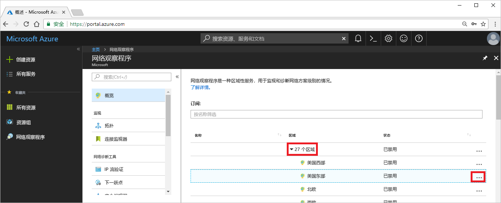

# 教程：使用 Azure 门户诊断虚拟机网络路由问题

部署虚拟机 (VM) 时，Azure 会为其创建多个默认路由。 可以创建自定义路由来覆盖 Azure 的默认路由。 有时候，自定义路由可能导致 VM 无法与其他资源通信。 在本教程中，你将了解如何执行以下操作：

> [!div class="checklist"]
> * 创建 VM
> * 使用网络观察程序的“下一跃点”功能测试到 URL 的通信
> * 测试到 IP 地址的通信
> * 诊断路由问题，并了解如何解决该问题

可以根据自己的偏好，使用 [Azure CLI](diagnose-vm-network-routing-problem-cli.md) 或 [Azure PowerShell](diagnose-vm-network-routing-problem-powershell.md) 诊断虚拟机网络路由问题。

如果没有 Azure 订阅，请在开始之前创建一个[免费帐户](https://azure.microsoft.com/free/?WT.mc_id=A261C142F)。

## 登录 Azure

通过 https://portal.azure.com 登录到 Azure 门户。

## 创建 VM

1. 选择 Azure 门户左上角的“+ 创建资源”  。
2. 选择“计算”，然后选择“Windows Server 2016 Datacenter”或“Ubuntu Server 17.10 VM”。   
3. 输入或选择以下信息，保留剩下的默认设置，然后选择“确定”  ：

    |设置|值|
    |---|---|
    |名称|myVm|
    |用户名| 输入所选用户名。|
    |密码| 输入所选密码。 密码必须至少 12 个字符长，且符合[定义的复杂性要求](../virtual-machines/windows/faq.md?toc=%2fazure%2fnetwork-watcher%2ftoc.json#what-are-the-password-requirements-when-creating-a-vm)。|
    |订阅| 选择订阅。|
    |资源组| 选择“新建”，并输入 myResourceGroup  |
    |位置| 选择“美国东部” |

4. 选择 VM 的大小，然后选择“选择”  。
5. 保留“设置”下的所有默认设置，然后选择“确定”。  
6. 在“摘要”中的“创建”下，选择“创建”以启动 VM 部署    。 部署 VM 需要几分钟时间。 在继续余下的步骤之前，请等待 VM 完成部署。

## 测试网络通信

若要通过网络观察程序测试网络通信，则必须先在至少一个 Azure 区域中启用网络观察程序，然后使用网络观察程序的“下一跃点”功能来测试通信。

### 启用网络观察程序

如果已至少在一个区域中启用网络观察程序，请跳到[使用下一跃点](#use-next-hop)。

1. 在门户中，选择“所有服务”。  在“筛选器”框中，输入“网络观察程序”   。 结果中出现“网络观察程序”后，将其选中  。
2. 选择“区域”，以便将其展开，然后选择“美国东部”右侧的“...”，如下图所示：   

    

3. 选择“启用网络观察程序”。 

### 使用下一个跃点

Azure 自动创建到默认目标的路由。 可以创建自定义路由来覆盖默认路由。 有时，自定义路由可能会导致通信故障。 请使用网络观察程序的“下一跃点”功能来确定 Azure 使用哪个路由来路由流量。

1. 在 Azure 门户的“网络观察程序”下选择“下一跃点”。  
2. 选择订阅，输入或选择以下值，然后选择“下一跃点”，如下图所示： 

    |设置                  |值                                                   |
    |---------                |---------                                               |
    | 资源组          | 选择 myResourceGroup                                 |
    | 虚拟机         | 选择 myVm                                            |
    | 网络接口       | myvm - 你的网络接口名称可能有所不同。   |
    | 源 IP 地址       | 10.0.0.4                                               |
    | 目标 IP 地址  | 13.107.21.200 - <www.bing.com> 的一个地址。 |

    

    数秒钟后，结果指示下一跃点类型为“Internet”  ，“路由表 ID”为“系统路由”。   此结果指示存在有效的通往目标的系统路由。

3. 将“目标 IP 地址”更改为“172.31.0.100”，然后再次选择“下一跃点”。    返回的结果指示“下一跃点类型”为“无”，“路由表 ID”仍为“系统路由”。     此结果指示，虽然存在有效的通往目标的系统路由，但是没有将流量路由到目标的下一跃点。

## 查看路由详细信息

1. 若要进一步分析路由情况，请查看网络接口的有效路由。 在门户顶部的搜索框中，输入“myvm”  （或勾选的网络接口的任何其他名称）。 当“myvm”出现在搜索结果中时，将其选中。 
2. 在“支持 + 故障排除”下选择“有效路由”，如下图所示：  

    

    使用[使用下一跃点](#use-next-hop)中的 13.107.21.200 运行测试时，地址前缀为 0.0.0.0/0 的路由用于将流量路由到该地址，因为没有其他路由包含该地址。 默认情况下，未在另一路由的地址前缀中指定的所有地址都会路由到 Internet。

    但在使用 172.31.0.100 运行测试时，结果指示没有下一跃点类型。 在上图中可以看到，虽然有一个到 172.16.0.0/12 前缀的默认路由（其中包括地址 172.31.0.100），但“下一跃点类型”为“无”。   Azure 会创建到 172.16.0.0/12 的默认路由，但不会无故指定下一个跃点类型。 在特定情况下，例如在已将 172.16.0.0/12 地址范围添加到虚拟网络的地址空间的情况下，Azure 会将路由的“下一跃点类型”更改为“虚拟网络”。   此时进行检查会显示“下一跃点类型”为“虚拟网络”。  

## 清理资源

不再需要资源组时，可将资源组及其包含的所有资源一并删除：

1. 在门户顶部的“搜索”框中输入“myResourceGroup”   。 当在搜索结果中看到“myResourceGroup”时，将其选中。 
2. 选择“删除资源组”  。
3. 对于“键入资源组名称:”，输入“myResourceGroup”，然后选择“删除”。   

## 后续步骤

本教程介绍了如何创建 VM 并根据该 VM 诊断网络路由问题， 同时说明了 Azure 可以创建多个默认路由，并且还测试了到两个不同目标的路由。 详细了解 [Azure 中的路由](../virtual-network/virtual-networks-udr-overview.md?toc=%2fazure%2fnetwork-watcher%2ftoc.json)，以及如何[创建自定义路由](../virtual-network/manage-route-table.md?toc=%2fazure%2fnetwork-watcher%2ftoc.json#create-a-route)。

对于出站 VM 连接，还可以使用网络观察程序的[连接故障排除](network-watcher-connectivity-portal.md)功能来确定延迟、VM 和终结点之间获得允许的和被拒绝的网络流量，以及所使用的通往某个终结点的路由。 了解如何使用网络观察程序的连接监视器功能监视 VM 和终结点（例如 IP 地址或 URL）之间在某段时间的通信情况。

> [!div class="nextstepaction"]
> [监视网络连接](connection-monitor.md)