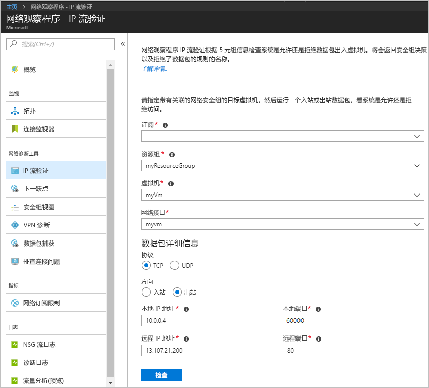
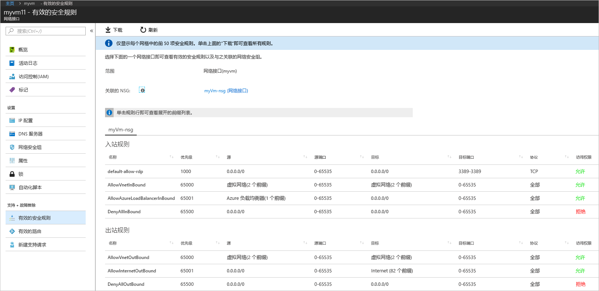
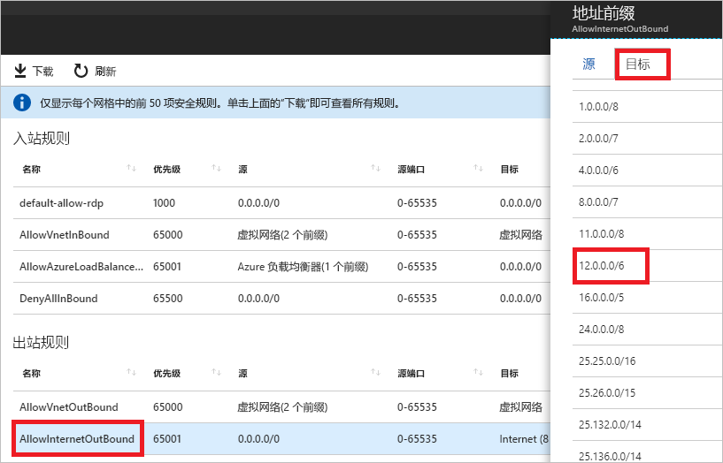

# 快速入门：使用 Azure 门户诊断虚拟机网络流量筛选器问题

在本快速入门中，请先部署虚拟机 (VM)，然后检查到某个 IP 地址和 URL 的通信以及来自某个 IP 地址的通信。 请确定通信失败的原因以及解决方法。

如果你还没有 Azure 订阅，可以在开始前创建一个 [免费帐户](https://azure.microsoft.com/free/?WT.mc_id=A261C142F)。

## 登录 Azure

通过 https://portal.azure.com 登录到 Azure 门户。

## 创建 VM

1. 选择 Azure 门户左上角的“+ 创建资源”。
2. 选择“计算”，然后选择“Windows Server 2016 Datacenter”或“Ubuntu Server 17.10 VM”。
3. 输入或选择以下信息，保留剩下的默认设置，然后选择“确定”：

    |设置|值|
    |---|---|
    |名称|myVm|
    |用户名| 输入所选用户名。|
    |密码| 输入所选密码。 密码必须至少 12 个字符长，且符合[定义的复杂性要求](../virtual-machines/windows/faq.md?toc=%2fazure%2fnetwork-watcher%2ftoc.json#what-are-the-password-requirements-when-creating-a-vm)。|
    |订阅| 选择订阅。|
    |资源组| 选择“新建”，并输入 myResourceGroup|
    |Location| 选择“美国东部”|

4. 选择 VM 的大小，然后选择“选择”。
5. 保留“设置”下的所有默认设置，然后选择“确定”。
6. 在“摘要”中的“创建”下，选择“创建”以启动 VM 部署。 部署 VM 需要几分钟时间。 在继续余下的步骤之前，请等待 VM 完成部署。

## 测试网络通信

若要通过网络观察程序测试网络通信，请先在至少一个 Azure 区域中启用网络观察程序，然后使用网络观察程序的 IP 流验证功能。

### 启用网络观察程序

如果已至少在一个区域中启用网络观察程序，请跳到[使用 IP 流验证](#use-ip-flow-verify)。

1. 在门户中，选择“所有服务”。 在“筛选器”框中，输入“网络观察程序”。 结果中出现“网络观察程序”后，将其选中。
2. 请在“美国东部”区域启用网络观察程序，因为那是在前面的步骤中将 VM 部署到其中的区域。 选择“区域”，以便将其展开，然后选择“美国东部”右侧的“...”，如下图所示：

    

3. 选择“启用网络观察程序”。

### 使用 IP 流验证

创建 VM 时，Azure 会默认允许和拒绝出入 VM 的网络流量。 可以在以后覆盖 Azure 的默认设置，允许或拒绝其他类型的流量。

1. 在门户中，选择“所有服务”。 在“所有服务”>“筛选器”框中，输入“网络观察程序”。 结果中出现“网络观察程序”后，将其选中。
2. 在“网络诊断工具”下选择“IP 流验证”。
3. 选择订阅，输入或选择以下值，然后选择“检查”，如下图所示：

    |设置            |值                                                                                              |
    |---------          |---------                                                                                          |
    | 资源组    | 选择 myResourceGroup                                                                            |
    | 虚拟机   | 选择 myVm                                                                                       |
    | 网络接口 | myvm - 你在创建 VM 时由门户创建的网络接口的名称是不同的。 |
    | 协议          | TCP                                                                                               |
    | 方向         | 出站                                                                                          |
    | 本地 IP 地址  | 10.0.0.4                                                                                          |
    | 本地端口      | 60000                                                                                                |
    | 远程 IP 地址 | 13.107.21.200 - www.bing.com 的一个地址。                                             |
    | 远程端口       | 80                                                                                                |

    

    数秒钟后返回结果，指示访问已获得名为 **AllowInternetOutbound** 的安全规则的允许。 运行检查时，网络观察程序自动在“美国东部”区域创建一个网络观察程序，前提是你在运行检查之前，已经在“美国东部”区域以外的其他区域有了一个网络观察程序。
4. 再次完成步骤 3，但请将“远程 IP 地址”更改为 **172.31.0.100**。 返回的结果指示访问已被名为 **DefaultOutboundDenyAll** 的安全规则拒绝。
5. 再次完成步骤 3，但请将“方向”更改为“入站”，将“本地端口”更改为 **80**，将“远程端口”更改为 **60000**。 返回的结果指示访问已被名为 **DefaultInboundDenyAll** 的安全规则拒绝。

了解哪些安全规则允许或拒绝出入 VM 的流量以后，即可确定问题解决方法。

## 查看安全规则的详细信息

1. 若要确定[使用 IP 流验证](#use-ip-flow-verify)的步骤 3-5 中的规则允许或拒绝通信的原因，请查看 VM 中网络接口的有效安全规则。 在门户顶部的搜索框中，输入“myvm”。 当 **myvm**（或网络接口的任何其他名称）网络接口显示在搜索结果中时，请将其选中。
2. 在“支持 + 故障排除”下选择“有效的安全规则”，如下图所示：

    

    在[使用 IP 流验证](#use-ip-flow-verify)的步骤 3 中，你了解到允许通信的原因是因为 **AllowInternetOutbound** 规则。 可以在上图中看到规则的“目标”是 **Internet**。 尚不清楚在[使用 IP 流验证](#use-ip-flow-verify)的步骤 3 中测试的地址 13.107.21.200 与 **Internet** 的关系如何。
3. 选择“AllowInternetOutBound”规则，然后选择“目标”，如下图所示：

    

    列表中的一个前缀是 **12.0.0.0/6**，涵盖了 IP 地址范围 12.0.0.1-15.255.255.254。 由于 13.107.21.200 在该地址范围内，因此 **AllowInternetOutBound** 规则允许此出站流量。 另外，在步骤 2 的图片中没有显示优先级更高（数字更小）的可以覆盖此规则的规则。 关闭“地址前缀”框。 若要拒绝到 13.107.21.200 的出站通信，可以添加一项优先级更高的安全规则，拒绝通过端口 80 向该 IP 地址发送出站流量。
4. 运行[使用 IP 流验证](#use-ip-flow-verify)的步骤 4 中针对 172.131.0.100 的出站检查时，你了解到 **DefaultOutboundDenyAll** 规则拒绝了通信。 该规则相当于在步骤 2 的图片中显示的 **DenyAllOutBound** 规则，后者指定 **0.0.0.0/0** 作为“目标”。 此规则拒绝到 172.131.0.100 的出站通信，因为此地址不在图片中显示的任何其他“出站规则”的“目标”范围内。 若要允许出站通信，可以添加一项优先级更高的安全规则，允许出站流量到达 172.131.0.100 地址的端口 80。
5. 运行[使用 IP 流验证](#use-ip-flow-verify)的步骤 5 中流量来自 172.131.0.100 的入站检查时，你了解到 **DefaultInboundDenyAll** 规则拒绝了通信。 该规则相当于在步骤 2 的图片中显示的 **DenyAllInBound** 规则。 **DenyAllInBound** 规则会强制实施，因为没有任何其他允许端口 80 将入站流量从 172.31.0.100 发往 VM 的规则有更高的优先级。 若要允许入站通信，可以添加一项优先级更高的安全规则，允许通过端口 80 从 172.31.0.100 发送入站流量。

本快速入门中的检查测试了 Azure 配置。 如果检查返回预期的结果，而网络问题仍然存在，请确保在 VM 和要与之通信的终结点之间没有防火墙，且 VM 中的操作系统没有防火墙来允许或拒绝通信。

## 清理资源

不再需要资源组时，可将资源组及其包含的所有资源一并删除：

1. 在门户顶部的“搜索”框中输入“myResourceGroup”。 当在搜索结果中看到“myResourceGroup”时，将其选中。
2. 选择“删除资源组”。
3. 对于“键入资源组名称:”，输入“myResourceGroup”，然后选择“删除”。

## 后续步骤

本快速入门介绍了如何创建 VM 并对入站和出站网络流量筛选器进行诊断， 同时还介绍了如何通过网络安全组规则来允许或拒绝出入 VM 的流量。 详细了解[安全规则](../virtual-network/security-overview.md?toc=%2fazure%2fnetwork-watcher%2ftoc.json)以及如何[创建安全规则](../virtual-network/manage-network-security-group.md?toc=%2fazure%2fnetwork-watcher%2ftoc.json#create-a-security-rule)。

即使相应的网络流量筛选器已就位，与 VM 的通信仍可能因路由配置问题而失败。 若要了解如何诊断 VM 网络路由问题，请参阅[诊断 VM 路由问题](diagnose-vm-network-routing-problem.md)；若要使用某个工具诊断出站路由、延迟和流量筛选问题，请参阅[排查连接问题](network-watcher-connectivity-portal.md)。