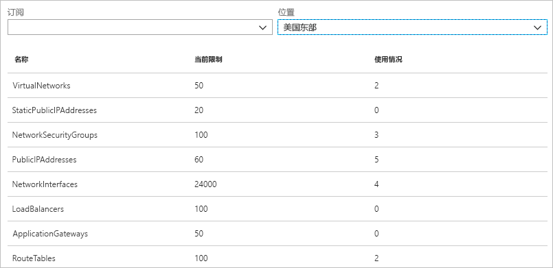

# Azure 网络观察程序是什么？

Azure 网络观察程序提供所需的工具用于监视、诊断 Azure 虚拟网络中的资源、查看其指标，以及为其启用或禁用日志。

## 监视

### 监视虚拟机与终结点之间的通信

终结点可以是另一个虚拟机 (VM)、完全限定的域名 (FQDN)、统一资源标识符 (URI) 或 IPv4 地址。 连接监视器功能定期监视通信，并告知 VM 与终结点之间的可访问性、延迟和网络拓扑变化。 例如，你使用了一个 Web 服务器 VM 来与数据库服务器 VM 通信。 组织中你不认识的某个人可能对 Web 服务器、数据库服务器 VM 或子网应用了自定义的路由或网络安全规则。

如果某个终结点不可访问，连接故障排除机制会告知原因。 原因可能在于 DNS 名称解析问题、CPU、内存、VM 操作系统中的防火墙、自定义路由的跃点类型、VM 的安全规则，或出站连接的子网。 详细了解 Azure 中的[安全规则](../virtual-network/security-overview.md?toc=%2fazure%2fnetwork-watcher%2ftoc.json#security-rules)和[路由跃点类型](../virtual-network/virtual-networks-udr-overview.md?toc=%2fazure%2fnetwork-watcher%2ftoc.json)。

连接监视器还提供在不同时间段观察到的最小、平均和最大延迟。 了解连接的延迟后，你可能会发现，将 Azure 资源移到不同的 Azure 区域能够降低延迟。 详细了解如何确定 [Azure 区域与 Internet 服务提供商之间的相对延迟](#determine-relative-latencies-between-azure- regions-and-internet-service-providers)，以及如何使用[连接监视器](connection-monitor.md)监视 VM 与终结点之间的通信。 若要测试某个时间点的连接，而不是监视各时间段的连接（像使用连接监视器所做的那样），请使用[连接故障排除](#connection-troubleshoot)功能。

### 查看虚拟网络中的资源及其关系

将资源添加到虚拟网络后，可能难以了解哪些资源位于虚拟网络中，以及它们彼此之间的关系。 使用拓扑功能可以生成虚拟网络中的资源及其相互关系的视觉图示。 下图显示了某个虚拟网络的示例拓扑图示，其中包含三个子网、两个 VM、网络接口、公共 IP 地址、网络安全组、路由表和资源之间的关系：

可以下载 svg 格式的可编辑图片版本。 详细了解[拓扑视图](view-network-topology.md)。

## 诊断

### 诊断传入或传出 VM 的网络流量筛选问题

部署 VM 时，Azure 会向 VM 应用多个默认安全规则，以允许或拒绝传入/传出 VM 的流量。 可以替代 Azure 的默认规则，或创建其他规则。 有时，VM 可能会由于安全规则而无法与其他资源通信。 使用 IP 流验证功能可以指定源和目标 IPv4 地址、端口、协议（TCP 或 UDP）和流量方向（入站或出站）。 然后，IP 流验证会测试通信，并告知连接是成功还是失败。 如果连接失败，IP 流验证会告知哪个安全规则允许或拒绝了通信，以便可以解决问题。 详细了解 [IP 流验证](network-watcher-ip-flow-verify-overview.md)。

### 诊断 VM 的网络路由问题

创建虚拟网络时，Azure 将为网络流量创建多个默认出站路由。 来自虚拟网络中部署的所有资源（例如 VM）的出站流量将会根据 Azure 的默认路由进行路由。 可以替代 Azure 的默认路由，或创建其他路由。 你可能发现，特定的路由导致 VM 不再能够与其他资源通信。 使用下一个跃点功能可以指定源和目标 IPv4 地址。 下一跃点会测试通信，并告知使用了哪种类型的下一跃点来路由流量。 然后，可以删除、更改或添加路由，以解决路由问题。 详细了解[下一跃点](network-watcher-next-hop-overview.md?)功能。

### 诊断 VM 的出站连接

使用连接故障排除功能可以测试 VM 与另一个 VM、FQDN、URI 或 IPv4 地址之间的连接。 该项测试返回的信息与使用[连接监视器](#connection-monitor)功能返回的信息类似，但测试的是某个时间点的连接，而不是像连接监视器那样监视各时间段的连接。 详细了解如何使用[连接故障排除](network-watcher-connectivity-overview.md)来排查连接问题。

### 捕获传入和传出 VM 的数据包

高级筛选选项和精细控制（例如设置时间与大小限制的功能）提供了多样性。 可将捕获的数据存储在 Azure 存储和/或 VM 磁盘中。 然后，可以使用多种标准网络捕获分析工具来分析捕获文件。 详细了解[数据包捕获](network-watcher-packet-capture-overview.md)。

### 诊断 Azure 虚拟网络网关和连接的问题

虚拟网络网关在本地资源与 Azure 虚拟网络之间提供连接。 监视网关及其连接对于确保通信不中断至关重要。 使用 VPN 诊断功能可以诊断网关和连接。 VPN 诊断功能诊断网关或网关连接的运行状况，并告知网关和网关连接是否可用。 如果网关或连接不可用，VPN 诊断会告知原因，以便可以解决问题。 详细了解 [VPN 诊断](network-watcher-troubleshoot-overview.md)。

### 确定 Azure 区域与 Internet 服务提供商之间的相对延迟

可以在网络观察程序中查询 Azure 区域之间以及不同 Internet 服务提供商之间的延迟信息。 了解 Azure 区域之间以及不同 Internet 服务提供商之间的延迟后，可以部署 Azure 资源来优化网络响应时间。 详细了解[相对延迟](view-relative-latencies.md)。

### 查看网络接口的安全规则

网络接口的有效安全规则是应用到网络接口以及网络接口所在子网的所有安全规则的组合。  安全组视图功能显示应用到网络接口、网络接口所在的子网和两者的聚合的所有安全规则。 了解已将哪些规则应用到网络接口后，可以添加、删除规则，或者更改规则（如果这些规则允许或拒绝所要更改的流量）。 详细了解[安全组视图](network-watcher-security-group-view-overview.md)。

## 度量值

在一个 Azure 订阅和区域中可以创建的网络资源数有[限制](../azure-subscription-service-limits.md?toc=%2fazure%2fnetwork-watcher%2ftoc.json#azure-resource-manager-virtual-networking-limits)。 如果超过了限制，则无法在该订阅或区域中创建更多的资源。 网络订阅限制功能汇总每个网络资源在某个订阅和区域中部署的数目，以及该资源的限制。 下图显示了在美国东部区域为某个示例订阅部署的网络资源的部分输出：

在规划将来的资源部署时，此信息非常有用。

## 日志

### 分析传入或传出网络安全组的流量

网络安全组 (NSG) 允许或拒绝 VM 中网络接口的入站或出站流量。 使用 NSG 流日志功能可以记录源和目标 IP 地址、端口、协议，以及 NSG 是允许还是拒绝了流量。 可以使用各种工具（例如 PowerBI）和流量分析功能来分析日志。 流量分析提供写入 NSG 流日志的数据的丰富可视化效果。 下图显示了流量分析功能在处理 NSG 流日志数据后显示的部分信息和可视化效果：

详细了解 [NSG 流日志](network-watcher-nsg-flow-logging-overview.md)和[流量分析](traffic-analytics.md)。

### 查看网络资源的诊断日志

可以针对网络安全组、公共 IP 地址、负载均衡器、虚拟网络网关和应用程序网关等 Azure 网络资源启用诊断日志记录。 诊断日志功能提供单个界面，用于针对生成诊断日志的任何现有网络资源启用和禁用网络资源诊断日志。 可以使用 Microsoft Power BI 和 Azure Log Analytics 等工具查看诊断日志。 若要详细了解如何分析 Azure 网络诊断日志，请参阅 [Log Analytics 中的 Azure 网络解决方案](../log-analytics/log-analytics-azure-networking-analytics.md?toc=%2fazure%2fnetwork-watcher%2ftoc.json)。

## 后续步骤

上面就是 Azure 网络观察程序的概述。 若要开始使用网络观察程序，请使用 IP 流验证来诊断与虚拟机之间的常见通信问题。 有关操作方法，请参阅[诊断虚拟机网络流量筛选问题](diagnose-vm-network-traffic-filtering-problem.md)快速入门。