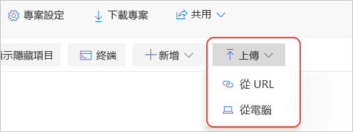

# 快速入门：将本地 Jupyter 笔记本迁移到 Azure Notebooks 预览版

在本快速入门中，我们将 Jupyter 笔记本从本地计算机或其他可访问的文件 URL 迁移到 Azure Notebooks。 

只有你才能访问自己的计算机上的 Jupyter 笔记本。 你可以共享自己的文件，但收件人随后会有他们自己的笔记本本地副本，很难将他们的更改合并到一起。 即使将笔记本存储在共享的联机存储库（如 GitHub）中，每个协作者也必须配置一个本地 Jupyter 安装（就像你的一样）。

将本地或基于存储库的笔记本迁移到 Azure Notebooks 就可以立即与协作者共享它们，这些协作者只需浏览器即可查看并运行你的笔记本。 如果登录到 Azure Notebooks，他们也可以进行更改。

## 必备条件

- 本地计算机或其他可访问文件 URL 上的 [Jupyter 笔记本](https://jupyter-notebook.readthedocs.io)。 

## 在 Azure Notebooks 上创建项目

本快速入门演示了如何从本地计算机或其他可访问的文件 URL 迁移笔记本。 若要从 GitHub 存储库迁移笔记本，请参阅[快速入门：克隆笔记本](quickstart-clone-jupyter-notebook.md)。

[!INCLUDE [notebooks-status](../../includes/notebooks-status.md)]

1. 转到 [Azure Notebooks](https://notebooks.azure.com) 并登录。 （有关详细信息，请参阅[快速入门 - 登录 Azure Notebooks](quickstart-sign-in-azure-notebooks.md)）。

1. 在公用个人资料页面中，选择页面顶部的“我的项目”  ：

    

1. 在“我的项目”页上，选择“新建项目”（键盘快捷方式：n）。   如果浏览器窗口较窄，则该按钮可能仅显示为“+”  ：

    

1. 在出现的“创建新项目”  弹出窗口中，在“项目名称”  和“项目 ID”  字段中输入迁移笔记本的适当值，清除“公共项目”  和“创建 README.md”  的选项，然后选择“创建”  。

## 上传本地笔记本

1. 在项目页上选择“上传”  （只有当浏览器窗口很小的情况下才会显示为向上箭头），然后选择 1。 在显示的弹出窗口，如果笔记本位于本地文件系统，选择“从计算机”  ，如果是联机笔记本，则选择“从 URL”  ：

    

   同样，如果笔记本是在 GitHub 存储库中，则改为执行[快速入门：克隆笔记本](quickstart-clone-jupyter-notebook.md)中的步骤。

   - 如果使用“从计算机”  ，将 .ipynb  文件拖放到弹出窗口，或选择“选择文件”  ，然后浏览并选择要导入的文件。 然后，选择“上传”  。 上传的文件与本地文件具有相同名称。 不需要上传任何 .ipynb_checkpoints  文件夹内容。

     

   - 如果使用“从 URL”  ，在“文件 URL”  字段输入源地址，并在“文件名”  字段输入在项目中分配给笔记本的文件名。 然后，选择“上传”  。 如果你有多个具有独立 URL 的文件，请使用“添加文件”  命令检查输入的第一个 URL，然后弹出窗口将为另一个文件提供新字段。

     

1. 打开并运行新上传的笔记本以验证其内容和操作。 完成后，选择“文件”   > “停止并关闭”  关闭笔记本。

1. 若要共享上传的笔记本链接，右键单击该项目中的文件并选择“复制链接”  （键盘快捷方式：y），然后将该链接粘贴到相应的消息中。 或者，可以使用项目页上的“共享”  控件来共享整个项目。

1. 若要编辑笔记本以外的文件，请右键单击该项目中的文件并选择“编辑文件”  （键盘快捷方式：i）。 默认操作“运行”  （键盘快捷方式：r）仅显示文件内容且不允许编辑。

## 后续步骤

> [!div class="nextstepaction"]
> [教程：创建并运行 Jupyter 笔记本以执行线性回归](tutorial-create-run-jupyter-notebook.md)
