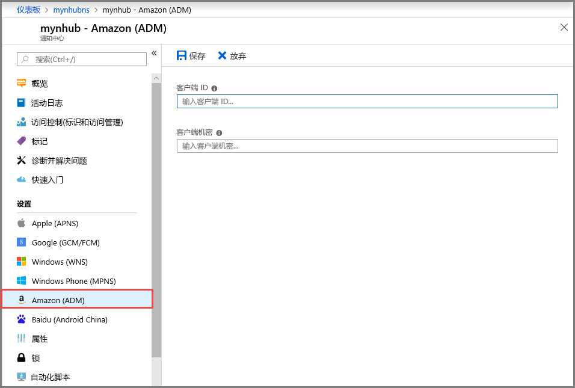

# 在 Azure 门户中配置通知中心 Android Device Messaging (ADM) 设置
本文介绍如何使用 Azure 门户配置 Azure 通知中心 Android Device Messaging (ADM) 设置。 

## 必备组件
如果你尚未创建通知中心，现在请创建一个。 有关详细信息，请参阅[在 Azure 门户中创建 Azure 通知中心](create-notification-hub-portal.md)。 

## 配置 Android 设备的消息传送

以下过程提供配置通知中心的 Amazon Device Messaging (ADM) 设置的步骤： 

1. 在 Azure 门户中，在**通知中心**页上，选择**Amazon (ADM)** 在左侧菜单中。
2. 输入“客户端 ID”和“客户端机密”的值。
3. 选择“保存”。
    
   

## 后续步骤
有关通过使用 Azure 通知中心和 Android Device Messaging (ADM) 将通知推送到 Android 设备的分步说明的教程，请参阅[开始使用通知中心适用于 Kindle 应用](notification-hubs-kindle-amazon-adm-push-notification.md)。

