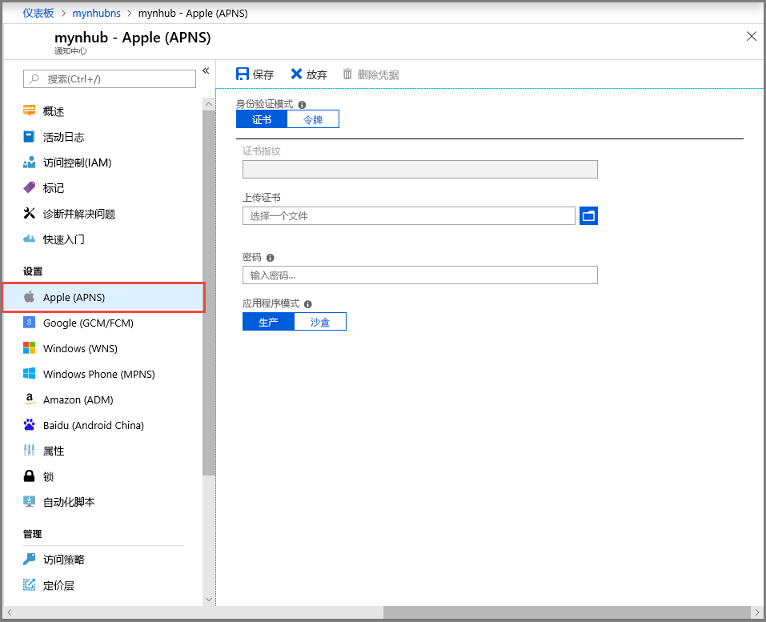
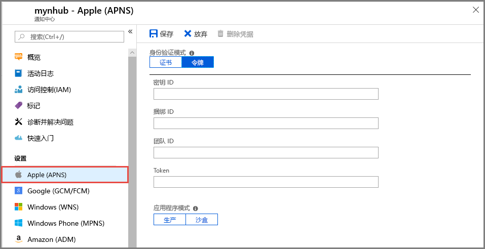

# 在 Azure 门户中配置通知中心的 Apple 推送通知服务 (APNS) 设置
本文介绍如何使用 Azure 门户配置 Azure 通知中心的 Apple 推送通知服务 (APNS) 设置。 

## 必备组件
如果你尚未创建通知中心，现在请创建一个。 有关详细信息，请参阅[在 Azure 门户中创建 Azure 通知中心](create-notification-hub-portal.md)。 

## 配置 Apple Push Notification 服务

以下过程提供配置通知中心的 Apple 推送通知服务 (APNS) 设置的步骤：

1. 在 Azure 门户中，在**通知中心**页上，选择**Apple (APNS)** 在左侧菜单中。

1. 对于“身份验证模式”，请选择“证书”或“令牌”。

   a. 如果选择“证书”：
   * 选择“文件”图标，然后选择要上传的“.p12”文件。
   * 输入密码。
   * 选择“沙盒”模式。 或者，若要将推送通知发送给从应用商店中购买了你的应用的用户，请选择“生产”模式。

     

   b. 如果选择“令牌”：

   * 输入的值**密钥 ID**，**捆绑 ID**，**团队 ID**，以及**令牌**。
   * 选择“沙盒”模式。 或者，若要将推送通知发送给从应用商店中购买了你的应用的用户，请选择“生产”模式。

     

## 后续步骤
有关将通知推送到 iOS 设备的分步说明的教程，请参阅以下文章：[使用通知中心和 APNS 将通知推送到 iOS 设备](notification-hubs-ios-apple-push-notification-apns-get-started.md)
