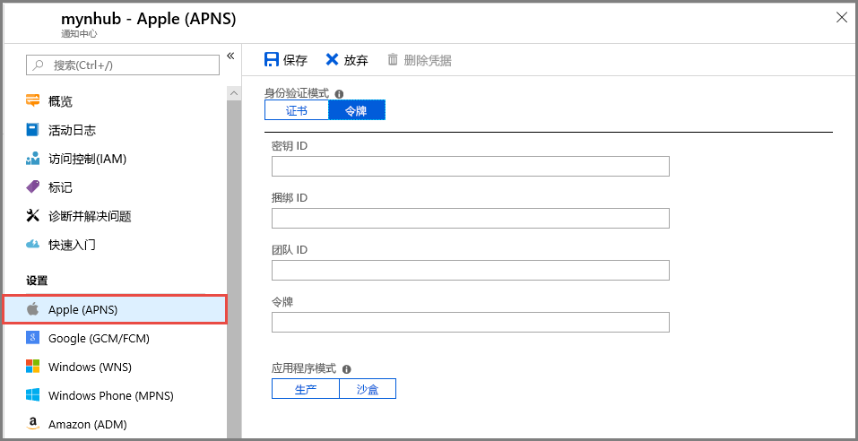

# <a name="quickstart-set-up-push-notifications-in-a-notification-hub"></a>快速入门：在通知中心设置推送通知

Azure 通知中心提供了一种易于使用且可扩展的推送引擎。使用通知中心可将通知发送到任意平台（iOS、Android、Windows 和百度），也可从任意后端（云或本地）进行发送。 有关详细信息，请参阅[什么是 Azure 通知中心？](notification-hubs-push-notification-overview.md)。

在该快速入门中，你将在通知中心使用平台通知系统 (PNS) 设置在多个平台上设置推送通知。 该快速入门介绍了要在 Azure 门户中执行的步骤。 [Google Firebase Cloud Messaging](?tabs=azure-cli#google-firebase-cloud-messaging-fcm) 包含 Azure CLI 使用说明。

如果尚未创建通知中心，请立即创建。 有关详细信息，请参阅[在 Azure 门户中创建 Azure 通知中心](create-notification-hub-portal.md)或[使用 Azure CLI 创建 Azure 通知中心](create-notification-hub-azure-cli.md)。

## <a name="apple-push-notification-service"></a>Apple Push Notification 服务

要设置 Apple Push Notification 服务 (APNS)：

1. 在 Azure 门户的“通知中心”页上，从左侧菜单中选择“Apple (APNS)”。

1. 对于“身份验证模式”，请选择“证书”或“令牌”  。

   a. 如果选择“证书”：
   * 选择文件图标，再选择要上传的 .p12 文件。
   * 输入密码。
   * 选择“沙盒”模式。 要将推送通知发送给从应用商店购买应用的用户，则选择“生产”模式。

     

   b. 如果选择“令牌”：

   * 输入“密钥 ID”、“绑定 ID”、“团队 ID”和“令牌”的值   。
   * 选择“沙盒”模式。 要将推送通知发送给从应用商店购买应用的用户，则选择“生产”模式。

     

有关详细信息，请参阅[使用 Azure 通知中心向 iOS 应用发送推送通知](ios-sdk-get-started.md)。

## <a name="google-firebase-cloud-messaging-fcm"></a>Google Firebase Cloud Messaging (FCM)

# <a name="portal"></a>[门户](#tab/azure-portal)

若要为 Google FCM 设置推送通知，请执行以下操作：

1. 在 Azure 门户的“通知中心”页上，从左侧菜单中选择“Google (GCM/FCM)”。 
2. 为之前保存的 Google FCM 项目粘贴“API 密钥”。
3. 选择“保存”。

   

完成这些步骤后，会显示一条警报，指出已成功上传通知中心。 “保存”按钮已禁用。

# <a name="azure-cli"></a>[Azure CLI](#tab/azure-cli)

### <a name="prerequisites"></a>先决条件

在开始之前，必须满足以下条件：

* [Azure CLI](/cli/azure/install-azure-cli) 2.0.67 或更高版本。

* Azure CLI 的[用于通知中心的扩展](/cli/azure/ext/notification-hub/notification-hub)。
* 用于 Google Firebase Cloud Messaging (FCM) 项目的“API 密钥”。

### <a name="set-up-push-notifications-for-google-fcm"></a>为 Google FCM 设置推送通知

1. 使用 [az notification-hub credential gcm update](/cli/azure/ext/notification-hub/notification-hub/credential/gcm#ext-notification-hub-az-notification-hub-credential-gcm-update) 命令将 Google API 密钥添加到通知中心。

   ```azurecli
   az notification-hub credential gcm update --resource-group spnhubrg --namespace-name spnhubns    --notification-hub-name spfcmtutorial1nhub --google-api-key myKey
   ```

2. Android 应用需要连接字符串才能连接到通知中心。  使用 [az notification-hub authorization-rule list](/cli/azure/ext/notification-hub/notification-hub/authorization-rule#ext-notification-hub-az-notification-hub-authorization-rule-list) 命令列出可用的访问策略。  使用 [az notification-hub authorization-rule list-keys](/cli/azure/ext/notification-hub/notification-hub/authorization-rule#ext-notification-hub-az-notification-hub-authorization-rule-list-keys) 命令获取访问策略连接字符串。  在 `--query` 参数中指定 **primaryConnectionString** 或 **secondaryConnectionString**，以直接获取主连接字符串。

   ```azurecli
   #list access policies for a notification hub
   az notification-hub authorization-rule list --resource-group spnhubrg --namespace-name spnhubns --notification-hub-name spfcmtutorial1nhub --output table

   #list keys and connection strings for a notification hub access policy
   az notification-hub authorization-rule list-keys --resource-group spnhubrg --namespace-name spnhubns --notification-hub-name spfcmtutorial1nhub --name myAccessPolicyName --output json

   #get the primaryConnectionString for an access policy
   az notification-hub authorization-rule list-keys --resource-group spnhubrg --namespace-name spnhubns --notification-hub-name spfcmtutorial1nhub --name myAccessPolicyName --query primaryConnectionString
   ```

3. 使用 [az notification-hub test-send](/cli/azure/ext/notification-hub/notification-hub#ext-notification-hub-az-notification-hub-test-send) 命令测试向 Android 应用发送消息的操作。

   ```azurecli
   #test with message body
   az notification-hub test-send --resource-group spnhubrg --namespace-name spnhubns --notification-hub-name spfcmtutorial1nhub --notification-format gcm --message "my message body"

   #test with JSON string
   az notification-hub test-send --resource-group spnhubrg --namespace-name spnhubns --notification-hub-name spfcmtutorial1nhub --notification-format gcm --payload "{\"data\":{\"message\":\"my JSON string\"}}"
   ```

通过 [az notification-hub credential](/cli/azure/ext/notification-hub/notification-hub/credential) 命令获取其他平台的 Azure CLI 引用。

若要详细了解如何将通知发送到 Android 应用程序，请参阅[使用 Firebase 将推送通知发送到 Android 设备](notification-hubs-android-push-notification-google-fcm-get-started.md)。

## <a name="windows-push-notification-service"></a>Windows 推送通知服务

要设置 Windows 推送通知服务 (WNS)：

1. 在 Azure 门户的“通知中心”页上，从左侧菜单中选择“Windows (WNS)”。
2. 输入“包 SID”和“安全密钥”的值。
3. 选择“保存”。

   

相关信息，请参阅[通过 Azure 通知中心向 UWP 发送通知](notification-hubs-windows-store-dotnet-get-started-wns-push-notification.md)。

## <a name="microsoft-push-notification-service-for-windows-phone"></a>面向 Windows Phone 的 Microsoft 推送通知服务

要为 Windows Phone 设置 Microsoft 推送通知服务 (MPNS)：

1. 在 Azure 门户的“通知中心”页上，从左侧菜单中选择“Windows Phone (MPNS)”。
1. 启用未经身份验证或经过身份验证的推送通知：

   a. 要启用未经身份验证的推送通知，请选择“启用未经身份验证的推送” > “保存” 。

      

   b. 要启用经过身份验证的推送通知：
      * 在工具栏上选择“上传证书”。
      * 选择文件图标，然后选择证书文件。
      * 输入证书的密码。
      * 选择“确定”。
      * 在“Windows Phone (MPNS)”页上选择“保存”。

有关详细信息，请参阅[通过通知中心向 Windows Phone 应用推送通知](notification-hubs-windows-mobile-push-notifications-mpns.md)。

## <a name="baidu-android-china"></a>Baidu (Android China)

要为百度设置推送通知：

1. 在 Azure 门户的“通知中心”页上，从左侧菜单中选择“Baidu (Android China)”。
2. 在百度云推送项目中，输入从百度控制台获得的 API 密钥。
3. 在百度云推送项目中，输入从百度控制台获得的机密密钥。
4. 选择“保存”。

    

完成这些步骤后，会显示一条警报，指出已成功上传通知中心。 “保存”按钮已禁用。

有关详细信息，请参阅[借助百度的通知中心入门](notification-hubs-baidu-china-android-notifications-get-started.md)。

## <a name="next-steps"></a>后续步骤

在该快速入门中，你学习了如何在 Azure 门户中为通知中心配置平台通知系统设置。

要详细了解如何将通知推送到各类平台，请参阅以下教程：

* [使用 Azure 通知中心向 iOS 应用发送推送通知](ios-sdk-get-started.md)
* [使用通知中心和 Google FCM 向 Android 设备发送通知](notification-hubs-android-push-notification-google-fcm-get-started.md)
* [将通知发送到在 Windows 设备上运行的 UWP 应用](notification-hubs-windows-store-dotnet-get-started-wns-push-notification.md)
* [使用 MPNS 将通知发送到 Windows Phone 8 应用](notification-hubs-windows-mobile-push-notifications-mpns.md)
* [使用通知中心和百度云推送服务来发送通知](notification-hubs-baidu-china-android-notifications-get-started.md)
