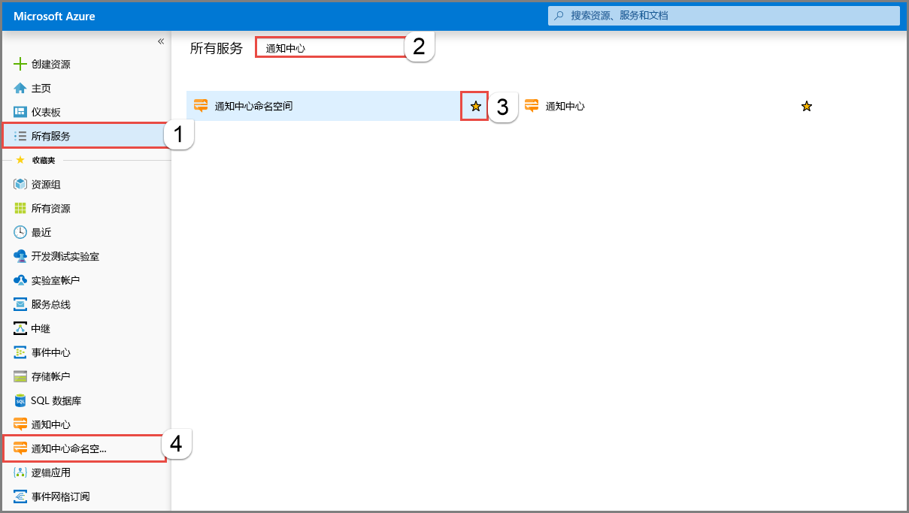
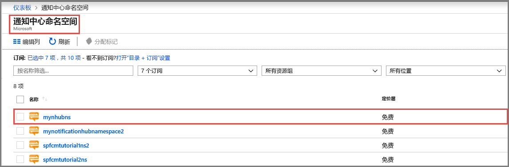
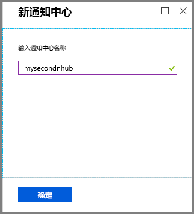
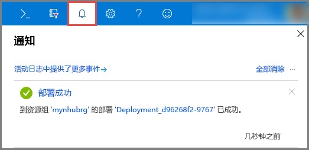
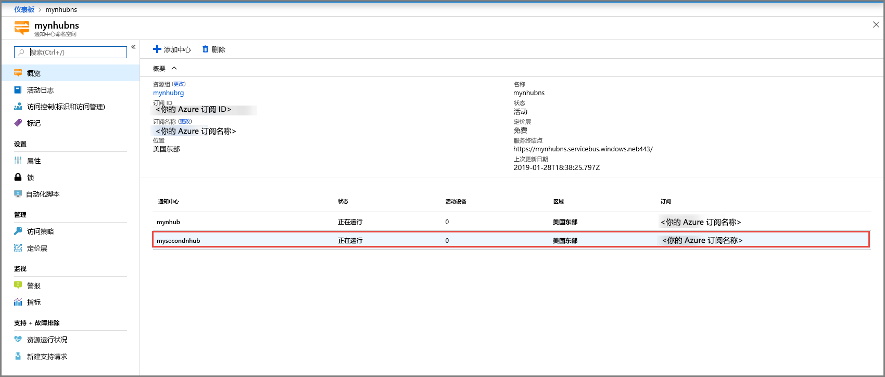
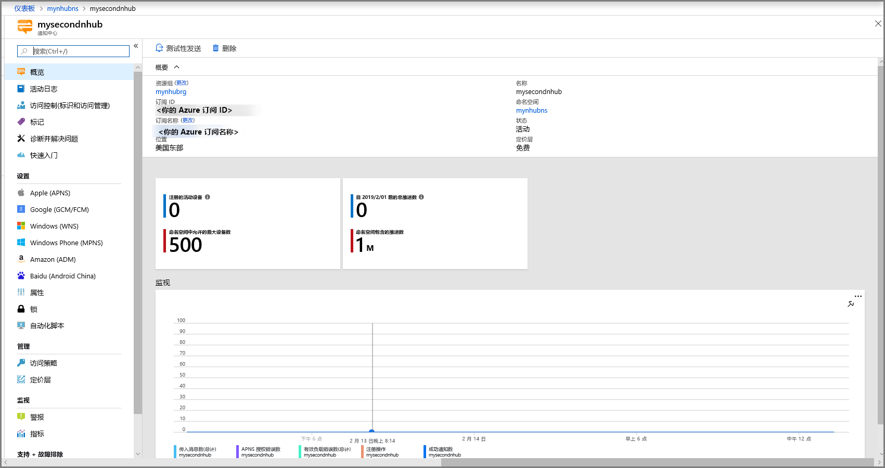

# 在 Azure 门户中创建 Azure 通知中心 
Azure 通知中心提供易于使用且横向扩展的推送引擎，可用于从任何后端（云或本地）向任何平台（iOS、Android、Windows、Kindle、百度等）发送通知。 有关此服务的详细信息，请参阅[什么是 Azure 通知中心？](notification-hubs-push-notification-overview.md)。

在本快速入门中，请在 Azure 门户中创建通知中心。 第一部分介绍如何通过多个步骤创建一个通知中心命名空间，然后在该命名空间中创建一个中心。 第二部分介绍如何通过多个步骤在现有的通知中心命名空间中创建一个通知中心。 

## 创建命名空间和通知中心
在此部分，请创建一个命名空间，然后在该命名空间中创建一个中心。 

[!INCLUDE [notification-hubs-portal-create-new-hub](../../includes/notification-hubs-portal-create-new-hub.md)]

## 在现有的命名空间中创建通知中心
在此部分，请在现有的命名空间中创建一个通知中心。 

1. 登录到 [Azure 门户](https://portal.azure.com)。
2. 在左侧菜单上选择“所有服务”，搜索“通知中心”，选择“通知中心命名空间”旁边的**星号** (`*`)，将其添加到左侧菜单上的“收藏夹”部分。 选择“通知中心命名空间”。 

      
3. 在“通知中心命名空间”页上，从列表中选择命名空间。 

      
1. 在“通知中心命名空间”页的工具栏上选择“添加中心”。 

      
4. 在“新建通知中心”页上输入通知中心的名称，然后选择“确定”。

      
4. 选择顶部的“通知”（钟形图标），查看新中心的部署状态。 选择右角的 **X**，关闭通知窗口。 

      
5. 刷新“通知中心命名空间”网页，查看列表中的新中心。 

      
6. 选择你的**通知中心**，查看通知中心的主页。 

      

## 后续步骤
在本快速入门中，你创建了一个通知中心。 若要了解如何使用平台通知系统 (PNS) 设置来配置通知中心，请参阅[使用 PNS 设置配置通知中心](configure-notification-hub-portal-pns-settings.md)。 