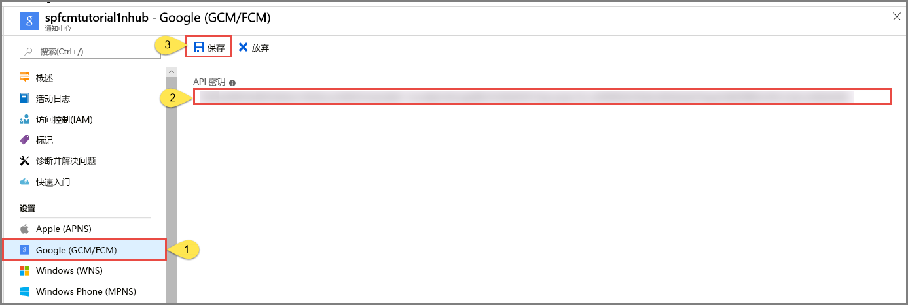

# <a name="tutorial-push-notifications-to-android-devices-by-using-azure-notification-hubs-and-google-firebase-cloud-messaging"></a>教程：使用 Azure 通知中心和 Google Firebase Cloud Messaging 将通知推送到 Android 设备

[!INCLUDE [notification-hubs-selector-get-started](../../includes/notification-hubs-selector-get-started.md)]

本教程介绍如何使用 Azure 通知中心和 Firebase Cloud Messaging (FCM) 将通知推送到 Android 应用程序。 在本教程中，请创建一个空白 Android 应用，以便使用 Firebase Cloud Messaging (FCM) 接收推送通知。

可以从 [此处](https://github.com/Azure/azure-notificationhubs-android/tree/master/samples/FCMTutorialApp)的 GitHub 中下载本教程的已完成代码。

在本教程中，我们将执行以下步骤：

> [!div class="checklist"]
> * 创建 Android Studio 项目。
> * 创建支持 Firebase Cloud Messaging 的 Firebase 项目。
> * 创建通知中心。
> * 将应用连接到通知中心。
> * 测试应用。

## <a name="prerequisites"></a>先决条件

要完成本教程，必须有一个有效的 Azure 帐户。 如果没有帐户，只需花费几分钟就能创建一个免费试用帐户。 有关详细信息，请参阅 [Azure 免费试用](https://azure.microsoft.com/free/)。

* 除了需要上面提到的可用 Azure 帐户外，本教程还要求具有最新版本的 [Android Studio](https://go.microsoft.com/fwlink/?LinkId=389797)。
* 适用于 Firebase Cloud Messaging 的 Android 2.3 或更高版本。
* Firebase Cloud Messaging 要求安装 Google Repository 修订版 27 或更高版本。
* 适用于 Firebase Cloud Messaging 的 Google Play Services 9.0.2 或更高版本。
* 完成本教程是学习有关 Android 应用的所有其他通知中心教程的先决条件。

## <a name="create-an-android-studio-project"></a>创建 Android Studio 项目

1. 启动 Android Studio。
2. 在菜单中选择“文件”，指向“新建”，然后选择“新建项目”。 
2. 在“选择项目”页上选择“空活动”，然后选择“下一步”。 
3. 在“配置项目”页上执行以下步骤： 
    1. 输入应用程序的**名称**。
    2. 指定项目文件的保存位置。 
    3. 选择“完成”。 

        

## <a name="create-a-firebase-project-that-supports-fcm"></a>创建支持 FCM 的 Firebase 项目

[!INCLUDE [notification-hubs-enable-firebase-cloud-messaging](../../includes/notification-hubs-enable-firebase-cloud-messaging.md)]

## <a name="configure-a-notification-hub"></a>配置通知中心

[!INCLUDE [notification-hubs-portal-create-new-hub](../../includes/notification-hubs-portal-create-new-hub.md)]

### <a name="configure-firebase-cloud-messaging-settings-for-the-hub"></a>为中心配置 Firebase Cloud Messaging 设置

1. 在左侧菜单中的“设置”下选择“Google (GCM/FCM)”。 
2. 粘贴前面保存的 FCM 项目**服务器密钥**。 
3. 在工具栏上选择“保存”。 

    
4. 警报中会显示一条消息，指出通知中心已成功更新。 “保存”按钮已禁用。 

现在通知中心已配置为使用 Firebase Cloud Messaging，并且具有用于注册应用以收发推送通知的连接字符串。

## <a id="connecting-app"></a>将你的应用连接到通知中心

### <a name="add-google-play-services-to-the-project"></a>将 Google Play 服务添加到项目

[!INCLUDE [Add Play Services](../../includes/notification-hubs-android-studio-add-google-play-services.md)]

### <a name="adding-azure-notification-hubs-libraries"></a>添加 Azure 通知中心库

1. 在**应用**的 `Build.Gradle` 文件中，在 **dependencies** 部分添加以下行。

    ```gradle
    implementation 'com.microsoft.azure:notification-hubs-android-sdk:0.6@aar'
    implementation 'com.microsoft.azure:azure-notifications-handler:1.0.1@aar'
    ```

2. 在 **dependencies** 节的后面添加以下存储库。

    ```gradle
    repositories {
        maven {
            url "https://dl.bintray.com/microsoftazuremobile/SDK"
        }
    }
    ```

### <a name="add-google-firebase-support"></a>添加 Google Firebase 支持

1. 在**应用**的 `Build.Gradle` 文件中的 **dependencies** 节内添加以下行（如果没有此行）。 

    ```gradle
    implementation 'com.google.firebase:firebase-core:16.0.8'
    implementation 'com.google.firebase:firebase-messaging:17.3.4'
    ```

2. 在该文件的末尾添加以下插件（如果尚不存在）。 

    ```gradle
    apply plugin: 'com.google.gms.google-services'
    ```
3. 在工具栏上选择“立即同步”。

### <a name="updating-the-androidmanifestxml"></a>更新 AndroidManifest.xml

1. 收到 FCM 注册令牌后，使用它[在 Azure 通知中心注册](notification-hubs-push-notification-registration-management.md)。 请使用名为 `RegistrationIntentService` 的 `IntentService` 在后台支持此注册。 此服务还负责刷新 FCM 注册令牌。

    将以下服务定义添加到 AndroidManifest.xml 文件的 `<application>` 标记内。

    ```xml
    <service
        android:name=".RegistrationIntentService"
        android:exported="false">
    </service>
    ```

2. 还需定义通知接收者。 将以下接收者定义添加到 AndroidManifest.xml 文件的 `<application>` 标记内。 

    ```xml
    <receiver android:name="com.microsoft.windowsazure.notifications.NotificationsBroadcastReceiver"
        android:permission="com.google.android.c2dm.permission.SEND">
        <intent-filter>
            <action android:name="com.google.android.c2dm.intent.RECEIVE" />
            <category android:name="<your package name>" />
        </intent-filter>
    </receiver>
    ```

    > [!IMPORTANT]
    > 将 `<your package NAME>` 占位符替换为 `AndroidManifest.xml` 文件顶部显示的实际包名称。
3. 在 `</application>` 标记**下面**添加以下必要的 FCM 相关权限。

    ```xml
    <uses-permission android:name="android.permission.INTERNET"/>
    <uses-permission android:name="android.permission.GET_ACCOUNTS"/>
    <uses-permission android:name="com.google.android.c2dm.permission.RECEIVE" />
    ```

### <a name="adding-code"></a>添加代码

1. 在项目视图中，展开 **app** > **src** > **main** > **java** 右键单击 **java** 下的包文件夹，单击“新建”，并单击“Java 类”。 输入 `NotificationSettings` 作为名称，并选择“确定”。

    确保在 `NotificationSettings` 类的以下代码中更新这三个占位符：

   * **HubListenConnectionString**：中心的 **DefaultListenAccessSignature** 连接字符串。 可以复制此连接字符串，方法是在 [Azure 门户]的中心单击“访问策略”。
   * **HubName**：使用 [Azure 门户]的中心页中显示的通知中心的名称。

     `NotificationSettings` 代码：

        ```java
        public class NotificationSettings {
            public static String HubName = "<Your HubName>";
            public static String HubListenConnectionString = "<Enter your DefaultListenSharedAccessSignature connection string>";
        }
        ```

     > [!IMPORTANT]
     > 输入通知中心的**名称**和 **DefaultListenSharedAccessSignature**，然后继续。 

3. 将另一个名为 `RegistrationIntentService`的新类添加到项目。 此类实现 `IntentService` 接口，并负责[刷新 FCM 令牌](https://developers.google.com/instance-id/guides/android-implementation#refresh_tokens)以及[在通知中心注册](notification-hubs-push-notification-registration-management.md)。

    针对此类使用以下代码。

    ```java
    import android.app.IntentService;
    import android.content.Intent;
    import android.content.SharedPreferences;
    import android.preference.PreferenceManager;
    import android.util.Log;
    import com.google.android.gms.tasks.OnSuccessListener;
    import com.google.firebase.iid.FirebaseInstanceId;
    import com.google.firebase.iid.InstanceIdResult;
    import com.microsoft.windowsazure.messaging.NotificationHub;
    import java.util.concurrent.TimeUnit;

    public class RegistrationIntentService extends IntentService {

        private static final String TAG = "RegIntentService";
        String FCM_token = null;

        private NotificationHub hub;

        public RegistrationIntentService() {
            super(TAG);
        }

        @Override
        protected void onHandleIntent(Intent intent) {

            SharedPreferences sharedPreferences = PreferenceManager.getDefaultSharedPreferences(this);
            String resultString = null;
            String regID = null;
            String storedToken = null;

            try {
                FirebaseInstanceId.getInstance().getInstanceId().addOnSuccessListener(new OnSuccessListener<InstanceIdResult>() { 
                    @Override 
                    public void onSuccess(InstanceIdResult instanceIdResult) { 
                        FCM_token = instanceIdResult.getToken(); 
                        Log.d(TAG, "FCM Registration Token: " + FCM_token); 
                    } 
                }); 
                TimeUnit.SECONDS.sleep(1);

                // Storing the registration ID that indicates whether the generated token has been
                // sent to your server. If it is not stored, send the token to your server,
                // otherwise your server should have already received the token.
                if (((regID=sharedPreferences.getString("registrationID", null)) == null)){

                    NotificationHub hub = new NotificationHub(NotificationSettings.HubName,
                            NotificationSettings.HubListenConnectionString, this);
                    Log.d(TAG, "Attempting a new registration with NH using FCM token : " + FCM_token);
                    regID = hub.register(FCM_token).getRegistrationId();

                    // If you want to use tags...
                    // Refer to : https://azure.microsoft.com/documentation/articles/notification-hubs-routing-tag-expressions/
                    // regID = hub.register(token, "tag1,tag2").getRegistrationId();

                    resultString = "New NH Registration Successfully - RegId : " + regID;
                    Log.d(TAG, resultString);

                    sharedPreferences.edit().putString("registrationID", regID ).apply();
                    sharedPreferences.edit().putString("FCMtoken", FCM_token ).apply();
                }

                // Check if the token may have been compromised and needs refreshing.
                else if ((storedToken=sharedPreferences.getString("FCMtoken", "")) != FCM_token) {

                    NotificationHub hub = new NotificationHub(NotificationSettings.HubName,
                            NotificationSettings.HubListenConnectionString, this);
                    Log.d(TAG, "NH Registration refreshing with token : " + FCM_token);
                    regID = hub.register(FCM_token).getRegistrationId();

                    // If you want to use tags...
                    // Refer to : https://azure.microsoft.com/documentation/articles/notification-hubs-routing-tag-expressions/
                    // regID = hub.register(token, "tag1,tag2").getRegistrationId();

                    resultString = "New NH Registration Successfully - RegId : " + regID;
                    Log.d(TAG, resultString);

                    sharedPreferences.edit().putString("registrationID", regID ).apply();
                    sharedPreferences.edit().putString("FCMtoken", FCM_token ).apply();
                }

                else {
                    resultString = "Previously Registered Successfully - RegId : " + regID;
                }
            } catch (Exception e) {
                Log.e(TAG, resultString="Failed to complete registration", e);
                // If an exception happens while fetching the new token or updating our registration data
                // on a third-party server, this ensures that we'll attempt the update at a later time.
            }

            // Notify UI that registration has completed.
            if (MainActivity.isVisible) {
                MainActivity.mainActivity.ToastNotify(resultString);
            }
        }
    }
    ```

4. 在 `MainActivity` 类中，在类声明的上面添加以下 `import` 语句。

    ```java
    import com.google.android.gms.common.ConnectionResult;
    import com.google.android.gms.common.GoogleApiAvailability;
    import com.microsoft.windowsazure.notifications.NotificationsManager;
    import android.content.Intent;
    import android.util.Log;
    import android.widget.TextView;
    import android.widget.Toast;
    ```

5. 在该类的最上面添加以下成员。 请使用这些字段来[检查 Google 推荐的 Google Play Services 的可用性](https://developers.google.com/android/guides/setup#ensure_devices_have_the_google_play_services_apk)。

    ```java
    public static MainActivity mainActivity;
    public static Boolean isVisible = false;
    private static final String TAG = "MainActivity";
    private static final int PLAY_SERVICES_RESOLUTION_REQUEST = 9000;
    ```

6. 在 `MainActivity` 类中，添加以下方法来检查 Google Play 服务的可用性。

    ```java
    /**
    * Check the device to make sure it has the Google Play Services APK. If
    * it doesn't, display a dialog that allows users to download the APK from
    * the Google Play Store or enable it in the device's system settings.
    */

    private boolean checkPlayServices() {
        GoogleApiAvailability apiAvailability = GoogleApiAvailability.getInstance();
        int resultCode = apiAvailability.isGooglePlayServicesAvailable(this);
        if (resultCode != ConnectionResult.SUCCESS) {
            if (apiAvailability.isUserResolvableError(resultCode)) {
                apiAvailability.getErrorDialog(this, resultCode, PLAY_SERVICES_RESOLUTION_REQUEST)
                        .show();
            } else {
                Log.i(TAG, "This device is not supported by Google Play Services.");
                ToastNotify("This device is not supported by Google Play Services.");
                finish();
            }
            return false;
        }
        return true;
    }
    ```

7. 在 `MainActivity` 类中添加以下代码，用于在调用 `IntentService` 之前检查 Google Play 服务，以获取 FCM 注册令牌并向通知中心注册。

    ```java
    public void registerWithNotificationHubs()
    {
        if (checkPlayServices()) {
            // Start IntentService to register this application with FCM.
            Intent intent = new Intent(this, RegistrationIntentService.class);
            startService(intent);
        }
    }
    ```

8. 在 `MainActivity` 类的 `OnCreate` 方法中添进行下代码，以便在创建活动时开始注册过程。

    ```java
    @Override
    protected void onCreate(Bundle savedInstanceState) {
        super.onCreate(savedInstanceState);
        setContentView(R.layout.activity_main);

        mainActivity = this;
        registerWithNotificationHubs();
        MyHandler.createChannelAndHandleNotifications(getApplicationContext());
    }
    ```

9. 若要验证和报告应用状态，请将这些其他的方法添加到 `MainActivity`。

    ```java
    @Override
    protected void onStart() {
        super.onStart();
        isVisible = true;
    }

    @Override
    protected void onPause() {
        super.onPause();
        isVisible = false;
    }

    @Override
    protected void onResume() {
        super.onResume();
        isVisible = true;
    }

    @Override
    protected void onStop() {
        super.onStop();
        isVisible = false;
    }

    public void ToastNotify(final String notificationMessage) {
        runOnUiThread(new Runnable() {
            @Override
            public void run() {
                Toast.makeText(MainActivity.this, notificationMessage, Toast.LENGTH_LONG).show();
                TextView helloText = (TextView) findViewById(R.id.text_hello);
                helloText.setText(notificationMessage);
            }
        });
    }
    ```

10. `ToastNotify` 方法使用“Hello World”`TextView` 控件持续报告应用状态和通知。 在 **res** -> **layout** -> **activity_main.xml** 布局中，为该控件添加以下 ID。

    ```java
    android:id="@+id/text_hello"
    ```

11. 接下来，为 AndroidManifest.xml 中定义的接收者添加一个子类。 将另一个名为 `MyHandler`的新类添加到项目。

12. 在 `MyHandler.java` 的顶部添加以下 import 语句：

    ```java
    import android.app.NotificationChannel;
    import android.app.NotificationManager;
    import android.app.PendingIntent;
    import android.content.Context;
    import android.content.Intent;
    import android.media.RingtoneManager;
    import android.net.Uri;
    import android.os.Build;
    import android.os.Bundle;
    import android.support.v4.app.NotificationCompat;
    import com.microsoft.windowsazure.notifications.NotificationsHandler;    
    import com.microsoft.windowsazure.notifications.NotificationsManager;
    ```

13. 为 `MyHandler` 类添加以下代码，使其成为 `com.microsoft.windowsazure.notifications.NotificationsHandler` 的子类。

    此代码将重写 `OnReceive` 方法，因此处理程序会报告所收到的通知。 处理程序还使用 `sendNotification()` 方法将推送通知发送到 Android 通知管理器。 应用未运行但收到通知时，应执行 `sendNotification()` 方法。

    ```java
    public class MyHandler extends NotificationsHandler {
        public static final String NOTIFICATION_CHANNEL_ID = "nh-demo-channel-id";
        public static final String NOTIFICATION_CHANNEL_NAME = "Notification Hubs Demo Channel";
        public static final String NOTIFICATION_CHANNEL_DESCRIPTION = "Notification Hubs Demo Channel";
    
        public static final int NOTIFICATION_ID = 1;
        private NotificationManager mNotificationManager;
        NotificationCompat.Builder builder;
        Context ctx;
    
        @Override
        public void onReceive(Context context, Bundle bundle) {
            ctx = context;
            String nhMessage = bundle.getString("message");
            sendNotification(nhMessage);
            if (MainActivity.isVisible) {
                MainActivity.mainActivity.ToastNotify(nhMessage);
            }
        }
    
        private void sendNotification(String msg) {
    
            Intent intent = new Intent(ctx, MainActivity.class);
            intent.addFlags(Intent.FLAG_ACTIVITY_CLEAR_TOP);
    
            mNotificationManager = (NotificationManager)
                    ctx.getSystemService(Context.NOTIFICATION_SERVICE);
    
            PendingIntent contentIntent = PendingIntent.getActivity(ctx, 0,
                    intent, PendingIntent.FLAG_ONE_SHOT);
    
            Uri defaultSoundUri = RingtoneManager.getDefaultUri(RingtoneManager.TYPE_NOTIFICATION);
            NotificationCompat.Builder notificationBuilder = new NotificationCompat.Builder(
                    ctx,
                    NOTIFICATION_CHANNEL_ID)
                    .setContentText(msg)
                    .setPriority(NotificationCompat.PRIORITY_HIGH)
                    .setSmallIcon(android.R.drawable.ic_popup_reminder)
                    .setBadgeIconType(NotificationCompat.BADGE_ICON_SMALL);
    
            notificationBuilder.setContentIntent(contentIntent);
            mNotificationManager.notify(NOTIFICATION_ID, notificationBuilder.build());
        }
    
        public static void createChannelAndHandleNotifications(Context context) {
            if (Build.VERSION.SDK_INT >= Build.VERSION_CODES.O) {
                NotificationChannel channel = new NotificationChannel(
                        NOTIFICATION_CHANNEL_ID,
                        NOTIFICATION_CHANNEL_NAME,
                        NotificationManager.IMPORTANCE_HIGH);
                channel.setDescription(NOTIFICATION_CHANNEL_DESCRIPTION);
                channel.setShowBadge(true);
    
                NotificationManager notificationManager = context.getSystemService(NotificationManager.class);
                notificationManager.createNotificationChannel(channel);
                NotificationsManager.handleNotifications(context, "", MyHandler.class);
            }
        }
    }
    ```

14. 在 Android Studio 的菜单栏上，单击“生成” > “重新生成项目”，确保代码中没有任何错误。 如果收到有关 `ic_launcher` 图标的错误，请从 AndroidManifest.xml 文件中删除以下语句。 

    ```
        android:icon="@mipmap/ic_launcher"
    ```
15. 在设备上运行该应用，验证其是否已成功注册到通知中心。

    > [!NOTE]
    > 除非已调用实例 ID 服务的 `onTokenRefresh()` 方法，否则最初启动时注册可能会失败。 刷新即可成功注册到通知中心。

    

## <a name="test-send-notification-from-the-notification-hub"></a>从通知中心测试性地发送通知

可以执行下述操作，以便从 [Azure 门户]发送推送通知：

1. 在 Azure 门户中通知中心的“通知中心”页上，选择“故障排除”部分的“测试发送”。
3. 对于“平台”，请选择“Android”。
4. 选择“发送”。  目前在 Android 设备上还看不到通知，因为尚未在其上运行移动应用。 运行移动应用以后，再次选择“发送”按钮即可看到通知消息。
5. 请在底部的列表中查看操作**结果**。

    
6. 设备上会显示通知消息。 

    
    

[!INCLUDE [notification-hubs-sending-notifications-from-the-portal](../../includes/notification-hubs-sending-notifications-from-the-portal.md)]

### <a name="run-the-mobile-app-on-emulator"></a>在仿真器中运行移动应用
如果想要在模拟器中测试推送通知，请确保模拟器映像支持你为应用程序选择的 Google API 级别。 如果映像不支持本机 Google API，可能会收到 **SERVICE\_NOT\_AVAILABLE** 异常。

另外，请确保已将 Google 帐户添加到运行的模拟器的“设置” > “帐户”下。 否则，尝试向 FCM 注册可能会导致 **AUTHENTICATION\_FAILED** 异常。

## <a name="next-steps"></a>后续步骤
在本教程中，你已使用 Firebase Cloud Messaging 将通知广播到在该服务中注册的所有 Android 设备。 若要了解如何向特定的设备推送通知，请转到以下教程：

> [!div class="nextstepaction"]
>[教程：向特定 Android 设备推送通知](notification-hubs-aspnet-backend-android-xplat-segmented-gcm-push-notification.md)

<!-- Images. -->

<!-- URLs. -->
[Get started with push notifications in Mobile Services]: ../mobile-services-javascript-backend-android-get-started-push.md  
[Mobile Services Android SDK]: https://go.microsoft.com/fwLink/?LinkID=280126&clcid=0x409
[Referencing a library project]: https://go.microsoft.com/fwlink/?LinkId=389800
[Notification Hubs Guidance]: notification-hubs-push-notification-overview.md
[Azure 门户]: https://portal.azure.com
