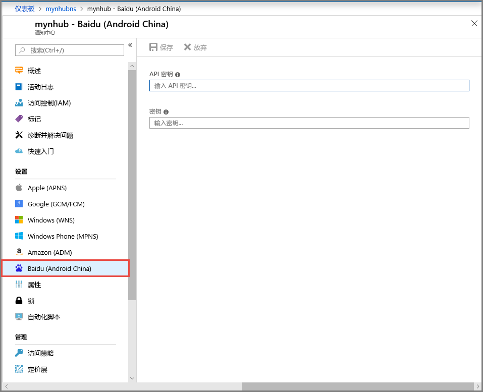

# <a name="get-started-with-notification-hubs-using-baidu"></a>通过百度开始使用通知中心
[!INCLUDE [notification-hubs-selector-get-started](../../includes/notification-hubs-selector-get-started.md)]

百度云推送是一种中国云服务，可用于将推送通知发送到移动设备。 

由于 Google Play 和 FCM (Firebase Cloud Messaging) 在中国不可用，必须使用其他的应用商店和推送服务。 百度就是其中的一个，也是通知中心目前所使用的。

## <a name="prerequisites"></a>先决条件
本教程需要：

* Android SDK（我们假设你使用 Android Studio），可从 <a href="http://go.microsoft.com/fwlink/?LinkId=389797">Android 站点</a>下载
* [百度推送 Android SDK]

> [!NOTE]
> 要完成本教程，必须有一个有效的 Azure 帐户。 如果没有帐户，只需花费几分钟就能创建一个免费试用帐户。 有关详细信息，请参阅 [Azure 免费试用](https://azure.microsoft.com/pricing/free-trial/?WT.mc_id=A0E0E5C02&amp;returnurl=http%3A%2F%2Fazure.microsoft.com%2Fen-us%2Fdocumentation%2Farticles%2Fnotification-hubs-baidu-get-started%2F)。
> 
> 

## <a name="create-a-baidu-account"></a>创建百度帐户
要使用百度，必须有一个百度帐户。 如果已有帐户，请登录 [百度门户]，并跳到下一步。 否则请参阅以下说明创建百度帐户。  

1. 转到[百度门户]并单击“登录”链接。 单击“立即注册”(Register Now) 以启动帐户注册过程。
   
    

2. 输入所需的详细信息（电话/电子邮件地址、密码和验证码），并单击“注册”(Signup)。
   
    

3. 系统会将一封电子邮件发送到输入的电子邮件地址，该邮件包含一个用于激活百度帐户的链接。
   
    

4. 登录到电子邮件帐户，打开百度激活邮件，并单击激活链接以激活百度帐号。
   
    

有已激活的百度帐户后，请登录 [百度门户]。

## <a name="create-a-baidu-cloud-push-project"></a>创建百度云推送项目
在创建百度云推送项目时，将收到应用程序 ID、API 密钥和密钥。

1. 登录到[百度门户]后，请单击“更多>>”。
   
    

2. 向下滚动“站长与开发者服务”(Webmaster and Developer Services) 部分并单击“百度云推送”(Baidu Cloud Push)。
   
    

3. 在下一页的右上角单击“登录”(Login)。
   
    

4. 然后，单击该页上的“创建应用”(Create Application)。

    

5. 在下一页上单击“创建新应用”(Create New Application)。
   
    

6. 输入应用程序名称，并单击“创建”(Create)。
   
    

7. 成功创建百度云推送项目后，会显示一个页面，其中包含“AppID”、“API 密钥”和“密钥”。 请记下 API 密钥和密钥，因为稍后将要用到。
   
    

8. 通过单击左侧窗格中的“创建通知”(Create Notification) 来配置推送通知项目。
   
    


## <a name="configure-a-new-notification-hub"></a>配置新通知中心
[!INCLUDE [notification-hubs-portal-create-new-hub](../../includes/notification-hubs-portal-create-new-hub.md)]


&emsp;&emsp;6. 在通知中心选择“通知服务”，然后选择“百度(Android China)”。

&emsp;&emsp;

&emsp;&emsp;7. 向下滚动到百度通知设置部分。 在百度云推送项目中，输入从百度控制台获得的 API 密钥和密钥。 然后单击“保存”。

&emsp;&emsp;

通知中心现在已配置为使用百度。 此外还有连接字符串，用于注册发送和接收推送通知的应用。

记下“访问连接信息”窗口中的 `DefaultListenSharedAccessSignature` 和 `DefaultFullSharedAccessSignature`。

## <a name="connect-your-app-to-the-notification-hub"></a>将应用连接到通知中心
1. 在 Android Studio 中创建新的 Android 项目（“文件”>“新建”>“新建项目”）。

    

2.  输入应用程序名称，并确保将要求的最低 SDK 版本设为“API 16: Android 4.1”。 **另请确保应用包名与百度云推送门户中的相同**

    
    

3.  单击“下一步”，并继续执行向导，直到显示“创建活动”窗口。 确保选中了“空活动”，最后选择“完成”以创建新的 Android 应用程序。

    

4.  确保“项目生成目标”已正确设置。

5.  然后添加 Azure 通知中心库。 在应用的 `Build.Gradle` 文件中，在 dependencies 节添加以下行。

    ```javascript
    compile 'com.microsoft.azure:notification-hubs-android-sdk:0.4@aar'
    compile 'com.microsoft.azure:azure-notifications-handler:1.0.1@aar'
    ```

    在 dependencies 节的后面添加以下存储库。

    ```javascript
    repositories {
        maven {
            url "http://dl.bintray.com/microsoftazuremobile/SDK"
        }
    }
    ```

    为了避免列表冲突，需在 Manifest.xml 中添加以下代码。

    ```xml
    <manifest package="YOUR.PACKAGE.NAME"
    xmlns:tools="http://schemas.android.com/tools"
    xmlns:android="http://schemas.android.com/apk/res/android">
    ```

    然后在 `<application/>` 标记中执行以下操作：

    ```xml
    <application
        tools:replace="android:allowBackup,icon,theme,label">
    ```

6.  下载并解压缩[百度推送 Android SDK]。 复制 libs 文件夹中的 `pushservice-x.y.z jar` 文件。 然后复制 Android 应用程序的 `src/main/jniLibs`（创建新文件夹）文件夹中的 `.so` 文件。

    

7. 右键单击 libs 文件夹中的 pushervice-x.y.z.jar 文件，然后单击“添加为库”将该 lib 包括到项目中。

    

8. 打开 Android 项目的 **AndroidManifest.xml** 文件，并添加百度 SDK 所需的权限。 **将 `YOURPACKAGENAME` 替换为包名**。

    ```xml
    <uses-permission android:name="android.permission.INTERNET" />
    <uses-permission android:name="android.permission.READ_PHONE_STATE" />
    <uses-permission android:name="android.permission.ACCESS_NETWORK_STATE" />
    <uses-permission android:name="android.permission.RECEIVE_BOOT_COMPLETED" />
    <uses-permission android:name="android.permission.WRITE_SETTINGS" />
    <uses-permission android:name="android.permission.VIBRATE" />
    <uses-permission android:name="android.permission.WRITE_EXTERNAL_STORAGE" />
    <uses-permission android:name="android.permission.DISABLE_KEYGUARD" />
    <uses-permission android:name="android.permission.ACCESS_COARSE_LOCATION" />
    <uses-permission android:name="android.permission.ACCESS_WIFI_STATE" />
    <uses-permission android:name="android.permission.ACCESS_DOWNLOAD_MANAGER" />
    <uses-permission android:name="android.permission.DOWNLOAD_WITHOUT_NOTIFICATION" />
    <uses-permission android:name="android.permission.EXPAND_STATUS_BAR" />
    !! <uses-permission android:name="baidu.push.permission.WRITE_PUSHINFOPROVIDER.YOURPACKAGENAME" />
    !!<permission android:name="baidu.push.permission.WRITE_PUSHINFOPROVIDER.YOURPACKAGENAME"android:protectionLevel="normal" />

    ```

9. 在 `.MainActivity` 活动元素后的 application 元素内添加以下配置，并替换 *yourprojectname*（例如 `com.example.BaiduTest`）：

    ```xml
    <activity
        android:name="com.baidu.android.pushservice.richmedia.MediaViewActivity"
        android:configChanges="orientation|keyboardHidden"
        android:label="MediaViewActivity" />
    <activity
        android:name="com.baidu.android.pushservice.richmedia.MediaListActivity"
        android:configChanges="orientation|keyboardHidden"
        android:label="MediaListActivity"
        android:launchMode="singleTask" />
 
    <!-- Push application definition message -->
    <receiver android:name=".MyPushMessageReceiver">
        <intent-filter>

            <!-- receive push message-->
            <action android:name="com.baidu.android.pushservice.action.MESSAGE" />
            <!-- receive bind,unbind,fetch,delete.. message-->
            <action android:name="com.baidu.android.pushservice.action.RECEIVE" />
            <action android:name="com.baidu.android.pushservice.action.notification.CLICK" />
        </intent-filter>
    </receiver>

    <receiver
        android:name="com.baidu.android.pushservice.PushServiceReceiver"
        android:process=":bdservice_v1">
        <intent-filter>
            <action android:name="android.intent.action.BOOT_COMPLETED" />
            <action android:name="android.net.conn.CONNECTIVITY_CHANGE" />
            <action android:name="com.baidu.android.pushservice.action.notification.SHOW" />
            <action android:name="com.baidu.android.pushservice.action.media.CLICK" />
            <action android:name="android.intent.action.MEDIA_MOUNTED" />
            <action android:name="android.intent.action.USER_PRESENT" />
            <action android:name="android.intent.action.ACTION_POWER_CONNECTED" />
            <action android:name="android.intent.action.ACTION_POWER_DISCONNECTED" />
        </intent-filter>
    </receiver>

    <receiver
        android:name="com.baidu.android.pushservice.RegistrationReceiver"
        android:process=":bdservice_v1">
        <intent-filter>
            <action android:name="com.baidu.android.pushservice.action.METHOD" />
            <action android:name="com.baidu.android.pushservice.action.BIND_SYNC" />
        </intent-filter>
        <intent-filter>
            <action android:name="android.intent.action.PACKAGE_REMOVED" />

            <data android:scheme="package" />
        </intent-filter>
    </receiver>

    <service
        android:name="com.baidu.android.pushservice.PushService"
        android:exported="true"
        android:process=":bdservice_v1">
        <intent-filter>
            <action android:name="com.baidu.android.pushservice.action.PUSH_SERVICE" />
        </intent-filter>
    </service>

    <service
        android:name="com.baidu.android.pushservice.CommandService"
        android:exported="true" />

    <!-- Adapt the ContentProvider declaration required for the Android N system, and the write permissions include the application package name-->
    <provider
        android:name="com.baidu.android.pushservice.PushInfoProvider"
        android:authorities="com.baidu.push.example.bdpush"
        android:exported="true"
        android:protectionLevel="signature"
        android:writePermission="baidu.push.permission.WRITE_PUSHINFOPROVIDER. yourprojectname  " />

    <!-- API Key of the Baidu application -->
    <meta-data
        android:name="api_key"
        !!   android:value="api_key" />
    </application>
    ```

10. 将名为 `ConfigurationSettings.java` 的新类添加到项目。

    ```java
    public class ConfigurationSettings {
        public static String API_KEY = "...";
        public static String NotificationHubName = "...";
        public static String NotificationHubConnectionString = "...";
    }
    ```
    
    使用百度云项目中的 API_KEY 设置 `API_KEY` 字符串的值。
    
    使用 [Azure 门户]中的通知中心名称设置 `NotificationHubName` 字符串的值，然后使用 [Azure 门户]中的 `DefaultListenSharedAccessSignature` 设置 `NotificationHubConnectionString` 的值。

11. 打开 MainActivity.java，并将以下内容添加到 onCreate 方法中：

    ```java
    PushManager.startWork(this, PushConstants.LOGIN_TYPE_API_KEY,  API_KEY );
    ```

12. 添加一个名为 `MyPushMessageReceiver.java` 的新类，并向此类中添加以下代码： 此类用于处理从百度推送服务器收到的推送通知。

    ```java
    package your.package.name;

    import android.content.Context;
    import android.content.Intent;
    import android.os.AsyncTask;
    import android.text.TextUtils;
    import android.util.Log;

    import com.baidu.android.pushservice.PushMessageReceiver;
    import com.microsoft.windowsazure.messaging.NotificationHub;
    import org.json.JSONException;
    import org.json.JSONObject;

    import java.util.List;

    public class MyPushMessageReceiver extends PushMessageReceiver {

        public static final String TAG = MyPushMessageReceiver.class
                .getSimpleName();
        public static NotificationHub hub = null;
        public static String mChannelId, mUserId;

        @Override
        public void onBind(Context context, int errorCode, String appid,
                        String userId, String channelId, String requestId) {
            String responseString = "onBind errorCode=" + errorCode + " appid="
                    + appid + " userId=" + userId + " channelId=" + channelId
                    + " requestId=" + requestId;
            Log.d(TAG, responseString);

            if (errorCode == 0) {
                // Binding successful
                Log.d(TAG, " Binding successful");
            }
            try {
                if (hub == null) {
                    hub = new NotificationHub(
                            ConfigurationSettings.NotificationHubName,
                            ConfigurationSettings.NotificationHubConnectionString,
                            context);
                    Log.i(TAG, "Notification hub initialized");
                }
            } catch (Exception e) {
                Log.e(TAG, e.getMessage());
            }
            mChannelId = channelId;
            mUserId = userId;

            registerWithNotificationHubs();
        }
        private void registerWithNotificationHubs() {

            new AsyncTask<Void, Void, Void>() {
                @Override
                protected Void doInBackground(Void... params) {
                    try {
                        hub.registerBaidu(mUserId, mChannelId);
                        Log.i(TAG, "Registered with Notification Hub - '"
                                + ConfigurationSettings.NotificationHubName + "'"
                                + " with UserId - '"
                                + mUserId + "' and Channel Id - '"
                                + mChannelId + "'");
                    } catch (Exception e) {
                        Log.e(TAG, e.getMessage());
                    }
                    return null;
                }
            }.execute(null, null, null);
        }

        @Override
        public void onMessage(Context context, String message,
                            String customContentString) {
            String messageString = " onMessage=\"" + message
                    + "\" customContentString=" + customContentString;
            Log.d(TAG, messageString);
            if (!TextUtils.isEmpty(customContentString)) {
                JSONObject customJson = null;
                try {
                    customJson = new JSONObject(customContentString);
                    String myvalue = null;
                    if (!customJson.isNull("mykey")) {
                        myvalue = customJson.getString("mykey");
                    }
                } catch (JSONException e) {
                    e.printStackTrace();
                }
            }

        }

        @Override
        public void onNotificationArrived(Context context, String title, String description, String customContentString) {
            String notifyString = " Notice Arrives onNotificationArrived  title=\"" + title
                    + "\" description=\"" + description + "\" customContent="
                    + customContentString;
            Log.d(TAG, notifyString);
            if (!TextUtils.isEmpty(customContentString)) {
                JSONObject customJson = null;
                try {
                    customJson = new JSONObject(customContentString);
                    String myvalue = null;
                    if (!customJson.isNull("mykey")) {
                        myvalue = customJson.getString("mykey");
                    }
                } catch (JSONException e) {
                    // TODO Auto-generated catch block
                    e.printStackTrace();
                }
            }
        }

        @Override
        public void onNotificationClicked(Context context, String title, String description, String customContentString) {
            String notifyString = " onNotificationClicked title=\"" + title + "\" description=\""
                    + description + "\" customContent=" + customContentString;
            Log.d(TAG, notifyString);
            Intent intent = new Intent(context.getApplicationContext(),MainActivity.class);
            intent.putExtra("title",title);
            intent.putExtra("description",description);
            intent.putExtra("isFromNotify",true);
            intent.addFlags(Intent.FLAG_ACTIVITY_NEW_TASK);
            context.getApplicationContext().startActivity(intent);

        }

        @Override
        public void onSetTags(Context context, int errorCode,
                            List<String> successTags, List<String> failTags, String requestId) {
            String responseString = "onSetTags errorCode=" + errorCode
                    + " successTags=" + successTags + " failTags=" + failTags
                    + " requestId=" + requestId;
            Log.d(TAG, responseString);

        }

        @Override
        public void onDelTags(Context context, int errorCode,
                            List<String> successTags, List<String> failTags, String requestId) {
            String responseString = "onDelTags errorCode=" + errorCode
                    + " successTags=" + successTags + " failTags=" + failTags
                    + " requestId=" + requestId;
            Log.d(TAG, responseString);

        }

        @Override
        public void onListTags(Context context, int errorCode, List<String> tags,
                            String requestId) {
            String responseString = "onListTags errorCode=" + errorCode + " tags="
                    + tags;
            Log.d(TAG, responseString);

        }

        @Override
        public void onUnbind(Context context, int errorCode, String requestId) {
            String responseString = "onUnbind errorCode=" + errorCode
                    + " requestId = " + requestId;
            Log.d(TAG, responseString);

            if (errorCode == 0) {
                // Unbinding is successful
                Log.d(TAG, " Unbinding is successful ");
            }
        }
    }
    ```

## <a name="send-notifications-to-your-app"></a>向应用程序发送通知

可以在 [Azure 门户]中快速测试通知接收情况：使用通知中心配置屏幕中的“发送”按钮，如以下屏幕所示：


通常，推送通知是在后端服务（例如，移动服务，或者使用兼容库的 ASP.NET）中发送的。 如果后端没有可用的库，则可直接使用 REST API 发送通知消息。

为简单起见，本教程使用一个控制台应用演示如何通过 .NET SDK 来发送通知。 但是，建议你接下来学习[使用通知中心向用户推送通知](notification-hubs-aspnet-backend-windows-dotnet-wns-notification.md)教程，了解如何从 ASP.NET 后端发送通知。 

下面是用于发送通知的不同方法：
* **REST 接口**：可以使用 [REST 接口](http://msdn.microsoft.com/library/windowsazure/dn223264.aspx)在任何后端平台上支持通知。
* **Microsoft Azure 通知中心 .NET SDK**：在 Visual Studio 的 Nuget 包管理器中，运行 [Install-Package Microsoft.Azure.NotificationHubs](https://www.nuget.org/packages/Microsoft.Azure.NotificationHubs/)。
* **Node.js**：[如何通过 Node.js 使用通知中心](notification-hubs-nodejs-push-notification-tutorial.md)。
* **移动应用**：有关如何从通知中心集成的 Azure 应用服务移动应用后端发送通知的示例，请参阅[将推送通知添加到移动应用](../app-service-mobile/app-service-mobile-windows-store-dotnet-get-started-push.md)。
* **Java/PHP**：有关如何使用 REST API 发送通知的示例，请参阅“如何通过 Java/PHP 使用通知中心”([Java](notification-hubs-java-push-notification-tutorial.md) | [PHP](notification-hubs-php-push-notification-tutorial.md))。

## <a name="optional-send-notifications-from-a-net-console-app"></a>（可选）通过 .NET 控制台应用发送通知。
在本部分，我们将演示如何使用 .NET 控制台应用发送通知。

1. 创建新的 Visual C# 控制台应用程序：
   
    

2. 在“包管理器控制台”窗口中，将“默认项目”设置为新的控制台应用程序项目，然后在控制台窗口中执行以下命令：
   
        Install-Package Microsoft.Azure.NotificationHubs
   
    此指令会使用 <a href="http://www.nuget.org/packages/Microsoft.Azure.NotificationHubs/">Microsoft.Azure.Notification Hubs NuGet 包</a>添加对 Azure 通知中心 SDK 的引用。
   
    

3. 打开 `Program.cs` 文件并添加以下 using 语句：
   
    ```csharp
    using Microsoft.Azure.NotificationHubs;
    ```

4. 在 `Program` 类中添加以下方法，并使用自己的值替换 `DefaultFullSharedAccessSignatureSASConnectionString` 和 `NotificationHubName`。
   
    ```csharp
    private static async void SendNotificationAsync()
    {
        NotificationHubClient hub = NotificationHubClient.CreateClientFromConnectionString("DefaultFullSharedAccessSignatureSASConnectionString", "NotificationHubName");
        string message = "{\"title\":\"((Notification title))\",\"description\":\"Hello from Azure\"}";
        var result = await hub.SendBaiduNativeNotificationAsync(message);
    }
    ```

5. 在 `Main` 方法中添加以下行：

    ```csharp
    SendNotificationAsync();
    Console.ReadLine();
    ```

## <a name="test-your-app"></a>测试应用

要使用实际的手机测试此应用，只需使用 USB 电缆将该手机连接到计算机。 此操作会将应用加载到连接的手机中。

若要使用模拟器测试此应用，请在 Android Studio 顶部工具栏中单击“运行”，然后选择用于启动模拟器、加载和运行应用的应用。

该应用将从百度推送通知服务检索 `userId` 和 `channelId`，并注册到通知中心。

若要发送测试通知，可以使用 [Azure 门户]的调试选项卡。 如果为 Visual Studio 生成了 .NET 控制台应用程序，只需在 Visual Studio 中按 F5 键以运行该应用程序。 该应用程序会发送一条通知，该通知显示在设备或模拟器的顶部通知区域。

<!-- URLs. -->
[Mobile Services Android SDK]: https://go.microsoft.com/fwLink/?LinkID=280126&clcid=0x409
[百度推送 Android SDK]: http://push.baidu.com/sdk/push_client_sdk_for_android
[Azure 门户]: https://portal.azure.com/
[百度门户]: http://www.baidu.com/
