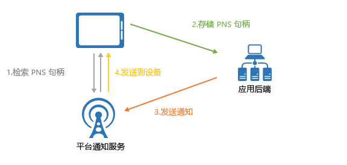
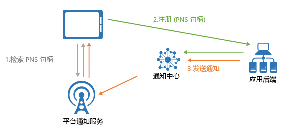

# 什么是 Azure 通知中心？

Azure 通知中心提供易于使用且横向扩展的推送引擎，允许你从任何后端（云或本地）向任何平台（iOS、Android、Windows 等）发送通知。 通知中心非常适合用于企业和消费者方案。 下面是一些示例方案：

- 以较低的延迟向数百万用户发送突发新闻通知。
- 向感兴趣的用户群发送基于位置的优惠券。
- 向媒体/体育/财经/游戏应用程序的用户或组发送活动相关的通知。
- 将促销内容推送到应用程序，以吸引客户并向其推销。
- 向用户通知企业事件，例如新的消息和工作项。
- 发送多重身份验证的代码。

## 什么是推送通知？

推送通知是一种应用到用户的通信形式，它通常以移动设备上的弹窗或对话框的方式将某种需要的信息通知给移动应用的用户。 用户通常选择是要查看还是忽略该消息，如果选择前者，将打开传达了该通知的移动应用程序。 一些通知是静默通知 - 通过后台提供，以便应用进行处理和确定相应操作。

推送通知对于提高消费型应用的应用参与度与使用量以及在企业应用中传达最新业务信息至关重要。 它是最佳的应用到用户通信形式，因为它对于移动设备而言能效较高，对于发送方而言具有弹性，即使相应的应用程序处于非活动状态时，也能使用推送通知。

> [!NOTE]
> Azure 通知中心并不正式支持 IP 语音 (VoIP) 推送通知；但是，[此文介绍如何通过 Azure 通知中心使用 APNS VOIP 通知](voip-apns.md)。

有关一些流行平台中的推送通知的详细信息，请参阅以下主题：

- [Android](https://developer.android.com/guide/topics/ui/notifiers/notifications.html)
- [iOS](https://developer.apple.com/notifications/)
- [Windows](https://msdn.microsoft.com/library/windows/apps/hh779725.aspx)

## 推送通知的工作原理是什么？

推送通知通过称为*平台通知系统* (PNS) 的特定于平台的基础结构进行传送。 它们提供基本的推送功能，使用提供的句柄向设备传送消息，没有通用接口。 若要跨应用的 Android、iOS 和 Windows 版本将通知发送给所有客户，开发人员必须单独使用 Apple Push Notification 服务 (APNS)、Firebase Cloud Messaging (FCM) 和 Windows 通知服务 (WNS)。

从较高层面讲，推送的工作原理如下：

1. 应用程序希望接收通知，因此会联系运行时所在的目标平台的 PNS 并请求唯一的临时推送句柄。 句柄类型取决于系统（例如，WNS 使用 URI，APNS 使用令牌）。
2. 客户端应用将此句柄存储在应用后端或提供程序中。
3. 为了发送推送通知，应用后端使用句柄与 PNS 联系以定位到特定的客户端应用。
4. PNS 将通知转发到句柄所指定的设备。

## 推送通知的难点

PNSes 非常强大。 但应用开发人员仍然需要完成大量工作才能实现常见的推送通知方案，例如，将推送通知广播给细分用户。

发送推送通知需要与应用程序的主要业务逻辑无关的复杂基础结构。 下面是基础结构方面的一些难题：

- **平台依赖性**
  - 由于 PNS 并不统一，需要在后端中使用复杂且难以维护的平台相关逻辑，才能将通知发送到各个平台上的设备。
- **缩放**
  - 根据 PNS 指导原则，每次启动应用时都必须刷新设备令牌。 仅仅是为了保持令牌的最新状态，后端就必须处理大量的流量和数据库访问。 当设备数目增长到几亿甚至几十亿时，创建和维护此基础结构所需的成本是巨大的。
  - 大多数 PNS 不支持广播到多台设备。 仅仅是广播到 100 万台设备就需要对 PNS 发出 100 万次调用。 以最低的延迟缩放这种流量大小并非易事。
- **路由**
  - 尽管 PNS 提供了向设备发送消息的方式，但大多数应用通知面向用户或兴趣组。 后端必须维护一个注册表，用于将设备与兴趣组、用户、属性等关联起来。此项开销增大了应用的面市时间和维护成本。

## 为何使用 Azure 通知中心？

通知中心消除了与你自行从应用后端发送推送通知相关的所有复杂性。 它的多平台扩展式推送通知基础结构减少了推送相关的代码并简化了后端。 使用通知中心时，设备只负责将其 PNS 句柄注册到中心，而后端负责向用户或兴趣组发送消息，如下图中所示：

通知中心是随时可用的推送引擎，具有以下优点：

- **跨平台**
  - 支持所有主要的推送平台。
  - 有一个通用接口，可以使用平台特定的或平台相关的格式向所有平台推送通知，无需执行平台特定的工作。
  - 在一个位置管理设备句柄。
- **跨后端**
  - 云或本地。
  - .NET、Node.js、Java、Python 等。
- **丰富的传送模式集**
  - 广播到一个或多个平台：只需调用 API 一次，便可立即广播到数百万台跨平台设备。
  - 推送到设备：可将通知定位到单个设备。
  - 推送到用户：可以借助标记和模板将通知传入用户的所有跨平台设备。
  - 使用动态标记推送到目标段：可以借助标记功能根据需要将设备分段并向其推送通知，不管是要发送到一个段还是段的表达式（例如，active AND lives in Seattle NOT new user）。 可以不受发布-订阅的限制，随时随地更新设备标记。
  - 本地化推送：可以借助模板功能实现本地化，而不会影响到后端代码。
  - 静默推送：可以通过向设备发送静默通知并触发设备完成特定的拉取或操作，来实现推送-拉取模式。
  - 计划推送：可以按计划随时发送通知。
  - 直接推送：可以跳过将设备注册到通知中心服务的步骤，直接批量推送到设备句柄列表。
  - 个性化推送：可以借助设备推送变量，使用自定义的键值对发送设备特定的个性化推送通知。
- **丰富的遥测**
  - 可通过 Azure 门户和编程方式使用常规的推送、设备、错误和操作遥测。
  - 单消息遥测会跟踪从发出初始请求调用到通知中心服务成功发送推送的每个推送过程。
  - 平台通知系统反馈会传达来自 PNS 的所有反馈以帮助调试。
- **伸缩性**
  - 无需重建体系结构或者将设备分片，即可快速地向数百万台设备发送消息。
- **安全性**
  - 共享访问机密 (SAS) 或联合身份验证。

## 后续步骤

按照[教程：向移动应用程序推送通知](notification-hubs-android-push-notification-google-fcm-get-started.md)，开始创建和使用通知中心。

[0]: ./media/notification-hubs-overview/registration-diagram.png
[1]: ./media/notification-hubs-overview/notification-hub-diagram.png

[How customers are using Notification Hubs]: https://azure.microsoft.com/services/notification-hubs
[Notification Hubs tutorials and guides]: https://azure.microsoft.com/documentation/services/notification-hubs
[iOS]: https://azure.microsoft.com/documentation/articles/notification-hubs-ios-get-started
[Android]: https://azure.microsoft.com/documentation/articles/notification-hubs-android-get-started
[Windows Universal]: https://azure.microsoft.com/documentation/articles/notification-hubs-windows-store-dotnet-get-started
[Windows Phone]: https://azure.microsoft.com/documentation/articles/notification-hubs-windows-phone-get-started
[Kindle]: https://azure.microsoft.com/documentation/articles/notification-hubs-kindle-get-started
[Xamarin.iOS]: https://azure.microsoft.com/documentation/articles/partner-xamarin-notification-hubs-ios-get-started
[Xamarin.Android]: https://azure.microsoft.com/documentation/articles/partner-xamarin-notification-hubs-android-get-started
[Microsoft.WindowsAzure.Messaging.NotificationHub]: https://msdn.microsoft.com/library/microsoft.windowsazure.messaging.notificationhub.aspx
[Microsoft.ServiceBus.Notifications]: https://msdn.microsoft.com/library/microsoft.servicebus.notifications.aspx
[App Service Mobile Apps]: https://azure.microsoft.com/documentation/articles/app-service-mobile-value-prop/
[templates]: notification-hubs-templates-cross-platform-push-messages.md
[Azure portal]: https://portal.azure.com
[tags]: (https://msdn.microsoft.com/library/azure/dn530749.aspx)
