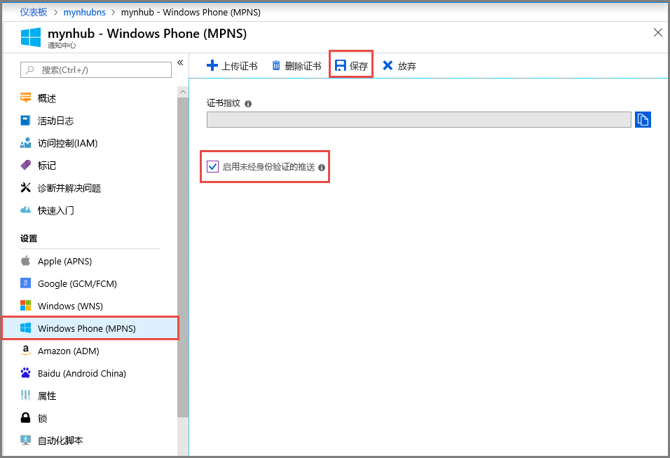

# <a name="tutorial-send-push-notifications-to-windows-phone-apps-using-notification-hubs"></a>教程：使用通知中心向 Windows Phone 应用发送推送通知

[!INCLUDE [notification-hubs-selector-get-started](../../includes/notification-hubs-selector-get-started.md)]

本教程演示如何使用 Azure 通知中心将推送通知发送到 Windows Phone 8 或 Windows Phone 8.1 Silverlight 应用程序。 如果要以 Windows Phone 8.1（非 Silverlight）为目标，请参阅本教程的 [Windows Universal](notification-hubs-windows-store-dotnet-get-started-wns-push-notification.md) 版本。

在本教程中，将创建一个空白 Windows Phone 8 应用，它使用 Microsoft 推送通知服务 (MPNS) 接收推送通知。 创建应用后，请使用通知中心将推送通知广播到运行应用的所有设备。

> [!NOTE]
> 通知中心 Windows Phone SDK 不支持将 Windows 推送通知服务 (WNS) 与 Windows Phone 8.1 Silverlight 应用配合使用。 要将 WNS（而不是 MPNS）与 Windows Phone 8.1 Silverlight 应用配合使用，请遵循使用 REST API 的 [通知中心 - Windows Phone Silverlight 教程]。

在本教程中，你将了解如何执行以下操作：

> [!div class="checklist"]
> * 创建通知中心
> * 创建 Windows Phone 应用程序
> * 测试性发送通知

## <a name="prerequisites"></a>先决条件

* **Azure 订阅**。 如果还没有 Azure 订阅，可以在开始前[创建一个免费 Azure 帐户](https://azure.microsoft.com/free/)。
* [包含移动开发组件的 Visual Studio 2015 Express](https://www.visualstudio.com/vs/older-downloads/)

完成本教程是学习有关 Windows Phone 8 应用的所有其他通知中心教程的先决条件。

## <a name="create-your-notification-hub"></a>创建通知中心

[!INCLUDE [notification-hubs-portal-create-new-hub](../../includes/notification-hubs-portal-create-new-hub.md)]

### <a name="configure-windows-phone-mpns-settings"></a>配置 Windows Phone (MPNS) 设置

1. 在“通知设置”下选择“Windows Phone (MPNS)”。  
2. 选择“启用身份验证推送”  。
3. 在工具栏上选择“保存”。 

    

    中心现已创建，并已配置为向 Windows Phone 发送未经身份验证的通知。

    > [!NOTE]
    > 本教程使用未经身份验证模式下的 MPNS。 MPNS 未经身份验证的模式对可以发送到每个通道的通知有一些限制。 通知中心支持 [MPNS 身份验证模式](https://msdn.microsoft.com/library/windowsphone/develop/ff941099.aspx)，它允许上传证书。

## <a name="create-a-windows-phone-application"></a>创建 Windows Phone 应用程序

在此部分，请创建一个可以自行注册到通知中心的 Windows Phone 应用程序。

1. 在 Visual Studio 中创建一个新的 Windows Phone 8 应用程序。

    ![Visual Studio - 新建项目 - Windows Phone 应用][13]

    在 Visual Studio 2013 Update 2 或更高版本中，必须改为创建 Windows Phone Silverlight 应用程序。

    ![Visual Studio - 新建项目 - 空白应用 - Windows Phone Silverlight][11]
2. 在 Visual Studio 中，右键单击该解决方案，并单击“管理 NuGet 包”。 
3. 搜索 `WindowsAzure.Messaging.Managed`，单击“安装”，并接受使用条款。 

    ![Visual Studio - NuGet 包管理器][20]
4. 打开文件 App.xaml.cs 并添加以下 `using` 语句：

        using Microsoft.Phone.Notification;
        using Microsoft.WindowsAzure.Messaging;
5. 在 `App.xaml.cs` 中的 `Application_Launching` 方法顶部添加以下代码：

    ```csharp
    private void Application_Launching(object sender, LaunchingEventArgs e)
    {

        var channel = HttpNotificationChannel.Find("MyPushChannel");
        if (channel == null)
        {
            channel = new HttpNotificationChannel("MyPushChannel");
            channel.Open();
            channel.BindToShellToast();
        }

        channel.ChannelUriUpdated += new EventHandler<NotificationChannelUriEventArgs>(async (o, args) =>
        {
            var hub = new NotificationHub("<hub name>", "<connection string>");
            var result = await hub.RegisterNativeAsync(args.ChannelUri.ToString());

            System.Windows.Deployment.Current.Dispatcher.BeginInvoke(() =>
            {
                MessageBox.Show("Registration :" + result.RegistrationId, "Registered", MessageBoxButton.OK);
            });
        });
    }
    ```

   > [!NOTE]
   > 值 `MyPushChannel` 是用于查找 [HttpNotificationChannel](https://msdn.microsoft.com/library/windows/apps/microsoft.phone.notification.httpnotificationchannel.aspx) 集合中现有通道的索引。 如果不存在，则使用该名称创建新条目。

    插入中心名称以及在前一部分记下的名为 `DefaultListenSharedAccessSignature` 的连接字符串。
    此代码从 MPNS 检索应用的通道 URI，然后将该通道 URI 注册到通知中心。 它还保证每次启动应用程序时都在通知中心注册通道 URI。

   > [!NOTE]
   > 本教程会一个 toast 通知发送到设备。 发送磁贴通知时，必须在通道上调用 `BindToShellTile` 方法。 若要同时支持 toast 通知和磁贴通知，请同时调用 `BindToShellTile` 和 `BindToShellToast`。

6. 在解决方案资源管理器中，展开“属性”，打开 `WMAppManifest.xml` 文件，单击“功能”选项卡并确保选中 **ID_CAP_PUSH_NOTIFICATION** 功能。   应用现在可以接收推送通知了。

    ![Visual Studio - Windows Phone 应用功能][14]
7. 按 `F5` 键以运行应用。 随后应用中会显示注册消息。
8. 关闭应用或切换到主页。

   > [!NOTE]
   > 若要接收 toast 推送通知，则应用程序不得在前台运行。

## <a name="test-send-a-notification"></a>测试性发送通知

1. 在 Azure 门户中切换到“概览”选项卡。
2. 选择“测试性发送”。 

    
3. 在“测试性发送”窗口中执行以下步骤： 

    1. 对于“平台”，请选择“Windows Phone”  。 
    2. 对于“通知类型”，请选择“Toast”。  
    3. 选择“发送” 
    4. 请在窗口底部的列表中查看**结果**。

        
4. 在 Windows Phone 模拟器或 Windows Phone 中，确认看到通知消息。

    

## <a name="next-steps"></a>后续步骤

在这个简单的示例中，已将推送通知广播到所有 Windows Phone 8 设备。 若要了解如何向特定的设备推送通知，请转到以下教程：

> [!div class="nextstepaction"]
>[向特定设备推送通知](notification-hubs-windows-phone-push-xplat-segmented-mpns-notification.md)

<!-- Images. -->
[6]: ./media/notification-hubs-windows-phone-get-started/notification-hub-create-console-app.png
[7]: ./media/notification-hubs-windows-phone-get-started/notification-hub-create-from-portal.png
[8]: ./media/notification-hubs-windows-phone-get-started/notification-hub-create-from-portal2.png
[9]: ./media/notification-hubs-windows-phone-get-started/notification-hub-select-from-portal.png
[10]: ./media/notification-hubs-windows-phone-get-started/notification-hub-select-from-portal2.png
[11]: ./media/notification-hubs-windows-phone-get-started/notification-hub-create-wp-silverlight-app.png
[12]: ./media/notification-hubs-windows-phone-get-started/notification-hub-connection-strings.png
[13]: ./media/notification-hubs-windows-phone-get-started/notification-hub-create-wp-app.png
[14]: ./media/notification-hubs-windows-phone-get-started/mobile-app-enable-push-wp8.png
[15]: ./media/notification-hubs-windows-phone-get-started/notification-hub-pushauth.png
[20]: ./media/notification-hubs-windows-phone-get-started/notification-hub-windows-universal-app-install-package.png
[213]: ./media/notification-hubs-windows-phone-get-started/notification-hub-create-console-app.png

<!-- URLs. -->
[Notification Hubs Guidance]: https://msdn.microsoft.com/library/jj927170.aspx
[MPNS authenticated mode]: https://msdn.microsoft.com/library/windowsphone/develop/ff941099(v=vs.105).aspx
[Use Notification Hubs to push notifications to users]: notification-hubs-aspnet-backend-windows-dotnet-wns-notification.md
[Use Notification Hubs to send breaking news]: notification-hubs-windows-phone-push-xplat-segmented-mpns-notification.md
[toast catalog]: https://msdn.microsoft.com/library/windowsphone/develop/jj662938(v=vs.105).aspx
[tile catalog]: https://msdn.microsoft.com/library/windowsphone/develop/hh202948(v=vs.105).aspx
[通知中心 - Windows Phone Silverlight 教程]: https://github.com/Azure/azure-notificationhubs-samples/tree/master/PushToSafari
