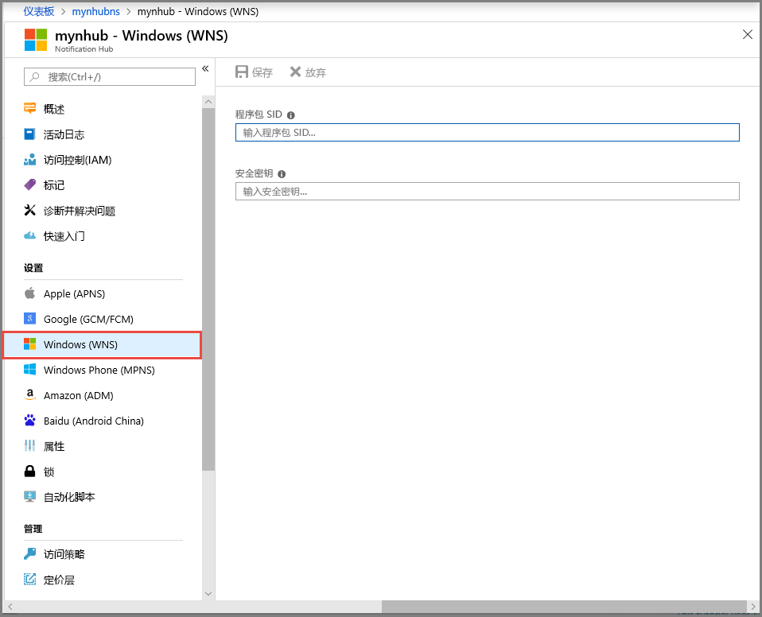

# 教程：使用 Azure 通知中心向通用 Windows 平台应用发送通知

[!INCLUDE [notification-hubs-selector-get-started](../../includes/notification-hubs-selector-get-started.md)]

本教程介绍如何创建通知中心，以便将推送通知发送到通用 Windows 平台 (UWP) 应用。 创建一个空白 Windows 应用商店应用，以便使用 Windows 推送通知服务 (WNS) 接收推送通知。 然后即可使用通知中心将推送通知广播到运行应用的所有设备。

> [!NOTE]
> 可以在 [GitHub](https://github.com/Azure/azure-notificationhubs-samples/tree/master/dotnet/GetStartedWindowsUniversal) 上找到本教程的已完成代码。

在本教程中，请执行以下步骤：

> [!div class="checklist"]
> * 在 Windows 应用商店中创建应用
> * 创建通知中心
> * 创建示例 Windows 应用
> * 发送测试通知

## 先决条件
- **Azure 订阅**。 如果你还没有 Azure 订阅，可以在开始前创建一个 [免费帐户](https://azure.microsoft.com/free/?WT.mc_id=A261C142F)。
- [Microsoft Visual Studio Community 2015](https://www.visualstudio.com/products/visual-studio-community-vs) 或更高版本。
- [已安装 UWP 应用开发工具](https://msdn.microsoft.com/windows/uwp/get-started/get-set-up)
- 有效的 Windows 应用商店帐户

完成本教程是学习有关 UWP 应用的所有其他通知中心教程的先决条件。

## 在 Windows 应用商店中创建应用
要将推送通知发送到 UWP 应用，请将应用关联到 Windows 应用商店。 然后将通知中心配置为与 WNS 集成。

1. 导航到 [Windows 开发人员中心](https://dev.windows.com/overview)，使用 Microsoft 帐户登录，然后选择“新建应用”。

    
1. 键入应用的名称，然后选择“保留产品名称”。 这将为应用创建一个新的 Windows 应用商店注册。

    
1. 展开“应用管理”，然后依次选择“WNS/MPNS”、“WNS/MPNS”、“Live 服务站点”。 登录 Microsoft 帐户。 “应用程序注册门户”会在新选项卡中打开。也可直接导航到[应用程序注册门户](http://apps.dev.microsoft.com)，然后选择应用程序名称以访问该页。

    
1.   记下“应用程序机密”密码和“包安全标识符(SID)”。

        >[!WARNING]
        >应用程序机密和程序包 SID 是重要的安全凭据。 请勿将这些值告知任何人或随应用程序分发它们。

## 创建通知中心
[!INCLUDE [notification-hubs-portal-create-new-hub](../../includes/notification-hubs-portal-create-new-hub.md)]

### 配置中心的 WNS 设置

1. 在“通知设置”类别中选择“Windows (WNS)”。 
2. 输入在前一部分记下的“包 SID”和“安全密钥”的值。 
3. 在工具栏上选择“保存”。

    

通知中心现在已配置为使用 WNS。 你有了用于注册应用和发送通知的连接字符串。

## 创建示例 Windows 应用
1. 在 Visual Studio 中选择“文件”，指向“新建”，然后选择“项目”。 
2. 在“新建项目”对话框中，执行以下步骤： 

    1. 展开“Visual C#”。
    2. 选择“Windows Universal”。 
    3. 选择“空白应用(通用 Windows)”。 
    4. 输入项目的**名称**。 
    5. 选择“确定”。 

        
1. 接受**目标**和**最低**平台版本的默认值，然后选择“确定”。 
2. 在“解决方案资源管理器”中，右键单击 Windows 应用商店应用项目，选择“应用商店”，然后选择“将应用与应用商店关联”。 此时会显示“将应用与 Windows 应用商店关联”向导。
3. 在向导中，使用 Microsoft 帐户登录。
4. 选择在第 2 步中注册的应用，选择“下一步”，然后选择“关联”。 这会将所需的 Windows 应用商店注册信息添加到应用程序清单中。
5. 在 Visual Studio 中，右键单击该解决方案，并选择“管理 NuGet 包”。 此时会打开“管理 NuGet 包”窗口。
6. 在搜索框中，输入 **WindowsAzure.Messaging.Managed**，选择“安装”，并接受使用条款。
   
    ![“管理 NuGet 包”窗口][20]
   
    此操作使用 [Microsoft.Azure.NotificationHubs NuGet 包](https://www.nuget.org/packages/Microsoft.Azure.NotificationHubs)下载、安装并添加对 Azure 通知中心库的引用。

3. 打开 App.xaml.cs 项目文件并添加以下 `using` 语句： 
   
        using Windows.Networking.PushNotifications;
        using Microsoft.WindowsAzure.Messaging;
        using Windows.UI.Popups;

4. 在 App.xaml.cs 中，另外将以下 **InitNotificationsAsync** 方法定义添加到 **App** 类中：
   
        private async void InitNotificationsAsync()
        {
            var channel = await PushNotificationChannelManager.CreatePushNotificationChannelForApplicationAsync();
   
            var hub = new NotificationHub("<your hub name>", "<Your DefaultListenSharedAccessSignature connection string>");
            var result = await hub.RegisterNativeAsync(channel.Uri);
   
            // Displays the registration ID so you know it was successful
            if (result.RegistrationId != null)
            {
                var dialog = new MessageDialog("Registration successful: " + result.RegistrationId);
                dialog.Commands.Add(new UICommand("OK"));
                await dialog.ShowAsync();
            }
   
        }
   
    此代码从 WNS 检索应用的通道 URI，并将该通道 URI 注册到通知中心。
   
    >[!NOTE]
    >* 将“hub name”占位符替换为出现在 Azure 门户中的通知中心的名称。 
    >* 另外，使用在之前部分中从通知中心的“访问策略”页获取的 **DefaultListenSharedAccessSignature** 连接字符串替换连接字符串占位符。
   > 
   > 
5. 在 App.xaml.cs 中 **OnLaunched** 事件处理程序的上方，添加对新 **InitNotificationsAsync** 方法的以下调用：
   
        InitNotificationsAsync();
   
    此操作保证每次启动应用程序时都在通知中心注册通道 URI。

6. 若要运行应用，请选择 **F5** 键。 此时会显示包含注册密钥的对话框。 若要关闭对话框，请选择“确定”。 

    

应用现在已能够接收 toast 通知。

## 发送测试通知
可以通过在 [Azure 门户](https://portal.azure.com/)中发送通知来快速测试在应用中接收通知。 

1. 在 Azure 门户中切换到“概览”选项卡，然后在工具栏上选择“测试性发送”。     

    
2. 在“测试性发送”窗口中执行以下操作： 
    1. 对于“平台”，请选择“Windows”。
    2. 对于“通知类型”，请选择“Toast”。 
    3. 选择“发送”。 
    
        
3. 请在窗口底部的“结果”列表中查看“发送”操作的结果。 此外还会看到一条警报消息。 

    
1. 桌面上会显示通知消息：**测试性消息**。 

    

## 后续步骤
本教程使用门户或控制台应用将广播通知发送到所有 Windows 设备。 若要了解如何向特定的设备推送通知，请转到以下教程： 

> [!div class="nextstepaction"]
>[向特定设备推送通知](
notification-hubs-windows-notification-dotnet-push-xplat-segmented-wns.md)

<!-- Images. -->
[13]: ./media/notification-hubs-windows-store-dotnet-get-started/notification-hub-create-console-app.png
[14]: ./media/notification-hubs-windows-store-dotnet-get-started/notification-hub-windows-toast.png
[19]: ./media/notification-hubs-windows-store-dotnet-get-started/notification-hub-windows-reg.png
[20]: ./media/notification-hubs-windows-store-dotnet-get-started/notification-hub-windows-universal-app-install-package.png

<!-- URLs. -->

[Use Notification Hubs to push notifications to users]: notification-hubs-aspnet-backend-windows-dotnet-wns-notification.md
[Use Notification Hubs to send breaking news]: notification-hubs-windows-notification-dotnet-push-xplat-segmented-wns.md

[toast catalog]: http://msdn.microsoft.com/library/windows/apps/hh761494.aspx
[tile catalog]: http://msdn.microsoft.com/library/windows/apps/hh761491.aspx
[badge overview]: http://msdn.microsoft.com/library/windows/apps/hh779719.aspx
 
