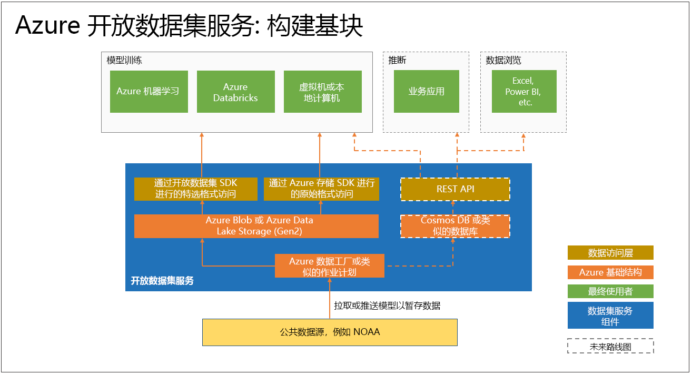

# 什么是 Azure 开放数据集？如何使用它们？

[Azure 开放数据集](https://azure.microsoft.com/services/open-datasets/)是精选公共数据集，可用于将方案专属特征添加到机器学习解决方案，以提高模型的准确度。 开放数据集位于云中的 Microsoft Azure 上并已集成到 Azure 机器学习中，随时可供 Azure Databricks 和机器学习工作室（经典版）使用。 也可以通过 API 访问数据集，并在 Power BI 和 Azure 数据工厂等其他产品中使用它们。

数据集包括不受任何限制的天气、人口普查、节假日、公共安全和位置数据，有助于定型机器学习模型和扩充预测解决方案。 还可以共享 Azure 开放数据集中的公共数据集。 

## 准备的精选数据集
Azure 开放数据集中的精选开放公共数据集更适合用于机器学习工作流。 

若要查看所有可用的数据集，请参阅 [Azure 开放数据集目录](https://azure.microsoft.com/services/open-datasets/catalog/)。

数据科学家通常将大部分时间花在清理和准备数据上，以执行高级分析。 为了节省你的时间，开放数据集复制到 Azure 云中，并经过预处理。 系统将按固定的间隔从源提取数据，例如，通过与美国海洋与大气管理局 (NOAA) 建立 FTP 连接来提取数据。 接下来，将数据分析成结构化格式，然后使用各种特征（例如最靠近的气象站的邮政编码或位置）相应地扩充这些数据。

数据集通过 Azure 中的云计算共同托管，简化了访问和操作。  

下面展示了可用数据集示例。 

### 天气数据
 
|数据集         | 笔记本     | 说明                                    |
|----------------|---------------|------------------------------------------------|
|[NOAA 集成地面数据 (ISD)](https://azure.microsoft.com/services/open-datasets/catalog/noaa-integrated-surface-data/) | [Azure Notebook](https://azure.microsoft.com/services/open-datasets/catalog/noaa-integrated-surface-data/?tab=data-access#AzureNotebooks)   [Azure Databricks](https://azure.microsoft.com/services/open-datasets/catalog/noaa-integrated-surface-data/?tab=data-access#AzureDatabricks) | 来自 NOAA 的全球每小时天气数据，最佳空间覆盖北美、欧洲、澳大利亚和亚洲部分地区。 每天更新一次。 |
|[NOAA 全球预测系统 (GFS)](https://azure.microsoft.com/services/open-datasets/catalog/noaa-global-forecast-system/) | [Azure Notebook](https://azure.microsoft.com/services/open-datasets/catalog/noaa-global-forecast-system/?tab=data-access#AzureNotebooks)   [Azure Databricks](https://azure.microsoft.com/services/open-datasets/catalog/noaa-global-forecast-system/?tab=data-access#AzureDatabricks) | 来自 NOAA 的 15 天美国每小时天气预测数据。 每天更新一次。 |

### 日历数据

|数据集         | 笔记本     | 说明                                    |
|----------------|---------------|------------------------------------------------|
|[公共节假日](https://azure.microsoft.com/services/open-datasets/catalog/public-holidays/) | [Azure Notebook](https://azure.microsoft.com/services/open-datasets/catalog/public-holidays/?tab=data-access#AzureNotebooks)   [Azure Databricks](https://azure.microsoft.com/services/open-datasets/catalog/public-holidays/?tab=data-access#AzureDatabricks) | 全球公共节假日数据，覆盖 41 个国家/地区从 1970 年到 2099 年的节假日数据。 包括国家/地区，以及大多数人是否带薪休假。 |

## 访问数据集  
借助 Azure 帐户，可以使用代码或通过 Azure 服务界面访问开放数据集。 数据与 Azure 云计算资源共置在一起，以供用于机器学习解决方案。  

开放数据集通过 Azure 机器学习 UI 和 SDK 提供。 开放数据集还提供 Azure Notebooks 和 Azure Databricks 笔记本，可用于将数据连接到 Azure 机器学习和 Azure Databricks。 也可以通过 Python SDK 访问数据集。 

不过，无需使用 Azure 帐户，即可访问开放数据集；可以在含或不含 Spark 的任意 Python 环境中访问它们。

## 请求获取或参与数据集

如果找不到所需的数据，请向我们发送电子邮件，以[请求获取数据集](mailto:aod@microsoft.com?Subject=Request%20dataset%3A%20%3Creplace%20with%20dataset%20name%3E&Body=%0AYour%20name%20and%20institution%3A%20%0A%0ADataset%20name%3A%0A%20%0ADataset%20description%3A%20%0A%3Cfill%20in%20a%20brief%20description%20and%20share%20any%20web%20links%20of%20the%20dataset%3E%20%0A%0ADataset%20size%3A%20%0A%3Chow%20much%20space%20does%20the%20dataset%20need%20today%20and%20how%20much%20is%20it%20expected%20to%20grow%20each%20year%3E%20%0A%0ADataset%20file%20formats%3A%20%0A%3Ccurrent%20dataset%20file%20formats%2C%20and%20optionally%2C%20any%20formats%20that%20the%20dataset%20must%20be%20transformed%20to%20for%20easy%20access%3E%0A%0ALicense%3A%20%0A%3Cwhat%20is%20the%20license%20or%20terms%20and%20conditions%20governing%20the%20distribution%20of%20this%20dataset%3E%0A%0AUse%20cases%3A%20%0A%3CExplain%20some%20common%20use%20of%20the%20dataset.%20E.g.%20weather%20dataset%20can%20be%20useful%20in%20demand%20forecasting%20and%20predictive%20maintenance%20scenarios%3E%20%0A%0AAny%20additional%20information%20you%20want%20us%20to%20know%3A%0A)或[参与数据集](mailto:aod@microsoft.com?Subject=Contribute%20dataset%3A%20%3Creplace%20with%20dataset%20name%3E&Body=%0AYour%20name%20and%20institution%3A%20%0A%0ADataset%20name%3A%0A%20%0ADataset%20description%3A%20%0A%3Cfill%20in%20a%20brief%20description%20and%20share%20any%20web%20links%20of%20the%20dataset%3E%20%0A%0ADataset%20size%3A%20%0A%3Chow%20much%20space%20does%20the%20dataset%20need%20today%20and%20how%20much%20is%20it%20expected%20to%20grow%20each%20year%3E%20%0A%0ADataset%20file%20formats%3A%20%0A%3Ccurrent%20dataset%20file%20formats%2C%20and%20optionally%2C%20any%20formats%20that%20the%20dataset%20must%20be%20transformed%20to%20for%20easy%20access%3E%0A%0ALicense%3A%20%0A%3Cwhat%20is%20the%20license%20or%20terms%20and%20conditions%20governing%20the%20distribution%20of%20this%20dataset%3E%0A%0AUse%20cases%3A%20%0A%3CExplain%20some%20common%20use%20of%20the%20dataset.%20E.g.%20weather%20dataset%20can%20be%20useful%20in%20demand%20forecasting%20and%20predictive%20maintenance%20scenarios%3E%20%0A%0AAny%20additional%20information%20you%20want%20us%20to%20know%3A%0A)。 

## 后续步骤
* [示例笔记本](samples.md)
* [教程：使用纽约出租车数据的回归建模](/azure/machine-learning/tutorial-auto-train-models?context=azure/open-datasets/context/open-datasets-context)
* [用于开放数据集的 Python SDK](/python/api/azureml-opendatasets/?view=azure-ml-py)
