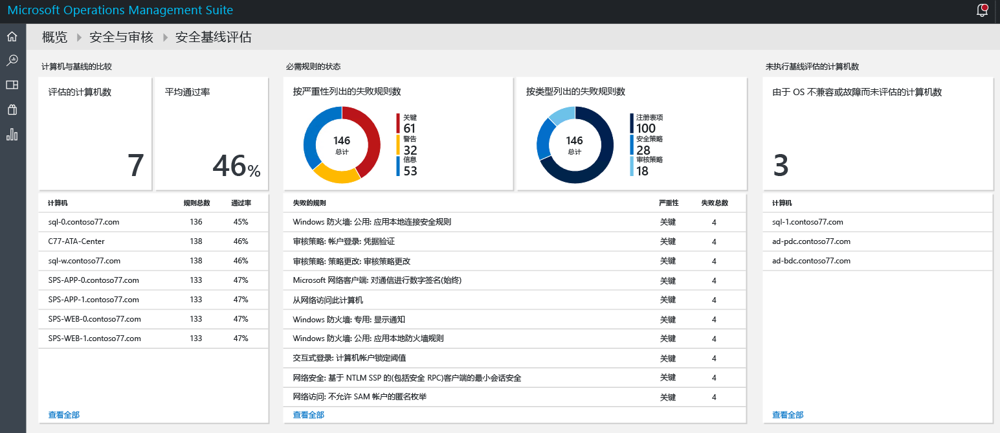
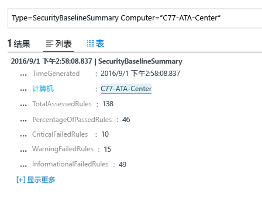
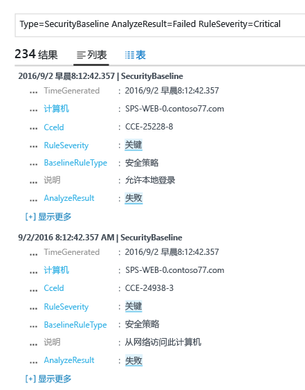

# Operations Management Suite 安全和审核解决方案中的基线评估
本文档有助于使用 [Operations Management Suite (OMS) 安全和审核解决方案](operations-management-suite-overview.md)基线评估功能来评估被监视资源的安全状态。

## 什么是基线评估？
Microsoft 及全球的产业和政府组织定义了一个代表高安全度服务器部署的 Windows 配置。 此配置是一组注册表项、审核策略设置、安全策略设置，以及 Microsoft 对这些设置的建议值。 这一组规则称为安全基线。 OMS 安全和审核基线评估功能可无缝扫描所有计算机的合规性。 

有三种类型的规则：

* **注册表规则**：检查注册表项是否设置正确。
* **审核策略规则**：有关审核策略的规则。
* **安全策略规则**：有关计算机上用户权限的规则。

> [!NOTE]
> 阅读 [Use OMS Security to assess the Security Configuration Baseline](https://blogs.technet.microsoft.com/msoms/2016/08/12/use-oms-security-to-assess-the-security-configuration-baseline/)（使用 OMS 安全来评估安全配置基线），了解此功能的简要概述。
> 
> 

## 安全基线评估
通过使用“安全和审核”仪表板，可查看 OMS 安全和审核所监测的所有计算机的当前安全基线评估。  执行以下步骤来访问安全基线评估仪表板：

1. 在“Microsoft Operations Management Suite”主仪表板中，单击“安全和审核”磁贴。
2. 在“安全和审核”仪表板中，单击“安全域”下的“基线评估”。 “安全基线评估”仪表板如下图显示：
   
    

此仪表板分为三个主要方面：

* **与基线比较的计算机**：此部分汇总被评估的计算机数及通过评估的计算机百分比。 还提供此评估的前 10 个计算机及百分比结果。
* **所需规则状态**：此部分中让人看清失败规则的严重性及其类型。 查看第一个图可以快速确定绝大部分失败的规则是否严重。 还提供前 10 个失败规则及其严重性的列表。 第二个图显示评估过程中失败的规则类型。 
* **缺少基线评估的计算机**：本部分列出了因操作系统不兼容或故障而未评估的计算机。 

### 根据基线评估计算机
理想情况下，所有计算机均符合安全基线评估。 但某些情况下，这应不会发生。 作为安全管理过程的一部分，务必要检查未通过所有安全评估测试的计算机。 若要快速进行可视化，可选择“与基线比较的计算机”部分中的“已评估计算机”选项。 应看到日志搜索结果，显示了以下屏幕所示的计算机列表：

搜索结果以表格格式显示，其中第一列包含计算机名，第二个颜色表示失败的规则数。 若要检索有关失败规则类型的信息，请单击计算机名旁的失败规则数。 应看到类似于下图中所示的结果：

在此搜索结果中，可看到被评估规则总数、严重性失败规则数、警告性失败规则数和信息性失败规则数。

### 评估所需规则状态
获取有关已通过评估的计算机百分比信息后，可能想要根据严重程度详细了解哪些规则未能通过。 此可视化有助于确定应优先处理的计算机，以确保它们在下次评估中符合规则。 将鼠标悬停在“所需规则状态”下“失败规则(按严重性)”磁贴中图形的“严重”部分，并单击它。 应看到类似于以下屏幕的结果：

 

在此日志结果中，将看到失败的基线规则类型、此规则的说明，以及此安全规则的通用配置枚举 (CCE) ID。 这些属性应足以执行更正操作来修复目标计算机中的问题。

> [!NOTE]
> 有关 CCE 的详细信息，请访问 [National Vulnerability Database](https://nvd.nist.gov/cce/index.cfm)（国家漏洞数据库）。
> 
> 

### 评估缺少基线评估的计算机
OMS 支持 Windows Server 2008 R2 到 Windows Server 2012 R2 上的域成员基线配置文件。 Windows Server 2016 基线尚未完成，将在其发布时尽快添加。 通过 OMS 安全和审核基线评估扫描的所有其他操作系统显示在“缺少基线评估的计算机”部分下。

## 另请参阅
本文档介绍了有关 OMS 安全和审核基线评估。 若要了解有关 OMS 安全的详细信息，请参阅以下文章：

* [Operations Management Suite (OMS) 概述](operations-management-suite-overview.md)
* [监视和响应 Operations Management Suite 安全和审核解决方案中的安全警报](oms-security-responding-alerts.md)
* [监视 Operations Management Suite 安全和审核解决方案中的资源](oms-security-monitoring-resources.md)

<!--HONumber=Nov16_HO2-->

