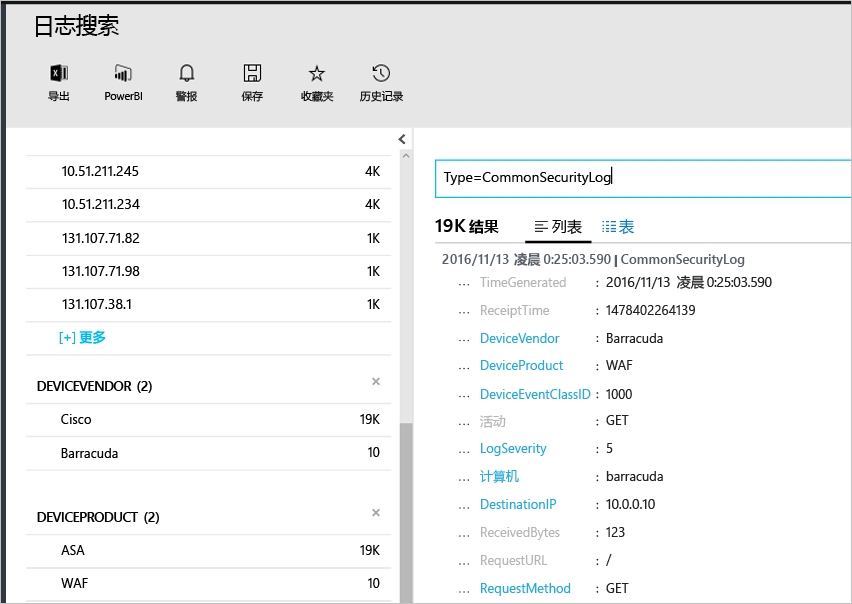

# <a name="connecting-your-security-products-to-the-operations-management-suite-oms-security-and-audit-solution"></a>将安全产品连接到 Operations Management Suite (OMS) 安全性和审核解决方案 
本文档帮助读者将安全产品连接到 OMS 安全性和审核解决方案。 支持以下源：

- 通用事件格式 (CEF) 事件
- Cisco ASA 事件


## <a name="what-is-cef"></a>什么是 CEF？
通用事件格式 (CEF) 是建立在 Syslog 消息顶层的行业标准格式，许多安全产品供应商使用它在不同的平台之间实现互操作性。 OMS 安全性和审核解决方案支持使用 CEF 引入数据，使用户能够将安全产品连接到 OMS 安全性。 

将数据源连接到 OMS 后，便可以利用此平台包含的以下功能：

- 搜索和关联
- 审核
- 警报
- 威胁智能
- 值得注意的问题

## <a name="collection-of-security-solution-logs"></a>收集安全解决方案日志

OMS 安全性支持通过 Syslogs 和 [Cisco ASA](https://blogs.technet.microsoft.com/msoms/2016/08/25/add-your-cisco-asa-logs-to-oms-security/) 日志使用 CEF 收集日志。 在本示例中，源（生成日志的计算机）是一台运行 syslog-ng 后台程序的 Linux 计算机，目标是 OMS 安全性。 若要准备好该 Linux 计算机，需要执行以下任务：

- 下载 1.2.0-25 或更高版本的适用于 Linux 的 OMS 代理。
- 遵循[此文](https://github.com/Microsoft/OMS-Agent-for-Linux/blob/master/docs/OMS-Agent-for-Linux.md#steps-to-install-the-oms-agent-for-linux)中的 **Quick Install Guide**（快速安装指南）安装该代理并将其加入工作区。

通常，不应该将该代理安装生成日志的计算机上，而应安装在另一台计算机上。 要将日志转发到代理计算机，通常需要执行以下步骤：

- 配置日志记录产品/计算机，使其将所需的事件转发到代理计算机上的 syslog 后台程序（rsyslog 或 syslog-ng）。
- 在代理计算机上启用 syslog 后台程序，以便从远程系统接收消息。

在代理计算机，需要将事件从 syslog 后台程序发送到本地 UDP 端口 25226。 代理会在此端口上侦听传入的事件。 以下示例配置将所有事件从本地系统发送到代理（可以根据本地设置修改此配置）：

1. 打开终端窗口中并转到目录 */etc/syslog-ng/* 
2. 创建新文件 *security-config-omsagent.conf* 并添加以下内容：OMS_facility = local4
    
    filter f_local4_oms { facility(local4); };

    destination security_oms { tcp("127.0.0.1" port(25226)); };

    log { source(src); filter(f_local4_oms); destination(security_oms); };
    
3. 下载文件 *security_events.conf* 并将它放置在 OMS 代理计算机上的 */etc/opt/microsoft/omsagent/conf/omsagent.d/* 中。
4. 键入以下命令重启 syslog 后台程序：*针对 syslog-ng，请运行：*
    
    ```
    sudo service rsyslog restart
    ```

    *针对 rsyslog，请运行：*
    
    ```
    /etc/init.d/syslog-ng restart
    ```
5. 键入以下命令重新启动 OMS 代理：

    *针对 syslog-ng，请运行：*
    
    ```
    sudo service omsagent restart
    ```

    *针对 rsyslog，请运行：*
    
    ```
    systemctl restart omsagent
    ```
6. 键入以下命令并查看结果，确认 OMS 代理日志中是否不包含错误：

    ``` 
    tail /var/opt/microsoft/omsagent/log/omsagent.log
    ```

## <a name="reviewing-collected-security-events"></a>查看收集的安全事件

[!include[log-analytics-log-search-nextgeneration](../../includes/log-analytics-log-search-nextgeneration.md)]

配置完成后，OMS 安全性将开始引入安全事件。 要可视化这些事件，请打开“日志搜索”，在搜索字段中键入命令 *Type=CommonSecurityLog*，并按 ENTER。 以下示例显示了此命令的结果。请注意，在本例中，OMS 安全性已从多个供应商引入安全日志：
   


可以针对一家供应商细化此搜索，例如，若要可视化 Cisco 联机日志，请键入：*Type=CommonSecurityLog DeviceVendor=Cisco*。 “CommonSecurityLog”对所有 CEF 标头使用预定义字段来包含基本扩展；其他所有扩展（不管是否为“自定义扩展”）将插入“AdditionalExtensions”字段。 可以使用“自定义字段”功能获取专用字段。 

### <a name="accessing-computers-missing-baseline-assessment"></a>评估缺少基线评估的计算机
OMS 支持 Windows Server 2008 R2 到 Windows Server 2012 R2 上的域成员基线配置文件。 Windows Server 2016 基线尚未完成，会在其发布时尽快添加。 通过 OMS 安全和审核基线评估扫描的所有其他操作系统显示在“缺少基线评估的计算机”部分下。

## <a name="see-also"></a>另请参阅
本文档介绍了如何将 CEF 解决方案连接到 OMS。 若要了解有关 OMS 安全的详细信息，请参阅以下文章：

* [Operations Management Suite (OMS) 概述](operations-management-suite-overview.md)
* [监视和响应 Operations Management Suite 安全和审核解决方案中的安全警报](oms-security-responding-alerts.md)
* [监视 Operations Management Suite 安全和审核解决方案中的资源](oms-security-monitoring-resources.md)

