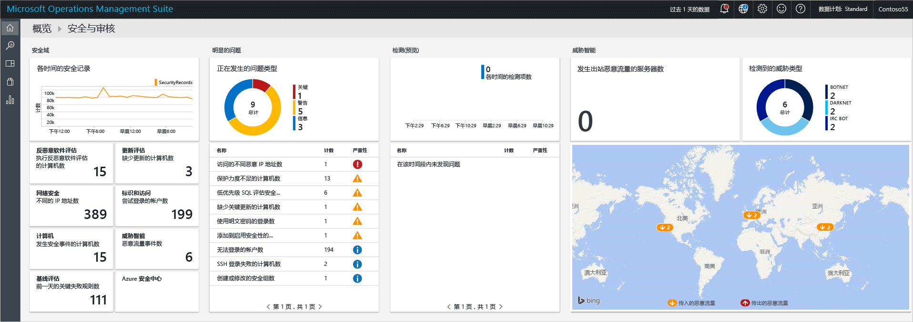
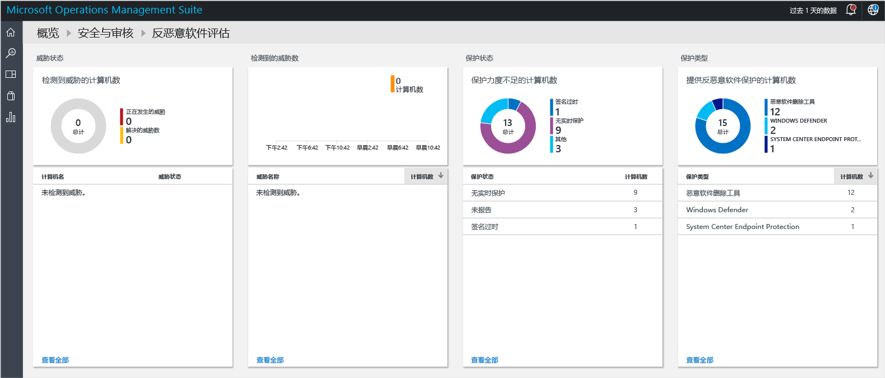
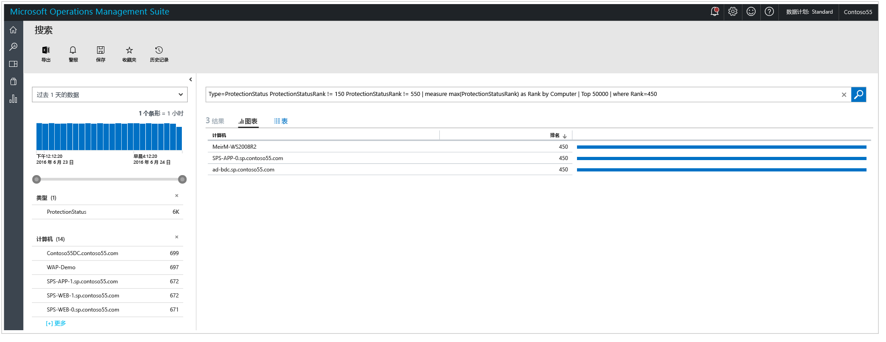
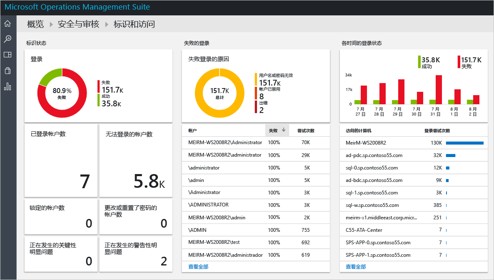
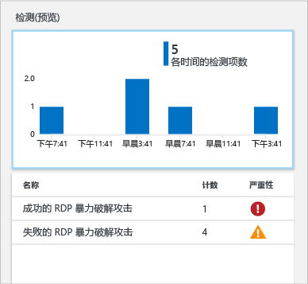

# Operations Management Suite 安全和审核解决方案入门
本文档通过带你了解每个选项，助你快速入门 Operations Management Suite (OMS) 安全和审核解决方案功能。

## 什么是 OMS？
Microsoft Operations Management Suite (OMS) 是 Microsoft 基于云的 IT 管理解决方案，有助于管理和保护本地和云基础结构。 有关 OMS 的详细信息，请参阅文章 [Operations Management Suite](https://technet.microsoft.com/library/mt484091.aspx)。

## OMS 安全和审核仪表板
OMS 安全和审核解决方案借助内置搜索查询找到需要关注的重要问题，从而提供有关组织的 IT 安全态势的全面观点。 “安全和审核”仪表板是主屏幕，提供 OMS 中安全的所有相关内容。 它提供计算机安全状态的高级洞见。 还允许查看过去 24 小时、7 天或任何自定义时间范围的所有事件。 若要访问“安全和审核”仪表板，请遵循下列步骤：

1. 在“Microsoft Operations Management Suite”主仪表板中单击左侧的“设置”磁贴。
2. 在“解决方案”选项下的“设置”边栏选项卡中单击“安全和审核”选项。
3. “安全和审核”仪表板将出现：
   
    

如果首次访问此仪表板，并且设备未由 OMS 监视，则不会使用从代理获取的数据填充磁贴。 安装代理后，填充需花一些时间，因此最初看到的内容可能会丢失一些数据，因它们仍在上传到云。  这种情况下，看到一些磁贴没有实质信息属于正常。 阅读 [Connect Windows computers directly to OMS](https://technet.microsoft.com/library/mt484108.aspx)（将 Windows 计算机直接连接到 OMS），详细了解如何在 Windows 系统上安装 OMS 代理；阅读 [Connect Linux computers to OMS](https://technet.microsoft.com/library/mt622052.aspx)（将 Linux 计算机连接到 OMS），详细了解如何在 Linux 系统中执行此任务。

> [!NOTE]
> 代理基于当前已启用的事件收集信息，例如计算机名称、IP 地址和用户名。 但不会收集任何文档/文件、数据库名称或私有数据。   
> 
> 

解决方案是用于应对主要客户挑战的逻辑、可视化效果和数据采集规则的集合。 安全和审核是一种解决方案，可单独添加其他解决方案。 阅读[添加解决方案](https://technet.microsoft.com/library/mt674635.aspx)一文，了解有关如何添加新解决方案的详细信息。

OMS 安全和审核仪表板有四个主要类别：

* **安全域**：在此区域中可进一步了解：随时间推移的安全记录、恶意软件评估、更新评估、网络安全、身份和访问信息、具有安全事件的计算机，并快速访问 Azure 安全中心仪表板。
* **值得注意的问题**：此选项允许快速标识未解决的问题数和这些问题的严重性。
* **检测（预览版）**：当针对资源的安全警报出现时对其进行可视化，从而确定攻击模式。
* **威胁智能**：对出站恶意 IP 通信的服务器总数、恶意威胁类型和显示恶意 IP 来源的地图进行可视化，从而确定攻击模式。 
* **常见安全查询**：此选项提供用来监视环境的最常见安全查询的列表。 单击其中一个查询时，将打开“搜索”边栏选项卡及该查询的结果。

> [!NOTE]
> 有关 OMS 如何保证数据安全的详细信息，请阅读 OMS 如何保护数据。
> 
> 

## 安全域
监视资源时，务必要能够快速评估环境的当前状态。 但还很重要的是，能够跟踪过去发生的事件，以便更好地理解环境中某一时刻发生的事情。 

> [!NOTE]
> 数据保留基于 OMS 定价计划。 有关详细信息，请访问 [Microsoft Operations Management Suite](https://www.microsoft.com/server-cloud/operations-management-suite/pricing.aspx) 定价页。
> 
> 

事件响应和取证调查方案将直接从“随时间推移的安全记录”磁贴所提供的结果中受益。

单击此磁贴时，将打开“搜索”边栏选项卡，显示**安全事件** (Type=SecurityEvents) 的查询结果，以及基于过去七天的数据，如下所示：

[!include[log-analytics-log-search-nextgeneration](../../includes/log-analytics-log-search-nextgeneration.md)]

搜索结果分为两个窗格：左窗格提供的信息包括被发现安全事件数目的细分、发现安全事件的计算机、计算机中找到的帐户数，以及活动类型。 右窗格提供了总结果，以及按时间排列的安全事件与计算机名和事件活动。 也可单击“显示更多”查看此事件的更多详情，如事件数据、事件 ID 和事件源。

> [!NOTE]
> 有关 OMS 搜索查询的详细信息，请阅读 [OMS 搜索参考](https://technet.microsoft.com/library/mt450427.aspx)。
> 
> 

### 反恶意软件评估
此选项可以快速确定保护不足的计算机和包含恶意软件的计算机。 读取被监视服务器上的恶意软件评估状态和检测到的威胁，然后将数据发送到云中的 OMS 服务进行处理。 检测到威胁的服务器和保护不足的服务器显示在恶意软件评估仪表板，在“反恶意软件评估”磁贴中单击后可访问该仪表板。 

与 OMS 仪表板中其他所有动态磁贴一样，单击该磁贴将打开包含查询结果的“搜索”边栏选项卡。 对于此选项，如果在“保护状态”下单击“未报告”，查询结果将显示包含计算机名及其级别的单个条目，如下所示：

> [!NOTE]
> *级别*是反映保护状态（开启、关闭、更新等）和所发现威胁的等级。 采用数字形式有助于进行聚合。
> 
> 

如果单击计算机名，将看到此计算机按时间排列的保护状态。 如果需要了解反恶意软件是否安装后之后又在某时刻被移除，这将非常有用。   

### 更新评估
此选项能够快速确定潜在安全问题的总体风险，以及这些更新对环境是否重要、有多重要。 OMS 安全和审核解决方案仅提供这些更新的可视化结果，实际数据来自[更新管理解决方案](oms-solution-update-management.md)，这是 OMS 内的另一个模块。 下面是更新的示例：

> [!NOTE]
> 有关更新管理解决方案的详细信息，请阅读 [OMS 中的更新管理解决方案](oms-solution-update-management.md)。
> 
> 

### 标识和访问
身份应为企业的控制平面，保护身份应为头等大事。 在过去，组织周围存在边界，这些边界成为主要防御边界之一；现如今，越来越多的数据和应用移动到云中，身份则成为新的外围。 

> [!NOTE]
> 当前数据仅基于安全事件登录数据（事件 ID 4624），在将来 Office365 登录信息和 Azure AD 数据也将包括在内。
> 
> 

通过监视身份活动，能够在事件发生前主动采取措施，或事后采取针对性措施停止攻击。 “身份和访问”仪表板提供身份状态概述，包括登录尝试失败数、失败尝试期间所用的用户帐户、已锁定的帐户、具有已更改或已重置密码的帐户，以及当前登录的帐户数。 

在“身份和访问”磁贴中单击时将看到以下仪表板：

此仪表板中提供的信息可立即帮助识别潜在的可疑活动。 例如，有 338 次以**管理员**身份进行登录的尝试，且所有尝试均失败。 这可能是针对此帐户的暴力破解攻击。 单击此帐户将获取更多信息，有助于确定此次潜在攻击的目标资源：

详细的报表提供有关此事件的重要信息，包括目标计算机、登录类型（在此示例为网络登录）、活动（此示例为事件 4625），以及每次尝试的全面时间信息。 

### 计算机
此磁贴可以用于访问主动具有安全事件的所有计算机。 在此磁贴中单击时，将看到具有安全事件的计算机的列表，以及每台计算机上的事件数：

可单击每台计算机上继续进行调查，并查看已标记的安全事件。

### 威胁智能

通过使用 OMS 安全和审核中的“威胁智能”选项，IT 管理员可根据环境识别安全威胁，例如识别某台特定的计算机是否是僵尸网络的一部分。 当攻击者非法安装秘密将此计算机连接到命令和控制的恶意软件时，该计算机就成为了僵尸网络的节点。 它还可以识别来自地下通信通道（例如暗网）的潜在威胁。 通过阅读[监视和响应 Operations Management Suite 安全和审核解决方案中的安全警报](oms-security-responding-alerts.md)一文，详细了解威胁情报。

在某些情况下，可能会注意到从一台受监视计算机访问的潜在恶意 IP：

OMS 安全利用 [Microsoft 威胁智能](https://youtu.be/O4WtxgUrDc8)生成此警报以及同一类别中的其他警报。 威胁智能数据由 Microsoft 收集，也可从领先的威胁智能提供商处购买。 此数据经常更新，适用于快速变化的威胁。 由于其自身的性质，[调查](https://blogs.technet.microsoft.com/msoms/2016/12/08/investigating-suspicious-activity-in-a-hybrid-cloud-with-oms-security/)安全警报时，应将它与其他来源的安全信息结合。 

### 基线评估

Microsoft 及全球的产业和政府组织定义了一个代表高安全度服务器部署的 Windows 配置。 此配置是一组注册表项、审核策略设置、安全策略设置，以及 Microsoft 对这些设置的建议值。 这一组规则称为安全基线。 请阅读 [Operations Management Suite 安全和审核解决方案中的基线评估](oms-security-baseline.md)，详细了解此选项。

### Azure 安全中心
此磁贴基本上是用于访问 Azure 安全中心仪表板的快捷方式。 阅读 [Azure 安全中心入门](../security-center/security-center-get-started.md)，了解有关此解决方案的详细信息。

## 值得注意的问题
此组选项的主要目的是，提供环境中所存在问题的快速视图，问题按照严重、警告和信息性进行分类。 “未解决问题类型”磁贴中可以直观看到这些问题，但无法了解更详细的信息，在此磁贴的下半部分可了解更详细的信息，如问题名称（名称）、发生此问题的对象数（计数）及问题严重性（严重性）。

可以看到，这些问题在**安全域**组的不同区域已有涉及，这强化了此视图的意图：对环境中来自单个位置的最重要问题进行可视化。

## 检测（预览版）
此选项的主要目的是允许 IT 快速识别其环境中的潜在威胁及威胁的严重性。

此选项还可在[事件响应调查](https://blogs.msdn.microsoft.com/azuresecurity/2016/11/30/investigating-suspicious-activity-in-a-hybrid-cloud-with-oms-security/)期间使用，从而执行评估并获取有关攻击的详细信息。

> [!NOTE]
> 有关如何针对事件响应使用 OMS 的详细信息，请观看以下视频：[How to Leverage the Azure Security Center & Microsoft Operations Management Suite for an Incident Response](https://channel9.msdn.com/Blogs/Taste-of-Premier/ToP1703)（如何针对事件响应利用 Azure 安全中心和 Microsoft Operations Management Suite）。
> 
> 

## 威胁智能
安全和审核解决方案的新威胁智能部分通过几种方式对可能的攻击模式进行可视化：出站恶意 IP 通信的服务器总数、恶意威胁类型和显示恶意 IP 来源的地图。 可与地图进行交互，单击 IP 了解详细信息。

地图上的黄色图钉指示来自恶意 IP 的传入流量。 公开到 Internet 的服务器通常会看到恶意传入流量，但我们建议进行查看以确保没有任何恶意尝试成功。 这些标志基于 IIS 日志、WireData 和 Windows 防火墙日志。  

## 常见安全查询
可用的常见安全查询列表有助于快速访问资源信息，并基于环境需要进行自定义。 这些常见的查询是：

* 所有安全活动
* 计算机“computer01.contoso.com”（替换为自己的计算机名）上的安全活动
* 帐户“管理员”的计算机“computer01.contoso.com”（替换为自己的计算机名和帐户名）上的安全活动
* 登录活动（按计算机）
* 终止了任何计算机上 Microsoft 反恶意软件的帐户
* Microsoft 反恶意软件进程已终止的计算机
* 执行“hash.exe”的计算机（替换为不同的进程名）
* 已执行的所有进程名
* 登录活动（按帐户）
* 远程登录计算机“computer01.contoso.com”（替换为自己的计算机名）的帐户

## 另请参阅
本文档介绍 OMS 安全和审核解决方案。 若要了解有关 OMS 安全的详细信息，请参阅以下文章：

* [Operations Management Suite (OMS) 概述](operations-management-suite-overview.md)
* [监视和响应 Operations Management Suite 安全和审核解决方案中的安全警报](oms-security-responding-alerts.md)
* [监视 Operations Management Suite 安全和审核解决方案中的资源](oms-security-monitoring-resources.md)

