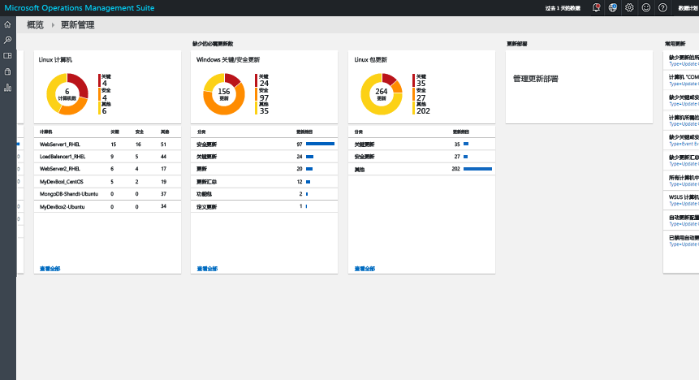
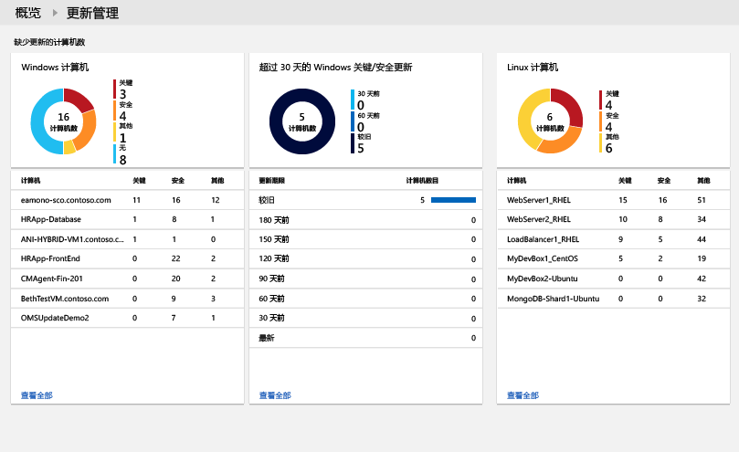
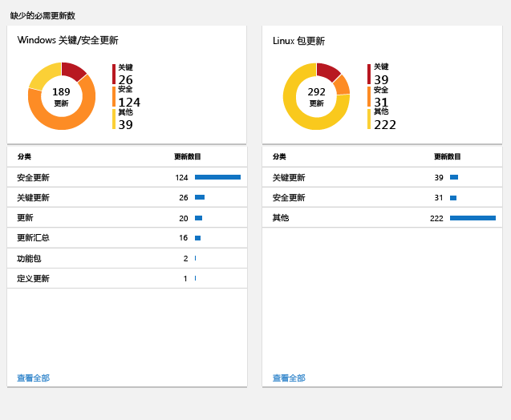
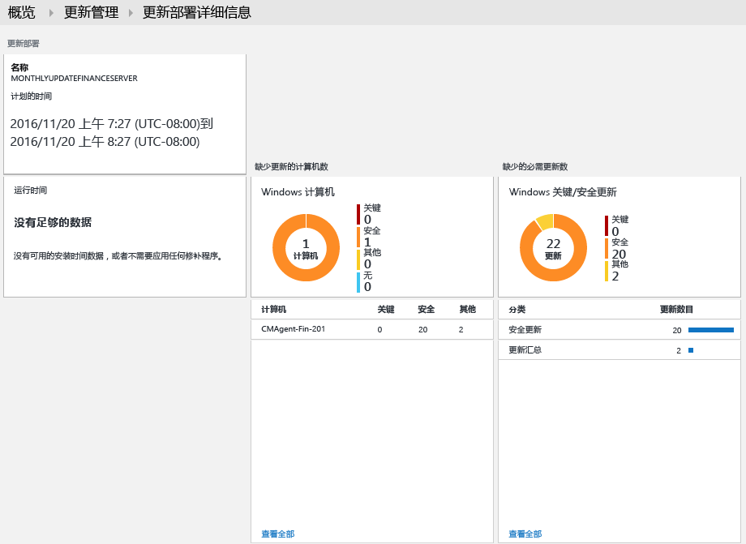

# 更新 OMS 中的管理解决方案
OMS 中的更新管理解决方案可管理 Windows 和 Linux 计算机的更新。  你可以快速评估所有代理计算机上可用更新的状态并启动为服务器安装所需更新的过程。 

## 先决条件
* Windows 代理也必须配置为与 Windows Server Update Services (WSUS) 服务器通信或有权访问 Microsoft 更新。  
  
  > [!NOTE]
  > System Center Configuration Manager 无法同时管理 Windows 代理。  
  > 
  > 
* Linux 代理必须具有访问更新存储库的权限。  可以从 [GitHub](https://github.com/microsoft/oms-agent-for-linux) 下载适用于 Linux 的 OMS 代理。 

## 配置
执行以下步骤以将更新管理解决方案添加到 OMS 工作区并添加 Linux 代理。 Windows 代理会自动添加，无额外配置。

> [!NOTE]
> 当前如果启用此解决方案，连接到 OMS 工作区的任何 Windows 计算机将自动配置为混合 Runbook 辅助角色，以支持将 Runbook 用作此解决方案的一部分。  但是，该计算机不会注册到自动化帐户中创建的任何混合辅助角色组，并且无法将它添加到混合辅助角色组来运行自己的 Runbook。  如果 Windows 计算机已指定为混合 Runbook 辅助角色并已连接到 OMS 工作区，则在添加解决方案之前，需要从 OMS 工作区中删除该计算机，防止 Runbook 无法按预期运行。  

1. 使用从解决方案库中添加 [OMS 解决方案](../log-analytics/log-analytics-add-solutions.md)中所述的过程，将更新管理解决方案添加到 OMS 工作区。  
2. 在 OMS 门户中，选择“设置”然后选择“已连接的源”。  记下**工作区 ID** 和**主密钥**或**辅助密钥**。
3. 为每台 Linux 计算机执行以下步骤。
   
   a.在“解决方案资源管理器”中，右键单击项目文件夹下的“引用”文件夹，然后单击“添加引用”。    通过运行以下命令安装适用于 Linux 的 OMS 代理最新版本。  将 <Workspace ID> 替换为工作区 ID，并将 <Key> 替换为主密钥或辅助密钥。
   
        cd ~
        wget https://github.com/Microsoft/OMS-Agent-for-Linux/releases/download/v1.2.0-75/omsagent-1.2.0-75.universal.x64.sh  
        sudo bash omsagent-1.2.0-75.universal.x64.sh --upgrade -w <Workspace ID> -s <Key>

   b. 若要删除代理，请运行以下命令。
   
        sudo bash omsagent-1.2.0-75.universal.x64.sh --purge

## 管理包
如果 System Center Operations Manager 管理组已连接到 OMS 工作区，则添加此解决方案时会在 Operations Manager 中安装以下管理包。 无需对这些管理包进行任何配置或维护。 

* Microsoft System Center Advisor Update Assessment Intelligence Pack (Microsoft.IntelligencePacks.UpdateAssessment)
* Microsoft.IntelligencePack.UpdateAssessment.Configuration (Microsoft.IntelligencePack.UpdateAssessment.Configuration)
* 更新部署 MP

有关如何更新解决方案管理包的详细信息，请参阅[将 Operations Manager 连接到 Log Analytics](../log-analytics/log-analytics-om-agents.md)。

## 数据收集
### 支持的代理
下表介绍了该解决方案支持的连接的源。

| 连接的源 | 支持 | 说明 |
| --- | --- | --- |
| Windows 代理 |是 |该解决方案从 Windows 代理收集有关系统更新的信息，并启动所需更新的安装。 |
| Linux 代理 |是 |该解决方案从 Linux 代理收集有关系统更新的信息。 |
| Operations Manager 管理组 |是 |该解决方案从已连接的管理组中的代理收集有关系统更新的信息。 从 Operations Manager 代理到 Log Analytics 的直接连接不是必须的。 数据从管理组转发到 OMS 存储库。 |
| Azure 存储帐户 |否 |Azure 存储不包含有关系统更新的信息。 |

### 收集频率
对于每台托管的 Windows 计算机，每天执行两次扫描。  安装更新后，将在 15 分钟内更新其信息。  

对于每台托管的 Linux 计算机，每 3 小时执行一次扫描。  

## 使用解决方案
向 OMS 工作区添加更新管理解决方案时，“更新管理”磁贴将添加到 OMS 仪表板。 此磁贴显示环境中当前需要进行系统更新的计算机数量的计数和图形表示形式。  
  

## 查看更新评估
单击“更新管理”磁贴打开“更新管理”仪表板。 仪表板包含下表中的列。 每个列按照指定范围和时间范围列出了匹配该列条件的最多十项。 可单击该列底部的“查看全部”或单击列标题运行返回所有记录的日志搜索。。

| 列 | 说明 |
| --- | --- |
| **缺少更新的计算机** | |
| 关键或安全更新 |按缺少的更新数列出缺少更新的前十台计算机。 单击计算机名称，运行返回该计算机所有更新记录的日志搜索。 |
| 超过 30 天的关键或安全更新 |标识缺少关键或安全更新的计算机数量（按更新发布的时长分组） 单击某一条目，运行返回所有缺少关键或安全更新的日志搜索。 |
| **所需的缺少的更新** | |
| 关键或安全更新 |列出计算机缺少的更新的类别（按缺少该类别更新的计算机数排序） 单击计算机名称，运行返回该类别的所有更新记录的日志搜索。 |
| **更新部署** | |
| 更新部署 |当前计划的更新部署数和运行下一次计划前的持续时长。  单击磁贴查看计划、当前正在运行的计划以及已完成的更新或计划新的部署。 |

   
   
 
   
 
   

## 安装更新
环境中的所有 Windows 计算机进行了更新评估后，你可以新通过创建“更新部署”安装所需的更新。  更新部署是为一台或多台 Windows 计算机计划的所需更新安装。  你需要指定部署的日期和时间，以及要包括的计算机或计算机组。  

通过 Azure 自动化中的 runbook 安装更新。  当前无法查看这些 runbook，它们不需要任何配置。  创建更新的部署时，它创建计划，并在指定的时间为包括在内的计算机启动主更新 runbook。  而此主要 runbook 在每个 Windows 代理上启动子 runbook，来执行所需更新的安装。  

### 查看更新部署
单击“更新部署” 磁贴以查看现有的更新部署列表。  这些对象按状态分组 – **已计划**、**正在运行**和 **已完成**。      

为每个更新部署显示的属性如下表所述。

| 属性 | 说明 |
| --- | --- |
| Name |更新部署的名称 |
| 计划 |计划的类型。  *一次性*是目前唯一可能的值。 |
| 开始时间 |计划启动更新部署的日期和时间。 |
| 持续时间 |更新部署允许运行的分钟数。  如果在此持续时间内未安装所有更新，剩余的更新必须等待下一次更新部署。 |
| 服务器 |受更新部署影响的计算机数。 |
| 状态 |更新部署的当前状态  可能的值包括： - 未启动 - 正在运行 - 已完成 |

单击更新部署以查看其详细信息屏幕，其中包括下表中的列。  如果更新部署尚未启动，则不会填充这些列。 

| 列 | 说明 |
| --- | --- |
| **计算机的结果** | |
| 已成功完成 |按状态列出更新部署中的计算机数。  单击某个状态以运行返回所有具有该更新部署状态的记录的日志搜索。 |
| 计算机安装状态 |列出更新部署中涉及的计算机以及已成功安装的更新数百分比。 单击某一条目，运行返回所有缺少关键或安全更新的日志搜索。 |
| **更新实例结果** | |
| 实例安装状态 |列出计算机缺少的更新的类别（按缺少该类别更新的计算机数排序） 单击计算机以运行返回该计算机所有更新记录的日志搜索。 |

   

### 创建更新部署
通过单击屏幕顶部的“添加”按钮打开“新建更新部署”页，创建新的更新部署。  必须提供下表中属性的值。

| 属性 | 说明 |
| --- | --- |
| Name |用于标识更新部署的唯一名称。 |
| 时区 |开始时间所使用的时区。 |
| 开始时间 |启动更新部署的日期和时间 |
| 持续时间 |更新部署允许运行的分钟数。  如果在此持续时间内未安装所有更新，剩余的更新必须等待下一次更新部署。 |
| 计算机 |更新部署中要包括的计算机或计算机组的名称。  从下拉列表中选择一个或多个条目。 |

   

### 时间范围
默认情况下，在更新管理解决方案中分析的数据范围是最近 1 天内生成的所有连接的管理组。 

若要更改数据的时间范围，请在仪表板的顶部选择“数据基于”。 你可以选择过去 7 天、1 天或 6 小时内创建或更新的记录。 也可以选择“自定义”，然后指定自定义的日期范围。     

## Log Analytics 记录
更新管理解决方案在 OMS 存储库中创建两种类型的记录。

### 更新记录
**更新**类型的记录为每台计算机上已安装或需要安装的每个更新而创建。 更新记录具有下表中的属性。

| 属性 | 说明 |
| --- | --- |
| 类型 |*更新* |
| SourceSystem |批准安装更新的源。 可能的值包括： - Microsoft 更新 -    Windows 更新 -    SCCM - Linux 服务器（从包管理器获取） |
| 已批准 |指定是否已批准安装该更新。  对于 Linux 服务器，这当前是可选选项，因为修补不由 OMS 管理。 |
| 适用于 Windows 的类别 |更新的类别。 可能的值包括： -    应用程序 - 关键更新 - 定义更新 - 功能包 - 安全更新 - 服务包 - 更新汇总 - 更新 |
| 适用于 Linux 的类别 |更新的类别。 可能的值包括： -关键更新 - 安全更新 -其他更新 |
| 计算机 |计算机的名称。 |
| InstallTimeAvailable |指定来自安装了相同更新的其他代理上的安装时间是否可用。 |
| InstallTimePredictionSeconds |根据安装了相同更新的其他代理预计的安装时间（以秒为单位）。 |
| KBID |介绍该更新的 KB 文章的 ID。 |
| ManagementGroupName |SCOM 代理的管理组名称。  对于其他代理，即 AOI-<workspace ID>。 |
| MSRCBulletinID |描述更新的 Microsoft 安全公告 ID。 |
| MSRCSeverity |Microsoft 安全公告的严重程度。 可能的值包括： - 关键 - 重要 -中等 |
| 可选 |指定是否为可选更新。 |
| 产品 |更新适用的产品的名称。  单击“查看”以在浏览器中打开项目。 |
| PackageSeverity |此更新中修复的漏洞的严重性，由 Linux 发行版供应商报告。 |
| PublishDate |安装更新的日期和时间。 |
| RebootBehavior |指定该更新是否强制重新启动。 可能的值包括： - canrequestreboot - neverreboots |
| RevisionNumber |更新的修订号。 |
| SourceComputerId |唯一标识计算机的 GUID。 |
| TimeGenerated |上次更新记录的日期和时间。 |
| 标题 |更新的标题。 |
| UpdateID |唯一标识更新的 GUID。 |
| UpdateState |指定此计算机上是否已安装更新。 可能的值包括： - 已安装 - 此计算机上已安装更新。 - 需要 -此计算机上未安装更新，需要进行安装。 |

 
执行返回“更新”类型记录的任何日志搜索时，可以选择“更新”视图，其中显示了一组汇总搜索所返回的更新的磁贴。 你可以单击“缺少和已应用的更新”和“必选和可选更新”磁贴上的条目来将视图限定为该组更新。 选择“列表”或“表”视图以返回单个记录。  

  

在“表” 视图中，可以单击任何记录的 **KBID** 以打开带有该 KB 文章的浏览器。 这使你可以快速阅读特定更新的详细信息。  

在“列表” 视图中，单击 KBID 旁边的“视图”链接可打开 KB 文章。 

### UpdateSummary 记录
为每台 Windows 代理计算机创建具有 **UpdateSummary** 类型的记录。 计算机每次扫描更新时都会更新此记录。 **UpdateSummary** 记录具有下表中的属性。

| 属性 | 说明 |
| --- | --- |
| 类型 |UpdateSummary |
| SourceSystem |OpsManager |
| 计算机 |计算机的名称。 |
| CriticalUpdatesMissing |计算机上缺少的关键更新数。 |
| ManagementGroupName |SCOM 代理的管理组名称。 对于其他代理，即 AOI-<workspace ID>。 |
| NETRuntimeVersion |计算机上已安装的 .NET 运行时版本。 |
| OldestMissingSecurityUpdateBucket |从此计算机上缺少的最早安全更新发布开始，对时间进行分类的存储桶。 可能的值包括： - 较旧 -    180 天前 - 150 天前 -    120 天前 - 90 天前 - 60 天前 -    30 天前 -    最近 |
| OldestMissingSecurityUpdateInDays |从此计算机上缺少的最早安全更新发布以来的天数。 |
| OsVersion |计算机上安装的操作系统版本。 |
| OtherUpdatesMissing |计算机上缺少的其他更新数。 |
| SecurityUpdatesMissing |计算机上缺少的安全更新数。 |
| SourceComputerId |唯一标识计算机的 GUID。 |
| TimeGenerated |上次更新记录的日期和时间。 |
| TotalUpdatesMissing |计算机上缺少的更新总数。 |
| WindowsUpdateAgentVersion |计算机上 Windows 更新代理的版本号。 |
| WindowsUpdateSetting |计算机如何安装重要更新的设置。 可能的值包括： - 已禁用 - 安装之前通知 - 已计划的安装 |
| WSUSServer |WSUS 服务器的 URL（如果计算机配置为使用 WSUS 服务器）。 |

## 示例日志搜索
下表提供了此解决方案收集的更新记录的示例日志搜索。 

| 查询 | 说明 |
| --- | --- |
| 缺少的更新的所有计算机 |Type=Update UpdateState=Needed Optional=false &#124; select Computer,Title,KBID,Classification,UpdateSeverity,PublishedDate |
| 计算机“COMPUTER01.contoso.com”（替换为你自己的计算机名）缺少的更新 |Type=Update UpdateState=Needed Optional=false Computer="COMPUTER01.contoso.com" &#124; select Computer,Title,KBID,Product,UpdateSeverity,PublishedDate |
| 缺少关键或安全更新的所有计算机 |Type=Update UpdateState=Needed Optional=false (Classification="Security Updates" OR Classification="Critical Updates") |
| 手动应用更新的计算机所需的关键或安全更新 |Type=Update UpdateState=Needed Optional=false (Classification="Security Updates" OR Classification="Critical Updates") Computer IN {Type=UpdateSummary WindowsUpdateSetting=Manual &#124; Distinct Computer} &#124; Distinct KBID |
| 缺少关键或所需安全更新的计算机的错误事件 |Type=Event EventLevelName=error Computer IN {Type=Update (Classification="Security Updates" OR Classification="Critical Updates") UpdateState=Needed Optional=false &#124; Distinct Computer} |
| 缺少更新汇总的所有计算机 |Type=Update Optional=false Classification="Update Rollups" UpdateState=Needed &#124; select Computer,Title,KBID,Classification,UpdateSeverity,PublishedDate |
| 所有计算机明显缺少的更新 |Type=Update UpdateState=Needed Optional=false &#124; Distinct Title |
| WSUS 计算机成员身份 |Type=UpdateSummary &#124; measure count() by WSUSServer |
| 自动更新配置 |Type=UpdateSummary &#124; measure count() by WindowsUpdateSetting |
| 禁用了自动更新的计算机 |Type=UpdateSummary WindowsUpdateSetting=Manual |
| 拥有可用更新包的所有 Linux 计算机的列表 |Type=Update and OSType=Linux and UpdateState!="Not needed" &#124; measure count() by Computer |
| 具有解决了关键或安全漏洞的可用更新包的 Linux 计算机列表 |Type=Update and OSType=Linux and UpdateState!="Not needed" and (Classification="Critical Updates" OR Classification="Security Updates") &#124; measure count() by Computer |
| 有可用更新的所有程序包列表 |Type=Update and OSType=Linux and UpdateState!="Not needed" |
| 具有解决了关键或安全漏洞的所有可用更新包的列表 |Type=Update  and OSType=Linux and UpdateState!="Not needed" and (Classification="Critical Updates" OR Classification="Security Updates") |
| 具有任何可用更新的“Ubuntu”计算机的列表 |Type=Update and OSType=Linux and OSName = Ubuntu &#124; measure count() by Computer |

## 后续步骤
* 使用[Log Analytics](../log-analytics/log-analytics-log-searches.md)中的日志搜索可查看详细的更新数据。
* [创建自己的仪表板](../log-analytics/log-analytics-dashboards.md)显示你管理的计算机的更新符合性。
* [创建警报](../log-analytics/log-analytics-alerts.md)检测到计算机缺少关键更新或计算机禁用了自动更新时发出警报。  

<!--HONumber=Dec16_HO1-->

