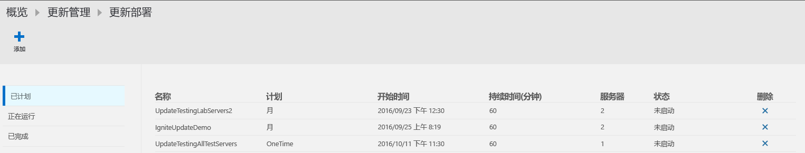
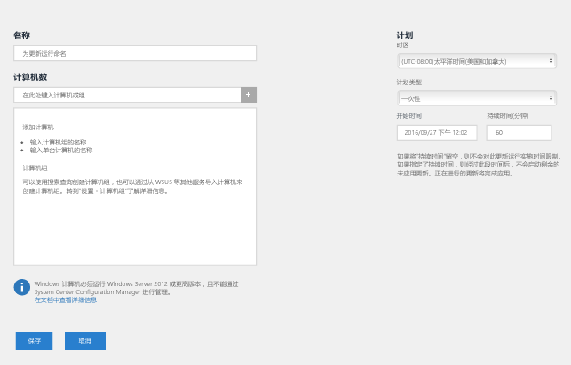
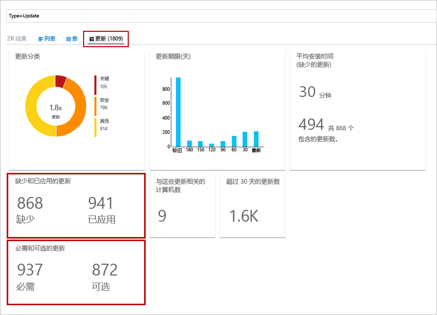
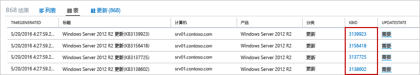
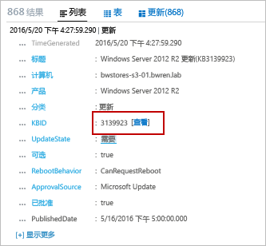

# 更新 OMS 中的管理解决方案

可以使用 OMS 中的更新管理解决方案，为部署在 Azure、本地环境或其他云提供程序中的 Windows 和 Linux 计算机管理操作系统安全更新。  可以快速评估所有代理计算机上可用更新的状态，并管理为服务器安装所需更新的过程。

## Azure 自动化中的更新管理

可以直接通过 [Azure 自动化](../automation/automation-offering-get-started.md)帐户为虚拟机启用“更新管理”。
若要了解如何通过自动化帐户为虚拟机启用更新管理，请参阅[管理多个虚拟机的更新](../automation/manage-update-multi.md)。

## 解决方案概述
由 OMS 托管的计算机使用以下方式执行评估和更新部署：

* 用于 Windows 或 Linux 的 OMS 代理
* 用于 Linux 的 PowerShell 所需状态配置 (DSC)
* 自动化混合 Runbook 辅助角色
* 适用于 Windows 计算机的 Microsoft 更新或 Windows Server 更新服务

下图是针对行为和数据流的概念性视图，说明了解决方案如何评估安全更新并将其应用到工作区中所有连接的 Windows Server 和 Linux 计算机。    

#### Windows Server

#### Linux

在计算机执行更新符合性扫描以后，OMS 代理会将信息批量转发到 OMS。 在 Windows 计算机上，符合性扫描默认情况下每 12 小时执行一次。  除了按扫描计划扫描，更新符合性扫描还会在更新安装前和更新安装后的 15 分钟内启动，前提是 Microsoft Monitoring Agent (MMA) 重新启动。  使用 Linux 计算机时，符合性扫描默认情况下每 3 小时执行一次。在重新启动 MMA 代理的情况下，15 分钟内就会启动符合性扫描。  

然后即可在解决方案随附的仪表板中处理和汇总符合性信息，或者通过用户定义查询或预定义查询对其进行搜索。  解决方案报告计算机更新情况的依据是你被配置为通过什么源来同步。  如果将 Windows 计算机配置为向 WSUS 报告，则结果可能不同于 Microsoft 更新所显示的内容，具体取决于 WSUS 上次通过 Microsoft 更新进行同步的时间。  对于配置为向本地存储库（而不是公共存储库）报告的 Linux 计算机来说，情况也是如此。   

可以通过创建计划的部署，在需要更新的计算机上部署和安装软件更新。  归类为“可选”的更新不包括在 Windows 计算机的部署范围内，仅必需更新包括在其内。  计划的部署会显式指定计算机或根据特定的一组计算机的日志搜索结果来选择[计算机组](../log-analytics/log-analytics-computer-groups.md)，从而定义会接收适用更新的目标计算机。  也可通过指定计划来批准和指定一个时段，允许在该时段内安装更新。  通过 Azure 自动化中的 runbook 安装更新。  无法查看这些 runbook，它们不需要任何配置。  更新部署在创建时，会创建一个计划，在指定的时间为包括在内的计算机启动主更新 Runbook。  此主 Runbook 会在每个代理上启动子 Runbook，以便执行所需更新的安装。       

目标计算机会按更新部署中指定的日期和时间，以并行方式执行部署。  首先会执行扫描，验证是否仍然需要更新，如果是，则会安装相应的更新。  请务必注意，对于 WSUS 客户端计算机来说，如果更新未在 WSUS 中获得批准，则更新部署会失败。  所应用更新的结果将转发到 OMS，通过仪表板或搜索事件进行处理和汇总。     

## 先决条件
* 该解决方案支持对 Windows Server 2008 和更高版本执行更新评估，以及对 Windows Server 2008 R2 SP1 和更高版本执行更新部署。  不支持 Nano Server。

    > [!NOTE]
    > 若要提供相关支持，以便将更新部署到 Windows Server 2008 R2 SP1，需要 .NET Framework 4.5 和 WMF 5.0 或更高版本。
    >  
* 不支持 Windows 客户端操作系统。  
* Windows 代理也必须配置为与 Windows Server Update Services (WSUS) 服务器通信或有权访问 Microsoft 更新。  

    > [!NOTE]
    > System Center Configuration Manager 无法同时管理 Windows 代理。  
    >
* CentOS 6 (x86/x64) 和 7 (x64)  
* Red Hat Enterprise 6 (x86/x64) 和 7 (x64)  
* SUSE Linux Enterprise Server 11 (x86/x64) 和 12 (x64)  
* Ubuntu 12.04 LTS 和更高版本 x86/x64   
    > [!NOTE]  
    > 若要避免在 Ubuntu 上的维护时段外应用更新，请重新配置无人参与升级包，禁用自动更新。 有关如何配置此包的信息，请参阅 [Ubuntu Server 指南中的自动更新主题](https://help.ubuntu.com/lts/serverguide/automatic-updates.html)。

* Linux 代理必须具有访问更新存储库的权限。  

    > [!NOTE]
    > 此解决方案不支持适用于 Linux 且配置为向多个 OMS 工作区报告的 OMS 代理。  
    >

若要详细了解如何安装适用于 Linux 的 OMS 代理并下载最新版本，请参阅 [Operations Management Suite Agent for Linux](https://github.com/microsoft/oms-agent-for-linux)（适用于 Linux 的 Operations Management Suite 代理）。  若要了解如何安装适用于 Windows 的 OMS 代理，请参阅[适用于 Windows 的 Operations Management Suite 代理](../log-analytics/log-analytics-windows-agent.md)。  

### 权限
若要创建或更新部署，需在自动化帐户和 Log Analytics 工作区中获得参与者角色。  

## 解决方案组件
此解决方案包含以下资源，这些资源添加到自动化帐户和直接连接的代理或 Operations Manager 连接的管理组。

### 管理包
如果 System Center Operations Manager 管理组已连接到 OMS 工作区，则会在 Operations Manager 中安装以下管理包。  在添加此解决方案以后，这些管理包也会安装在直接连接的 Windows 计算机上。 这些管理包不需进行配置或管理。

* Microsoft System Center Advisor Update Assessment Intelligence Pack (Microsoft.IntelligencePacks.UpdateAssessment)
* Microsoft.IntelligencePack.UpdateAssessment.Configuration (Microsoft.IntelligencePack.UpdateAssessment.Configuration)
* 更新部署 MP

有关如何更新解决方案管理包的详细信息，请参阅[将 Operations Manager 连接到 Log Analytics](../log-analytics/log-analytics-om-agents.md)。

### 混合辅助角色组
启用此解决方案以后，任何直接连接到 OMS 工作区的 Windows 计算机都会自动配置为混合 Runbook 辅助角色，为此解决方案随附的 Runbook 提供支持。  此方案管理的每个 Windows 计算机都会列在自动化帐户的“混合 Runbook 辅助角色组”边栏选项卡下，其命名依据命名约定 *Hostname FQDN_GUID*。  不能以在帐户中有 Runbook 的这些组为目标，否则会失败。 这些组只能用于为管理解决方案提供支持。   

不过，只要将同一个帐户同时用于解决方案和混合 Runbook 辅助角色组成员身份，即可将 Windows 计算机添加到自动化帐户的混合 Runbook 辅助角色组，为自动化 Runbook 提供支持。  此功能已添加到 7.2.12024.0 版本的混合 Runbook 辅助角色。  

## 配置
执行以下步骤，将“更新管理”解决方案添加到 OMS 工作区并确认代理正在进行报告。 已连接到工作区的 Windows 代理会自动添加，无额外配置。

可以使用下述方法部署解决方案：

* Azure 门户中的 Azure Marketplace：选择“自动化与控制”服务或“更新管理”解决方案
* OMS 工作区中的 OMS 解决方案库

如果已在同一资源组和区域中将自动化帐户和 OMS 工作区关联到一起，则选择“自动化和控制”时会对配置进行验证，仅安装该解决方案并在两项服务中对其进行配置。  从 Azure Marketplace 选择“更新管理”解决方案会产生相同的行为。  如果订阅中没有部署任一服务，则请执行“创建新的解决方案”边栏选项卡中的步骤，确认需要安装其他预先选定的建议解决方案。  （可选）可以使用解决方案库中[添加 OMS 解决方案](../log-analytics/log-analytics-add-solutions.md)一文所述步骤，将“更新管理”解决方案添加到 OMS 工作区。  

### 确认 OMS 代理和 Operations Manager 管理组已连接到 OMS

若要确认直接连接的适用于 Linux 和 Windows 的 OMS 代理正在与 OMS 通信，可在数分钟后运行以下日志搜索：

* Linux - `Type=Heartbeat OSType=Linux | top 500000 | dedup SourceComputerId | Sort Computer | display Table`。  

* Windows - `Type=Heartbeat OSType=Windows | top 500000 | dedup SourceComputerId | Sort Computer | display Table`。

在 Windows 计算机上，可以通过查看以下内容来验证代理与 OMS 的连接：

1.  在控制面板中打开 Microsoft Monitoring Agent，此时该代理会在“Azure Log Analytics (OMS)”选项卡上显示一条消息，指出“Microsoft Monitoring Agent 已成功连接到 Microsoft Operations Management Suite 服务”。   
2.  打开 Windows 事件日志，导航到“应用程序和服务日志\Operations Manager”，搜索来自源服务连接器的事件 ID 3000 和 5002。  这些事件指示计算机已注册到 OMS 工作区并且正在接收配置。  

如果代理无法与 OMS 服务通信且已配置为通过防火墙或代理服务器与 Internet 通信，则请参阅 [Windows 代理的网络配置](../log-analytics/log-analytics-windows-agent.md)或 [Linux 代理的网络配置](../log-analytics/log-analytics-agent-linux.md)，确认防火墙或代理服务器是否已正确配置。

> [!NOTE]
> 如果 Linux 系统配置为与代理或 OMS 网关通信，并且你将载入此解决方案，请执行以下命令更新 proxy.conf 权限，向 omiuser 组授予对文件的读取权限：  
> `sudo chown omsagent:omiusers /etc/opt/microsoft/omsagent/proxy.conf`  
> `sudo chmod 644 /etc/opt/microsoft/omsagent/proxy.conf`

执行评估后，新添加的 Linux 代理会显示状态“已更新”。  此过程可能需要长达 6 小时的时间。

若要确认 Operations Manager 管理组是否正在与 OMS 通信，请参阅[验证 Operations Manager 与 OMS 的集成](../log-analytics/log-analytics-om-agents.md#validate-operations-manager-integration-with-oms)。

## 数据收集
### 支持的代理
下表介绍了该解决方案支持的连接的源。

| 连接的源 | 支持 | 说明 |
| --- | --- | --- |
| Windows 代理 |是 |该解决方案从 Windows 代理收集有关系统更新的信息，并启动所需更新的安装。 |
| Linux 代理 |是 |该解决方案从 Linux 代理收集有关系统更新的信息，并在支持的发行版上启动所需更新的安装。 |
| Operations Manager 管理组 |是 |该解决方案从已连接的管理组中的代理收集有关系统更新的信息。 从 Operations Manager 代理到 Log Analytics 的直接连接不是必须的。 数据从管理组转发到 OMS 存储库。 |
| Azure 存储帐户 |否 |Azure 存储不包含有关系统更新的信息。 |

### 收集频率
对于每台托管的 Windows 计算机，每天执行两次扫描。 每隔 15 分钟就会调用一次 Windows API，以便查询上次更新时间，从而确定状态是否已更改，并在状态已更改的情况下启动符合性扫描。  对于每台托管的 Linux 计算机，每 3 小时执行一次扫描。

可能需要 30 分钟到 6 小时的时间，仪表板才会显示受托管计算机提供的已更新数据。   

## 使用解决方案
向 OMS 工作区添加更新管理解决方案时，“更新管理”磁贴将添加到 OMS 仪表板。 此磁贴显示环境中计算机数量及其更新符合性的计数和图形表示形式。  
  

## 查看更新评估
单击“更新管理”磁贴打开“更新管理”仪表板。    

此仪表板对更新状态按操作系统类型和更新分类（关键更新、安全更新或其他更新，例如定义更新）进行了细分。 此仪表板上每个磁贴中的结果仅反映获准进行部署的更新，而部署则取决于计算机同步源。   “更新部署”磁贴在选中后，会你将重定向到“更新部署”页，可以在其中查看计划、当前正在运行的部署、已完成部署，也可以计划一个新的部署。  

可以通过单击特定的磁贴来运行一个返回所有记录的日志搜索，也可以从“常用更新查询”列下提供的列表中选择一个查询，以便运行具有特定类别和预定义条件的查询。    

## 安装更新
对工作区中的所有 Linux 和 Windows 计算机进行更新评估后，即可通过创建“更新部署”安装所需的更新。  更新部署是为一台或多台计算机计划的所需更新安装。  除了应包括在部署范围内的计算机或计算机组，还请指定部署的日期和时间。  若要详细了解计算机组，请参阅 [Log Analytics 中的计算机组](../log-analytics/log-analytics-computer-groups.md)。  在更新部署中包括计算机组时，只会在创建计划时对组成员身份评估一次。  不会反映对组所做的后续更改。  要解决此问题，请删除计划的更新部署，并重新创建它。

> [!NOTE]
> 默认情况下，从 Azure Marketplace 部署的 Windows VM 设置为从 Windows 更新服务接收自动更新。  将此解决方案或 Windows VM 添加到工作区后，该行为不会改变。  如果不主动通过此解决方案管理更新，系统会应用默认行为（即自动应用更新）。  

对于从 Azure Marketplace 中提供的按需 Red Hat Enterprise Linux (RHEL) 映像创建的虚拟机，已进行注册，以访问 Azure 中部署的 [Red Hat 更新基础结构 (RHUI)](../virtual-machines/virtual-machines-linux-update-infrastructure-redhat.md)。  对于任何其他 Linux 分发，必须按照其所支持的方法从发行版联机文件存储库对其进行更新。  

### 查看更新部署
单击“更新部署” 磁贴以查看现有的更新部署列表。  这些对象按状态分组 – **已计划**、**正在运行**和 **已完成**。      

为每个更新部署显示的属性如下表所述。

| 属性 | 说明 |
| --- | --- |
| Name |更新部署的名称 |
| 计划 |计划的类型。  可用选项包括：“一次”、“每周重复一次”、“每月重复一次”。 |
| 开始时间 |计划启动更新部署的日期和时间。 |
| 持续时间 |更新部署允许运行的分钟数。  如果在此持续时间内未安装所有更新，剩余的更新必须等待下一次更新部署。 |
| 服务器 |受更新部署影响的计算机数。  |
| 状态 |更新部署的当前状态  可能的值包括： - 未启动 - 正在运行 - 已完成 |

选择一个完成的更新部署即可查看详细信息屏幕，其中包括下表中的列。  如果更新部署尚未启动，则不会填充这些列。   

| 列 | 说明 |
| --- | --- |
| **计算机视图** | |
| Windows 计算机 |按状态列出更新部署中的 Windows 计算机数。  单击某个状态以运行返回所有具有该更新部署状态的记录的日志搜索。 |
| Linux 计算机 |按状态列出更新部署中的 Linux 计算机数。  单击某个状态以运行返回所有具有该更新部署状态的记录的日志搜索。 |
| 计算机安装状态 |列出更新部署中涉及的计算机以及已成功安装的更新数百分比。 单击某一条目，运行返回所有缺少关键或安全更新的日志搜索。 |
| **更新视图** | |
| Windows 更新 |列出包括在更新部署中的 Windows 更新以及每个更新的安装状态。  可以选择一个更新来运行日志搜索，返回该特定更新的所有更新记录；也可以单击状态来运行日志搜索，返回该部署的所有更新记录。 |
| Linux 更新 |列出包括在更新部署中的 Linux 更新以及每个更新的安装状态。  可以选择一个更新来运行日志搜索，返回该特定更新的所有更新记录；也可以单击状态来运行日志搜索，返回该部署的所有更新记录。 |

### 创建更新部署
通过单击屏幕顶部的“添加”按钮打开“新建更新部署”页，创建新的更新部署。  必须提供下表中属性的值。

| 属性 | 说明 |
| --- | --- |
| Name |用于标识更新部署的唯一名称。 |
| 时区 |开始时间所使用的时区。 |
| 计划类型 | 计划的类型。  可用选项包括：“一次”、“每周重复一次”、“每月重复一次”。  
| 开始时间 |启动更新部署的日期和时间 **注意：**如果需要立即进行部署，则从当前时间算起，最快也得 30 分钟才能运行部署。 |
| 持续时间 |更新部署允许运行的分钟数。  如果在此持续时间内未安装所有更新，剩余的更新必须等待下一次更新部署。 |
| 计算机 |要包括在更新部署中并将其作为目标的计算机或计算机组的名称。  从下拉列表中选择一个或多个条目。 |

   

### 时间范围
默认情况下，在更新管理解决方案中分析的数据范围是最近 1 天内生成的所有连接的管理组。

若要更改数据的时间范围，请在仪表板的顶部选择“数据基于”。 可以选择过去 7 天、1 天或 6 小时内创建或更新的记录。 也可以选择“自定义”，并指定自定义的日期范围。

## Log Analytics 记录
更新管理解决方案在 OMS 存储库中创建两种类型的记录。

### 更新记录
**更新**类型的记录为每台计算机上已安装或需要安装的每个更新而创建。 更新记录具有下表中的属性。

| 属性 | 说明 |
| --- | --- |
| 类型 |*更新* |
| SourceSystem |批准安装更新的源。 可能的值包括： - Microsoft 更新 - Windows 更新 - SCCM - Linux 服务器（从包管理器获取） |
| 已批准 |指定是否已批准安装该更新。  对于 Linux 服务器，这当前是可选选项，因为修补不由 OMS 管理。 |
| 适用于 Windows 的类别 |更新的类别。 可能的值包括： -    应用程序 - 关键更新 - 定义更新 - 功能包 - 安全更新 - 服务包 - 更新汇总 - 更新 |
| 适用于 Linux 的类别 |更新的类别。 可能的值包括： -关键更新 - 安全更新 -其他更新 |
| 计算机 |计算机的名称。 |
| InstallTimeAvailable |指定来自安装了相同更新的其他代理上的安装时间是否可用。 |
| InstallTimePredictionSeconds |根据安装了相同更新的其他代理预计的安装时间（以秒为单位）。 |
| KBID |介绍该更新的 KB 文章的 ID。 |
| ManagementGroupName |SCOM 代理的管理组名称。  对于其他代理，即 AOI-<workspace ID>。 |
| MSRCBulletinID |描述更新的 Microsoft 安全公告 ID。 |
| MSRCSeverity |Microsoft 安全公告的严重程度。 可能的值包括： - 关键 - 重要 -中等 |
| 可选 |指定是否为可选更新。 |
| 产品 |更新适用的产品的名称。  单击“查看”以在浏览器中打开项目。 |
| PackageSeverity |此更新中修复的漏洞的严重性，由 Linux 发行版供应商报告。 |
| PublishDate |安装更新的日期和时间。 |
| RebootBehavior |指定该更新是否强制重新启动。 可能的值包括： - canrequestreboot - neverreboots |
| RevisionNumber |更新的修订号。 |
| SourceComputerId |唯一标识计算机的 GUID。 |
| TimeGenerated |上次更新记录的日期和时间。 |
| 标题 |更新的标题。 |
| UpdateID |唯一标识更新的 GUID。 |
| UpdateState |指定此计算机上是否已安装更新。 可能的值包括： - 已安装 - 此计算机上已安装更新。 - 需要 -此计算机上未安装更新，需要进行安装。 |

执行返回“更新”类型记录的任何日志搜索时，可以选择“更新”视图，其中显示了一组汇总搜索所返回的更新的磁贴。 可以单击“缺少和已应用的更新”和“必选和可选更新”磁贴上的条目来将视图限定为该组更新。 选择“列表”或“表”视图以返回单个记录。 

  

在“表” 视图中，可以单击任何记录的 **KBID** 以打开带有该 KB 文章的浏览器。 这样便可以快速阅读特定更新的详细信息。 

在“列表” 视图中，单击 KBID 旁边的“视图”链接可打开 KB 文章。 

### UpdateSummary 记录
为每台 Windows 代理计算机创建具有 **UpdateSummary** 类型的记录。 计算机每次扫描更新时都会更新此记录。 **UpdateSummary** 记录具有下表中的属性。

| 属性 | 说明 |
| --- | --- |
| 类型 |UpdateSummary |
| SourceSystem |OpsManager |
| 计算机 |计算机的名称。 |
| CriticalUpdatesMissing |计算机上缺少的关键更新数。 |
| ManagementGroupName |SCOM 代理的管理组名称。 对于其他代理，即 AOI-<workspace ID>。 |
| NETRuntimeVersion |计算机上已安装的 .NET 运行时版本。 |
| OldestMissingSecurityUpdateBucket |从此计算机上缺少的最早安全更新发布开始，对时间进行分类的存储桶。 可能的值包括： - 较旧 -    180 天前 - 150 天前 -    120 天前 - 90 天前 - 60 天前 -    30 天前 -    最近 |
| OldestMissingSecurityUpdateInDays |从此计算机上缺少的最早安全更新发布以来的天数。 |
| OsVersion |计算机上安装的操作系统版本。 |
| OtherUpdatesMissing |计算机上缺少的其他更新数。 |
| SecurityUpdatesMissing |计算机上缺少的安全更新数。 |
| SourceComputerId |唯一标识计算机的 GUID。 |
| TimeGenerated |上次更新记录的日期和时间。 |
| TotalUpdatesMissing |计算机上缺少的更新总数。 |
| WindowsUpdateAgentVersion |计算机上 Windows 更新代理的版本号。 |
| WindowsUpdateSetting |计算机如何安装重要更新的设置。 可能的值包括： - 已禁用 - 安装之前通知 - 已计划的安装 |
| WSUSServer |WSUS 服务器的 URL（如果计算机配置为使用 WSUS 服务器）。 |

## 示例日志搜索
下表提供了此解决方案收集的更新记录的示例日志搜索。

| 查询 | 说明 |
| --- | --- |
| Type:Update OSType!=Linux UpdateState=Needed Optional=false Approved!=false &#124; measure count() by Computer |基于 Windows 且需要更新的服务器计算机 |
| Type:Update OSType=Linux UpdateState!="不需要" &#124; measure count() by Computer |需要更新的 Linux 服务器 | 
| Type=Update UpdateState=Needed Optional=false &#124; select Computer,Title,KBID,Classification,UpdateSeverity,PublishedDate |缺少的更新的所有计算机 |
| Type=Update UpdateState=Needed Optional=false Computer="COMPUTER01.contoso.com" &#124; select Computer,Title,KBID,Product,UpdateSeverity,PublishedDate |特定计算机缺少的更新（请将相关值替换成自己的计算机名称）|
| Type=Update UpdateState=Needed Optional=false (Classification="Security Updates" OR Classification="Critical Updates") |缺少关键或安全更新的所有计算机 | 
| Type=Update UpdateState=Needed Optional=false (Classification="Security Updates" OR Classification="Critical Updates") Computer IN {Type=UpdateSummary WindowsUpdateSetting=Manual &#124; Distinct Computer} &#124; Distinct KBID |手动应用更新的计算机所需的关键或安全更新 |
| Type=Event EventLevelName=error Computer IN {Type=Update (Classification="Security Updates" OR Classification="Critical Updates") UpdateState=Needed Optional=false &#124; Distinct Computer} |缺少关键或所需安全更新的计算机的错误事件 |
| Type=Update Optional=false Classification="Update Rollups" UpdateState=Needed &#124; select Computer,Title,KBID,Classification,UpdateSeverity,PublishedDate |缺少更新汇总的所有计算机 | 
| Type=Update UpdateState=Needed Optional=false &#124; Distinct Title |所有计算机明显缺少的更新 | 
| Type:UpdateRunProgress InstallationStatus=failed &#124; measure count() by Computer, Title, UpdateRunName |基于 Windows 且其更新在更新运行中失败的服务器计算机 | 
| Type:UpdateRunProgress InstallationStatus=failed &#124; measure count() by Computer, Product, UpdateRunName |其更新在更新运行中失败的 Linux 服务器 | 
| Type=UpdateSummary &#124; measure count() by WSUSServer |WSUS 计算机成员身份 | 
| Type=UpdateSummary &#124; measure count() by WindowsUpdateSetting |自动更新配置 | 
| Type=UpdateSummary WindowsUpdateSetting=Manual |禁用了自动更新的计算机 | 
| Type=Update and OSType=Linux and UpdateState!="Not needed" &#124; measure count() by Computer |拥有可用更新包的所有 Linux 计算机的列表 | 
| Type=Update and OSType=Linux and UpdateState!="Not needed" and (Classification="Critical Updates" OR Classification="Security Updates") &#124; measure count() by Computer |具有解决了关键或安全漏洞的可用更新包的 Linux 计算机列表 | 
| Type=Update and OSType=Linux and UpdateState!="Not needed" |有可用更新的所有程序包列表 | 
| Type=Update  and OSType=Linux and UpdateState!="Not needed" and (Classification="Critical Updates" OR Classification="Security Updates") |具有解决了关键或安全漏洞的所有可用更新包的列表 | 
| Type:UpdateRunProgress &#124; measure Count() by UpdateRunName |列出哪些更新部署对计算机进行了修改 | 
| Type:UpdateRunProgress UpdateRunName="DeploymentName" &#124; measure Count() by Computer |在此更新运行中进行了更新的计算机（请将相关值替换为更新部署名称） | 
| Type=Update and OSType=Linux and OSName = Ubuntu &#124; measure count() by Computer |具有任何可用更新的“Ubuntu”计算机的列表 |

## 集成 System Center Configuration Manager

在软件更新管理 (SUM) 周期中，已经投资购买 System Center Configuration Manager 来管理电脑、服务器和移动设备的客户还可以依赖其在管理软件更新方面的优势和成熟度。

若要了解如何将 OMS 更新管理解决方案与 Sytem Center Configuration Manager 集成，请参阅[将 System Center Configuration Manager 与 OMS 更新管理集成](../automation/oms-solution-updatemgmt-sccmintegration.md)。

## 故障排除

此部分介绍如何排查“更新管理”解决方案的问题。

### 如何排查载入问题？
如果在尝试载入解决方案或虚拟机时遇到问题，请查看“应用程序和服务日志\Operations Manager”事件日志中是否存在事件 ID 为 4502、事件消息包含 Microsoft.EnterpriseManagement.HealthService.AzureAutomation.HybridAgent 的事件。  下表突出显示了特定的错误消息，以及每个消息的可能解决方案。  

| 消息 | 原因 | 解决方案 |   
|----------|----------|----------|  
| 无法注册进行修补程序管理的计算机， 注册失败，出现异常 System.InvalidOperationException: {"消息":"计算机已 注册到其他帐户。 "} | 计算机已载入到其他进行更新管理的工作区 | 通过[删除混合 runbook 组](../automation/automation-hybrid-runbook-worker.md#remove-hybrid-worker-groups)对旧项目进行清理|  
| 无法注册进行修补程序管理的计算机， 注册失败，出现异常 System.Net.Http.HttpRequestException: 发送请求时出错。 ---> System.Net.WebException: 基础连接 已关闭: 在接收时 发生意外错误。 ---> System.ComponentModel.Win32Exception: 客户端和服务器无法通信， 因为没有通用算法 | 代理/网关/防火墙阻止通信 | [查看网络要求](../automation/automation-offering-get-started.md#network-planning)|  
| 无法注册进行修补程序管理的计算机， 注册失败，出现异常 Newtonsoft.Json.JsonReaderException: 分析正无穷大值时出错。 | 代理/网关/防火墙阻止通信 | [查看网络要求](../automation/automation-offering-get-started.md#network-planning)| 
| 由服务 <wsid>.oms.opinsights.azure.com 出示的证书 不是由 用于 Microsoft 服务的证书颁发机构颁发的。 请联系 网络管理员，确定其运行的代理是否截获 TLS/SSL 通信。 |代理/网关/防火墙阻止通信 | [查看网络要求](../automation/automation-offering-get-started.md#network-planning)|  
| 无法注册进行修补程序管理的计算机， 注册失败，出现异常 AgentService.HybridRegistration. PowerShell.Certificates.CertificateCreationException: 无法创建自签名证书。 ---> System.UnauthorizedAccessException: 访问被拒绝。 | 自签名证书生成失败 | 请验证系统帐户是否具有 以下文件夹的读取访问权限: **C:\ProgramData\Microsoft\** **Crypto\RSA**|  

### 如何排查更新部署问题？
可以通过与支持此解决方案的 OMS 工作区关联的自动化帐户的“作业”边栏选项卡，查看负责部署已计划更新部署所随附更新的 Runbook 的结果。  Runbook **Patch-MicrosoftOMSComputer** 是一个以特定托管计算机为目标的子 Runbook，查看详细的流即可详细了解该部署。  输出会显示适用的必需更新、下载状态、安装状态等详细信息。    

有关详细信息，请参阅[自动化 Runbook 输出和消息](../automation/automation-runbook-output-and-messages.md)。   

## 后续步骤
* 使用[Log Analytics](../log-analytics/log-analytics-log-searches.md)中的日志搜索可查看详细的更新数据。
* [创建自己的仪表板](../log-analytics/log-analytics-dashboards.md)显示所管理计算机的更新符合性。
* [创建警报](../log-analytics/log-analytics-alerts.md)检测到计算机缺少关键更新或计算机禁用了自动更新时发出警报。  
