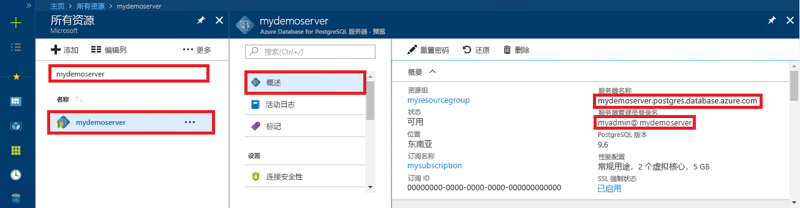

# <a name="azure-database-for-postgresql---single-server-use-net-c-to-connect-and-query-data"></a>Azure Database for PostgreSQL - 单一服务器：使用 .NET (C#) 连接和查询数据
本快速入门演示了如何使用 C# 应用程序连接到 Azure Database for PostgreSQL。 同时还介绍了如何使用 SQL 语句在数据库中查询、插入、更新和删除数据。 本文中的步骤假定你熟悉如何使用 C# 进行开发，但不熟悉如何使用 Azure Database for PostgreSQL。

## <a name="prerequisites"></a>先决条件
此快速入门使用以下任意指南中创建的资源作为起点：
- [创建 DB - 门户](quickstart-create-server-database-portal.md)
- [创建 DB - CLI](quickstart-create-server-database-azure-cli.md)

还需要：
- 安装 [.NET Framework](https://www.microsoft.com/net/download)。 按照链接文章中的步骤来安装专用于平台（Windows、Ubuntu Linux 或 macOS）的 .NET。 
- 安装 [Visual Studio](https://www.visualstudio.com/downloads/) 或 Visual Studio Code，用于键入和编辑代码。
- 添加对 [Npgsql](https://www.nuget.org/packages/Npgsql/) Nuget 包的引用。

## <a name="get-connection-information"></a>获取连接信息
获取连接到 Azure Database for PostgreSQL 所需的连接信息。 需要完全限定的服务器名称和登录凭据。

1. 登录到 [Azure 门户](https://portal.azure.com/)。
2. 在 Azure 门户的左侧菜单中，单击“所有资源”  ，然后搜索已创建的服务器（例如 mydemoserver  ）。
3. 单击服务器名称。
4. 从服务器的“概览”面板中记下“服务器名称”和“服务器管理员登录名”。    如果忘记了密码，也可通过此面板来重置密码。
 

## <a name="connect-create-table-and-insert-data"></a>进行连接，创建表，然后插入数据
通过以下代码进行连接，然后使用 **CREATE TABLE** 和 **INSERT INTO** SQL 语句加载数据。 代码使用 NpgsqlCommand 类，通过 [Open()](https://www.npgsql.org/doc/api/Npgsql.NpgsqlConnection.html#Npgsql_NpgsqlConnection_Open) 方法建立与 PostgreSQL 数据库的连接。 然后，代码使用 [CreateCommand()](https://www.npgsql.org/doc/api/Npgsql.NpgsqlConnection.html#Npgsql_NpgsqlConnection_CreateCommand) 方法，设置 CommandText 属性，再调用 [ExecuteNonQuery()](https://www.npgsql.org/doc/api/Npgsql.NpgsqlCommand.html#Npgsql_NpgsqlCommand_ExecuteNonQuery) 方法来运行数据库命令。 

将 Host、DBName、User 和 Password 参数替换为创建服务器和数据库时指定的值。 

```csharp
using System;
using Npgsql;

namespace Driver
{
    public class AzurePostgresCreate
    {
        // Obtain connection string information from the portal
        //
        private static string Host = "mydemoserver.postgres.database.azure.com";
        private static string User = "mylogin@mydemoserver";
        private static string DBname = "mypgsqldb";
        private static string Password = "<server_admin_password>";
        private static string Port = "5432";

        static void Main(string[] args)
        {
            // Build connection string using parameters from portal
            //
            string connString =
                String.Format(
                    "Server={0};Username={1};Database={2};Port={3};Password={4};SSLMode=Prefer",
                    Host,
                    User,
                    DBname,
                    Port,
                    Password);


            using (var conn = new NpgsqlConnection(connString))

            {
                Console.Out.WriteLine("Opening connection");
                conn.Open();

                using (var command = new NpgsqlCommand("DROP TABLE IF EXISTS inventory", conn))
                { 
                    command.ExecuteNonQuery();
                    Console.Out.WriteLine("Finished dropping table (if existed)");

                }

                using (var command = new NpgsqlCommand("CREATE TABLE inventory(id serial PRIMARY KEY, name VARCHAR(50), quantity INTEGER)", conn))
                {
                    command.ExecuteNonQuery();
                    Console.Out.WriteLine("Finished creating table");
                }

                using (var command = new NpgsqlCommand("INSERT INTO inventory (name, quantity) VALUES (@n1, @q1), (@n2, @q2), (@n3, @q3)", conn))
                {
                    command.Parameters.AddWithValue("n1", "banana");
                    command.Parameters.AddWithValue("q1", 150);
                    command.Parameters.AddWithValue("n2", "orange");
                    command.Parameters.AddWithValue("q2", 154);
                    command.Parameters.AddWithValue("n3", "apple");
                    command.Parameters.AddWithValue("q3", 100);
                    
                    int nRows = command.ExecuteNonQuery();
                    Console.Out.WriteLine(String.Format("Number of rows inserted={0}", nRows));
                }
            }

            Console.WriteLine("Press RETURN to exit");
            Console.ReadLine();
        }
    }
}
```

## <a name="read-data"></a>读取数据
使用以下代码进行连接，并使用 **SELECT** SQL 语句来读取数据。 代码使用 NpgsqlCommand 类，通过 [Open()](https://www.npgsql.org/doc/api/Npgsql.NpgsqlConnection.html#Npgsql_NpgsqlConnection_Open) 方法建立到 PostgreSQL 的连接。 然后，代码使用 [CreateCommand()](https://www.npgsql.org/doc/api/Npgsql.NpgsqlConnection.html#Npgsql_NpgsqlConnection_CreateCommand) 方法和 [ExecuteReader()](https://www.npgsql.org/doc/api/Npgsql.NpgsqlCommand.html#Npgsql_NpgsqlCommand_ExecuteReader) 方法运行数据库命令。 接下来，代码使用 [Read()](https://www.npgsql.org/doc/api/Npgsql.NpgsqlDataReader.html#Npgsql_NpgsqlDataReader_Read) 转到结果中的记录。 最后，代码使用 [GetInt32()](https://www.npgsql.org/doc/api/Npgsql.NpgsqlDataReader.html#Npgsql_NpgsqlDataReader_GetInt32_System_Int32_) 和 [GetString()](https://www.npgsql.org/doc/api/Npgsql.NpgsqlDataReader.html#Npgsql_NpgsqlDataReader_GetString_System_Int32_) 分析记录中的值。

将 Host、DBName、User 和 Password 参数替换为创建服务器和数据库时指定的值。 

```csharp
using System;
using Npgsql;

namespace Driver
{
    public class AzurePostgresRead
    {
        // Obtain connection string information from the portal
        //
        private static string Host = "mydemoserver.postgres.database.azure.com";
        private static string User = "mylogin@mydemoserver";
        private static string DBname = "mypgsqldb";
        private static string Password = "<server_admin_password>";
        private static string Port = "5432";

        static void Main(string[] args)
        {
            // Build connection string using parameters from portal
            //
            string connString =
                String.Format(
                    "Server={0}; User Id={1}; Database={2}; Port={3}; Password={4};SSLMode=Prefer",
                    Host,
                    User,
                    DBname,
                    Port,
                    Password);

            using (var conn = new NpgsqlConnection(connString))
            {

                Console.Out.WriteLine("Opening connection");
                conn.Open();


                using (var command = new NpgsqlCommand("SELECT * FROM inventory", conn))
                {

                    var reader = command.ExecuteReader();
                    while (reader.Read())
                    {
                        Console.WriteLine(
                            string.Format(
                                "Reading from table=({0}, {1}, {2})",
                                reader.GetInt32(0).ToString(),
                                reader.GetString(1),
                                reader.GetInt32(2).ToString()
                                )
                            );
                    }
                }
            }

            Console.WriteLine("Press RETURN to exit");
            Console.ReadLine();
        }
    }
}
```


## <a name="update-data"></a>更新数据
使用以下代码进行连接，并使用 UPDATE SQL 语句更新数据  。 代码使用 NpgsqlCommand 类，通过 [Open()](https://www.npgsql.org/doc/api/Npgsql.NpgsqlConnection.html#Npgsql_NpgsqlConnection_Open) 方法建立到 PostgreSQL 的连接。 然后，代码使用 [CreateCommand()](https://www.npgsql.org/doc/api/Npgsql.NpgsqlConnection.html#Npgsql_NpgsqlConnection_CreateCommand) 方法，设置 CommandText 属性，再调用 [ExecuteNonQuery()](https://www.npgsql.org/doc/api/Npgsql.NpgsqlCommand.html#Npgsql_NpgsqlCommand_ExecuteNonQuery) 方法来运行数据库命令。

将 Host、DBName、User 和 Password 参数替换为创建服务器和数据库时指定的值。 

```csharp
using System;
using Npgsql;

namespace Driver
{
    public class AzurePostgresUpdate
    {
        // Obtain connection string information from the portal
        //
        private static string Host = "mydemoserver.postgres.database.azure.com";
        private static string User = "mylogin@mydemoserver";
        private static string DBname = "mypgsqldb";
        private static string Password = "<server_admin_password>";
        private static string Port = "5432";

        static void Main(string[] args)
        {
            // Build connection string using parameters from portal
            //
            string connString =
                String.Format(
                    "Server={0}; User Id={1}; Database={2}; Port={3}; Password={4};SSLMode=Prefer",
                    Host,
                    User,
                    DBname,
                    Port,
                    Password);

            using (var conn = new NpgsqlConnection(connString))
            {

                Console.Out.WriteLine("Opening connection");
                conn.Open();

                using (var command = new NpgsqlCommand("UPDATE inventory SET quantity = @q WHERE name = @n", conn))
                {
                    command.Parameters.AddWithValue("n", "banana");
                    command.Parameters.AddWithValue("q", 200);
                    
                    int nRows = command.ExecuteNonQuery();
                    Console.Out.WriteLine(String.Format("Number of rows updated={0}", nRows));
                }
            }

            Console.WriteLine("Press RETURN to exit");
            Console.ReadLine();
        }
    }
}


```


## <a name="delete-data"></a>删除数据
使用以下代码进行连接，并使用 DELETE SQL 语句删除数据  。 

代码使用 NpgsqlCommand 类，通过 [Open()](https://www.npgsql.org/doc/api/Npgsql.NpgsqlConnection.html#Npgsql_NpgsqlConnection_Open) 方法建立与 PostgreSQL 数据库的连接。 然后，代码使用 [CreateCommand()](https://www.npgsql.org/doc/api/Npgsql.NpgsqlConnection.html#Npgsql_NpgsqlConnection_CreateCommand) 方法，设置 CommandText 属性，再调用 [ExecuteNonQuery()](https://www.npgsql.org/doc/api/Npgsql.NpgsqlCommand.html#Npgsql_NpgsqlCommand_ExecuteNonQuery) 方法来运行数据库命令。

将 Host、DBName、User 和 Password 参数替换为创建服务器和数据库时指定的值。 

```csharp
using System;
using Npgsql;

namespace Driver
{
    public class AzurePostgresDelete
    {
        // Obtain connection string information from the portal
        //
        private static string Host = "mydemoserver.postgres.database.azure.com";
        private static string User = "mylogin@mydemoserver";
        private static string DBname = "mypgsqldb";
        private static string Password = "<server_admin_password>";
        private static string Port = "5432";

        static void Main(string[] args)
        {
            // Build connection string using parameters from portal
            //
            string connString =
                String.Format(
                    "Server={0}; User Id={1}; Database={2}; Port={3}; Password={4};SSLMode=Prefer",
                    Host,
                    User,
                    DBname,
                    Port,
                    Password);

            using (var conn = new NpgsqlConnection(connString))
            {
                Console.Out.WriteLine("Opening connection");
                conn.Open();

                using (var command = new NpgsqlCommand("DELETE FROM inventory WHERE name = @n", conn))
                {
                    command.Parameters.AddWithValue("n", "orange");

                    int nRows = command.ExecuteNonQuery();
                    Console.Out.WriteLine(String.Format("Number of rows deleted={0}", nRows));
                }
            }

            Console.WriteLine("Press RETURN to exit");
            Console.ReadLine();
        }
    }
}

```

## <a name="next-steps"></a>后续步骤
> [!div class="nextstepaction"]
> [使用导出和导入功能迁移数据库](./howto-migrate-using-export-and-import.md)
