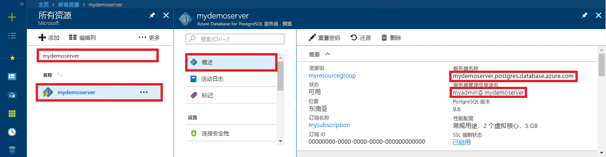

# <a name="azure-database-for-postgresql---single-server-use-go-language-to-connect-and-query-data"></a>Azure Database for PostgreSQL - 单一服务器：使用 Go 语言连接和查询数据
本快速入门演示如何使用以 [Go](https://golang.org/) 语言 (golang) 编写的代码连接到 Azure Database for PostgreSQL。 同时还介绍了如何使用 SQL 语句在数据库中查询、插入、更新和删除数据。 本文假设你熟悉如何使用 Go 进行开发，但不熟悉如何使用 Azure Database for PostgreSQL。

## <a name="prerequisites"></a>先决条件
此快速入门使用以下任意指南中创建的资源作为起点：
- [创建 DB - 门户](quickstart-create-server-database-portal.md)
- [创建 DB - Azure CLI](quickstart-create-server-database-azure-cli.md)

## <a name="install-go-and-pq-connector"></a>安装 Go 和 pq 连接器
在自己的计算机上安装 [Go](https://golang.org/doc/install) 和[纯 Go 语言 Postgres 驱动程序 (pq)](https://github.com/lib/pq)。 根据自己的平台执行相应步骤：

### <a name="windows"></a>Windows
1. 根据[安装说明](https://golang.org/doc/install)[下载](https://golang.org/dl/)和安装用于 Microsoft Windows 的 Go。
2. 从开始菜单启动命令提示符。
3. 为项目创建一个文件夹，例如 `mkdir  %USERPROFILE%\go\src\postgresqlgo`。
4. 将目录转到项目文件夹，例如 `cd %USERPROFILE%\go\src\postgresqlgo`。
5. 设置 GOPATH 的环境变量，使之指向源代码目录。 `set GOPATH=%USERPROFILE%\go` 列中的一个值匹配。
6. 通过运行 `go get github.com/lib/pq` 命令安装[纯 Go 语言 Postgres 驱动程序 (pq)](https://github.com/lib/pq)。

   总起来说就是，安装 Go，然后在命令提示符处运行以下命令：
   ```cmd
   mkdir  %USERPROFILE%\go\src\postgresqlgo
   cd %USERPROFILE%\go\src\postgresqlgo
   set GOPATH=%USERPROFILE%\go
   go get github.com/lib/pq
   ```

### <a name="linux-ubuntu"></a>Linux (Ubuntu)
1. 启动 Bash Shell。 
2. 通过运行 `sudo apt-get install golang-go` 来安装 Go。
3. 在主目录中为项目创建一个文件夹，例如 `mkdir -p ~/go/src/postgresqlgo/`。
4. 将目录转到该文件夹，例如 `cd ~/go/src/postgresqlgo/`。
5. 设置 GOPATH 环境变量，使之指向有效的源目录，例如当前主目录的 Go 文件夹。 在 Bash Shell 中运行 `export GOPATH=~/go`，将 Go 目录添加为当前 Shell 会话的 GOPATH。
6. 通过运行 `go get github.com/lib/pq` 命令安装[纯 Go 语言 Postgres 驱动程序 (pq)](https://github.com/lib/pq)。

   总起来说就是，运行以下 bash 命令：
   ```bash
   sudo apt-get install golang-go
   mkdir -p ~/go/src/postgresqlgo/
   cd ~/go/src/postgresqlgo/
   export GOPATH=~/go/
   go get github.com/lib/pq
   ```

### <a name="apple-macos"></a>Apple macOS
1. 下载 Go，然后根据与平台相对应的[安装说明](https://golang.org/doc/install)进行安装。 
2. 启动 Bash Shell。 
3. 在主目录中为项目创建一个文件夹，例如 `mkdir -p ~/go/src/postgresqlgo/`。
4. 将目录转到该文件夹，例如 `cd ~/go/src/postgresqlgo/`。
5. 设置 GOPATH 环境变量，使之指向有效的源目录，例如当前主目录的 Go 文件夹。 在 Bash Shell 中运行 `export GOPATH=~/go`，将 Go 目录添加为当前 Shell 会话的 GOPATH。
6. 通过运行 `go get github.com/lib/pq` 命令安装[纯 Go 语言 Postgres 驱动程序 (pq)](https://github.com/lib/pq)。

   总起来说就是，安装 Go，然后运行以下 bash 命令：
   ```bash
   mkdir -p ~/go/src/postgresqlgo/
   cd ~/go/src/postgresqlgo/
   export GOPATH=~/go/
   go get github.com/lib/pq
   ```

## <a name="get-connection-information"></a>获取连接信息
获取连接到 Azure Database for PostgreSQL 所需的连接信息。 需要完全限定的服务器名称和登录凭据。

1. 登录到 [Azure 门户](https://portal.azure.com/)。
2. 在 Azure 门户的左侧菜单中，单击“所有资源”  ，然后搜索已创建的服务器（例如 mydemoserver  ）。
3. 单击服务器名称。
4. 从服务器的“概览”面板中记下“服务器名称”和“服务器管理员登录名”。    如果忘记了密码，也可通过此面板来重置密码。
 

## <a name="build-and-run-go-code"></a>生成和运行 Go 代码 
1. 若要编写 Golang 代码，可以使用纯文本编辑器，例如 Microsoft Windows 中的记事本、Ubuntu 中的 [vi](https://manpages.ubuntu.com/manpages/xenial/man1/nvi.1.html#contenttoc5) 或 [Nano](https://www.nano-editor.org/)，或者 macOS 中的 TextEdit。 如果偏好功能更丰富的交互式开发环境 (IDE)，可尝试 Jetbrains 推出的 [GoLand](https://www.jetbrains.com/go/)、Microsoft 推出的 [Visual Studio Code](https://code.visualstudio.com/)，或者 [Atom](https://atom.io/)。
2. 将以下部分中的 Golang 代码粘贴到文本文件中，再使用文件扩展名 \*.go 将这些文件保存到项目文件夹中，例如 Windows 路径 `%USERPROFILE%\go\src\postgresqlgo\createtable.go` 或 Linux 路径 `~/go/src/postgresqlgo/createtable.go`。
3. 在代码中找到 `HOST`、`DATABASE`、`USER`、`PASSWORD` 常量，将示例值替换为自己的值。  
4. 启动命令提示符或 Bash Shell。 将目录转到项目文件夹。 例如，在 Windows 上使用 `cd %USERPROFILE%\go\src\postgresqlgo\`。 在 Linux 上使用 `cd ~/go/src/postgresqlgo/`。 提到的某些 IDE 环境提供不需 shell 命令的调试和运行时功能。
5. 通过键入命令 `go run createtable.go` 来运行代码，编译并运行应用程序。 
6. 另外，若要将代码内建到本机应用程序中，请键入命令 `go build createtable.go`，再启动 `createtable.exe` 来运行该应用程序。

## <a name="connect-and-create-a-table"></a>进行连接并创建表
使用以下代码进行连接，使用 **CREATE TABLE** SQL 语句创建表，然后使用 **INSERT INTO** SQL 语句将行添加到表中。

代码将导入三个包：[sql 包](https://golang.org/pkg/database/sql/)、[pq 包](https://godoc.org/github.com/lib/pq)（充当与 PostgreSQL 服务器通信所需的驱动程序）以及 [fmt 包](https://golang.org/pkg/fmt/)（用于命令行中的打印输入和输出）。

代码通过调用 [sql.Open()](https://godoc.org/github.com/lib/pq#Open) 方法来连接到 Azure Database for PostgreSQL 数据库，并使用 [db.Ping()](https://golang.org/pkg/database/sql/#DB.Ping) 方法来检查连接。 将始终使用[数据库句柄](https://golang.org/pkg/database/sql/#DB)来存储数据库服务器的连接池。 代码多次调用 [Exec()](https://golang.org/pkg/database/sql/#DB.Exec) 方法来运行多个 SQL 命令。 每次都将使用自定义 checkError() 方法来检查是否发生错误，以及是否在发生错误时死机退出。

将 `HOST`、`DATABASE`、`USER` 和 `PASSWORD` 参数替换为你自己的值。 

```go
package main

import (
    "database/sql"
    "fmt"
    _ "github.com/lib/pq"
)

const (
    // Initialize connection constants.
    HOST     = "mydemoserver.postgres.database.azure.com"
    DATABASE = "mypgsqldb"
    USER     = "mylogin@mydemoserver"
    PASSWORD = "<server_admin_password>"
)

func checkError(err error) {
    if err != nil {
        panic(err)
    }
}

func main() {
    // Initialize connection string.
    var connectionString string = fmt.Sprintf("host=%s user=%s password=%s dbname=%s sslmode=require", HOST, USER, PASSWORD, DATABASE)

    // Initialize connection object.
    db, err := sql.Open("postgres", connectionString)
    checkError(err)

    err = db.Ping()
    checkError(err)
    fmt.Println("Successfully created connection to database")

    // Drop previous table of same name if one exists.
    _, err = db.Exec("DROP TABLE IF EXISTS inventory;")
    checkError(err)
    fmt.Println("Finished dropping table (if existed)")

    // Create table.
    _, err = db.Exec("CREATE TABLE inventory (id serial PRIMARY KEY, name VARCHAR(50), quantity INTEGER);")
    checkError(err)
    fmt.Println("Finished creating table")

    // Insert some data into table.
    sql_statement := "INSERT INTO inventory (name, quantity) VALUES ($1, $2);"
    _, err = db.Exec(sql_statement, "banana", 150)
    checkError(err)
    _, err = db.Exec(sql_statement, "orange", 154)
    checkError(err)
    _, err = db.Exec(sql_statement, "apple", 100)
    checkError(err)
    fmt.Println("Inserted 3 rows of data")
}
```

## <a name="read-data"></a>读取数据
使用以下代码进行连接，并使用 **SELECT** SQL 语句来读取数据。 

代码将导入三个包：[sql 包](https://golang.org/pkg/database/sql/)、[pq 包](https://godoc.org/github.com/lib/pq)（充当与 PostgreSQL 服务器通信所需的驱动程序）以及 [fmt 包](https://golang.org/pkg/fmt/)（用于命令行中的打印输入和输出）。

代码通过调用 [sql.Open()](https://godoc.org/github.com/lib/pq#Open) 方法来连接到 Azure Database for PostgreSQL 数据库，并使用 [db.Ping()](https://golang.org/pkg/database/sql/#DB.Ping) 方法来检查连接。 将始终使用[数据库句柄](https://golang.org/pkg/database/sql/#DB)来存储数据库服务器的连接池。 select 查询通过调用方法 [db.Query()](https://golang.org/pkg/database/sql/#DB.Query) 来运行，生成的行保留在类型为[行](https://golang.org/pkg/database/sql/#Rows)的变量中。 代码使用 [rows.Scan()](https://golang.org/pkg/database/sql/#Rows.Scan) 方法来读取当前行中的列数据值，并使用迭代器 [rows.Next()](https://golang.org/pkg/database/sql/#Rows.Next) 来循环访问相关行，直到再也没有行存在。 每行的列值列显到控制台。每次都将使用自定义 checkError() 方法检查是否发生错误，以及是否在发生错误时死机退出。

将 `HOST`、`DATABASE`、`USER` 和 `PASSWORD` 参数替换为你自己的值。 

```go
package main

import (
    "database/sql"
    "fmt"
    _ "github.com/lib/pq"
)

const (
    // Initialize connection constants.
    HOST     = "mydemoserver.postgres.database.azure.com"
    DATABASE = "mypgsqldb"
    USER     = "mylogin@mydemoserver"
    PASSWORD = "<server_admin_password>"
)

func checkError(err error) {
    if err != nil {
        panic(err)
    }
}

func main() {

    // Initialize connection string.
    var connectionString string = fmt.Sprintf("host=%s user=%s password=%s dbname=%s sslmode=require", HOST, USER, PASSWORD, DATABASE)

    // Initialize connection object.
    db, err := sql.Open("postgres", connectionString)
    checkError(err)

    err = db.Ping()
    checkError(err)
    fmt.Println("Successfully created connection to database")

    // Read rows from table.
    var id int
    var name string
    var quantity int

    sql_statement := "SELECT * from inventory;"
    rows, err := db.Query(sql_statement)
    checkError(err)
    defer rows.Close()

    for rows.Next() {
        switch err := rows.Scan(&id, &name, &quantity); err {
        case sql.ErrNoRows:
            fmt.Println("No rows were returned")
        case nil:
            fmt.Printf("Data row = (%d, %s, %d)\n", id, name, quantity)
        default:
            checkError(err)
        }
    }
}
```

## <a name="update-data"></a>更新数据
使用以下代码进行连接，并使用 UPDATE SQL 语句更新数据  。

代码导入三个包：[sql 包](https://golang.org/pkg/database/sql/)、[pq 包](https://godoc.org/github.com/lib/pq)（充当与 Postgres 服务器通信所需的驱动程序）以及 [fmt 包](https://golang.org/pkg/fmt/)（适用于在命令行中列显的输入和输出）。

代码通过调用 [sql.Open()](https://godoc.org/github.com/lib/pq#Open) 方法来连接到 Azure Database for PostgreSQL 数据库，并使用 [db.Ping()](https://golang.org/pkg/database/sql/#DB.Ping) 方法来检查连接。 将始终使用[数据库句柄](https://golang.org/pkg/database/sql/#DB)来存储数据库服务器的连接池。 代码通过调用 [Exec()](https://golang.org/pkg/database/sql/#DB.Exec) 方法来运行 SQL 语句，以便更新表。 使用自定义 checkError() 方法检查是否发生错误，以及是否在发生错误时死机退出。

将 `HOST`、`DATABASE`、`USER` 和 `PASSWORD` 参数替换为你自己的值。 
```go
package main

import (
  "database/sql"
  _ "github.com/lib/pq"
  "fmt"
)

const (
    // Initialize connection constants.
    HOST     = "mydemoserver.postgres.database.azure.com"
    DATABASE = "mypgsqldb"
    USER     = "mylogin@mydemoserver"
    PASSWORD = "<server_admin_password>"
)

func checkError(err error) {
    if err != nil {
        panic(err)
    }
}

func main() {
    
    // Initialize connection string.
    var connectionString string = 
        fmt.Sprintf("host=%s user=%s password=%s dbname=%s sslmode=require", HOST, USER, PASSWORD, DATABASE)

    // Initialize connection object.
    db, err := sql.Open("postgres", connectionString)
    checkError(err)

    err = db.Ping()
    checkError(err)
    fmt.Println("Successfully created connection to database")

    // Modify some data in table.
    sql_statement := "UPDATE inventory SET quantity = $2 WHERE name = $1;"
    _, err = db.Exec(sql_statement, "banana", 200)
    checkError(err)
    fmt.Println("Updated 1 row of data")
}
```

## <a name="delete-data"></a>删除数据
使用以下代码进行连接，并使用 **DELETE** SQL 语句删除数据。 

代码导入三个包：[sql 包](https://golang.org/pkg/database/sql/)、[pq 包](https://godoc.org/github.com/lib/pq)（充当与 Postgres 服务器通信所需的驱动程序）以及 [fmt 包](https://golang.org/pkg/fmt/)（适用于在命令行中列显的输入和输出）。

代码通过调用 [sql.Open()](https://godoc.org/github.com/lib/pq#Open) 方法来连接到 Azure Database for PostgreSQL 数据库，并使用 [db.Ping()](https://golang.org/pkg/database/sql/#DB.Ping) 方法来检查连接。 将始终使用[数据库句柄](https://golang.org/pkg/database/sql/#DB)来存储数据库服务器的连接池。 代码通过调用 [Exec()](https://golang.org/pkg/database/sql/#DB.Exec) 方法来运行 SQL 语句，以便从表中删除行。 使用自定义 checkError() 方法检查是否发生错误，以及是否在发生错误时死机退出。

将 `HOST`、`DATABASE`、`USER` 和 `PASSWORD` 参数替换为你自己的值。 
```go
package main

import (
  "database/sql"
  _ "github.com/lib/pq"
  "fmt"
)

const (
    // Initialize connection constants.
    HOST     = "mydemoserver.postgres.database.azure.com"
    DATABASE = "mypgsqldb"
    USER     = "mylogin@mydemoserver"
    PASSWORD = "<server_admin_password>"
)

func checkError(err error) {
    if err != nil {
        panic(err)
    }
}

func main() {
    
    // Initialize connection string.
    var connectionString string = 
        fmt.Sprintf("host=%s user=%s password=%s dbname=%s sslmode=require", HOST, USER, PASSWORD, DATABASE)

    // Initialize connection object.
    db, err := sql.Open("postgres", connectionString)
    checkError(err)

    err = db.Ping()
    checkError(err)
    fmt.Println("Successfully created connection to database")

    // Delete some data from table.
    sql_statement := "DELETE FROM inventory WHERE name = $1;"
    _, err = db.Exec(sql_statement, "orange")
    checkError(err)
    fmt.Println("Deleted 1 row of data")
}
```

## <a name="next-steps"></a>后续步骤
> [!div class="nextstepaction"]
> [使用导出和导入功能迁移数据库](./howto-migrate-using-export-and-import.md)
