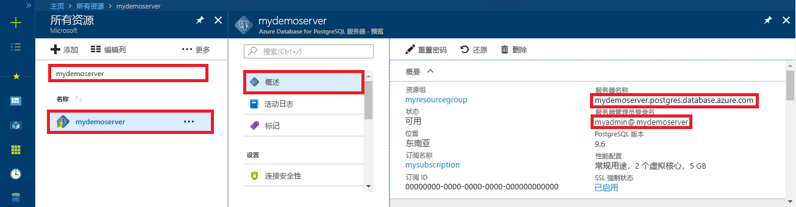

# <a name="azure-database-for-postgresql-use-java-to-connect-and-query-data"></a>Azure Database for PostgreSQL：使用 Java 进行连接并查询数据
本快速入门演示了如何使用 Java 应用程序连接到 Azure Database for PostgreSQL。 同时还介绍了如何使用 SQL 语句在数据库中查询、插入、更新和删除数据。 本文中的步骤假定你熟悉如何使用 Java 进行开发，但不熟悉如何使用 Azure Database for PostgreSQL。

## <a name="prerequisites"></a>先决条件
此快速入门使用以下任意指南中创建的资源作为起点：
- [创建 DB - 门户](quickstart-create-server-database-portal.md)
- [创建 DB - Azure CLI](quickstart-create-server-database-azure-cli.md)

还需要：
- 下载与 Java 版本和 Java 开发工具包匹配的 [PostgreSQL JDBC 驱动程序](https://jdbc.postgresql.org/download.html)。
- 在应用程序类路径中包括 PostgreSQL JDBC jar 文件（例如 postgresql-42.1.1.jar）。 有关详细信息，请参阅[类路径详细信息](https://jdbc.postgresql.org/documentation/head/classpath.html)。

## <a name="get-connection-information"></a>获取连接信息
获取连接到 Azure Database for PostgreSQL 所需的连接信息。 需要完全限定的服务器名称和登录凭据。

1. 登录到 [Azure 门户](https://portal.azure.com/)。
2. 在 Azure 门户的左侧菜单中，单击“所有资源”，然后搜索已创建的服务器（例如 mydemoserver）。
3. 单击服务器名称。
4. 从服务器的“概览”面板中记下“服务器名称”和“服务器管理员登录名”。 如果忘记了密码，也可通过此面板来重置密码。
 

## <a name="connect-create-table-and-insert-data"></a>进行连接，创建表，然后插入数据
通过以下代码进行连接，然后使用函数和 INSERT SQL 语句将数据加载到数据库。 使用 [getConnection()](https://www.postgresql.org/docs/7.4/static/jdbc-use.html)、[createStatement()](https://jdbc.postgresql.org/documentation/head/query.html) 和 [executeQuery()](https://jdbc.postgresql.org/documentation/head/query.html) 方法来连接到数据库、删除和创建表。 使用 [prepareStatement](https://jdbc.postgresql.org/documentation/head/query.html) 对象来生成 insert 命令，通过 setString() 和 setInt() 来绑定参数值。 [executeUpdate()](https://jdbc.postgresql.org/documentation/head/update.html) 方法为每组参数运行该命令。 

将 host、database、user 和 password 参数替换为创建你自己的服务器和数据库时指定的值。

```java
import java.sql.*;
import java.util.Properties;

public class CreateTableInsertRows {

    public static void main (String[] args)  throws Exception
    {

        // Initialize connection variables.
        String host = "mydemoserver.postgres.database.azure.com";
        String database = "mypgsqldb";
        String user = "mylogin@mydemoserver";
        String password = "<server_admin_password>";

        // check that the driver is installed
        try
        {
            Class.forName("org.postgresql.Driver");
        }
        catch (ClassNotFoundException e)
        {
            throw new ClassNotFoundException("PostgreSQL JDBC driver NOT detected in library path.", e);
        }

        System.out.println("PostgreSQL JDBC driver detected in library path.");

        Connection connection = null;

        // Initialize connection object
        try
        {
            String url = String.format("jdbc:postgresql://%s/%s", host, database);
            
            // set up the connection properties
            Properties properties = new Properties();
            properties.setProperty("user", user);
            properties.setProperty("password", password);
            properties.setProperty("ssl", "true");

            // get connection
            connection = DriverManager.getConnection(url, properties);
        }
        catch (SQLException e)
        {
            throw new SQLException("Failed to create connection to database.", e);
        }
        if (connection != null) 
        { 
            System.out.println("Successfully created connection to database.");
        
            // Perform some SQL queries over the connection.
            try
            {
                // Drop previous table of same name if one exists.
                Statement statement = connection.createStatement();
                statement.execute("DROP TABLE IF EXISTS inventory;");
                System.out.println("Finished dropping table (if existed).");
    
                // Create table.
                statement.execute("CREATE TABLE inventory (id serial PRIMARY KEY, name VARCHAR(50), quantity INTEGER);");
                System.out.println("Created table.");
    
                // Insert some data into table.
                int nRowsInserted = 0;
                PreparedStatement preparedStatement = connection.prepareStatement("INSERT INTO inventory (name, quantity) VALUES (?, ?);");
                preparedStatement.setString(1, "banana");
                preparedStatement.setInt(2, 150);
                nRowsInserted += preparedStatement.executeUpdate();

                preparedStatement.setString(1, "orange");
                preparedStatement.setInt(2, 154);
                nRowsInserted += preparedStatement.executeUpdate();

                preparedStatement.setString(1, "apple");
                preparedStatement.setInt(2, 100);
                nRowsInserted += preparedStatement.executeUpdate();
                System.out.println(String.format("Inserted %d row(s) of data.", nRowsInserted));
    
                // NOTE No need to commit all changes to database, as auto-commit is enabled by default.
    
            }
            catch (SQLException e)
            {
                throw new SQLException("Encountered an error when executing given sql statement.", e);
            }       
        }
        else {
            System.out.println("Failed to create connection to database.");
        }
        System.out.println("Execution finished.");
    }
}
```

## <a name="read-data"></a>读取数据
使用以下代码，通过 **SELECT** SQL 语句读取数据。 使用 [getConnection()](https://www.postgresql.org/docs/7.4/static/jdbc-use.html)、[createStatement()](https://jdbc.postgresql.org/documentation/head/query.html) 和 [executeQuery()](https://jdbc.postgresql.org/documentation/head/query.html) 方法来连接到数据库、创建和运行 select 语句。 结果使用 [ResultSet](https://www.postgresql.org/docs/7.4/static/jdbc-query.html) 对象处理。 

将 host、database、user 和 password 参数替换为创建你自己的服务器和数据库时指定的值。

```java
import java.sql.*;
import java.util.Properties;

public class ReadTable {

    public static void main (String[] args)  throws Exception
    {

        // Initialize connection variables.
        String host = "mydemoserver.postgres.database.azure.com";
        String database = "mypgsqldb";
        String user = "mylogin@mydemoserver";
        String password = "<server_admin_password>";

        // check that the driver is installed
        try
        {
            Class.forName("org.postgresql.Driver");
        }
        catch (ClassNotFoundException e)
        {
            throw new ClassNotFoundException("PostgreSQL JDBC driver NOT detected in library path.", e);
        }

        System.out.println("PostgreSQL JDBC driver detected in library path.");

        Connection connection = null;

        // Initialize connection object
        try
        {
            String url = String.format("jdbc:postgresql://%s/%s", host, database);
            
            // set up the connection properties
            Properties properties = new Properties();
            properties.setProperty("user", user);
            properties.setProperty("password", password);
            properties.setProperty("ssl", "true");

            // get connection
            connection = DriverManager.getConnection(url, properties);
        }
        catch (SQLException e)
        {
            throw new SQLException("Failed to create connection to database.", e);
        }
        if (connection != null) 
        { 
            System.out.println("Successfully created connection to database.");
        
            // Perform some SQL queries over the connection.
            try
            {
    
                Statement statement = connection.createStatement();
                ResultSet results = statement.executeQuery("SELECT * from inventory;");
                while (results.next())
                {
                    String outputString = 
                        String.format(
                            "Data row = (%s, %s, %s)",
                            results.getString(1),
                            results.getString(2),
                            results.getString(3));
                    System.out.println(outputString);
                }
            }
            catch (SQLException e)
            {
                throw new SQLException("Encountered an error when executing given sql statement.", e);
            }       
        }
        else {
            System.out.println("Failed to create connection to database.");
        }
        System.out.println("Execution finished.");
    }
}

```

## <a name="update-data"></a>更新数据
使用以下代码，通过 **UPDATE** SQL 语句更改数据。 使用 [getConnection()](https://www.postgresql.org/docs/7.4/static/jdbc-use.html)、[prepareStatement()](https://jdbc.postgresql.org/documentation/head/query.html) 和 [executeUpdate()](https://jdbc.postgresql.org/documentation/head/update.html) 方法来连接到数据库、准备和运行 update 语句。 

将 host、database、user 和 password 参数替换为创建你自己的服务器和数据库时指定的值。

```java
import java.sql.*;
import java.util.Properties;

public class UpdateTable {
    public static void main (String[] args)  throws Exception
    {

        // Initialize connection variables.
        String host = "mydemoserver.postgres.database.azure.com";
        String database = "mypgsqldb";
        String user = "mylogin@mydemoserver";
        String password = "<server_admin_password>";

        // check that the driver is installed
        try
        {
            Class.forName("org.postgresql.Driver");
        }
        catch (ClassNotFoundException e)
        {
            throw new ClassNotFoundException("PostgreSQL JDBC driver NOT detected in library path.", e);
        }

        System.out.println("PostgreSQL JDBC driver detected in library path.");

        Connection connection = null;

        // Initialize connection object
        try
        {
            String url = String.format("jdbc:postgresql://%s/%s", host, database);
            
            // set up the connection properties
            Properties properties = new Properties();
            properties.setProperty("user", user);
            properties.setProperty("password", password);
            properties.setProperty("ssl", "true");

            // get connection
            connection = DriverManager.getConnection(url, properties);
        }
        catch (SQLException e)
        {
            throw new SQLException("Failed to create connection to database.", e);
        }
        if (connection != null) 
        { 
            System.out.println("Successfully created connection to database.");
        
            // Perform some SQL queries over the connection.
            try
            {
                // Modify some data in table.
                int nRowsUpdated = 0;
                PreparedStatement preparedStatement = connection.prepareStatement("UPDATE inventory SET quantity = ? WHERE name = ?;");
                preparedStatement.setInt(1, 200);
                preparedStatement.setString(2, "banana");
                nRowsUpdated += preparedStatement.executeUpdate();
                System.out.println(String.format("Updated %d row(s) of data.", nRowsUpdated));
    
                // NOTE No need to commit all changes to database, as auto-commit is enabled by default.
            }
            catch (SQLException e)
            {
                throw new SQLException("Encountered an error when executing given sql statement.", e);
            }       
        }
        else {
            System.out.println("Failed to create connection to database.");
        }
        System.out.println("Execution finished.");
    }
}
```
## <a name="delete-data"></a>删除数据
使用以下代码，通过 **DELETE** SQL 语句删除数据。 使用 [getConnection()](https://www.postgresql.org/docs/7.4/static/jdbc-use.html)、[prepareStatement()](https://jdbc.postgresql.org/documentation/head/query.html) 和 [executeUpdate()](https://jdbc.postgresql.org/documentation/head/update.html) 方法来连接到数据库、准备和运行 delete 语句。 

将 host、database、user 和 password 参数替换为创建你自己的服务器和数据库时指定的值。

```java
import java.sql.*;
import java.util.Properties;

public class DeleteTable {
    public static void main (String[] args)  throws Exception
    {

        // Initialize connection variables.
        String host = "mydemoserver.postgres.database.azure.com";
        String database = "mypgsqldb";
        String user = "mylogin@mydemoserver";
        String password = "<server_admin_password>";

        // check that the driver is installed
        try
        {
            Class.forName("org.postgresql.Driver");
        }
        catch (ClassNotFoundException e)
        {
            throw new ClassNotFoundException("PostgreSQL JDBC driver NOT detected in library path.", e);
        }

        System.out.println("PostgreSQL JDBC driver detected in library path.");

        Connection connection = null;

        // Initialize connection object
        try
        {
            String url = String.format("jdbc:postgresql://%s/%s", host, database);
            
            // set up the connection properties
            Properties properties = new Properties();
            properties.setProperty("user", user);
            properties.setProperty("password", password);
            properties.setProperty("ssl", "true");

            // get connection
            connection = DriverManager.getConnection(url, properties);
        }
        catch (SQLException e)
        {
            throw new SQLException("Failed to create connection to database.", e);
        }
        if (connection != null) 
        { 
            System.out.println("Successfully created connection to database.");
        
            // Perform some SQL queries over the connection.
            try
            {
                // Delete some data from table.
                int nRowsDeleted = 0;
                PreparedStatement preparedStatement = connection.prepareStatement("DELETE FROM inventory WHERE name = ?;");
                preparedStatement.setString(1, "orange");
                nRowsDeleted += preparedStatement.executeUpdate();
                System.out.println(String.format("Deleted %d row(s) of data.", nRowsDeleted));
    
                // NOTE No need to commit all changes to database, as auto-commit is enabled by default.
            }
            catch (SQLException e)
            {
                throw new SQLException("Encountered an error when executing given sql statement.", e);
            }       
        }
        else {
            System.out.println("Failed to create connection to database.");
        }
        System.out.println("Execution finished.");
    }
}
```

## <a name="next-steps"></a>后续步骤
> [!div class="nextstepaction"]
> [使用导出和导入功能迁移数据库](./howto-migrate-using-export-and-import.md)
