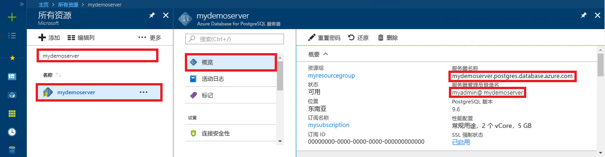

# <a name="quickstart-use-nodejs-to-connect-and-query-data-in-azure-database-for-postgresql---single-server"></a>快速入门：使用 Node.js 连接到 Azure Database for PostgreSQL 并查询其中的数据 - 单一服务器

在本快速入门中，我们使用 Node.js 应用程序连接到 Azure Database for PostgreSQL。 同时还介绍了如何使用 SQL 语句在数据库中查询、插入、更新和删除数据。 本文中的步骤假定你熟悉如何使用 Node.js 进行开发，但不熟悉如何使用 Azure Database for PostgreSQL。

## <a name="prerequisites"></a>必备条件

- 具有活动订阅的 Azure 帐户。 [免费创建帐户](https://azure.microsoft.com/free/?ref=microsoft.com&utm_source=microsoft.com&utm_medium=docs&utm_campaign=visualstudio)。

- 完成[快速入门：在 Azure 门户中创建 Azure Database for PostgreSQL 服务器](quickstart-create-server-database-portal.md)或[快速入门：使用 Azure CLI 创建 Azure Database for PostgreSQL](quickstart-create-server-database-azure-cli.md) 中的步骤。

- [Node.js](https://nodejs.org)

## <a name="install-pg-client"></a>安装 pg 客户端
安装 [pg](https://www.npmjs.com/package/pg)，这是 Node.js 的 PostgreSQL 客户端。

为此，请从命令行运行适用于 JavaScript 的节点包管理器 (npm)，以便安装 pg 客户端。
```bash
npm install pg
```

通过列出已安装的包来验证安装。
```bash
npm list
```

## <a name="get-connection-information"></a>获取连接信息
获取连接到 Azure Database for PostgreSQL 所需的连接信息。 需要完全限定的服务器名称和登录凭据。

1. 在 [Azure 门户](https://portal.azure.com/)中，搜索并选择已创建的服务器（例如 **mydemoserver**）。

1. 从服务器的“概览”面板中记下“服务器名称”和“管理员用户名”。    如果忘记了密码，也可通过此面板来重置密码。

   

## <a name="running-the-javascript-code-in-nodejs"></a>在 Node.js 中运行 JavaScript 代码
可以通过键入 `node` 从 bash shell、终端或 Windows 命令提示符启动 Node.js，然后以交互方式运行示例 JavaScript 代码（只需将其复制并粘贴到提示符处即可）。 也可将 JavaScript 代码保存到文本文件中，然后以文件名作为运行所需的参数来启动 `node filename.js`。

## <a name="connect-create-table-and-insert-data"></a>进行连接，创建表，然后插入数据
通过以下代码进行连接，然后使用 **CREATE TABLE** 和 **INSERT INTO** SQL 语句加载数据。
[pg.Client](https://github.com/brianc/node-postgres/wiki/Client) 对象用作 PostgreSQL 服务器的接口。 [pg.Client.connect()](https://github.com/brianc/node-postgres/wiki/Client#method-connect) 函数用来建立到服务器的连接。 [pg.Client.query()](https://github.com/brianc/node-postgres/wiki/Query) 函数用来针对 PostgreSQL 数据库执行 SQL 查询。 

将 host、dbname、user 和 password 参数替换为创建服务器和数据库时指定的值。

```javascript
const pg = require('pg');

const config = {
    host: '<your-db-server-name>.postgres.database.azure.com',
    // Do not hard code your username and password.
    // Consider using Node environment variables.
    user: '<your-db-username>',     
    password: '<your-password>',
    database: '<name-of-database>',
    port: 5432,
    ssl: true
};

const client = new pg.Client(config);

client.connect(err => {
    if (err) throw err;
    else {
        queryDatabase();
    }
});

function queryDatabase() {
    const query = `
        DROP TABLE IF EXISTS inventory;
        CREATE TABLE inventory (id serial PRIMARY KEY, name VARCHAR(50), quantity INTEGER);
        INSERT INTO inventory (name, quantity) VALUES ('banana', 150);
        INSERT INTO inventory (name, quantity) VALUES ('orange', 154);
        INSERT INTO inventory (name, quantity) VALUES ('apple', 100);
    `;

    client
        .query(query)
        .then(() => {
            console.log('Table created successfully!');
            client.end(console.log('Closed client connection'));
        })
        .catch(err => console.log(err))
        .then(() => {
            console.log('Finished execution, exiting now');
            process.exit();
        });
}
```

## <a name="read-data"></a>读取数据
使用以下代码进行连接，并使用 **SELECT** SQL 语句来读取数据。 [pg.Client](https://github.com/brianc/node-postgres/wiki/Client) 对象用作 PostgreSQL 服务器的接口。 [pg.Client.connect()](https://github.com/brianc/node-postgres/wiki/Client#method-connect) 函数用来建立到服务器的连接。 [pg.Client.query()](https://github.com/brianc/node-postgres/wiki/Query) 函数用来针对 PostgreSQL 数据库执行 SQL 查询。 

将 host、dbname、user 和 password 参数替换为创建服务器和数据库时指定的值。 

```javascript
const pg = require('pg');

const config = {
    host: '<your-db-server-name>.postgres.database.azure.com',
    // Do not hard code your username and password.
    // Consider using Node environment variables.
    user: '<your-db-username>',     
    password: '<your-password>',
    database: '<name-of-database>',
    port: 5432,
    ssl: true
};

const client = new pg.Client(config);

client.connect(err => {
    if (err) throw err;
    else { queryDatabase(); }
});

function queryDatabase() {
  
    console.log(`Running query to PostgreSQL server: ${config.host}`);

    const query = 'SELECT * FROM inventory;';

    client.query(query)
        .then(res => {
            const rows = res.rows;

            rows.map(row => {
                console.log(`Read: ${JSON.stringify(row)}`);
            });

            process.exit();
        })
        .catch(err => {
            console.log(err);
        });
}
```

## <a name="update-data"></a>更新数据
使用以下代码进行连接，并使用 **UPDATE** SQL 语句读取数据。 [pg.Client](https://github.com/brianc/node-postgres/wiki/Client) 对象用作 PostgreSQL 服务器的接口。 [pg.Client.connect()](https://github.com/brianc/node-postgres/wiki/Client#method-connect) 函数用来建立到服务器的连接。 [pg.Client.query()](https://github.com/brianc/node-postgres/wiki/Query) 函数用来针对 PostgreSQL 数据库执行 SQL 查询。 

将 host、dbname、user 和 password 参数替换为创建服务器和数据库时指定的值。 

```javascript
const pg = require('pg');

const config = {
    host: '<your-db-server-name>.postgres.database.azure.com',
    // Do not hard code your username and password.
    // Consider using Node environment variables.
    user: '<your-db-username>',     
    password: '<your-password>',
    database: '<name-of-database>',
    port: 5432,
    ssl: true
};

const client = new pg.Client(config);

client.connect(err => {
    if (err) throw err;
    else {
        queryDatabase();
    }
});

function queryDatabase() {
    const query = `
        UPDATE inventory 
        SET quantity= 1000 WHERE name='banana';
    `;

    client
        .query(query)
        .then(result => {
            console.log('Update completed');
            console.log(`Rows affected: ${result.rowCount}`);
        })
        .catch(err => {
            console.log(err);
            throw err;
        });
}
```

## <a name="delete-data"></a>删除数据
使用以下代码进行连接，并使用 **DELETE** SQL 语句读取数据。 [pg.Client](https://github.com/brianc/node-postgres/wiki/Client) 对象用作 PostgreSQL 服务器的接口。 [pg.Client.connect()](https://github.com/brianc/node-postgres/wiki/Client#method-connect) 函数用来建立到服务器的连接。 [pg.Client.query()](https://github.com/brianc/node-postgres/wiki/Query) 函数用来针对 PostgreSQL 数据库执行 SQL 查询。 

将 host、dbname、user 和 password 参数替换为创建服务器和数据库时指定的值。 

```javascript
const pg = require('pg');

const config = {
    host: '<your-db-server-name>.postgres.database.azure.com',
    // Do not hard code your username and password.
    // Consider using Node environment variables.
    user: '<your-db-username>',     
    password: '<your-password>',
    database: '<name-of-database>',
    port: 5432,
    ssl: true
};

const client = new pg.Client(config);

client.connect(err => {
    if (err) {
        throw err;
    } else {
        queryDatabase();
    }
});

function queryDatabase() {
    const query = `
        DELETE FROM inventory 
        WHERE name = 'apple';
    `;

    client
        .query(query)
        .then(result => {
            console.log('Delete completed');
            console.log(`Rows affected: ${result.rowCount}`);
        })
        .catch(err => {
            console.log(err);
            throw err;
        });
}
```

## <a name="next-steps"></a>后续步骤
> [!div class="nextstepaction"]
> [使用导出和导入功能迁移数据库](./howto-migrate-using-export-and-import.md)
