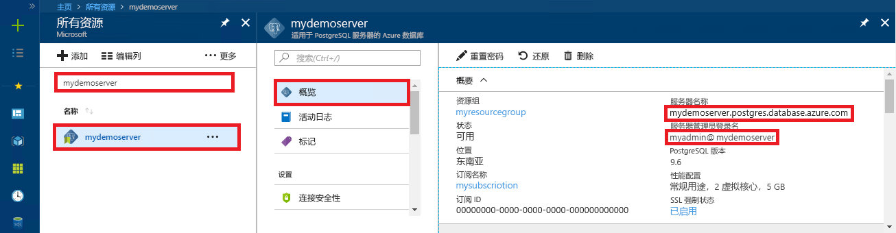

# <a name="azure-database-for-postgresql---single-server-use-php-to-connect-and-query-data"></a>Azure Database for PostgreSQL - 单一服务器：使用 PHP 连接和查询数据
本快速入门演示了如何使用 [PHP](https://secure.php.net/manual/intro-whatis.php) 应用程序连接到 Azure Database for PostgreSQL。 同时还介绍了如何使用 SQL 语句在数据库中查询、插入、更新和删除数据。 本文中的步骤假定你熟悉如何使用 PHP 进行开发，但不熟悉如何使用 Azure Database for PostgreSQL。

## <a name="prerequisites"></a>先决条件
此快速入门使用以下任意指南中创建的资源作为起点：
- [创建 DB - 门户](quickstart-create-server-database-portal.md)
- [创建 DB - Azure CLI](quickstart-create-server-database-azure-cli.md)

## <a name="install-php"></a>安装 PHP
在自己的服务器上安装 PHP，或者创建包括 PHP 的 Azure [Web 应用](../app-service/overview.md)。

### <a name="windows"></a>Windows
- 下载 [PHP 7.1.4 非线程安全 (x64) 版本](https://windows.php.net/download#php-7.1)
- 安装 PHP 并参阅 [PHP 手册](https://secure.php.net/manual/install.windows.php)以获取更多配置
- 代码使用 PHP 安装中包括的 **pgsql** 类 (ext/php_pgsql.dll)。 
- 通过编辑 php.ini 配置文件（通常位于 `C:\Program Files\PHP\v7.1\php.ini` 中）启用 **pgsql** 扩展。 配置文件应包含文本为 `extension=php_pgsql.so` 的行。 如果未显示，请添加该文本并保存文件。 如果文本存在，但已被分号前缀注释掉，请通过删除分号来取消注释该文本。

### <a name="linux-ubuntu"></a>Linux (Ubuntu)
- 下载 [PHP 7.1.4 非线程安全 (x64) 版本](https://secure.php.net/downloads.php) 
- 安装 PHP 并参阅 [PHP 手册](https://secure.php.net/manual/install.unix.php)以获取更多配置
- 代码使用 **pgsql** 类 (php_pgsql.so)。 通过运行 `sudo apt-get install php-pgsql` 来安装它。
- 通过编辑 `/etc/php/7.0/mods-available/pgsql.ini` 配置文件启用 **pgsql** 扩展。 配置文件应包含文本为 `extension=php_pgsql.so` 的行。 如果未显示，请添加该文本并保存文件。 如果文本存在，但已被分号前缀注释掉，请通过删除分号来取消注释该文本。

### <a name="macos"></a>MacOS
- 下载 [PHP 7.1.4 版](https://secure.php.net/downloads.php)
- 安装 PHP 并参阅 [PHP 手册](https://secure.php.net/manual/install.macosx.php)以获取更多配置

## <a name="get-connection-information"></a>获取连接信息
获取连接到 Azure Database for PostgreSQL 所需的连接信息。 需要完全限定的服务器名称和登录凭据。

1. 登录到 [Azure 门户](https://portal.azure.com/)。
2. 在 Azure 门户的左侧菜单中，单击“所有资源”  ，然后搜索已创建的服务器（例如 mydemoserver  ）。
3. 单击服务器名称。
4. 从服务器的“概览”面板中记下“服务器名称”和“服务器管理员登录名”。    如果忘记了密码，也可通过此面板来重置密码。
 

## <a name="connect-and-create-a-table"></a>进行连接并创建表
使用以下代码进行连接，使用 **CREATE TABLE** SQL 语句创建表，然后使用 **INSERT INTO** SQL 语句将行添加到表中。

代码通过调用 [pg_connect()](https://secure.php.net/manual/en/function.pg-connect.php) 方法来连接到 Azure Database for PostgreSQL。 然后，它会通过多次调用 [pg_query()](https://secure.php.net/manual/en/function.pg-query.php) 方法来运行多个命令，并通过调用 [pg_last_error()](https://secure.php.net/manual/en/function.pg-last-error.php) 来查看详细信息（如果每次都发生错误）。 然后，它会调用方法 [pg_close()](https://secure.php.net/manual/en/function.pg-close.php) 来关闭连接。

将 `$host`、`$database`、`$user` 和 `$password` 参数替换为你自己的值。 

```php
<?php
    // Initialize connection variables.
    $host = "mydemoserver.postgres.database.azure.com";
    $database = "mypgsqldb";
    $user = "mylogin@mydemoserver";
    $password = "<server_admin_password>";

    // Initialize connection object.
    $connection = pg_connect("host=$host dbname=$database user=$user password=$password") 
        or die("Failed to create connection to database: ". pg_last_error(). "<br/>");
    print "Successfully created connection to database.<br/>";

    // Drop previous table of same name if one exists.
    $query = "DROP TABLE IF EXISTS inventory;";
    pg_query($connection, $query) 
        or die("Encountered an error when executing given sql statement: ". pg_last_error(). "<br/>");
    print "Finished dropping table (if existed).<br/>";

    // Create table.
    $query = "CREATE TABLE inventory (id serial PRIMARY KEY, name VARCHAR(50), quantity INTEGER);";
    pg_query($connection, $query) 
        or die("Encountered an error when executing given sql statement: ". pg_last_error(). "<br/>");
    print "Finished creating table.<br/>";

    // Insert some data into table.
    $name = '\'banana\'';
    $quantity = 150;
    $query = "INSERT INTO inventory (name, quantity) VALUES ($1, $2);";
    pg_query($connection, $query) 
        or die("Encountered an error when executing given sql statement: ". pg_last_error(). "<br/>");

    $name = '\'orange\'';
    $quantity = 154;
    $query = "INSERT INTO inventory (name, quantity) VALUES ($name, $quantity);";
    pg_query($connection, $query) 
        or die("Encountered an error when executing given sql statement: ". pg_last_error(). "<br/>");

    $name = '\'apple\'';
    $quantity = 100;
    $query = "INSERT INTO inventory (name, quantity) VALUES ($name, $quantity);";
    pg_query($connection, $query) 
        or die("Encountered an error when executing given sql statement: ". pg_last_error()). "<br/>";

    print "Inserted 3 rows of data.<br/>";

    // Closing connection
    pg_close($connection);
?>
```

## <a name="read-data"></a>读取数据
使用以下代码进行连接，并使用 **SELECT** SQL 语句来读取数据。 

 代码通过调用 [pg_connect()](https://secure.php.net/manual/en/function.pg-connect.php) 方法来连接到 Azure Database for PostgreSQL。 然后，它会通过调用 [pg_query()](https://secure.php.net/manual/en/function.pg-query.php) 方法来运行 SELECT 命令，将结果保存在结果集中，并通过调用 [pg_last_error()](https://secure.php.net/manual/en/function.pg-last-error.php) 来查看详细信息（如果发生错误）。  若要读取结果集，请在循环中调用 [pg_fetch_row()](https://secure.php.net/manual/en/function.pg-fetch-row.php) 方法，每行一个循环，并在数组 `$row` 中检索行数据，每列一个数据值（在每个数组位置）。  若要释放结果集，请调用 [pg_free_result()](https://secure.php.net/manual/en/function.pg-free-result.php) 方法。 然后，它会调用方法 [pg_close()](https://secure.php.net/manual/en/function.pg-close.php) 来关闭连接。

将 `$host`、`$database`、`$user` 和 `$password` 参数替换为你自己的值。 

```php
<?php
    // Initialize connection variables.
    $host = "mydemoserver.postgres.database.azure.com";
    $database = "mypgsqldb";
    $user = "mylogin@mydemoserver";
    $password = "<server_admin_password>";
    
    // Initialize connection object.
    $connection = pg_connect("host=$host dbname=$database user=$user password=$password")
                or die("Failed to create connection to database: ". pg_last_error(). "<br/>");

    print "Successfully created connection to database. <br/>";

    // Perform some SQL queries over the connection.
    $query = "SELECT * from inventory";
    $result_set = pg_query($connection, $query) 
        or die("Encountered an error when executing given sql statement: ". pg_last_error(). "<br/>");
    while ($row = pg_fetch_row($result_set))
    {
        print "Data row = ($row[0], $row[1], $row[2]). <br/>";
    }

    // Free result_set
    pg_free_result($result_set);

    // Closing connection
    pg_close($connection);
?>
```

## <a name="update-data"></a>更新数据
使用以下代码进行连接，并使用 **UPDATE** SQL 语句更新数据。

代码通过调用 [pg_connect()](https://secure.php.net/manual/en/function.pg-connect.php) 方法来连接到 Azure Database for PostgreSQL。 然后，它会通过调用 [pg_query()](https://secure.php.net/manual/en/function.pg-query.php) 方法来运行命令，并通过调用 [pg_last_error()](https://secure.php.net/manual/en/function.pg-last-error.php) 来查看详细信息（如果发生错误）。 然后，它会调用方法 [pg_close()](https://secure.php.net/manual/en/function.pg-close.php) 来关闭连接。

将 `$host`、`$database`、`$user` 和 `$password` 参数替换为你自己的值。 

```php
<?php
    // Initialize connection variables.
    $host = "mydemoserver.postgres.database.azure.com";
    $database = "mypgsqldb";
    $user = "mylogin@mydemoserver";
    $password = "<server_admin_password>";

    // Initialize connection object.
    $connection = pg_connect("host=$host dbname=$database user=$user password=$password")
                or die("Failed to create connection to database: ". pg_last_error(). ".<br/>");

    print "Successfully created connection to database. <br/>";

    // Modify some data in table.
    $new_quantity = 200;
    $name = '\'banana\'';
    $query = "UPDATE inventory SET quantity = $new_quantity WHERE name = $name;";
    pg_query($connection, $query) 
        or die("Encountered an error when executing given sql statement: ". pg_last_error(). ".<br/>");
    print "Updated 1 row of data. </br>";

    // Closing connection
    pg_close($connection);
?>
```


## <a name="delete-data"></a>删除数据
使用以下代码进行连接，并使用 **DELETE** SQL 语句读取数据。 

 代码通过调用 [pg_connect()](https://secure.php.net/manual/en/function.pg-connect.php) 方法来连接到 Azure Database for PostgreSQL。 然后，它会通过调用 [pg_query()](https://secure.php.net/manual/en/function.pg-query.php) 方法来运行命令，并通过调用 [pg_last_error()](https://secure.php.net/manual/en/function.pg-last-error.php) 来查看详细信息（如果发生错误）。 然后，它会调用方法 [pg_close()](https://secure.php.net/manual/en/function.pg-close.php) 来关闭连接。

将 `$host`、`$database`、`$user` 和 `$password` 参数替换为你自己的值。 

```php
<?php
    // Initialize connection variables.
    $host = "mydemoserver.postgres.database.azure.com";
    $database = "mypgsqldb";
    $user = "mylogin@mydemoserver";
    $password = "<server_admin_password>";

    // Initialize connection object.
    $connection = pg_connect("host=$host dbname=$database user=$user password=$password")
            or die("Failed to create connection to database: ". pg_last_error(). ". </br>");

    print "Successfully created connection to database. <br/>";

    // Delete some data from table.
    $name = '\'orange\'';
    $query = "DELETE FROM inventory WHERE name = $name;";
    pg_query($connection, $query) 
        or die("Encountered an error when executing given sql statement: ". pg_last_error(). ". <br/>");
    print "Deleted 1 row of data. <br/>";

    // Closing connection
    pg_close($connection);
?>
```

## <a name="next-steps"></a>后续步骤
> [!div class="nextstepaction"]
> [使用导出和导入功能迁移数据库](./howto-migrate-using-export-and-import.md)
