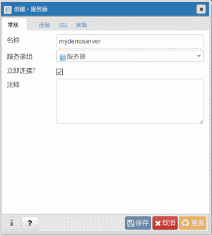
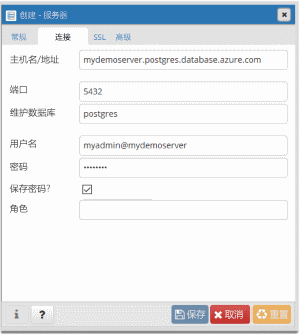
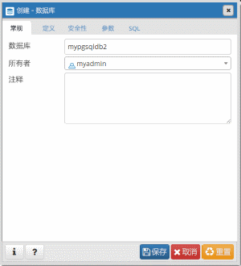

# <a name="quickstart-create-an-azure-database-for-postgresql-using-the-azure-cli"></a>快速入门：使用 Azure CLI 创建 Azure Database for PostgreSQL
用于 PostgreSQL 的 Azure 数据库是一种托管服务，可用于在云中运行、管理和缩放具有高可用性的 PostgreSQL 数据库。 Azure CLI 用于从命令行或脚本创建和管理 Azure 资源。 本快速入门指南介绍了如何使用 Azure CLI 在 [Azure 资源组](https://docs.microsoft.com/azure/azure-resource-manager/resource-group-overview)中创建 Azure Database for PostgreSQL 服务器。

如果你还没有 Azure 订阅，可以在开始前创建一个[免费](https://azure.microsoft.com/free/)帐户。

[!INCLUDE [cloud-shell-try-it](../../includes/cloud-shell-try-it.md)]

如果选择在本地安装并使用 CLI，本文要求运行 Azure CLI 2.0 版或更高版本。 若要查看安装的版本，请运行 `az --version` 命令。 如果需要进行安装或升级，请参阅[安装 Azure CLI 2.0]( /cli/azure/install-azure-cli)。 

如果在本地运行 CLI，需要使用 [az login](/cli/azure/authenticate-azure-cli?view=interactive-log-in) 命令登录帐户。 记下与订阅名称相对应的命令输出中的 **id** 属性。
```azurecli-interactive
az login
```

如果有多个订阅，请选择应计费的资源所在的相应订阅。 使用 [az account set](/cli/azure/account#az_account_set) 命令选择帐户下的特定订阅 ID。 用订阅的 **az login** 输出中的 **id** 属性代替订阅 id 占位符。
```azurecli-interactive
az account set --subscription <subscription id>
```

## <a name="create-a-resource-group"></a>创建资源组

使用 [az group create](/cli/azure/group#az_group_create) 命令创建 [Azure 资源组](../azure-resource-manager/resource-group-overview.md)。 资源组是在其中以组的形式部署和管理 Azure 资源的逻辑容器。 应提供唯一名称。 以下示例在 `westus` 位置创建名为 `myresourcegroup` 的资源组。
```azurecli-interactive
az group create --name myresourcegroup --location westus
```
## <a name="add-the-extension"></a>添加扩展
使用以下命令添加更新的 Azure Database for PostgreSQL 管理扩展：
```azurecli-interactive
az extension add --name rdbms
``` 
## <a name="create-an-azure-database-for-postgresql-server"></a>创建 Azure Database for PostgreSQL 服务器

使用 [az postgres server create](/cli/azure/postgres/server#az_postgres_server_create) 命令创建 [Azure Database for PostgreSQL 服务器](overview.md)。 服务器包含作为组进行管理的一组数据库。 

下面的示例使用服务器管理员登录名 `myadmin` 在资源组 `myresourcegroup` 中创建位于“美国西部”区域的名为 `mydemoserver` 的服务器。 这是**第 4 代****常规用途**服务器，带有 2 个 **vCore**。 服务器的名称映射到 DNS 名称，因此需要在 Azure 中全局唯一。 用自己的值替换 `<server_admin_password>`。
```azurecli-interactive
az postgres server create --resource-group myresourcegroup --name mydemoserver  --location westus --admin-user myadmin --admin-password <server_admin_password> --sku-name GP_Gen4_2 --version 9.6
```

> [!IMPORTANT]
> 此处指定的服务器管理员登录名和密码是以后在本快速入门中登录到服务器及其数据库所必需的。 请牢记或记录此信息，以后会使用到它。

默认情况下，在服务器下创建 postgres 数据库。 [postgres](https://www.postgresql.org/docs/9.6/static/app-initdb.html) 是供用户、实用工具和第三方应用程序使用的默认数据库。 


## <a name="configure-a-server-level-firewall-rule"></a>配置服务器级防火墙规则

使用 [az postgres server firewall-rule create](/cli/azure/postgres/server/firewall-rule#az_postgres_server_firewall_rule_create) 命令创建 Azure PostgreSQL 服务器级防火墙规则。 服务器级防火墙规则允许外部应用程序（如 [psql](https://www.postgresql.org/docs/9.2/static/app-psql.html) 或 [PgAdmin](https://www.pgadmin.org/)）通过 Azure PostgreSQL 服务防火墙连接到服务器。 

可以设置覆盖某个 IP 范围的防火墙规则，以便通过网络进行连接。 下面的示例使用 [az postgres server firewall-rule create](/cli/azure/postgres/server/firewall-rule#az_postgres_server_firewall_rule_create) 为某个 IP 地址范围创建防火墙规则 `AllowAllIps`。 若要开放所有 IP 地址，请使用 0.0.0.0 作为起始 IP 地址，使用 255.255.255.255 作为结束地址。
```azurecli-interactive
az postgres server firewall-rule create --resource-group myresourcegroup --server mydemoserver --name AllowAllIps --start-ip-address 0.0.0.0 --end-ip-address 255.255.255.255
```

> [!NOTE]
> Azure PostgreSQL 服务器通过端口 5432 进行通信。 从企业网络内部进行连接时，该网络的防火墙可能不允许经端口 5432 的出站流量。 让 IT 部门打开端口 5432，以便连接到 Azure SQL 数据库服务器。

## <a name="get-the-connection-information"></a>获取连接信息

若要连接到服务器，需要提供主机信息和访问凭据。
```azurecli-interactive
az postgres server show --resource-group myresourcegroup --name mydemoserver
```

结果采用 JSON 格式。 记下 administratorLogin 和 fullyQualifiedDomainName。
```json
{
  "administratorLogin": "myadmin",
  "earliestRestoreDate": null,
  "fullyQualifiedDomainName": "mydemoserver.postgres.database.azure.com",
  "id": "/subscriptions/00000000-0000-0000-0000-000000000000/resourceGroups/myresourcegroup/providers/Microsoft.DBforPostgreSQL/servers/mydemoserver",
  "location": "westus",
  "name": "mydemoserver",
  "resourceGroup": "myresourcegroup",
  "sku": {
    "capacity": 2,
    "family": "Gen4",
    "name": "GP_Gen4_2",
    "size": null,
    "tier": "GeneralPurpose"
  },
  "sslEnforcement": "Enabled",
  "storageProfile": {
    "backupRetentionDays": 7,
    "geoRedundantBackup": "Disabled",
    "storageMb": 5120
  },
  "tags": null,
  "type": "Microsoft.DBforPostgreSQL/servers",
  "userVisibleState": "Ready",
  "version": "9.6"
}
```

## <a name="connect-to-postgresql-database-using-psql"></a>使用 psql 连接到 PostgreSQL 数据库

如果客户端计算机已安装 PostgreSQL，则可以使用 [psql](https://www.postgresql.org/docs/9.6/static/app-psql.html) 的本地实例连接到 Azure PostgreSQL 服务器。 现在使用 psql 命令行实用工具连接到 Azure PostgreSQL 服务器。

1. 运行以下 psql 命令连接到 Azure Database for PostgreSQL 服务器
```azurecli-interactive
psql --host=<servername> --port=<port> --username=<user@servername> --dbname=<dbname>
```

  例如，以下命令使用访问凭据连接到 PostgreSQL 服务器 mydemoserver.postgres.database.azure.com 上名为“postgres”的默认数据库。 提示输入密码时，输入之前选择的 `<server_admin_password>`。
  
  ```azurecli-interactive
psql --host=mydemoserver.postgres.database.azure.com --port=5432 --username=myadmin@mydemoserver --dbname=postgres
```

2.  连接到服务器后，在出现提示时创建空数据库。
```sql
CREATE DATABASE mypgsqldb;
```

3.  出现提示时，请执行以下命令，将连接切换到新建的数据库 mypgsqldb：
```sql
\c mypgsqldb
```

## <a name="connect-to-the-postgresql-server-using-pgadmin"></a>使用 pgAdmin 连接到 PostgreSQL 服务器

pgAdmin 是用于 PostgreSQL 的开源工具。 可以从 [pgAdmin 网站](http://www.pgadmin.org/)安装 pgAdmin。 你所使用的 pgAdmin 版本可能不同于本快速入门中使用的版本。 如果需要更多指南，请阅读 pgAdmin 文档。

1. 在客户端计算机上打开 pgAdmin 应用程序。

2. 从工具栏转到“对象”，将鼠标指针悬停在“创建”上，然后选择“服务器”。

3. 在“创建 - 服务器”对话框中的“常规”选项卡上，为服务器输入唯一的友好名称，例如 **mydemoserver**。

   

4. 在“创建 - 服务器”对话框中的“连接”选项卡上，填写设置表。

   

    pgAdmin 参数 |值|说明
    ---|---|---
    主机名/地址 | 服务器名称 | 此前在创建用于 PostgreSQL 的 Azure 数据库服务器时使用过的服务器名称值。 示例服务器为 mydemoserver.postgres.database.azure.com。请使用完全限定的域名 (**\*.postgres.database.azure.com**)，如示例中所示。 如果不记得服务器名称，请按上一部分的步骤操作，以便获取连接信息。 
    端口 | 5432 | 连接到用于 PostgreSQL 的 Azure 数据库服务器时使用的端口。 
    维护数据库 | postgres | 系统生成的默认数据库名称。
    用户名 | 服务器管理员登录名 | 此前在创建用于 PostgreSQL 的 Azure 数据库服务器时提供的服务器管理员登录用户名。 如果不记得用户名，请按上一部分的步骤操作，以便获取连接信息。 格式为 username@servername。
    密码 | 管理员密码 | 之前在此快速入门中创建服务器时选择的密码。
    角色 | 留空 | 此时无需提供角色名称。 此字段留空。
    SSL 模式 | *必需* | 可以在 pgAdmin 的 SSL 选项卡中设置 SSL 模式。默认情况下，所有 Azure Database for PostgreSQL 服务器在创建时都会启用“SSL 强制实施”。 若要关闭“SSL 强制实施”，请参阅 [SSL 强制实施](./concepts-ssl-connection-security.md)。
    
5. 选择“保存”。

6. 在左侧的“浏览器”窗格中，展开“服务器”节点。 选择服务器，例如 **mydemoserver**。 单击该服务器与它建立连接。

7. 展开服务器节点，然后展开其下的“数据库”。 此列表应包括现有 *postgres* 数据库和已创建的任何其他数据库。 可以使用 Azure Database for PostgreSQL 为每个服务器创建多个数据库。

8. 右键单击“数据库”，选择“创建”菜单，并选择“数据库”。

9. 在“数据库”字段中键入所选的数据库名称，例如“mypgsqldb2”。

10. 从列表框中选择数据库的“所有者”。 选择服务器管理员登录名，例如“my admin”。

   

11. 选择“保存”创建新的空白数据库。

12. 在“浏览器”窗格中，可以在服务器名称下的数据库列表中看到创建的数据库。


## <a name="clean-up-resources"></a>清理资源

可以通过删除 [Azure 资源组](../azure-resource-manager/resource-group-overview.md)来清除在此快速入门中创建的所有资源。

> [!TIP]
> 本教程系列中的其他快速入门教程是在本文的基础上制作的。 如果打算继续使用后续的快速入门，请不要清除在本快速入门中创建的资源。 如果不打算继续，请在 Azure CLI 中执行以下步骤，删除通过此快速入门创建的所有资源。

```azurecli-interactive
az group delete --name myresourcegroup
```

若要删除新创建的服务器，可运行 [az postgres server delete](/cli/azure/postgres/server#az_postgres_server_delete) 命令。
```azurecli-interactive
az postgres server delete --resource-group myresourcegroup --name mydemoserver
```

## <a name="next-steps"></a>后续步骤
> [!div class="nextstepaction"]
> [使用导出和导入功能迁移数据库](./howto-migrate-using-export-and-import.md)

