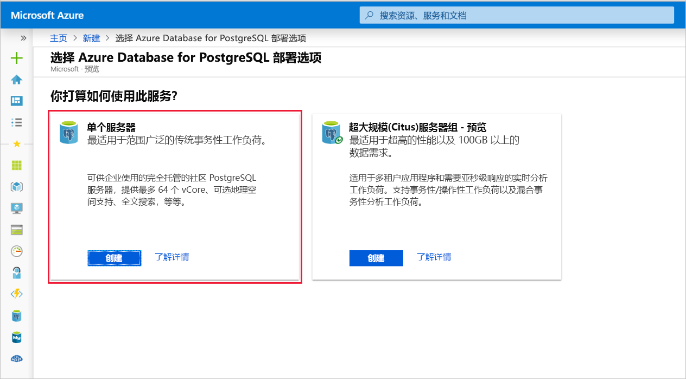
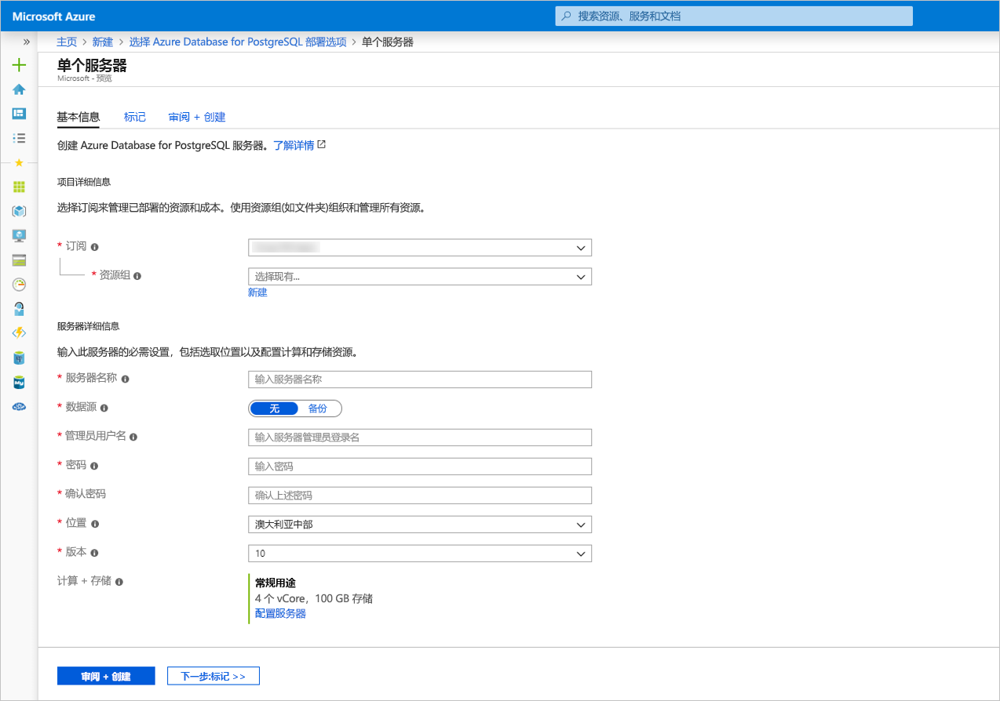

# <a name="quickstart-create-an-azure-database-for-postgresql-server-in-the-azure-portal"></a>快速入门：在 Azure 门户中创建用于 PostgreSQL 的 Azure 数据库服务器

用于 PostgreSQL 的 Azure 数据库是一种托管服务，可用于在云中运行、管理和缩放具有高可用性的 PostgreSQL 数据库。 本快速入门介绍如何使用 Azure 门户在大约五分钟内创建 Azure Database for PostgreSQL 服务器。

如果还没有 Azure 订阅，可以在开始前创建一个[免费 Azure 帐户](https://azure.microsoft.com/free/)。

## <a name="sign-in-to-the-azure-portal"></a>登录到 Azure 门户
打开 Web 浏览器并转到[门户](https://portal.azure.com/)。 输入登录到门户所需的凭据。 默认视图是服务仪表板。

## <a name="create-an-azure-database-for-postgresql-server"></a>创建 Azure Database for PostgreSQL 服务器

创建的 Azure Database for PostgreSQL 服务器中包含一组已配置的[计算和存储资源](./concepts-pricing-tiers.md)。 将在 [Azure 资源组](../azure-resource-manager/resource-group-overview.md)中创建服务器。

若要创建用于 PostgreSQL 的 Azure 数据库服务器，请执行以下步骤：
1. 选择门户左上角的“创建资源”按钮 (+)  。

2. 选择“数据库”   >   “用于 PostgreSQL 的 Azure 数据库”。

    

3. 选择“单个服务器”部署选项  。

   

4. 填写“基本”表单，其中包含以下信息  ：

    

    设置|建议的值|说明
    ---|---|---
    订阅|订阅名称|要用于服务器的 Azure 订阅。 如果有多个订阅，请选择要计费的资源所在的订阅。
    资源组| myresourcegroup| 新的资源组名称，或订阅中的现有资源组。
    服务器名称 |*mydemoserver*|用于标识用于 PostgreSQL 的 Azure 数据库服务器的唯一名称。 域名 *postgres.database.azure.com* 附加到提供的服务器名称。 服务器名称只能包含小写字母、数字和连字符 (-) 字符。 该名称必须至少包含 3 到 63 个字符。
    数据源 | 无  | 选择“无”，从头开始创建新的服务器  。 （如果是从现有 Azure Database for PostgreSQL 服务器的异地备份创建服务器，则会选择“备份”  ）。
    管理员用户名 |*myadmin*| 连接到服务器时使用的自己的登录帐户。 管理员登录名不能是 **azure_superuser**、**azure_pg_admin**、**admin**、**administrator**、**root**、**guest** 或 **public**， 不能以 **pg_** 开头。
    密码 |你的密码| 服务器管理员帐户的新密码。 该密码必须包含 8 到 128 个字符。 密码必须包含以下三个类别的字符：英文大写字母、英文小写字母、数字 (0 到 9)和非字母数字字符（!, $, #, % 等）。
    位置|离用户最近的区域| 最靠近用户的位置。
    版本|最新主版本| 除非另有特定的要求，否则为最新 PostgreSQL 主版本。
    计算 + 存储 | **常规用途**、**第 5 代**、**2 个 vCore**、**5 GB**、**7 天**、**异地冗余** | 新服务器的计算、存储和备份配置。 选择“配置服务器”  。 接下来，选择“常规用途”  选项卡。“第 5 代”、“4 个 vCore”、“100 GB”和“7 天”分别是“计算代系”、“vCore”、“存储”和“备份保持期”的默认值         。 可以按原样保留这些滑块，也可以对其进行调整。 若要在异地冗余存储中启用服务器备份，请从“备份冗余选项”  中选择“异地冗余”  。 若要保存此定价层选择，请选择“确定”  。 下一个屏幕截图捕获了这些选择。

   > [!NOTE]
   > 如果轻量级计算和 I/O 足以满足工作负荷要求，请考虑使用“基本”定价层。 请注意，在“基本”定价层中创建的服务器以后不能扩展到“常规用途”或“内存优化”定价层。 有关详细信息，请参阅[定价页](https://azure.microsoft.com/pricing/details/postgresql/)。
   > 

    

5. 选择“查看 + 创建”，查看所选内容  。 选择“创建”  以预配服务器。 此操作可能需要几分钟的时间。

6. 在工具栏上选择“通知”图标（铃铛）以监视部署过程。  完成部署后，可以选择“固定到仪表板”  ，以便在 Azure 门户仪表板上为此服务器创建磁贴作为到此服务器“概述”  页的快捷方式。 选择“转到资源”  可打开此服务器的“概述”  页。

    
   
   默认情况下，会在服务器下创建 **postgres** 数据库。 [postgres](https://www.postgresql.org/docs/9.6/static/app-initdb.html) 是供用户、实用工具和第三方应用程序使用的默认数据库。 （另一个默认数据库是 **azure_maintenance**， 其功能是将托管服务进程与用户操作分开。 你不能访问此数据库。）

## <a name="configure-a-server-level-firewall-rule"></a>配置服务器级防火墙规则

用于 PostgreSQL 的 Azure 数据库会在服务器级别创建防火墙。 除非创建了规则来为特定的 IP 地址打开防火墙，否则此防火墙会阻止外部应用程序和工具连接到服务器和服务器上的任何数据库。 

1. 部署完成后，找到服务器。 可以根据需要进行搜索。 例如，在左侧菜单中选择“所有资源”。  键入服务器名称（例如 **mydemoserver**）来搜索新建的服务器。 从搜索结果列表中选择服务器名称。 服务器的“概述”  页面随即打开，其中提供了用于进一步配置的选项。
 
    

2. 在服务器页中，选择“连接安全性”  。

3. 在“防火墙规则”下的“规则名称”列中选择空白文本框，开始创建防火墙规则。   

   在文本框中填写将访问服务器的客户端的名称，以及起始和结束 IP 范围。 如果它是单个 IP，请为起始 IP 和结束 IP 使用相同的值。

   
     

4. 在“连接安全性”页的上部工具栏中，选择“保存”。   等到指示连接安全性更新已成功完成的通知出现后，再继续操作。

    > [!NOTE]
    > 连接到 Azure Database for PostgreSQL 服务器时，通过端口 5432 进行通信。 如果尝试从企业网络内部进行连接，则该网络的防火墙可能不允许经端口 5432 的出站流量。 如果是这样，则无法连接到服务器，除非 IT 部门打开了端口 5432。
    >

## <a name="get-the-connection-information"></a>获取连接信息

创建用于 PostgreSQL 的 Azure 数据库服务器时，会创建名为 **postgres** 的默认数据库。 若要连接到数据库服务器，需要完整的服务器名称和管理员登录凭据。 此前可能已在本快速入门文章中记下这些值。 如果没有记下这些值，可以在门户的服务器“概览”页中轻松找到服务器名称和登录信息。 

打开服务器的“概览”  页。 记下“服务器名称”  和“服务器管理员登录名”  。 将光标悬停在每个字段，然后复制符号就会显示在文本右侧。 根据需要选择复制符号即可复制这些值。

 

## <a name="connect-to-the-postgresql-database-using-psql"></a>使用 psql 连接到 PostgreSQL 数据库

可以通过多个应用程序连接到 Azure Database for PostgreSQL 服务器。 如果客户端计算机已安装 PostgreSQL，则可以使用 [psql](https://www.postgresql.org/docs/current/static/app-psql.html) 的本地实例连接到 Azure PostgreSQL 服务器。 现在使用 psql 命令行实用工具连接到 Azure PostgreSQL 服务器。

1. 运行以下 psql 命令连接到 Azure Database for PostgreSQL 服务器
   ```bash
   psql --host=<servername> --port=<port> --username=<user@servername> --dbname=<dbname>
   ```

   例如，以下命令使用访问凭据连接到 PostgreSQL 服务器 mydemoserver.postgres.database.azure.com  上名为“postgres”  的默认数据库。 提示输入密码时，输入之前选择的 `<server_admin_password>`。
  
   ```bash
   psql --host=mydemoserver.postgres.database.azure.com --port=5432 --username=myadmin@mydemoserver --dbname=postgres
   ```

   > [!TIP]
   > 如果更喜欢使用 URL 路径连接到 Postgres，则 URL 会使用 `%40` 对用户名中的 @ 符号进行编码。 例如，psql 的连接字符串将是： 
   > ```
   > psql postgresql://myadmin%40mydemoserver@mydemoserver.postgres.database.azure.com:5432/postgres
   > ```

   连接后，psql 实用工具会显示 postgres 提示符，要求在其中键入 sql 命令。 在初始连接输出中可能会显示警告，因为所使用的 psql 版本可能不同于 Azure Database for PostgreSQL 服务器版本。 

   psql 输出示例：
   ```bash
   psql (9.5.7, server 9.6.2)
   WARNING: psql major version 9.5, server major version 9.6.
    Some psql features might not work.
    SSL connection (protocol: TLSv1.2, cipher: ECDHE-RSA-AES256-SHA384, bits: 256, compression: off)
   Type "help" for help.

   postgres=> 
   ```

   > [!TIP]
   > 如果未将防火墙配置为允许客户端的 IP 地址，则会出现以下错误：
   > 
   > psql: 致命错误: 主机 `<IP address>`、用户 "myadmin"、数据库 "postgres" 没有 pg_hba.conf 条目，SSL 出现致命错误:需要 SSL 连接。 请指定 SSL 选项，然后重试。
   > 
   > 确认在上面的防火墙规则步骤中允许你的客户端 IP。

2. 出现提示时通过键入以下命令来创建名为“mypgsqldb”的空数据库：
    ```bash
    CREATE DATABASE mypgsqldb;
    ```

3. 在提示符下，执行以下命令来将连接切换到新建的数据库 **mypgsqldb**：
    ```bash
    \c mypgsqldb
    ```

4. 键入 `\q`，再按 Enter 键退出 psql。 

已通过 psql 连接到 Azure Database for PostgreSQL 服务器并创建了一个空用户数据库。 请转到下一部分，使用另一常用工具 pgAdmin 进行连接。

## <a name="connect-to-the-postgresql-server-using-pgadmin"></a>使用 pgAdmin 连接到 PostgreSQL 服务器

pgAdmin 是用于 PostgreSQL 的开源工具。 可以从 [pgAdmin 网站](https://www.pgadmin.org/)安装 pgAdmin。 你所使用的 pgAdmin 版本可能不同于本快速入门中使用的版本。 如果需要更多指南，请阅读 pgAdmin 文档。

1. 在客户端计算机上打开 pgAdmin 应用程序。

2. 从工具栏转到“对象”  ，将鼠标指针悬停在“创建”  上，然后选择“服务器”  。

3. 在“创建 - 服务器”对话框中的“常规”选项卡上，为服务器输入唯一的友好名称，例如 **mydemoserver**。  

    

4. 在“创建 - 服务器”对话框中的“连接”选项卡上，填写设置表。  

   

    pgAdmin 参数 |值|说明
    ---|---|---
    主机名/地址 | 服务器名称 | 此前在创建用于 PostgreSQL 的 Azure 数据库服务器时使用过的服务器名称值。 示例服务器为 mydemoserver.postgres.database.azure.com。  请使用完全限定的域名 ( **\*.postgres.database.azure.com**)，如示例中所示。 如果不记得服务器名称，请按上一部分的步骤操作，以便获取连接信息。 
    端口 | 5432 | 连接到用于 PostgreSQL 的 Azure 数据库服务器时使用的端口。 
    维护数据库 |  postgres | 系统生成的默认数据库名称。
    用户名 | 服务器管理员登录名 | 此前在创建用于 PostgreSQL 的 Azure 数据库服务器时提供的服务器管理员登录用户名。 如果不记得用户名，请按上一部分的步骤操作，以便获取连接信息。 格式为 username\@servername  。
    密码 | 管理员密码 | 之前在此快速入门中创建服务器时选择的密码。
    角色 | 留空 | 此时无需提供角色名称。 此字段留空。
    SSL 模式 | *必需* | 可以在 pgAdmin 的 SSL 选项卡中设置 SSL 模式。默认情况下，所有 Azure Database for PostgreSQL 服务器在创建时都会启用“SSL 强制实施”。 若要关闭“SSL 强制实施”，请参阅 [SSL 强制实施](./concepts-ssl-connection-security.md)。
    
5. 选择“保存”。 

6. 在左侧的“浏览器”窗格中，展开“服务器”节点   。 选择服务器，例如 **mydemoserver**。 单击该服务器与它建立连接。

7. 展开服务器节点，然后展开其下的“数据库”。  此列表应包括现有 *postgres* 数据库和已创建的任何其他数据库。 可以使用 Azure Database for PostgreSQL 为每个服务器创建多个数据库。

8. 右键单击“数据库”，选择“创建”菜单，并选择“数据库”。   

9. 在“数据库”字段中键入所选的数据库名称，例如“mypgsqldb2”。  

10. 从列表框中选择数据库的“所有者”。  选择服务器管理员登录名，例如“my admin”  。

    

11. 选择“保存”创建新的空白数据库。 

12. 在“浏览器”窗格中，可以在服务器名称下的数据库列表中看到创建的数据库。 


## <a name="clean-up-resources"></a>清理资源
可以通过两种方法之一清理在快速入门中创建的资源。 可以删除 [Azure 资源组](../azure-resource-manager/resource-group-overview.md)，其中包括资源组中的所有资源。 若要保持其他资源原封不动，请只删除服务器资源。

> [!TIP]
> 本教程系列中的其他快速入门教程是在本文的基础上制作的。 如果打算继续使用快速入门，请不要清除在本快速入门中创建的资源。 如果不打算继续，请在门户中执行以下步骤来删除本快速入门创建的资源。

若要删除包括新建服务器在内的整个资源组，请执行以下操作：
1. 在门户中找到自己的资源组。 在左侧菜单中，选择“资源组”  。 然后选择资源组的名称，例如 myresourcegroup  。

2. 在资源组页上，选择“删除”  。 在文本框中键入确认删除的资源组的名称，例如 myresourcegroup  。 选择“删除”。 

仅删除新建的服务器：
1. 在门户中找到自己的服务器（如果尚未将其打开）。 在左侧菜单中选择“所有资源”。  然后搜索所创建的服务器。

2. 在“概览”  页上，选择“删除”  。

    

3. 确认要删除的服务器名称并查看其下受影响的数据库。 在文本框中键入服务器名称，例如 mydemoserver  。 选择“删除”。 

## <a name="next-steps"></a>后续步骤
> [!div class="nextstepaction"]
> [使用导出和导入功能迁移数据库](./howto-migrate-using-export-and-import.md)
