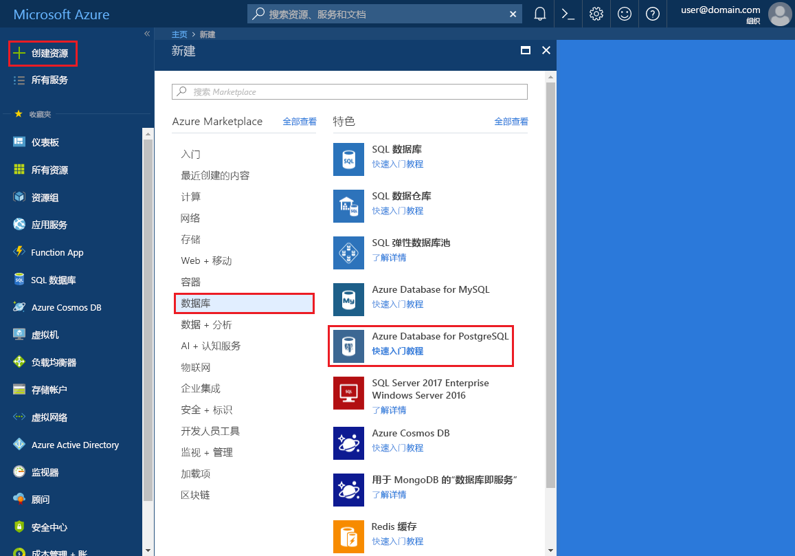
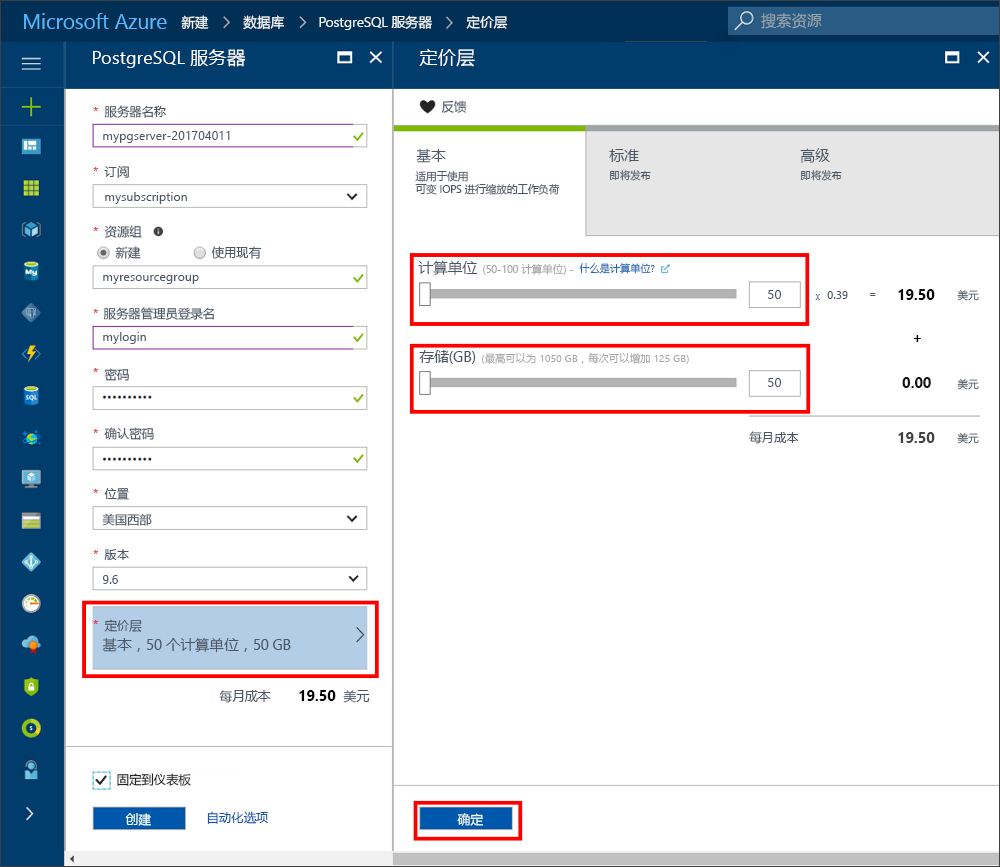
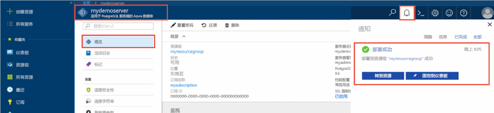
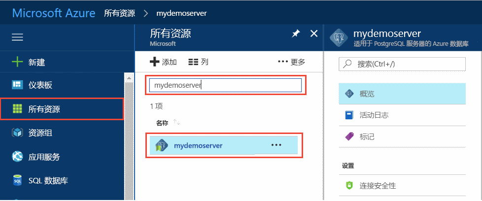
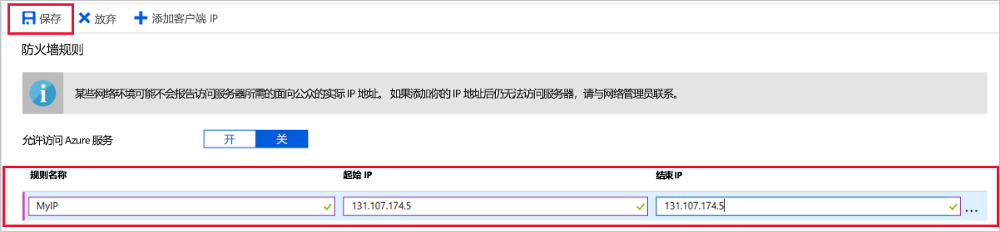
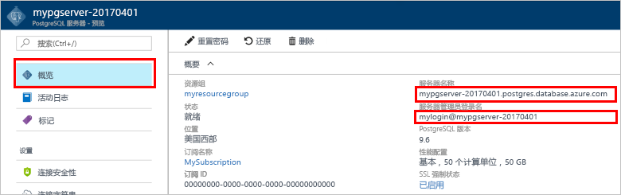
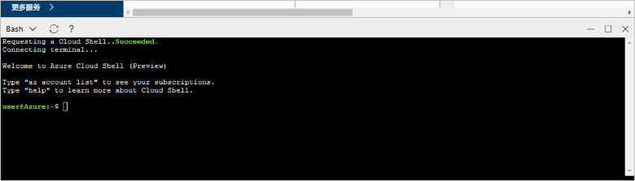
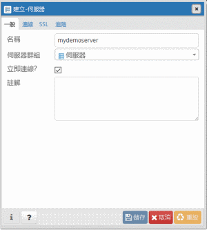
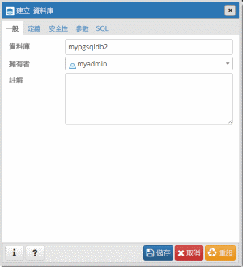
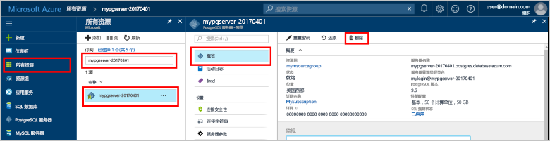

# 可以在 Azure 门户中创建用于 PostgreSQL 的 Azure 数据库
<a id="create-an-azure-database-for-postgresql-in-the-azure-portal" class="xliff"></a>

用于 PostgreSQL 的 Azure 数据库是一种托管服务，可用于在云中运行、管理和缩放具有高可用性的 PostgreSQL 数据库。 此快速入门指南介绍了如何使用 Azure 门户创建用于 PostgreSQL 的 Azure 数据库。

如果你还没有 Azure 订阅，可以在开始前创建一个[免费](https://azure.microsoft.com/free/)帐户。

## 登录到 Azure 门户
<a id="log-in-to-the-azure-portal" class="xliff"></a>

登录到 [Azure 门户](https://portal.azure.com)。

## 创建用于 PostgreSQL 的 Azure 数据库
<a id="create-an-azure-database-for-postgresql" class="xliff"></a>

创建的 Azure Database for PostgreSQL 服务器中包含一组已定义的[计算和存储](./concepts-compute-unit-and-storage.md)资源。 将在 [Azure 资源组](../azure-resource-manager/resource-group-overview.md)中创建服务器。

可以按照以下步骤创建用于 PostgreSQL 的 Azure 数据库：
1.  单击 Azure 门户左上角的“新建”按钮。
2.  从“新建”页中选择“数据库”，然后从“数据库”页中选择“用于 PostgreSQL 的 Azure 数据库”。
 

3.  如上图所示，在新服务器详细信息窗体中填写以下信息：
    - 服务器名称：mypgserver-20170401（服务器的名称会映射到 DNS 名称，因此前者需为全局唯一） 
    - 订阅：如果有多个订阅，请选择资源所在的相应订阅或对资源进行计费的订阅。
    - 资源组：**myresourcegroup**
    - 你选择的服务器管理员登录名和密码
    - 位置
    - PostgreSQL 版本

  > [!IMPORTANT]
  > 在此处指定的服务器管理员登录名和密码是你以后在本快速入门中登录到服务器及其数据库所必需的。 请牢记或记录此信息，以后会使用到它。

4.  单击“定价层”为新数据库指定服务层和性能级别。 对于此快速入门，选择“基本”层、“50 个计算单元”，以及“50 GB”存储空间。
 
5.  单击“确定” 。
6.  单击“创建”以预配服务器。 预配需要数分钟。

  > [!TIP]
  > 选中“固定到仪表板”选项，轻松跟踪部署。

7.  在工具栏上，单击“通知”可监视部署过程。
 
   
  默认情况下，会在服务器下创建 **postgres** 数据库。 [postgres](https://www.postgresql.org/docs/9.6/static/app-initdb.html) 是供用户、实用工具和第三方应用程序使用的默认数据库。 

## 配置服务器级防火墙规则
<a id="configure-a-server-level-firewall-rule" class="xliff"></a>

“用于 PostgreSQL 的 Azure 数据库”服务会在服务器级别创建防火墙。 除非创建了防火墙规则来为特定的 IP 地址打开防火墙，否则此防火墙会阻止外部应用程序和工具连接到服务器和服务器上的任何数据库。 

1.  部署完成后，请单击左侧菜单中的“所有资源”，并键入名称 **mypgserver-20170401** 来搜索新创建的服务器。 单击搜索结果中列出的服务器名称。 服务器的“概述”页面随即打开，其中提供了用于进一步配置的选项。
 
 

2.  在服务器边栏选项卡中，选择“连接安全性”。 
3.  单击“规则名称”下的文本框，添加新的防火墙规则，以将连接的 IP 范围加入白名单。 对于此快速入门，我们将允许所有 IP，方法是键入“规则名称 = AllowAllIps”，“起始 IP = 0.0.0.0”，“结束 IP = 255.255.255.255”，然后单击“保存”。 可以设置涵盖某个 IP 范围的防火墙规则，以便通过网络进行连接。

 

4.  单击“保存”，然后单击“X”以关闭“连接安全性”页面。

  > [!NOTE]
  > Azure PostgreSQL 服务器通过端口 5432 进行通信。 如果尝试从企业网络内部进行连接，则该网络的防火墙可能不允许经端口 5432 的出站流量。 如果是这样，则无法连接到 Azure SQL 数据库服务器，除非 IT 部门打开了端口 5432。
  >

## 获取连接信息
<a id="get-the-connection-information" class="xliff"></a>

创建“用于 PostgreSQL 的 Azure 数据库”服务器时，还会创建默认的 **postgres** 数据库。 若要连接到数据库服务器，需要提供主机信息和访问凭据。

1. 在 Azure 门户中的左侧菜单中，单击“所有资源”，然后搜索刚创建的服务器 **mypgserver-20170401**。

  

2. 单击服务器名称 **mypgserver-20170401**。
3. 选择服务器的“概述”页面。 记下“服务器名称”和“服务器管理员登录名”。

 

## 在 Cloud Shell 中使用 psql 连接到 PostgreSQL 数据库
<a id="connect-to-postgresql-database-using-psql-in-cloud-shell" class="xliff"></a>

现在，使用 psql 命令行实用工具连接到“用于 PostgreSQL 的 Azure 数据库”服务器。 
1. 通过顶部导航窗格中的终端图标启动 Azure Cloud Shell。

   

2. Azure Cloud Shell 将在浏览器中打开，并允许键入 bash 命令。

   

3. 在 Cloud Shell 提示符下键入 psql 命令行，连接到 Azure Database for PostgreSQL 服务器。 借助 [psql](https://www.postgresql.org/docs/9.6/static/app-psql.html) 实用工具可以使用以下格式连接到用于 PostgreSQL 的 Azure 数据库：
   ```bash
   psql --host=<myserver> --port=<port> --username=<server admin login> --dbname=<database name>
   ```

   例如，以下命令使用访问凭据连接到 PostgreSQL 服务器 mypgserver-20170401.postgres.database.azure.com 上名为“postgres”的默认数据库。 连接时始终使用端口 5432。 在出现提示时输入服务器管理员密码。 请在命令中的 -- 开关之间使用空格（如下所示），但不要在等号和参数值之间使用空格。

   ```bash
   psql --host=mypgserver-20170401.postgres.database.azure.com --port=5432 --username=mylogin@mypgserver-20170401 --dbname=postgres
   ```
4.  连接到服务器后，在出现提示时创建空数据库。
```bash
CREATE DATABASE mypgsqldb;
```

5.  在提示符下，执行以下命令来将连接切换到新创建的数据库 **mypgsqldb**。
```bash
\c mypgsqldb
```

## 使用 pgAdmin 连接到 PostgreSQL 数据库
<a id="connect-to-postgresql-database-using-pgadmin" class="xliff"></a>

使用 GUI 工具 _pgAdmin_ 连接到 Azure PostgreSQL 服务器
1.  在客户端计算机上启动 _pgAdmin_ 应用程序。 可以从 http://www.pgadmin.org/ 安装 _pgAdmin_。
2.  从“快速链接”菜单中选择“添加新服务器”。
3.  在“创建 - 服务器”对话框的“常规”选项卡中，为服务器输入唯一的友好名称，例如 **Azure PostgreSQL Server**。

4.  在“创建 - 服务器”对话框的“连接”选项卡中，使用下图中指定的设置并单击“保存”。
   
    - **主机名/地址**：mypgserver-20170401.postgres.database.azure.com 
        - 完全限定的服务器名称。
    - **端口：**5432
        - 此数据库服务器使用的端口号是 5432。
    - **维护数据库**：postgres 
        - 系统生成的默认数据库名称。
    - **用户名：**mylogin@mypgserver-20170401 
        - 此快速入门中之前获取的服务器管理员登录名 (user@mypgserver)。
    - **密码**：你之前在此快速入门中创建服务器时选择的密码。
    - **SSL 模式**：必需
        - 默认情况下，所有 Azure PostgreSQL 服务器在创建时都会启用 SSL 强制。 若要关闭 SSL 强制，请参阅[强制 SSL](./concepts-ssl-connection-security.md) 中的详细信息。
5.  单击“保存”。
6.  在浏览器左窗格中，展开“服务器组”。 选择你的服务器：**Azure PostgreSQL 服务器**。
7.  选择已连接到的**服务器**，然后选择其下的“数据库”。 
8.  右键单击“数据库”以创建数据库。
9.  使用 **mypgsqldb** 作为数据库名称，并选择服务器管理员登录名 **mylogin** 作为其所有者。
10. 单击“保存”创建空数据库。
11. 在“浏览器”中，展开“服务器”。 展开你创建的服务器，此时会在其下看到数据库 **mypgsqldb**。
 


## 清理资源
<a id="clean-up-resources" class="xliff"></a>
可以通过删除 [Azure 资源组](../azure-resource-manager/resource-group-overview.md)来清除你在此快速入门中创建的所有资源。

> [!TIP]
> 本教程系列中的其他快速入门教程是在本文的基础上制作的。 如果你打算继续使用后续的快速入门，请不要清除在本快速入门中创建的资源。 如果不打算继续，请在 Azure 门户中执行以下步骤来删除此快速入门创建的所有资源。

1.  在 Azure 门户的左侧菜单中，单击“资源组”，然后单击“myresourcegroup”。
2.  在资源组页上单击“删除”，在文本框中键入 **myresourcegroup**，然后单击“删除”。

如果只想删除新创建的服务器，请执行以下操作：
1.  在 Azure 门户中的左侧菜单中，单击“PostgreSQL 服务器”，然后搜索刚创建的服务器
2.  在“概述”页面上，单击顶部窗格“用于 PostgreSQL 的 Azure 数据库 - 删除服务器”中的“删除”按钮
3.  确认要删除的服务器名称并显示其下受影响的数据库。 在文本框中键入 **mypgserver-20170401**，然后单击“删除”。

## 后续步骤
<a id="next-steps" class="xliff"></a>
> [!div class="nextstepaction"]
> [使用导出和导入功能迁移数据库](./howto-migrate-using-export-and-import.md)

