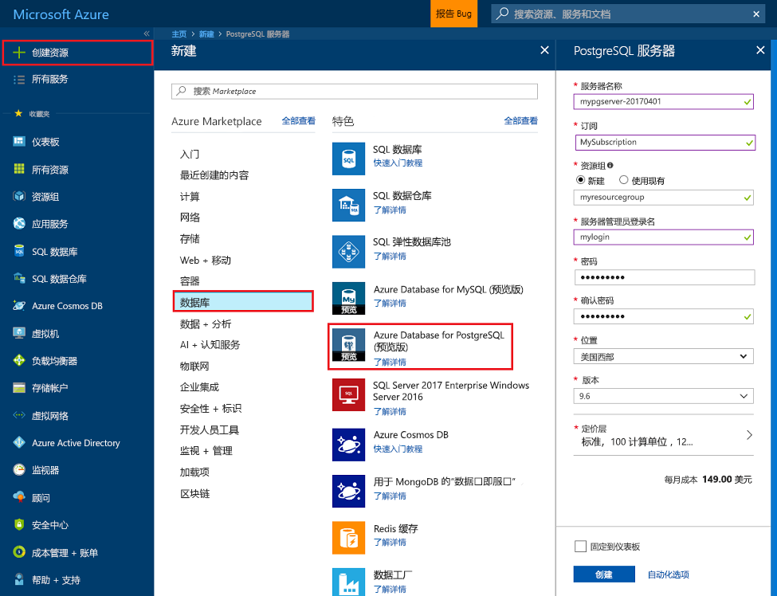
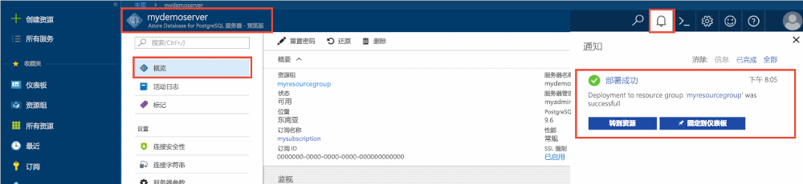
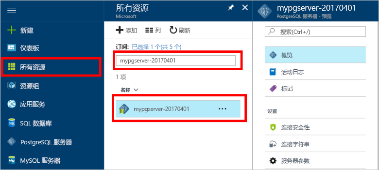
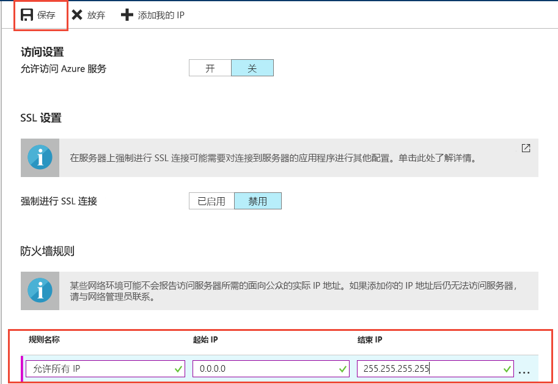
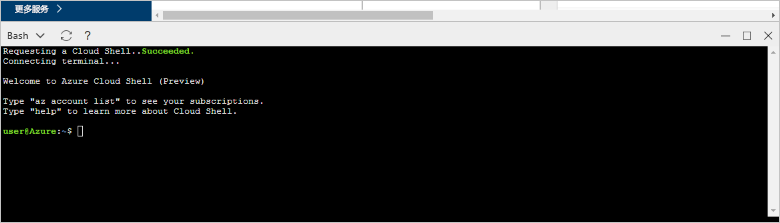

# <a name="design-your-first-azure-database-for-postgresql-using-the-azure-portal"></a>使用 Azure 门户设计第一个 Azure Database for PostgreSQL

Azure Database for PostgreSQL 是一种托管服务，可用于在云中运行、管理和缩放可用性高的 PostgreSQL 数据库。 使用 Azure 门户可以轻松管理服务器和设计数据库。

本教程介绍如何使用 Azure 门户完成以下操作：
> [!div class="checklist"]
> * 创建 Azure Database for PostgreSQL 服务器
> * 配置服务器防火墙
> * 使用 [psql](https://www.postgresql.org/docs/9.6/static/app-psql.html) 实用工具创建数据库
> * 加载示例数据
> * 查询数据
> * 更新数据
> * 还原数据

## <a name="prerequisites"></a>先决条件
如果你还没有 Azure 订阅，可以在开始前创建一个[免费](https://azure.microsoft.com/free/)帐户。

## <a name="log-in-to-the-azure-portal"></a>登录到 Azure 门户
登录到 [Azure 门户](https://portal.azure.com)。

## <a name="create-an-azure-database-for-postgresql"></a>创建用于 PostgreSQL 的 Azure 数据库

创建的 Azure Database for PostgreSQL 服务器中包含一组已定义的[计算和存储](./concepts-compute-unit-and-storage.md)资源。 将在 [Azure 资源组](../azure-resource-manager/resource-group-overview.md)中创建服务器。

按照以下步骤创建 Azure Database for PostgreSQL 服务器：
1.  单击 Azure 门户左上角的“新建”按钮。
2.  从“新建”页中选择“数据库”，并从“数据库”页中选择“用于 PostgreSQL 的 Azure 数据库”。
 

3.  如上图所示，在新服务器详细信息窗体中填写以下信息：
    - 服务器名称：mypgserver-20170401（服务器的名称会映射到 DNS 名称，因此前者需为全局唯一） 
    - 订阅：如果有多个订阅，请选择资源所在的相应订阅或对资源进行计费的订阅。
    - 资源组：**myresourcegroup**
    - 选择的服务器管理员登录名和密码
    - 位置
    - PostgreSQL 版本

  > [!IMPORTANT]
  > 此处指定的服务器管理员登录名和密码是以后在本快速入门中登录到服务器及其数据库所必需的。 请牢记或记录此信息，以后会使用到它。

4.  单击“定价层”为新数据库指定服务层和性能级别。 对于此快速入门，选择“基本”层、“50 个计算单元”，以及“50 GB”存储空间。
 
5.  单击“确定” 。
6.  单击“创建”以预配服务器。 预配需要数分钟。

  > [!TIP]
  > 选中“固定到仪表板”选项，轻松跟踪部署。

7.  在工具栏上，单击“通知”可监视部署过程。
 
   
  默认情况下，会在服务器下创建 **postgres** 数据库。 [postgres](https://www.postgresql.org/docs/9.6/static/app-initdb.html) 是供用户、实用工具和第三方应用程序使用的默认数据库。 

## <a name="configure-a-server-level-firewall-rule"></a>配置服务器级防火墙规则

Azure Database for PostgreSQL 服务在服务器级别使用防火墙。 默认情况下，除非创建了防火墙规则来为特定 IP 地址范围打开防火墙，否则此防火墙会阻止所有外部应用程序和工具连接到服务器和服务器上的任何数据库。 

1.  部署完成后，请单击左侧菜单中的“所有资源”，并键入名称 **mypgserver-20170401** 来搜索新创建的服务器。 单击搜索结果中列出的服务器名称。 服务器的“概述”页面随即打开，其中提供了用于进一步配置的选项。
 
 

2.  在服务器页中，选择“连接安全性”。 
3.  单击“规则名称”下的文本框，添加新的防火墙规则，将连接的 IP 范围加入允许列表。 本教程中允许所有 IP，方法是键入“规则名称 = AllowAllIps”，“起始 IP = 0.0.0.0”，“结束 IP = 255.255.255.255”，并单击“保存”。 可以设置涵盖较小 IP 范围的特定防火墙规则，以便通过网络进行连接。
 
 

4.  单击“保存”，并单击“X”以关闭“连接安全性”页。

  > [!NOTE]
  > Azure PostgreSQL 服务器通过端口 5432 进行通信。 如果尝试从企业网络内部进行连接，则该网络的防火墙可能不允许经端口 5432 的出站流量。 若是如此，则无法连接到 Azure SQL 数据库服务器，除非 IT 部门启用了端口 5432。
  >


## <a name="get-the-connection-information"></a>获取连接信息

创建 Azure Database for PostgreSQL 服务器时，还会创建默认的 postgres 数据库。 若要连接到数据库服务器，需要提供主机信息和访问凭据。

1. 在 Azure 门户中的左侧菜单中，单击“所有资源”，并搜索刚创建的服务器 **mypgserver-20170401**。

  

3. 单击服务器名称 **mypgserver-20170401**。

4. 选择服务器的“概述”页面。 记下“服务器名称”和“服务器管理员登录名”。

 


## <a name="connect-to-postgresql-database-using-psql-in-cloud-shell"></a>在 Cloud Shell 中使用 psql 连接到 PostgreSQL 数据库

现在，使用 [psql](https://www.postgresql.org/docs/9.6/static/app-psql.html) 命令行实用工具连接到 Azure Database for PostgreSQL 服务器。 
1. 通过顶部导航窗格中的终端图标启动 Azure Cloud Shell。

   

2. Azure Cloud Shell 会在浏览器中打开，并允许键入 bash 命令。

   

3. 在 Cloud Shell 提示符下，使用 psql 命令连接到“用于 PostgreSQL 的 Azure 数据库”服务器。 借助 [psql](https://www.postgresql.org/docs/9.6/static/app-psql.html) 实用工具可以使用以下格式连接到用于 PostgreSQL 的 Azure 数据库：
   ```bash
   psql --host=<myserver> --port=<port> --username=<server admin login> --dbname=<database name>
   ```

   例如，以下命令使用访问凭据连接到 PostgreSQL 服务器 mypgserver-20170401.postgres.database.azure.com 上名为“postgres”的默认数据库。 在出现提示时输入服务器管理员密码。

   ```bash
   psql --host=mypgserver-20170401.postgres.database.azure.com --port=5432 --username=mylogin@mypgserver-20170401 --dbname=postgres
   ```

## <a name="create-a-new-database"></a>新建数据库
连接到服务器后，在出现提示时创建空数据库。
```bash
CREATE DATABASE mypgsqldb;
```

出现提示时，请执行以下命令，切换为连接此新建的数据库 mypgsqldb。
```bash
\c mypgsqldb
```
## <a name="create-tables-in-the-database"></a>在数据库中创建表
现已介绍了如何连接 Azure Database for PostgreSQL，接下来你可以完成一些基本任务：

首先，创建表并加载一些数据。 使用此 SQL 代码创建一个跟踪库存信息的表：
```sql
CREATE TABLE inventory (
    id serial PRIMARY KEY, 
    name VARCHAR(50), 
    quantity INTEGER
);
```

现可通过键入以下内容在表列表中查看新创建的表：
```sql
\dt
```

## <a name="load-data-into-the-tables"></a>将数据加载到表
表格创建好后，可向其插入一些数据。 在打开的命令提示窗口中，运行以下查询来插入几行数据。
```sql
INSERT INTO inventory (id, name, quantity) VALUES (1, 'banana', 150); 
INSERT INTO inventory (id, name, quantity) VALUES (2, 'orange', 154);
```

现已将两行示例数据添加到了之前创建的库存表中。

## <a name="query-and-update-the-data-in-the-tables"></a>查询和更新表中的数据
执行以下查询，从库存数据库表中检索信息。 
```sql
SELECT * FROM inventory;
```

还可以更新表中的数据。
```sql
UPDATE inventory SET quantity = 200 WHERE name = 'banana';
```

检索数据时，可以看到更新后的值。
```sql
SELECT * FROM inventory;
```

## <a name="restore-data-to-a-previous-point-in-time"></a>将数据还原到之前的时间点
假设意外删除了此表。 这种情况无法轻易还原。 借助 Azure Database for PostgreSQL，可返回到任意时间点（基本版为最近 7 天内，标准版为最近 35 天内）并将此时间点还原到新的服务器。 可以使用此新服务器恢复已删除的数据。 以下步骤将 **mypgserver-20170401** 服务器还原到添加库存表之前的时间点。

1.  在服务器的 Azure Database for PostgreSQL“概述”页中，单击工具栏上的“还原”。 将打开“还原”页面。
  
2.  使用必需信息填充“还原”窗体：

  
  - 还原点：选择更改服务器前的时间点
  - 目标服务器：提供一个要还原到的新服务器名称
  - 位置：不能选择区域，此区域默认与源服务器相同
  - 定价层：还原服务器时不能更改此值。 此值与源服务器相同。 
3.  单击“确定”，将服务器[还原到删除该表之前的时间点](./howto-restore-server-portal.md)。 将服务器还原到不同的时间点，在指定时间点（前提是在[服务层](./concepts-service-tiers.md)保留时间段内）创建原始服务器的一个备份新服务器。

## <a name="next-steps"></a>后续步骤
本教程介绍如何使用 Azure 门户和其他实用工具完成以下操作：
> [!div class="checklist"]
> * 创建 Azure Database for PostgreSQL 服务器
> * 配置服务器防火墙
> * 使用 [psql](https://www.postgresql.org/docs/9.6/static/app-psql.html) 实用工具创建数据库
> * 加载示例数据
> * 查询数据
> * 更新数据
> * 还原数据

接下来了解如何使用 Azure CLI 执行类似的任务，请查看此教程：[使用 Azure CLI 设计第一个 Azure Database for PostgreSQL](tutorial-design-database-using-azure-cli.md)
