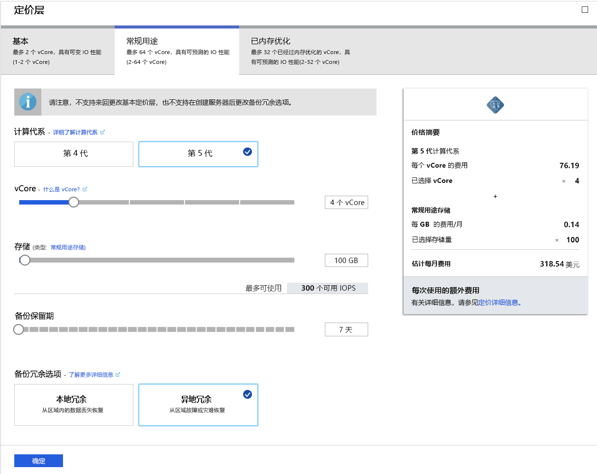

# <a name="tutorial-design-an-azure-database-for-postgresql---single-server-using-the-azure-portal"></a>教程：使用 Azure 门户设计 Azure Database for PostgreSQL - 单个服务器

用于 PostgreSQL 的 Azure 数据库是一种托管服务，可用于在云中运行、管理和缩放具有高可用性的 PostgreSQL 数据库。 使用 Azure 门户可以轻松管理服务器和设计数据库。

本教程介绍如何使用 Azure 门户完成以下操作：
> [!div class="checklist"]
> * 创建 Azure Database for PostgreSQL 服务器
> * 配置服务器防火墙
> * 使用 [psql  ](https://www.postgresql.org/docs/9.6/static/app-psql.html) 实用工具创建数据库
> * 加载示例数据
> * 查询数据
> * 更新数据
> * 还原数据

## <a name="prerequisites"></a>先决条件
如果没有 Azure 订阅，请在开始之前创建一个[免费](https://azure.microsoft.com/free/)帐户。

## <a name="create-an-azure-database-for-postgresql"></a>创建用于 PostgreSQL 的 Azure 数据库

创建的 Azure Database for PostgreSQL 服务器中包含一组已定义的[计算和存储](./concepts-compute-unit-and-storage.md)资源。 将在 [Azure 资源组](../azure-resource-manager/resource-group-overview.md)中创建服务器。

可以按照以下步骤创建用于 PostgreSQL 的 Azure 数据库：
1. 在 Azure 门户的左上角单击“创建资源”。 
2. 从“新建”页中选择“数据库”，并从“数据库”页中选择“用于 PostgreSQL 的 Azure 数据库”。    
   

3. 选择“单个服务器”部署选项  。

   

4. 填写“基本”表单，其中包含以下信息  ：

    

    设置|建议的值|说明
    ---|---|---
    订阅|订阅名称|要用于服务器的 Azure 订阅。 如果有多个订阅，请选择要计费的资源所在的订阅。
    资源组| myresourcegroup| 新的资源组名称，或订阅中的现有资源组。
    服务器名称 |*mydemoserver*|用于标识用于 PostgreSQL 的 Azure 数据库服务器的唯一名称。 域名 *postgres.database.azure.com* 附加到提供的服务器名称。 服务器名称只能包含小写字母、数字和连字符 (-) 字符。 该名称必须至少包含 3 到 63 个字符。
    数据源 | 无  | 选择“无”，从头开始创建新的服务器  。 （如果是从现有 Azure Database for PostgreSQL 服务器的异地备份创建服务器，则会选择“备份”  ）。
    管理员用户名 |*myadmin*| 连接到服务器时使用的自己的登录帐户。 管理员登录名不能是 **azure_superuser**、**azure_pg_admin**、**admin**、**administrator**、**root**、**guest** 或 **public**， 不能以 **pg_** 开头。
    密码 |你的密码| 服务器管理员帐户的新密码。 该密码必须包含 8 到 128 个字符。 密码必须包含以下三个类别的字符：英文大写字母、英文小写字母、数字 (0 到 9)和非字母数字字符（!, $, #, % 等）。
    位置|离用户最近的区域| 最靠近用户的位置。
    版本|最新主版本| 除非另有特定的要求，否则为最新 PostgreSQL 主版本。
    计算 + 存储 | **常规用途**、**第 5 代**、**2 个 vCore**、**5 GB**、**7 天**、**异地冗余** | 新服务器的计算、存储和备份配置。 选择“配置服务器”  。 接下来，选择“常规用途”  选项卡。“第 5 代”、“4 个 vCore”、“100 GB”和“7 天”分别是“计算代系”、“vCore”、“存储”和“备份保持期”的默认值         。 可以按原样保留这些滑块，也可以对其进行调整。 若要在异地冗余存储中启用服务器备份，请从“备份冗余选项”  中选择“异地冗余”  。 若要保存此定价层选择，请选择“确定”  。 下一个屏幕截图捕获了这些选择。

   > [!NOTE]
   > 如果轻量级计算和 I/O 足以满足工作负荷要求，请考虑使用“基本”定价层。 请注意，在“基本”定价层中创建的服务器以后不能扩展到“常规用途”或“内存优化”定价层。 有关详细信息，请参阅[定价页](https://azure.microsoft.com/pricing/details/postgresql/)。
   > 

    

    > [!TIP]
    > 启用“自动增长”  后，当接近分配的限制时，服务器会增加存储空间，而不会影响工作负荷。

5. 选择“查看 + 创建”，查看所选内容  。 选择“创建”  以预配服务器。 此操作可能需要几分钟的时间。

6. 在工具栏上选择“通知”图标（铃铛）以监视部署过程。  完成部署后，可以选择“固定到仪表板”  ，以便在 Azure 门户仪表板上为此服务器创建磁贴作为到此服务器“概述”  页的快捷方式。 选择“转到资源”  可打开此服务器的“概述”  页。

    
   
   默认情况下，会在服务器下创建 **postgres** 数据库。 [postgres](https://www.postgresql.org/docs/9.6/static/app-initdb.html) 是供用户、实用工具和第三方应用程序使用的默认数据库。 （另一个默认数据库是 **azure_maintenance**， 其功能是将托管服务进程与用户操作分开。 你不能访问此数据库。）


## <a name="configure-a-server-level-firewall-rule"></a>配置服务器级防火墙规则

Azure Database for PostgreSQL 服务在服务器级别使用防火墙。 默认情况下，除非创建了防火墙规则来为特定 IP 地址范围打开防火墙，否则此防火墙会阻止所有外部应用程序和工具连接到服务器和服务器上的任何数据库。 

1. 部署完成后，请单击左侧菜单中的“所有资源”，并键入名称“mydemoserver”来搜索新创建的服务器   。 单击搜索结果中列出的服务器名称。 服务器的“概述”  页面随即打开，其中提供了用于进一步配置的选项。

   

2. 在服务器页中，选择“连接安全性”  。 

3. 单击“规则名称”下的文本框  ，添加新的防火墙规则，将连接的 IP 范围加入允许列表。 输入 IP 范围。 单击“ **保存**”。

   

4. 单击“保存”，并单击“X”以关闭“连接安全性”页。   

   > [!NOTE]
   > Azure PostgreSQL 服务器通过端口 5432 进行通信。 如果尝试从企业网络内部进行连接，则该网络的防火墙可能不允许经端口 5432 的出站流量。 若是如此，则无法连接到 Azure SQL 数据库服务器，除非 IT 部门启用了端口 5432。
   >

## <a name="get-the-connection-information"></a>获取连接信息

创建 Azure Database for PostgreSQL 服务器时，还会创建默认的 postgres 数据库  。 若要连接到数据库服务器，需要提供主机信息和访问凭据。

1. 在 Azure 门户中的左侧菜单中，单击“所有资源”  ，并搜索刚创建的服务器。

   

2. 单击服务器名称 **mydemoserver**。

3. 选择服务器的“概述”  页面。 记下“服务器名称”  和“服务器管理员登录名”  。

   


## <a name="connect-to-postgresql-database-using-psql-in-cloud-shell"></a>在 Cloud Shell 中使用 psql 连接到 PostgreSQL 数据库

现在，使用 [psql](https://www.postgresql.org/docs/9.6/static/app-psql.html) 命令行实用工具连接到 Azure Database for PostgreSQL 服务器。 
1. 通过顶部导航窗格中的终端图标启动 Azure Cloud Shell。

   

2. Azure Cloud Shell 会在浏览器中打开，并允许键入 bash 命令。

   

3. 在 Cloud Shell 提示符下，使用 psql 命令连接到“用于 PostgreSQL 的 Azure 数据库”服务器。 借助 [psql](https://www.postgresql.org/docs/9.6/static/app-psql.html) 实用工具可以使用以下格式连接到用于 PostgreSQL 的 Azure 数据库：
   ```bash
   psql --host=<myserver> --port=<port> --username=<server admin login> --dbname=<database name>
   ```

   例如，以下命令使用访问凭据连接到 PostgreSQL 服务器 mydemoserver.postgres.database.azure.com  上名为“postgres”  的默认数据库。 在出现提示时输入服务器管理员密码。

   ```bash
   psql --host=mydemoserver.postgres.database.azure.com --port=5432 --username=myadmin@mydemoserver --dbname=postgres
   ```

## <a name="create-a-new-database"></a>新建数据库
连接到服务器后，在出现提示时创建空数据库。
```bash
CREATE DATABASE mypgsqldb;
```

出现提示时，请执行以下命令，切换为连接此新建的数据库 mypgsqldb  。
```bash
\c mypgsqldb
```
## <a name="create-tables-in-the-database"></a>在数据库中创建表
现已介绍了如何连接 Azure Database for PostgreSQL，接下来你可以完成一些基本任务：

首先，创建表并加载一些数据。 使用此 SQL 代码创建一个跟踪库存信息的表：
```sql
CREATE TABLE inventory (
    id serial PRIMARY KEY, 
    name VARCHAR(50), 
    quantity INTEGER
);
```

现可通过键入以下内容在表列表中查看新创建的表：
```sql
\dt
```

## <a name="load-data-into-the-tables"></a>将数据加载到表
表格创建好后，可向其插入一些数据。 在打开的命令提示窗口中，运行以下查询来插入几行数据。
```sql
INSERT INTO inventory (id, name, quantity) VALUES (1, 'banana', 150); 
INSERT INTO inventory (id, name, quantity) VALUES (2, 'orange', 154);
```

现已将两行示例数据添加到了之前创建的库存表中。

## <a name="query-and-update-the-data-in-the-tables"></a>查询和更新表中的数据
执行以下查询，从库存数据库表中检索信息。 
```sql
SELECT * FROM inventory;
```

还可以更新表中的数据。
```sql
UPDATE inventory SET quantity = 200 WHERE name = 'banana';
```

检索数据时，可以看到更新后的值。
```sql
SELECT * FROM inventory;
```

## <a name="restore-data-to-a-previous-point-in-time"></a>将数据还原到之前的时间点
假设意外删除了此表。 这种情况无法轻易还原。 使用 Azure Database for PostgreSQL 可以返回到服务器有其备份的任何时间点（由所配置的备份保留期确定），并可将此时间点还原到新服务器。 可以使用此新服务器恢复已删除的数据。 以下步骤将 **mydemoserver** 服务器还原到添加库存表之前的时间点。

1. 在服务器的 Azure Database for PostgreSQL“概述”页中，单击工具栏上的“还原”   。 将打开“还原”  页面。

   

2. 使用必需信息填充“还原”  窗体：

   

   - **还原点**：选择更改服务器前的时间点
   - **目标服务器**：提供一个要还原到的新服务器名称
   - **位置**：不能选择区域，此区域默认与源服务器相同
   - **定价层**：还原服务器时不能更改此值。 此值与源服务器相同。 
3. 单击“确定”  ，[将服务器还原到删除该表之前的时间点](./howto-restore-server-portal.md)。 将服务器还原到不同的时间点会基于原始服务器到指定时间点为止的内容创建一个新的副本服务器，前提是该时间点在[定价层](./concepts-pricing-tiers.md)的保留期内。

## <a name="next-steps"></a>后续步骤
本教程介绍如何使用 Azure 门户和其他实用工具完成以下操作：
> [!div class="checklist"]
> * 创建 Azure Database for PostgreSQL 服务器
> * 配置服务器防火墙
> * 使用 [psql  ](https://www.postgresql.org/docs/9.6/static/app-psql.html) 实用工具创建数据库
> * 加载示例数据
> * 查询数据
> * 更新数据
> * 还原数据

接下来，若要了解如何使用 Azure CLI 执行类似任务，请查看此教程：[使用 Azure CLI 设计第一个 Azure Database for PostgreSQL](tutorial-design-database-using-azure-cli.md)
