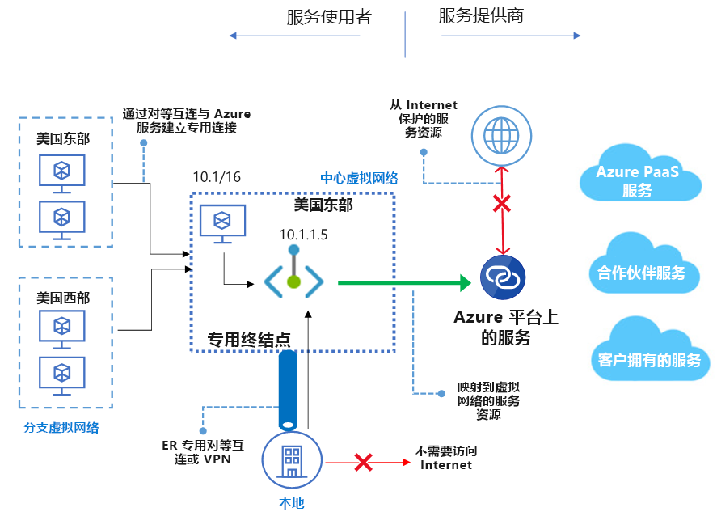

# 什么是 Azure 专用链接？ 
使用 Azure 专用链接，可以通过虚拟网络中的[专用终结点](private-endpoint-overview.md)访问 Azure PaaS 服务（例如，Azure 存储和 SQL 数据库）和 Azure 托管的客户拥有的服务/合作伙伴服务。

虚拟网络与服务之间的流量将遍历 Microsoft 主干网络。 不再需要向公共 Internet 公开服务。 可以在虚拟网络中创建自己的[专用链接服务](private-link-service-overview.md)，并将其交付给客户。 使用 Azure 专用链接的设置和使用体验在 Azure PaaS、客户自有服务和共享合作伙伴服务中是一致的。

> [!IMPORTANT]
> Azure 专用链接现已推出正式版。 专用终结点和专用链接服务（标准负载均衡器后面的服务）都已推出正式版。 不同的 Azure PaaS 会按不同计划加入 Azure 专用链接。 请查看下面的[可用性](https://docs.microsoft.com/azure/private-link/private-link-overview#availability)部分，了解专用链接上 Azure PaaS 的准确状态。 有关已知的限制，请参阅[专用终结点](private-endpoint-overview.md#limitations)和[专用链接服务](private-link-service-overview.md#limitations)。 

## 主要优点
Azure 专用链接提供以下优势：  
- **以私密方式访问 Azure 平台上的服务**：无需在源或目标上使用公共 IP 地址，即可将虚拟网络连接到 Azure 中的服务。 服务提供商可在自己的虚拟网络中呈现其服务，而使用者可在其本地虚拟网络中访问这些服务。 专用链接平台将通过 Azure 主干网络处理使用者与服务之间的连接。 
 
- **本地网络和对等互连的网络**：使用专用终结点通过 ExpressRoute 专用对等互连、VPN 隧道和对等互连的虚拟网络从本地访问 Azure 中运行的服务。 无需设置公共对等互连或遍历 Internet 即可访问服务。 专用链接可让客户安全地将工作负荷迁移到 Azure。
 
- **防范数据泄露**：专用终结点映射到 PaaS 资源的某个实例，而不是映射到整个服务。 使用者只能连接到特定的资源。 对服务中任何其他资源的访问将遭到阻止。 此机制可以防范数据泄露风险。 
 
- **全球覆盖**：以私密方式连接到在其他区域中运行的服务。 使用者的虚拟网络可以位于区域 A，而且可以连接到区域 B 中专用链接后面的服务。  
 
- **扩展到自己的服务**：实现相同的体验和功能，以私密方式将服务呈现给 Azure 中的使用者。 将服务放在标准 Azure 负载均衡器的后面即可为其启用专用链接。 然后，使用者可以使用其自己的虚拟网络中的专用终结点直接连接到你的服务。 可以使用审批调用流来管理这些连接请求。 Azure 专用链接适用于属于不同 Azure Active Directory 租户的使用者和服务。 

## 可用性 
 下表列出了专用链接服务及其适用的区域。 

|支持的服务  |可用区域 | 状态  |
|:-------------------|:-----------------|:--------|
|标准 Azure 负载均衡器后面的专用链接服务 | 所有公共区域  | GA   [了解详细信息](https://docs.microsoft.com/azure/private-link/private-link-service-overview) |
| Azure 存储        |  所有公共区域       | GA   [了解详细信息](/azure/storage/common/storage-private-endpoints)  |
| Azure Data Lake Storage Gen2        |  所有公共区域      | GA   [了解详细信息](/azure/storage/common/storage-private-endpoints)  |
|  Azure SQL Database         | 所有公共区域      |   GA   [了解详细信息](https://docs.microsoft.com/azure/sql-database/sql-database-private-endpoint-overview)      |
|Azure Synapse Analytics（SQL 数据仓库）| 所有公共区域 |GA   [了解详细信息](https://docs.microsoft.com/azure/sql-database/sql-database-private-endpoint-overview)|
|Azure Cosmos DB|  所有公共区域 |GA   [了解详细信息](https://docs.microsoft.com/azure/cosmos-db/how-to-configure-private-endpoints)|
|  Azure Database for PostgreSQL - 单一服务器         | 所有公共区域      |   GA   [了解详细信息](https://docs.microsoft.com/azure/postgresql/concepts-data-access-and-security-private-link)      |
|  Azure Database for MySQL         | 所有公共区域      |   GA   [了解详细信息](https://docs.microsoft.com/azure/mysql/concepts-data-access-security-private-link)     |
|  Azure Database for MariaDB         | 所有公共区域      |   GA   [了解详细信息](https://docs.microsoft.com/azure/mariadb/concepts-data-access-security-private-link)      |
|  Azure Key Vault         | 所有公共区域      |   GA     [了解详细信息](https://docs.microsoft.com/azure/key-vault/private-link-service)   |
|Azure Kubernetes 服务 - Kubernetes API | 所有公共区域      |   GA     [了解详细信息](https://docs.microsoft.com/azure/aks/private-clusters)   |
|Azure 搜索 | 所有公共区域 |   GA     [了解详细信息](https://docs.microsoft.com/azure/search/search-security-overview#endpoint-access)    |
|Azure 容器注册表 | 所有公共区域      |   GA     [了解详细信息](https://docs.microsoft.com/azure/container-registry/container-registry-private-link)   |
|Azure 应用配置 | 所有公共区域      |   预览   |
|Azure 备份 | 所有公共区域     |   GA     [了解详细信息](https://docs.microsoft.com/azure/backup/private-endpoints)   |
|Azure 事件中心 | 所有公共区域      |    GA     [了解详细信息](https://docs.microsoft.com/azure/event-hubs/private-link-service)  |
|Azure 服务总线 | 所有公共区域      |  GA     [了解详细信息](https://docs.microsoft.com/azure/service-bus-messaging/private-link-service)    |
|Azure 中继 | 所有公共区域      |   预览   [了解详细信息](https://docs.microsoft.com/azure/service-bus-relay/private-link-service)  |
|Azure 事件网格| 所有公共区域       |   GA     [了解详细信息](https://docs.microsoft.com/azure/event-grid/network-security) |
|Azure Web 应用 | 美国东部、美国西部 2、美国中南部      |   预览     [了解详细信息](https://docs.microsoft.com/azure/app-service/networking/private-endpoint)   |
|Azure 机器学习 | 美国东部、美国西部 2、美国中南部      |   预览     [了解详细信息](https://docs.microsoft.com/azure/machine-learning/how-to-configure-private-link)   |
| IoT 中心 | 所有公共区域    |   预览     [了解详细信息](https://docs.microsoft.com/azure/iot-hub/virtual-network-support ) |
| Azure SignalR | 美国东部、美国西部 2、美国中南部      |   预览     [了解详细信息](https://aka.ms/asrs/privatelink)   |

有关最新通知，请查看 [Azure 虚拟网络更新页](https://azure.microsoft.com/updates/?product=virtual-network)。

## 日志记录和监视

Azure 专用链接可与 Azure Monitor 集成。 通过这种组合可以：

 - 将日志存档到存储帐户。
 - 将事件流式传输到事件中心。
 - 启用 Azure Monitor 日志记录。

可以在 Azure Monitor 中访问以下信息： 
- **专用终结点**： 
    - 专用终结点处理的数据（传入/传出）
 
- **专用链接服务**：
    - 专用链接服务处理的数据（传入/传出）
    - NAT 端口可用性  
 
## 定价   
有关定价详细信息，请参阅 [Azure 专用链接定价](https://azure.microsoft.com/pricing/details/private-link/)。
 
## 常见问题解答  
有关常见问题解答，请参阅 [Azure 专用链接常见问题解答](private-link-faq.md)。
 
## 限制  
有关限制，请参阅 [Azure 专用链接的限制](../azure-resource-manager/management/azure-subscription-service-limits.md#private-link-limits)。

## 服务级别协议
有关 SLA，请参阅 [Azure 专用链接的 SLA](https://azure.microsoft.com/support/legal/sla/private-link/v1_0/)。

## 后续步骤

- [快速入门：使用 Azure 门户创建专用终结点](create-private-endpoint-portal.md)
- [快速入门：使用 Azure 门户创建专用链接服务](create-private-link-service-portal.md)

 
