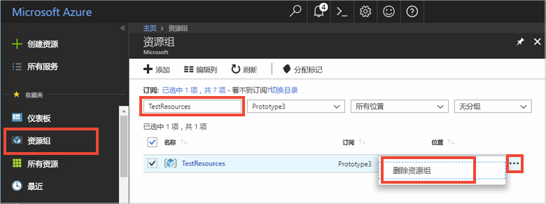

# <a name="quickstart-use-azure-redis-cache-with-a-net-application"></a>快速入门：将 Azure Redis 缓存与 .NET 应用程序配合使用


本快速入门展示了如何开始将 Microsoft Azure Redis 缓存与 .NET 配合使用。 Microsoft Azure Redis 缓存基于流行的开源 Redis 缓存。 它让你访问 Microsoft 管理的安全专用的 Redis 缓存。 使用 Azure Redis 缓存创建的缓存可从 Microsoft Azure 内的任何应用程序进行访问。

本快速入门将在控制台应用中将 [StackExchange.Redis](https://github.com/StackExchange/StackExchange.Redis) 客户端与 C\# 代码配合使用。 将创建缓存并配置 .NET 客户端应用。 然后，将在缓存中添加和更新对象。 


[!INCLUDE [quickstarts-free-trial-note](../../includes/quickstarts-free-trial-note.md)]

## <a name="prerequisites"></a>先决条件

* [Visual Studio](https://www.visualstudio.com/downloads/)
* StackExchange.Redis 客户端需要 [.NET Framework 4 或更高版本](https://www.microsoft.com/net/download/dotnet-framework-runtime)。

## <a name="create-a-cache"></a>创建缓存
[!INCLUDE [redis-cache-create](../../includes/redis-cache-create.md)]

[!INCLUDE [redis-cache-access-keys](../../includes/redis-cache-access-keys.md)]

在计算机上创建名为 *CacheSecrets.config* 的文件，将其放到不会连同示例应用程序源代码一起签入的位置。 在本快速入门中，*CacheSecrets.config* 文件的路径为 *C:\AppSecrets\CacheSecrets.config*。

编辑 *CacheSecrets.config* 文件，添加以下内容：

```xml
<appSettings>
    <add key="CacheConnection" value="<cache-name>.redis.cache.windows.net,abortConnect=false,ssl=true,password=<access-key>"/>
</appSettings>
```

将 `<cache-name>` 替换为缓存主机名。

将 `<access-key>` 替换缓存的主密钥。


## <a name="create-a-console-app"></a>创建控制台应用

在 Visual Studio 中，单击“文件” > “新建” > “项目”。

在 **Visual C#** 下依次单击“Windows 经典桌面”、“控制台应用”、“确定”，以便创建新的控制台应用程序。


<a name="configure-the-cache-clients"></a>

## <a name="configure-the-cache-client"></a>配置缓存客户端

在本部分，请配置控制台应用程序，以便将 [StackExchange.Redis](https://github.com/StackExchange/StackExchange.Redis) 客户端用于 .NET。

在 Visual Studio 中单击“工具” > “NuGet 包管理器” > “包管理器控制台”，然后在“包管理器控制台”窗口中运行以下命令。

```powershell
Install-Package StackExchange.Redis
```

完成安装后，*StackExchange.Redis* 缓存客户端可供与项目一起使用。


## <a name="connect-to-the-cache"></a>连接到缓存

在 Visual Studio 中打开 *App.config* 文件并对其进行更新，使之包括引用 *CacheSecrets.config* 文件的 `appSettings` `file` 属性。

```xml
<?xml version="1.0" encoding="utf-8" ?>
<configuration>
    <startup> 
        <supportedRuntime version="v4.0" sku=".NETFramework,Version=v4.7.1" />
    </startup>

    <appSettings file="C:\AppSecrets\CacheSecrets.config"></appSettings>  

</configuration>
```

在解决方案资源管理器中右键单击“引用”，然后单击“添加引用”。 添加对 **System.Configuration** 程序集的引用。

将以下 `using` 语句添加到 *Program.cs*：

```csharp
using StackExchange.Redis;
using System.Configuration;
```

到 Azure Redis 缓存的连接由 `ConnectionMultiplexer` 类管理。 应当在整个客户端应用程序中共享和重用此类。 不要为每个操作创建新连接。 

切勿将凭据存储在源代码中。 为了使此示例简单明了，我将只使用外部机密配置文件。 更好的方法是[将 Azure Key Vault 与证书配合使用](https://docs.microsoft.com/rest/api/keyvault/certificate-scenarios)。

在 *Program.cs* 中，将以下成员添加到控制台应用程序的 `Program` 类：

```csharp
        private static Lazy<ConnectionMultiplexer> lazyConnection = new Lazy<ConnectionMultiplexer>(() =>
        {
            string cacheConnection = ConfigurationManager.AppSettings["CacheConnection"].ToString();
            return ConnectionMultiplexer.Connect(cacheConnection);
        });

        public static ConnectionMultiplexer Connection
        {
            get
            {
                return lazyConnection.Value;
            }
        }
```


这种在应用程序中共享 `ConnectionMultiplexer` 实例的方法使用一个返回已连接实例的静态属性。 此代码提供了一种线程安全方法，它仅初始化单个已连接的 `ConnectionMultiplexer` 实例。 `abortConnect` 设置为 false，这意味着即使未建立到 Azure Redis 缓存的连接，调用也会成功。 `ConnectionMultiplexer` 的一个关键功能是，一旦解决网络问题和其他原因，它会自动还原缓存连接。

*CacheConnection* appSetting 的值用于将 Azure 门户中的缓存连接字符串作为密码参数引用。

## <a name="executing-cache-commands"></a>执行缓存命令

为控制台应用程序的 `Program` 类的 `Main` 过程添加以下代码：

```csharp
        static void Main(string[] args)
        {
            // Connection refers to a property that returns a ConnectionMultiplexer
            // as shown in the previous example.
            IDatabase cache = lazyConnection.Value.GetDatabase();

            // Perform cache operations using the cache object...

            // Simple PING command
            string cacheCommand = "PING";
            Console.WriteLine("\nCache command  : " + cacheCommand);
            Console.WriteLine("Cache response : " + cache.Execute(cacheCommand).ToString());

            // Simple get and put of integral data types into the cache
            cacheCommand = "GET Message";
            Console.WriteLine("\nCache command  : " + cacheCommand + " or StringGet()");
            Console.WriteLine("Cache response : " + cache.StringGet("Message").ToString());

            cacheCommand = "SET Message \"Hello! The cache is working from a .NET console app!\"";
            Console.WriteLine("\nCache command  : " + cacheCommand + " or StringSet()");
            Console.WriteLine("Cache response : " + cache.StringSet("Message", "Hello! The cache is working from a .NET console app!").ToString());

            // Demostrate "SET Message" executed as expected...
            cacheCommand = "GET Message";
            Console.WriteLine("\nCache command  : " + cacheCommand + " or StringGet()");
            Console.WriteLine("Cache response : " + cache.StringGet("Message").ToString());

            // Get the client list, useful to see if connection list is growing...
            cacheCommand = "CLIENT LIST";
            Console.WriteLine("\nCache command  : " + cacheCommand);
            Console.WriteLine("Cache response : \n" + cache.Execute("CLIENT", "LIST").ToString().Replace("id=", "id="));

            lazyConnection.Value.Dispose();
        }
```

Azure Redis 缓存的数据库数目（默认为 16 个）是可以配置的，因此可以通过逻辑方式隔离 Redis 缓存中的数据。 该代码连接到默认数据库 DB 0。 有关详细信息，请参阅[什么是 Redis 数据库？](cache-faq.md#what-are-redis-databases)和[默认 Redis 服务器配置](cache-configure.md#default-redis-server-configuration)。

可以使用 `StringSet` 和 `StringGet` 方法来存储和检索缓存项。

Redis 将大多数数据存储为 Redis 字符串，但这些字符串可能包含许多类型的数据，包括序列化的二进制数据，可在缓存中存储 .NET 对象时使用。

按 **Ctrl+F5** 生成并运行控制台应用。

在下面的示例中，可以看到 `Message` 键以前有一个缓存值，该值是使用 Azure 门户中的 Redis 控制台设置的。 应用更新了该缓存值。 应用还执行了 `PING` 和 `CLIENT LIST` 命令。


## <a name="work-with-net-objects-in-the-cache"></a>处理缓存中的 .NET 对象

Azure Redis 缓存可以缓存 .NET 对象以及基元数据类型，但在缓存 .NET 对象之前，必须将其序列化。 此 .NET 对象序列化是应用程序开发人员的责任，同时赋与开发人员选择序列化程序的弹性。

将对象序列化的一种简单方式是使用 [Newtonsoft.Json](https://www.nuget.org/packages/Newtonsoft.Json/) 中的 `JsonConvert` 序列化方法，并与 JSON 相互序列化。 在本部分中，将向缓存中添加一个 .NET 对象。

在 Visual Studio 中单击“工具” > “NuGet 包管理器” > “包管理器控制台”，然后在“包管理器控制台”窗口中运行以下命令。

```powershell
Install-Package Newtonsoft.Json
```

将以下 `using` 语句添加到 *Program.cs* 的顶部：

```charp
using Newtonsoft.Json;
```

将以下 `Employee` 类定义添加到 *Program.cs*：

```csharp
        class Employee
        {
            public string Id { get; set; }
            public string Name { get; set; }
            public int Age { get; set; }

            public Employee(string EmployeeId, string Name, int Age)
            {
                this.Id = EmployeeId;
                this.Name = Name;
                this.Age = Age;
            }
        }
```

在 *Program.cs* 中的 `Main()` 过程的底部，在对 `Dispose()` 的调用之前，添加以下代码行来缓存和检索已序列化的 .NET 对象：

```csharp
            // Store .NET object to cache
            Employee e007 = new Employee("007", "Davide Columbo", 100);
            Console.WriteLine("Cache response from storing Employee .NET object : " + 
                cache.StringSet("e007", JsonConvert.SerializeObject(e007)));

            // Retrieve .NET object from cache
            Employee e007FromCache = JsonConvert.DeserializeObject<Employee>(cache.StringGet("e007"));
            Console.WriteLine("Deserialized Employee .NET object :\n");
            Console.WriteLine("\tEmployee.Name : " + e007FromCache.Name);
            Console.WriteLine("\tEmployee.Id   : " + e007FromCache.Id);
            Console.WriteLine("\tEmployee.Age  : " + e007FromCache.Age + "\n");
```

按 **Ctrl+F5** 生成并运行控制台应用，以便测试 .NET 对象的序列化。 


## <a name="clean-up-resources"></a>清理资源

如果想要继续学习下一篇教程，可以保留本快速入门中创建的资源，以便重复使用。

如果已完成快速入门示例应用程序，可以删除本快速入门中创建的 Azure 资源，以免产生费用。 

> [!IMPORTANT]
> 删除资源组的操作不可逆，资源组以及其中的所有资源将被永久删除。 请确保不会意外删除错误的资源组或资源。 如果在现有资源组（其中包含要保留的资源）中为托管此示例而创建了相关资源，可从各自的边栏选项卡逐个删除这些资源，而不要删除资源组。
>

登录到 [Azure 门户](https://portal.azure.com)，并单击“资源组”。

在“按名称筛选...”文本框中键入资源组的名称。 本文的说明使用了名为 *TestResources* 的资源组。 在结果列表中的资源组上，单击“...”，然后单击“删除资源组”。



系统会要求确认是否删除资源组。 键入资源组的名称进行确认，然后单击“删除”。

片刻之后，将会删除该资源组及其包含的所有资源。


<a name="next-steps"></a>

## <a name="next-steps"></a>后续步骤

本快速入门介绍了如何在 .NET 应用程序中使用 Azure Redis 缓存。 请继续学习下一快速入门，了解如何将 Redis 缓存与 ASP.NET Web 应用配合使用。

> [!div class="nextstepaction"]
> [创建使用 Azure Redis 缓存的 ASP.NET Web 应用](./cache-web-app-howto.md)。


