# <a name="quickstart-create-a-aspnet-web-app-with-redis-cache"></a>快速入门：使用 Redis 缓存创建 ASP.NET Web 应用

> [!div class="op_single_selector"]
> * [.NET](cache-dotnet-how-to-use-azure-redis-cache.md)
> * [ASP.NET](cache-web-app-howto.md)
> * [Node.js](cache-nodejs-get-started.md)
> * [Java](cache-java-get-started.md)
> * [Python](cache-python-get-started.md)
>

## <a name="introduction"></a>介绍

本快速入门介绍如何使用 Visual Studio 2017 创建 ASP.NET Web 应用程序并将其部署到 Azure 应用服务。 示例应用程序连接到 Azure Redis 缓存，以在缓存中存储并检索数据。 完成本快速入门后，Azure 中会托管一个正常运行的 Web 应用，该应用在 Azure Redis 缓存中读取和写入数据。

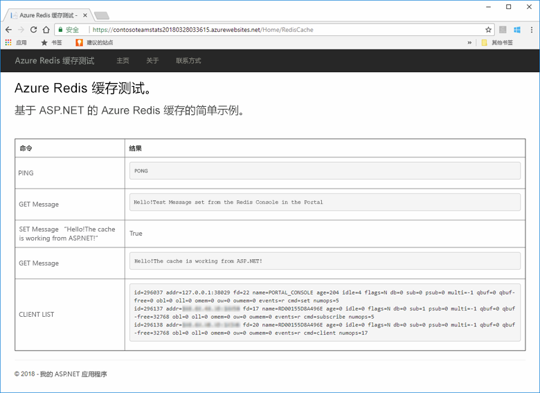

## <a name="prerequisites"></a>先决条件

若要完成本快速入门，必须满足以下先决条件：

* 使用以下工作负荷安装 [Visual Studio 2017](https://www.visualstudio.com/downloads/)：
    * ASP.NET 和 Web 开发
    * Azure 开发

[!INCLUDE [quickstarts-free-trial-note](../../includes/quickstarts-free-trial-note.md)]

## <a name="create-the-visual-studio-project"></a>创建 Visual Studio 项目

打开 Visual Studio，并依次单击“文件”、“新建”、“项目”。

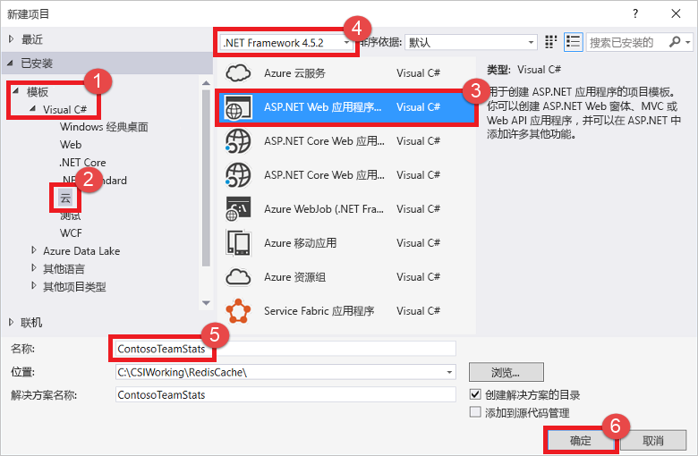

在“新建项目”对话框中执行以下步骤：

1. 展开“模板”列表中的“Visual C#”节点
1. 选择“云”
1. 单击“ASP.NET Web 应用程序”
1. 确保已选择“.NET Framework 4.5.2”或更高版本
1. 在“名称”文本框中为项目命名，本示例使用了 **ContosoTeamStats**
1. 单击“确定”。

随后会看到“新建 ASP.NET Web 应用程序”屏幕：


选择“MVC”作为项目类型。

对于“身份验证”设置，请确保指定“无身份验证”。 根据 Visual Studio 版本，可能会默认设置为其他。 要对其进行更改，请单击“更改身份验证”，并选择“无身份验证”。

单击“确定”以创建该项目  。

## <a name="create-a-cache"></a>创建缓存

接下来，为应用创建缓存。

[!INCLUDE [redis-cache-create](../../includes/redis-cache-create.md)]

[!INCLUDE [redis-cache-access-keys](../../includes/redis-cache-access-keys.md)]

在计算机上创建名为 *CacheSecrets.config* 的文件，将其放到不会连同示例应用程序源代码一起签入的位置。 在本快速入门中，*CacheSecrets.config* 文件的路径为 *C:\AppSecrets\CacheSecrets.config*。

编辑 *CacheSecrets.config* 文件，添加以下内容：

```xml
<appSettings>
    <add key="CacheConnection" value="<cache-name>.redis.cache.windows.net,abortConnect=false,ssl=true,password=<access-key>"/>
</appSettings>
```

将 `<cache-name>` 替换为缓存主机名。

将 `<access-key>` 替换缓存的主密钥。

> [!TIP]
> 在将密钥轮换为备用密钥期间重新生成主访问密钥时，会使用辅助访问密钥。
>

保存文件。

## <a name="update-the-mvc-application"></a>更新 MVC 应用程序

在本部分，我们将应用程序更新为支持一个新视图，该视图显示针对 Azure Redis 缓存执行的一项简单测试。

* [使用缓存的应用设置更新 web.config 文件](#Update-the-webconfig-file-with-an-app-setting-for-the-cache)
* [将应用程序配置为使用 StackExchange.Redis 客户端](#configure-the-application-to-use-stackexchangeredis)
* [更新 HomeController 和布局](#update-the-homecontroller-and-layout)
* [添加新的 RedisCache 视图](#add-a-new-rediscache-view)

### <a name="update-the-webconfig-file-with-an-app-setting-for-the-cache"></a>使用缓存的应用设置更新 web.config 文件

在本地运行应用程序时，将使用 *CacheSecrets.config* 中的信息连接到 Azure Redis 缓存实例。 稍后，我们要将此应用程序部署到 Azure。 到时，我们要在 Azure 中配置一项应用设置，应用程序将使用该设置来检索缓存连接信息而不是此文件。 由于 *CacheSecrets.config* 未连同应用程序一起部署到 Azure，因此，只是在本地测试应用程序时才使用此文件。 请尽量安全保管此信息，防止有人恶意访问缓存数据。

在“解决方案资源管理器”中，双击“web.config”文件将其打开。

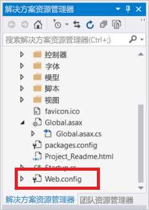

在 *web.config* 文件中找到 `<appSetting>` 元素，并添加以下 `file` 特性。 如果使用了其他文件名或位置，请使用这些值来替换示例中显示的值。

* 之前： `<appSettings>`
* 之后： ` <appSettings file="C:\AppSecrets\CacheSecrets.config">`

ASP.NET 运行时合并了外部文件的内容以及 `<appSettings>` 元素中的标记。 如果找不到指定的文件，运行时会忽略文件属性。 应用程序的源代码中将不包括机密（连接到缓存的连接字符串）。 将 Web 应用部署到 Azure 时，不会部署 *CacheSecrests.config* 文件。

### <a name="configure-the-application-to-use-stackexchangeredis"></a>配置应用程序以使用 StackExchange.Redis

若要将应用配置为使用 Visual Studio 的 [StackExchange.Redis](https://github.com/StackExchange/StackExchange.Redis) NuGet 包，请单击“工具”>“NuGet 包管理器”>“包管理器控制台”。

从 `Package Manager Console` 窗口运行以下命令：

```powershell
Install-Package StackExchange.Redis
```

NuGet 程序包会给客户端应用程序下载并添加所需的程序集引用，以访问带 StackExchange.Redis 缓存客户端的 Azure Redis 缓存。 如果更愿使用强命名版本的 `StackExchange.Redis` 客户端库，请安装 `StackExchange.Redis.StrongName` 包。

### <a name="update-the-homecontroller-and-layout"></a>更新 HomeController 和布局

在“解决方案资源管理器”中，展开“Controllers”文件夹，并打开“HomeController.cs”文件。

在文件的顶部添加以下两个 `using` 语句，以支持缓存客户端和应用设置。

```csharp
using System.Configuration;
using StackExchange.Redis;
```

将以下方法添加到 `HomeController` 类，以支持针对新缓存执行某些命令的新 `RedisCache` 操作。

```csharp
    public ActionResult RedisCache()
    {
        ViewBag.Message = "A simple example with Azure Redis Cache on ASP.NET.";

        var lazyConnection = new Lazy<ConnectionMultiplexer>(() =>
        {
            string cacheConnection = ConfigurationManager.AppSettings["CacheConnection"].ToString();
            return ConnectionMultiplexer.Connect(cacheConnection);
        });

        // Connection refers to a property that returns a ConnectionMultiplexer
        // as shown in the previous example.
        IDatabase cache = lazyConnection.Value.GetDatabase();

        // Perform cache operations using the cache object...

        // Simple PING command
        ViewBag.command1 = "PING";
        ViewBag.command1Result = cache.Execute(ViewBag.command1).ToString();

        // Simple get and put of integral data types into the cache
        ViewBag.command2 = "GET Message";
        ViewBag.command2Result = cache.StringGet("Message").ToString();

        ViewBag.command3 = "SET Message \"Hello! The cache is working from ASP.NET!\"";
        ViewBag.command3Result = cache.StringSet("Message", "Hello! The cache is working from ASP.NET!").ToString();

        // Demostrate "SET Message" executed as expected...
        ViewBag.command4 = "GET Message";
        ViewBag.command4Result = cache.StringGet("Message").ToString();

        // Get the client list, useful to see if connection list is growing...
        ViewBag.command5 = "CLIENT LIST";
        ViewBag.command5Result = cache.Execute("CLIENT", "LIST").ToString().Replace(" id=", "\rid=");

        lazyConnection.Value.Dispose();

        return View();
    }
```

在“解决方案资源管理器”中，展开“Views”>“Shared”文件夹，并打开“_Layout.cshtml”文件。

将：

```csharp
@Html.ActionLink("Application name", "Index", "Home", new { area = "" }, new { @class = "navbar-brand" })
```

替换为：

```csharp
@Html.ActionLink("Azure Redis Cache Test", "RedisCache", "Home", new { area = "" }, new { @class = "navbar-brand" })
```

### <a name="add-a-new-rediscache-view"></a>添加新的 RedisCache 视图

在“解决方案资源管理器”中，展开“Views”文件夹，并右键单击“Home”文件夹。 选择“添加” > “视图...”。

在“添加视图”对话框中，输入 **RedisCache** 作为视图名称，并单击“添加”。

将 *RedisCache.cshtml* 文件中的代码替换为以下代码：

```csharp
@{
    ViewBag.Title = "Azure Redis Cache Test";
}

<h2>@ViewBag.Title.</h2>
<h3>@ViewBag.Message</h3>
<br /><br />
<table border="1" cellpadding="10">
    <tr>
        <th>Command</th>
        <th>Result</th>
    </tr>
    <tr>
        <td>@ViewBag.command1</td>
        <td><pre>@ViewBag.command1Result</pre></td>
    </tr>
    <tr>
        <td>@ViewBag.command2</td>
        <td><pre>@ViewBag.command2Result</pre></td>
    </tr>
    <tr>
        <td>@ViewBag.command3</td>
        <td><pre>@ViewBag.command3Result</pre></td>
    </tr>
    <tr>
        <td>@ViewBag.command4</td>
        <td><pre>@ViewBag.command4Result</pre></td>
    </tr>
    <tr>
        <td>@ViewBag.command5</td>
        <td><pre>@ViewBag.command5Result</pre></td>
    </tr>
</table>
```

## <a name="run-the-app-locally"></a>在本地运行应用

默认情况下，项目配置为在 [IIS Express](https://docs.microsoft.com/iis/extensions/introduction-to-iis-express/iis-express-overview) 本地托管应用，以进行测试和调试。

在 Visual Studio 的菜单中，单击“调试” > “开始调试”，在本地生成并启动应用进行测试和调试。

在浏览器中，单击导航栏上的“Azure Redis 缓存测试”。

在以下示例中可以看到，`Message` 键事先已包含一个缓存值，该值是使用门户中的 Redis 控制台设置的。 应用更新了该缓存值。 应用还执行了 `PING` 和 `CLIENT LIST` 命令。

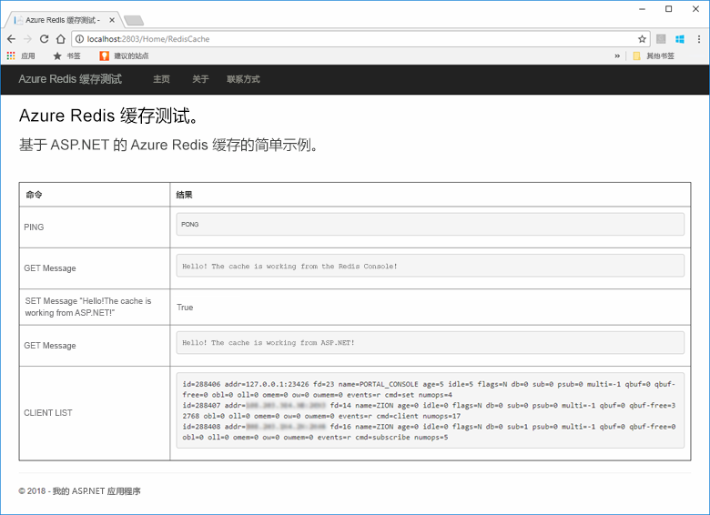

## <a name="publish-and-run-in-azure"></a>在 Azure 中发布和运行

在本地成功测试应用后，将应用部署到 Azure 并在云中运行它。

### <a name="publish-the-app-to-azure"></a>将应用发布到 Azure

在 Visual Studio 中，右键单击解决方案资源管理器中的项目节点，并选择“发布”。

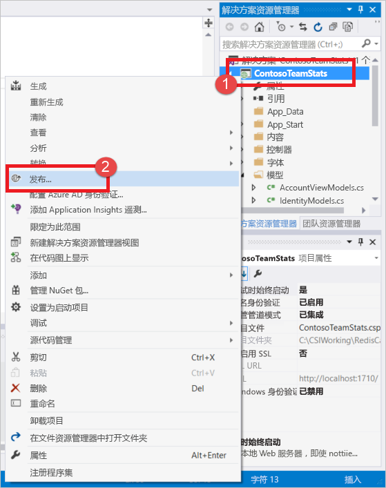

单击“Microsoft Azure 应用服务”，选择“新建”，并单击“发布”。

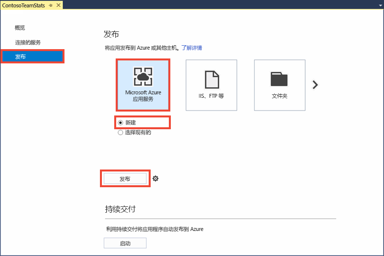

在“创建应用服务”对话框中进行以下更改：

| 设置 | 建议的值 | 说明 |
| ------- | :---------------: | ----------- |
| **应用名称** | 使用默认值 | 应用名称是部署到 Azure 时应用的主机名。 如果需要让该名称保持唯一，可在其后添加一个时间戳后缀。 |
| **订阅** | 选择自己的 Azure 订阅 | 将在此订阅中收取任何相关的托管费用。 如果有多个 Azure 订阅，请确认是否选择了所需的订阅。|
| **资源组** | 使用在其中创建了缓存的同一个资源组。 例如 *TestResourceGroup*。 | 该资源组可帮助你将所有资源作为一个组进行管理。 以后想要删除应用时，只需删除该组即可。 |
| 应用服务计划 | 单击“新建”，创建名为 *TestingPlan* 的新应用服务计划。 <br />使用创建缓存时所用的相同**位置**。 <br />选择“免费”作为大小。 | 应用服务计划为要运行的 Web 应用定义一组计算资源。 |

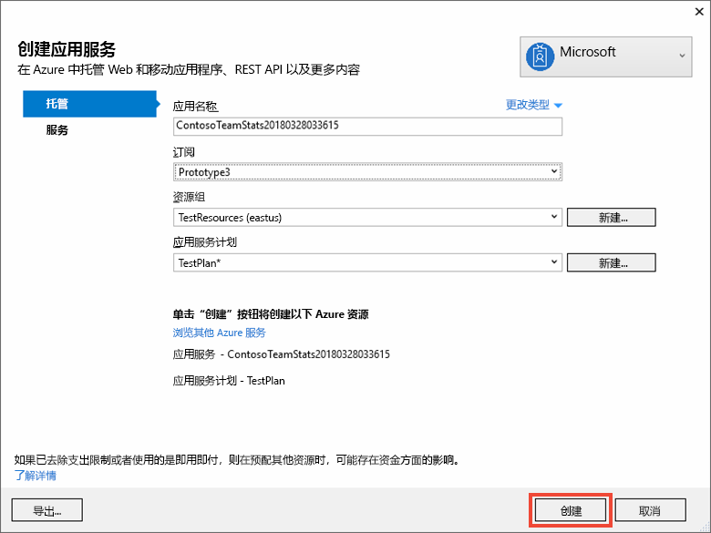

配置应用服务托管设置后，单击“创建”为应用创建新的应用服务。

监视 Visual Studio 中的“输出”窗口，观察发布到 Azure 的过程状态。 成功完成发布后，会记录应用服务的 URL，如下所示：

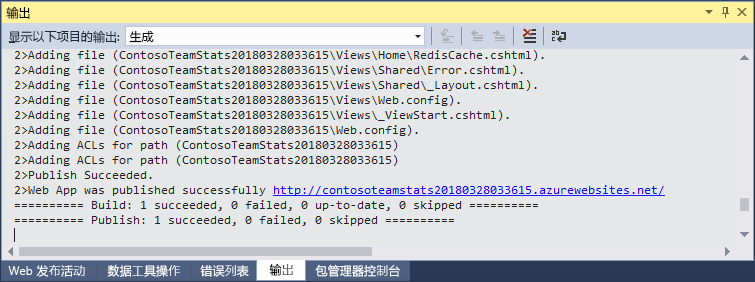

### <a name="add-the-app-setting-for-the-cache"></a>为缓存添加应用设置

完成新应用服务的发布后，添加新的应用设置。 此设置将用于存储缓存连接信息。 在 Azure 门户顶部的搜索栏中键入应用名称，查找刚刚创建的新应用服务。

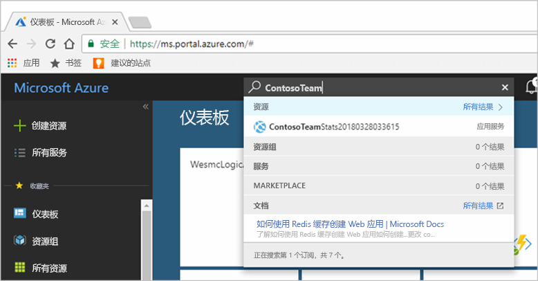

为应用添加名为 **CacheConnection** 的新应用设置，用于连接到缓存。 使用在 *CacheSecrets.config* 文件中为 `CacheConnection` 配置的相同值。 该值包含缓存主机名和访问密钥。

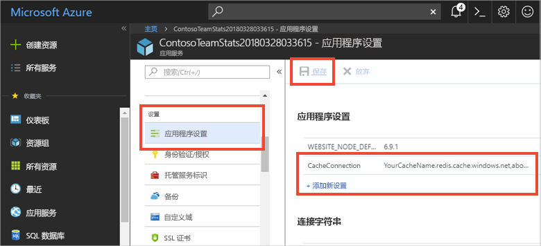

### <a name="run-the-app-in-azure"></a>在 Azure 中运行应用

在浏览器中，浏览到应用服务的 URL。 该 URL 显示在 Visual Studio“输出”窗口中的发布操作结果内。 此外，在 Azure 门户中，所创建应用服务的“概述”页上也提供了该 URL。

单击导航栏上的“Azure Redis 缓存测试”以测试缓存访问。


## <a name="clean-up-resources"></a>清理资源

如果想要继续学习下一篇教程，可以保留本快速入门中创建的资源，以便重复使用。

如果已完成快速入门示例应用程序，可以删除本快速入门中创建的 Azure 资源，以免产生费用。 

> [!IMPORTANT]
> 删除资源组的操作不可逆，资源组以及其中的所有资源将被永久删除。 请确保不会意外删除错误的资源组或资源。 如果在现有资源组（其中包含要保留的资源）中为托管此示例而创建了相关资源，可从各自的边栏选项卡逐个删除这些资源，而不要删除资源组。
>

登录到 [Azure 门户](https://portal.azure.com)，并单击“资源组”。

在“按名称筛选...”文本框中键入资源组的名称。 本主题的说明使用了名为 *TestResources* 的资源组。 在结果列表中的资源组上，单击“...”，然后单击“删除资源组”。

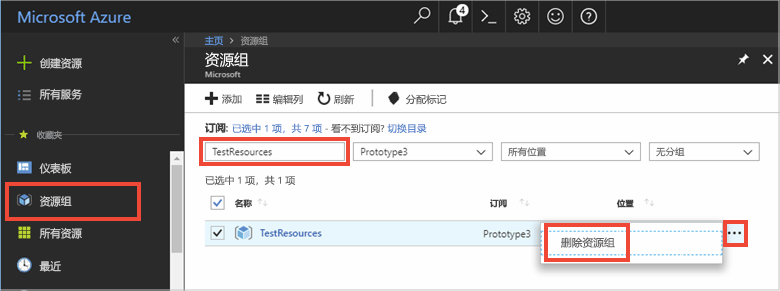

系统会要求确认是否删除资源组。 键入资源组的名称进行确认，然后单击“删除”。

几分钟后，资源组及其包含的所有资源就会被删除。

## <a name="next-steps"></a>后续步骤

在下一篇教程中，我们将在一个更真实的场景中使用 Azure Redis 缓存来改善应用的性能。 我们会将此应用程序更新为使用 ASP.NET 和数据库的缓存端模式来缓存排行榜结果。

> [!div class="nextstepaction"]
> [在 ASP.NET 中创建缓存端排行榜](cache-web-app-cache-aside-leaderboard.md)
