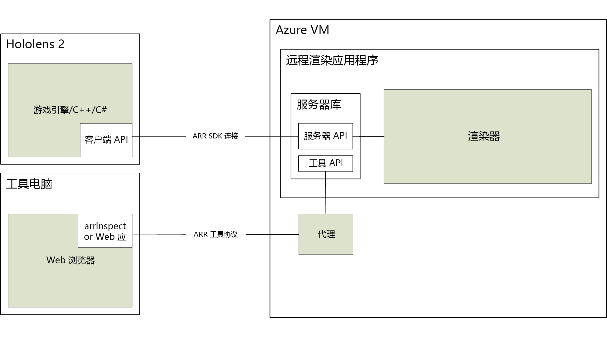

# 关于 Azure 远程渲染

> [!IMPORTANT]
> Azure 远程渲染目前为公共预览版。 
> 此预览版在提供时没有附带服务级别协议，不建议将其用于生产工作负荷。 某些功能可能不受支持或者受限。 有关详细信息，请参阅 [Microsoft Azure 预览版补充使用条款](https://azure.microsoft.com/support/legal/preview-supplemental-terms/)。

使用 Azure 远程渲染 (ARR) 服务可以在云中渲染高质量的交互式 3D 内容，并将其实时流式传输到 HoloLens 2 等设备。 

离线设备的计算能力有限，很难渲染复杂的模型。 同时，在许多应用场合中，视觉保真度出现任何形式的下降都是不可接受的。

远程渲染解决了此问题，因为它可以将渲染工作负载转移到云中的高端 GPU。  云托管的图形引擎可以渲染图像，将图像编码为视频流，然后将编码的内容流式传输到目标设备。

## 混合渲染

在大多数应用场合中，只是渲染复杂模型并不足够， 还需要通过自定义的 UI 向用户提供功能。 Azure 远程渲染不强迫你使用专用的 UI 框架，它还支持混合渲染。  这意味着，你可以使用首选的方法（例如 [MRTK](https://microsoft.github.io/MixedRealityToolkit-Unity/Documentation/GettingStartedWithTheMRTK.html)）在设备上渲染元素。

在某个帧的末尾，Azure 远程渲染会自动将本地渲染的内容与远程图像合并到一起。 它甚至可以通过适当的闭合来做到这一点。

## 多 GPU 渲染

某些模型在以交互式帧速率渲染时过于复杂，即使对于高端 GPU 来说也是如此。 尤其是在工业可视化中，经常会遇到此问题。 为了进一步克服限制，Azure 远程渲染可将工作负载分配到多个 GPU。 结果会合并成单个图像，因此，该过程对于用户而言完全是透明的。

## 高级体系结构

下图演示了远程渲染体系结构：

完整的图像生成周期包括以下步骤：

1. 客户端：帧设置
    1. 你的代码：处理用户输入并更新场景图
    1. ARR 代码：更新场景图，并将预测的头部姿势发送到服务器
1. 服务器端：远程渲染
    1. 渲染引擎在可用的 GPU 之间分配渲染工作负载
    1. 多个 GPU 的输出组合成单个图像
    1. 将图像编码为视频流，并将其发送回客户端
1. 客户端：最终确认
    1. 你的代码：渲染可选的本地内容（UI、标记等）
    1. ARR 代码：提供的本地渲染内容自动与视频流合并

网络延迟是主要问题。 通常情况下，从发送请求到接收结果的周转时间相对于交互式帧速率而言太长。 因此，随时都可能会有多个帧处于急速传输状态。

## 后续步骤

* [系统要求](system-requirements.md)
* [快速入门：使用 Unity 渲染模型](../quickstarts/render-model.md)
