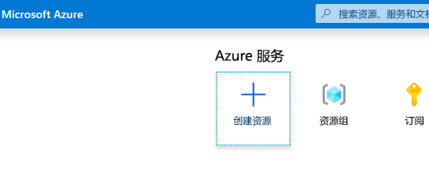
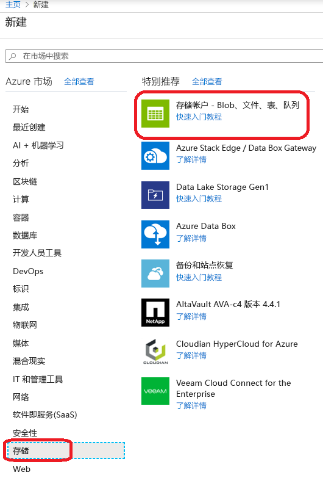
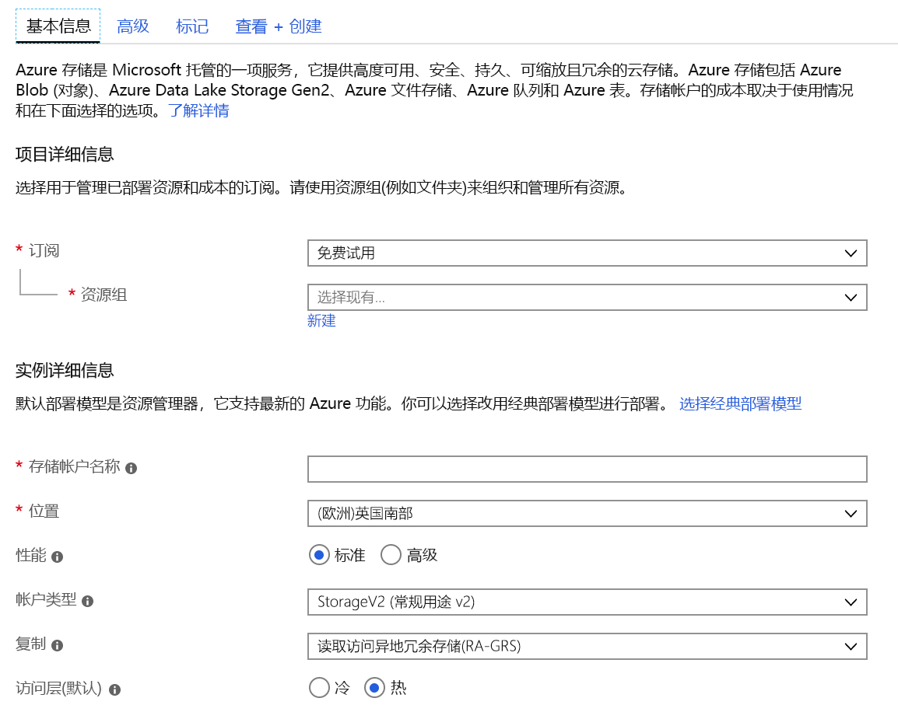
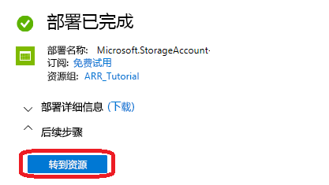
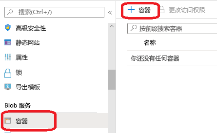
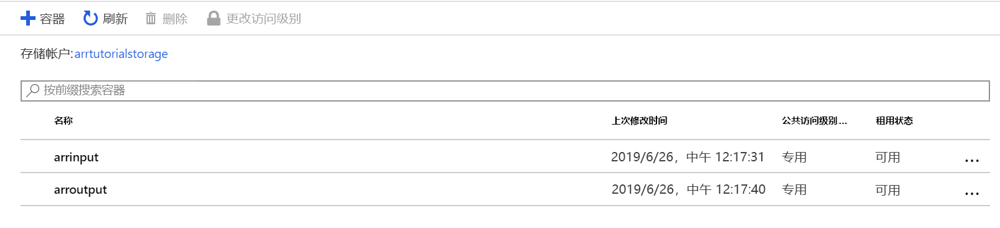
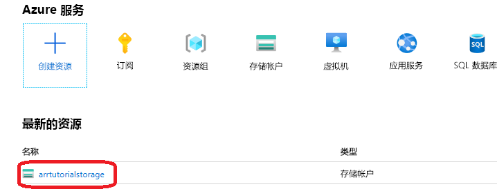
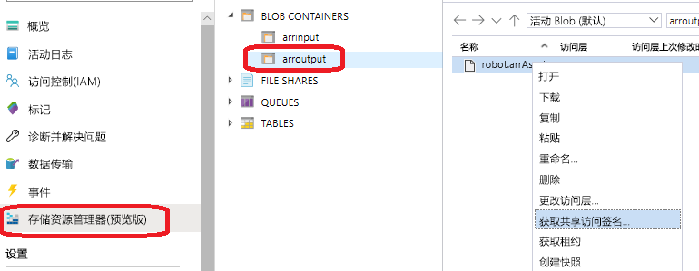

# <a name="quickstart-convert-a-model-for-rendering"></a>快速入门：转换用于渲染的模型

在[快速入门：使用 Unity 渲染模型](render-model.md)中，你已了解如何使用 Unity 示例项目来渲染某个内置模型。 本指南介绍如何转换你自己的模型。

将了解如何执行以下操作：

> [!div class="checklist"]
>
> * 设置用于输入和输出的 Azure Blob 存储帐户
> * 上传并转换一个用于 Azure 远程渲染的 3D 模型
> * 在应用程序中包含要渲染的已转换 3D 模型

## <a name="prerequisites"></a>先决条件

* 完整[快速入门：使用 Unity 渲染模型](render-model.md)
* 安装 Azure PowerShell[（文档）](https://docs.microsoft.com/powershell/azure/)
  * 以管理员权限打开 PowerShell
  * 运行：`Install-Module -Name Az -AllowClobber`

## <a name="overview"></a>概述

服务器上的渲染器无法直接处理 FBX 或 GLTF 等源模型格式。 它要求模型采用专属的二进制格式。
转换服务将使用 Azure Blob 存储中的模型，并将转换后的模型写回到所提供的 Azure Blob 存储容器。

需要：

* Azure 订阅
* 订阅中的“StorageV2”帐户
* 输入模型的 Blob 存储容器
* 输出数据的 Blob 存储容器
* 要转换的模型，具体请参阅[示例模型](../samples/sample-model.md)
  * 查看[支持的源格式](../how-tos/conversion/model-conversion.md#supported-source-formats)列表
  * 若要使用示例转换脚本，请确保准备好一个包含模型和所有外部依赖项（例如外部纹理或几何结构）的输入文件夹

## <a name="azure-setup"></a>Azure 设置

如果你没有 Azure 帐户，请转到 [https://azure.microsoft.com/get-started/](https://azure.microsoft.com/get-started/)，单击“免费帐户”选项，然后按照说明创建一个帐户。

有了 Azure 帐户后，请转到 [https://ms.portal.azure.com/#home](https://ms.portal.azure.com/#home)。

### <a name="storage-account-creation"></a>创建存储帐户

若要创建 Blob 存储，首先需要一个存储帐户。
若要创建一个存储帐户，请单击“创建资源”按钮：



在新屏幕中，选择左侧的“存储”，然后在下一列中选择“存储帐户 - Blob、文件、表、队列”： 



单击此按钮会显示以下屏幕，其中包含要填写的存储属性：



按如下方式填写表单：

* 通过下拉框下方的链接创建一个新的资源组，并将其 命名为 ARR_Tutorial
* 对于“存储帐户名称”，请输入唯一名称。 此名称必须全局唯一，否则会出现一条提示，告知该名称已被使用。 对于本快速入门，我们将存储帐户命名为 arrtutorialstorage。 如果你在本快速入门中使用了其他名称，则需要相应地将上述名称替换为自己的名称。
* 选择靠近自己的位置。 最好是使用在其他快速入门中设置渲染时所用的同一位置。
* 将“性能”设为“标准”
* 将“帐户类型”设为“StorageV2 (常规用途 v2)”
* 将“复制”设为“读取访问权限异地冗余存储(RA-GRS)”
* 将“访问层”设为“热”

不必更改其他选项卡中的属性，因此可以继续选择“查看 + 创建”，然后按照相应的步骤完成设置。

现在，网站会告知部署进度，并且最终会报告“部署已完成”。 单击“转到资源”按钮来完成后续步骤：



### <a name="blob-storage-creation"></a>创建 Blob 存储

接下来，需要两个 Blob 容器，一个用于输入，一个用于输出。

按前面所述单击“转到资源”按钮后，会进入一个页面，其左侧显示了一个包含列表菜单的面板。 在该列表中的“Blob 服务”类别下，单击“容器”按钮： 



按“+ 容器”按钮创建输入 Blob 存储容器。 
创建该容器时，请使用以下设置：
  
* 名称 = arrinput
* 公共访问级别 = 私有

创建该容器后，再次单击“+ 容器”，并针对输出容器重复使用这些设置： 

* 名称 = arroutput
* 公共访问级别 = 私有

现在应已有两个 Blob 存储容器：



## <a name="run-the-conversion"></a>运行转换

为了便于调用资产转换服务，我们提供了一个实用工具脚本。 该脚本位于 Scripts 文件夹中，其名称为 Conversion.ps1。

具体而言，此脚本

1. 将给定目录中的所有文件从本地磁盘上传到输入存储容器
1. 调用[资产转换 REST API](../how-tos/conversion/conversion-rest-api.md)，以便从输入存储容器检索数据并启动转换，该转换将返回转换 ID
1. 使用检索到的转换 ID 轮询转换状态 API，直到转换过程以成功或失败状态终止
1. 在输出存储中检索已转换资产的链接

该脚本从 Scripts\arrconfig.json 文件中读取其配置。 在文本编辑器中打开该 JSON 文件。

```json
{
    "accountSettings": {
        "arrAccountId": "8*******-****-****-****-*********d7e",
        "arrAccountKey": "R***************************************l04=",
        "region": "<your-region>"
    },
    "renderingSessionSettings": {
        "vmSize": "standard",
        "maxLeaseTime": "1:00:00"
    },
    "assetConversionSettings": {
        "localAssetDirectoryPath": "D:\\tmp\\robot",
        "resourceGroup": "ARR_Tutorial",
        "storageAccountName": "arrexamplestorage",
        "blobInputContainerName": "arrinput",
        "inputFolderPath": "robotConversion",
        "inputAssetPath": "robot.fbx",
        "blobOutputContainerName": "arroutput",
        "outputFolderPath":"converted/robot",
        "outputAssetFileName": "robot.arrAsset"
    }
}
```

应该以类似于[使用 Unity 渲染模型快速入门](render-model.md)中所述的凭据填写 accountSettings 组中的配置（帐户 ID 和密钥）。

在 assetConversionSettings 组中，请确保按上面所示更改 resourceGroup、blobInputContainerName和 blobOutputContainerName。   
请注意，需将 arrtutorialstorage 值替换为在创建存储帐户期间选取的唯一名称。

将 localAssetDirectoryPath 更改为指向磁盘上包含要转换的模型的目录。 请小心使用双反斜杠（“\\\\”）来正确转义路径中的反斜杠（“\\”）。

localAssetDirectoryPath 指定的路径中的所有数据，将上传到 blobInputContainerName Blob 容器中由 inputFolderPath 指定的子路径下。   因此，在上述示例配置中，“D:\\tmp\\robot”目录的内容将上传到存储帐户“arrtutorialstorage”的 Blob 容器“arrinput”中的路径“robotConversion”下。 已存在的文件将被覆盖。

将 inputAssetPath 更改为要转换的模型的路径 - 该路径是 localAssetDirectoryPath 的相对路径。 使用“/”而不是“\\”作为路径分隔符。 因此，对于直接位于“D:\\tmp\\robot”中的“robot.fbx”文件，请使用“robot.fbx”。

转换模型后，它将写回到 blobOutputContainerName 指定的存储容器。 可通过提供可选的 outputFolderPath 来指定子路径。 在上述示例中，生成的“robot.arrAsset”将复制到输出 Blob 容器中的“converted/robot”下。

配置设置“outputAssetFileName”决定了已转换资产的名称 - 此参数是可选项，如果不使用此参数，将从输入文件名推导输出文件名。

打开 PowerShell，并确保已根据[先决条件](#prerequisites)中所述安装了 Azure PowerShell。 然后，使用以下命令登录到订阅，并按照屏幕上的说明进行操作：

```PowerShell
Connect-AzAccount
```

> [!NOTE]
> 如果你的组织有多个订阅，你可能需要指定 SubscriptionId 和 Tenant 参数。 在 [Connect-AzAccount 文档](https://docs.microsoft.com/powershell/module/az.accounts/connect-azaccount)中可以找到详细信息。

切换到 `azure-remote-rendering\Scripts` 目录并运行转换脚本：

```PowerShell
.\Conversion.ps1 -UseContainerSas
```

应看到与下面类似的内容：

## <a name="insert-new-model-into-quickstart-sample-app"></a>向快速入门示例应用中插入新模型

转换脚本将为转换后的模型生成共享访问签名 (SAS) URI。 现在，可将此 URI 作为“模型名称”复制到快速入门示例应用（请参阅[快速入门：使用 Unity 渲染模型](render-model.md)）。


 现在，该示例应会加载并渲染你的自定义模型！

## <a name="optional-re-creating-a-sas-uri"></a>可选：重新创建 SAS URI

转换脚本创建的 SAS URI 仅在 24 小时内有效。 不过，在此 URI 过期之后，你不需要再次转换模型。 而可以根据后续步骤中所述，在门户中创建新的 SAS：

1. 转到 [Azure 门户](https://www.portal.azure.com)
1. 单击“存储帐户”资源：
1. 在如下所示的屏幕中，单击左侧面板中的“存储资源管理器”，并在“arroutput”Blob 存储容器中找到你的输出模型（.arrAsset 文件）。  右键单击该文件，并从上下文菜单中选择“获取共享访问签名”：
1. 此时会打开一个新屏幕，在其中可以选择过期日期。 按“创建”，并复制下一个对话框中显示的 URI。 这一新 URI 将替换脚本创建的临时 URI。

## <a name="next-steps"></a>后续步骤

了解基础知识后，接下来请查看我们的教程获得更深入的知识。

若要了解有关模型转换的详细信息，请查看[模型转换 REST API](../how-tos/conversion/conversion-rest-api.md)。

> [!div class="nextstepaction"]
> [教程：查看远程渲染的模型](../tutorials/unity/view-remote-models/view-remote-models.md)
