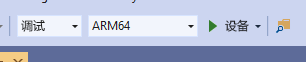

# <a name="quickstart-deploy-native-c-sample-to-hololens"></a>快速入门：将原生 C++ 示例部署到 HoloLens

本快速入门介绍如何在 HoloLens 2 上部署和运行本机 C++ 教程应用程序。

本快速入门将介绍以下操作：

> [!div class="checklist"]
>
>* 为 HoloLens 构建教程应用程序。
>* 更改源代码中的 ARR 凭据。
>* 在设备上部署并运行示例。

## <a name="prerequisites"></a>先决条件

若要获取对 Azure 远程渲染服务的访问权限，首先需要[创建一个帐户](../../../how-tos/create-an-account.md)。

必须安装以下软件：

* Windows SDK 10.0.18362.0[（下载）](https://developer.microsoft.com/windows/downloads/windows-10-sdk)
* Visual Studio 2019 最新版本[（下载）](https://visualstudio.microsoft.com/vs/older-downloads/)
* [适用于混合现实的 Visual Studio Tools](https://docs.microsoft.com/windows/mixed-reality/install-the-tools)。 具体来说，必须安装以下工作负载：
  * **使用 C++ 的桌面开发**
  * **通用 Windows 平台 (UWP) 开发**
* GIT[（下载）](https://git-scm.com/downloads)。

## <a name="clone-the-arr-samples-repository"></a>克隆 ARR 示例存储库

第一步，克隆 Git 存储库，其中包含公共的 Azure 远程渲染示例。 打开命令提示符（在 Windows 开始菜单中键入 `cmd`），并切换到要在其中存储 ARR 示例项目的目录。

运行以下命令：

```cmd
mkdir ARR
cd ARR
git clone https://github.com/Azure/azure-remote-rendering
```

最后一个命令会在 ARR 目录中创建一个子目录，其中包含 Azure 远程渲染的各个示例项目。

C++ HoloLens 教程位于子目录 NativeCpp/HoloLens 中。

## <a name="build-the-project"></a>生成项目

使用 Visual Studio 2019 打开位于 NativeCpp/HoloLens 子目录中的解决方案文件 HolographicApp.sln 。

将生成配置切换为“调试”（或“发布”）和“ARM64”  。 此外，还要确保将调试程序模式设置为“设备”，而不是“远程计算机” ：



由于帐户凭据在教程的源代码中进行了硬编码，因此请将其更改为有效凭据。 为此，请在 Visual Studio 中打开文件 `HolographicAppMain.cpp` 并更改类 `HolographicAppMain` 的构造函数中创建前端的部分：


```cpp
// 2. Create front end
{
    // Users need to fill out the following with their account data and model
    RR::AzureFrontendAccountInfo init;
    init.AccountId = "00000000-0000-0000-0000-000000000000";
    init.AccountKey = "<account key>";
    init.AccountDomain = "westus2.mixedreality.azure.com"; // <change to your region>
    m_modelURI = "builtin://Engine";
    m_sessionOverride = ""; // If there is a valid session ID to re-use, put it here. Otherwise a new one is created
    m_frontEnd = RR::ApiHandle(RR::AzureFrontend(init));
}
```

具体而言，请更改以下值：
* 更改 `init.AccountId` 和 `init.AccountKey` 以使用帐户数据。 请参阅有关如何[检索帐户信息](../../../how-tos/create-an-account.md#retrieve-the-account-information)的段落。
* 将 `init.AccountDomain` 字符串中的区域部分更改为 `westus2` 以外的其他区域，例如 `"westeurope.mixedreality.azure.com"`
* 此外，可以将 `m_sessionOverride` 更改为现有会话 ID。 可在此示例外部创建会话。例如，可使用 [powershell 脚本](../../../samples/powershell-example-scripts.md#script-renderingsessionps1)或直接使用[会话 REST API](../../../how-tos/session-rest-api.md#create-a-session) 执行此操作。
当示例应多次运行时，建议在示例外部创建会话。 如果未传入任何会话，则该示例将在每次启动时创建一个新会话，这可能需花费几分钟的时间。

现在可以编译该应用程序了。

## <a name="launch-the-application"></a>启动应用程序

1. 使用 USB 数据线将 HoloLens 连接到电脑。
1. 打开 HoloLens 并等待，直到显示开始菜单。
1. 在 Visual Studio 中启动调试器 (F5)。 此时会自动将该应用部署到设备。

随即系统应会启动示例应用，并显示一个文本面板，通知你当前的应用程序状态。 启动时的状态为“正在启动新会话”或“正在连接到现有会话”。 模型加载完成后，内置引擎模型会直接显示在头位置。 在遮挡方面，引擎模型与本地呈现的旋转多维数据集正确交互。

 如果以后想要再次启动该示例，也可以在 HoloLens 开始菜单中找到它，但请注意，其中可能编译了一个过期的会话 ID。

## <a name="next-steps"></a>后续步骤

此快速入门以教程的结果为基础，该教程说明了如何将所有与远程渲染相关的部分集成到常用全息应用中。 若要了解必需的步骤，请遵循本教程：

> [!div class="nextstepaction"]
> [教程：将远程渲染集成到 HoloLens 全息应用](../../../tutorials/native-cpp/hololens/integrate-remote-rendering-into-holographic-app.md)
