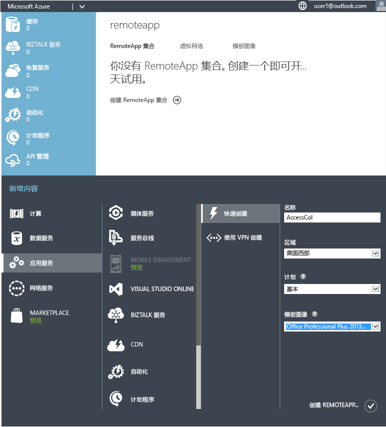
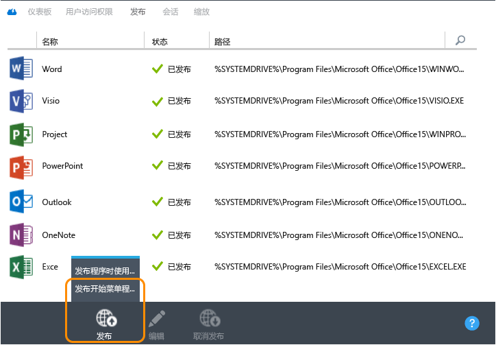
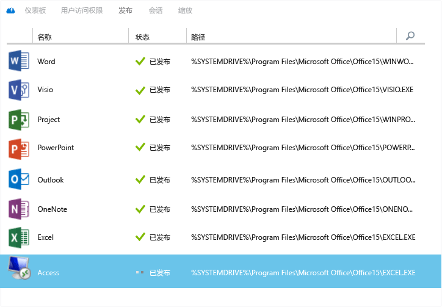
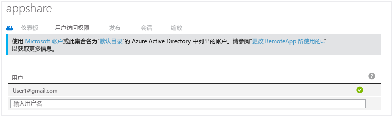
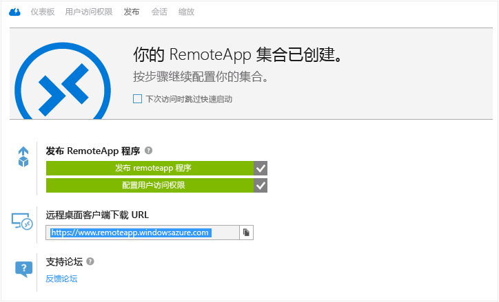
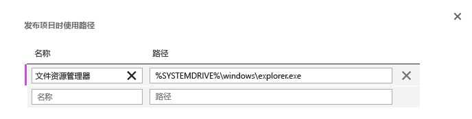
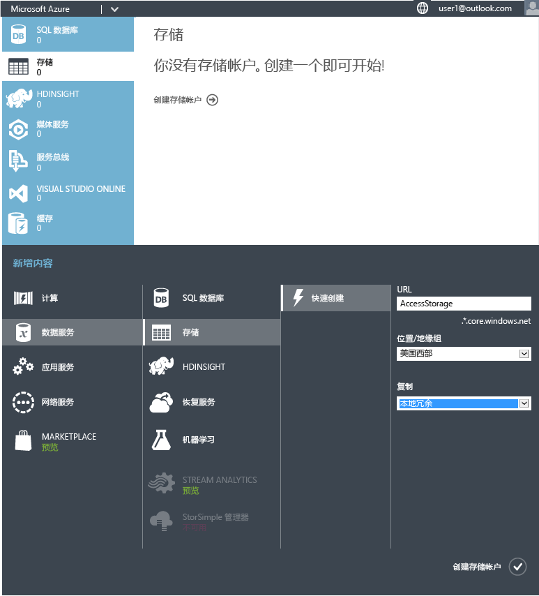
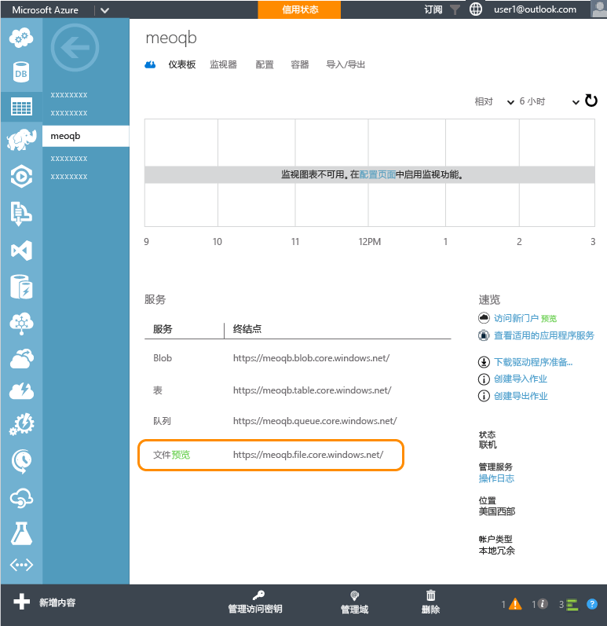
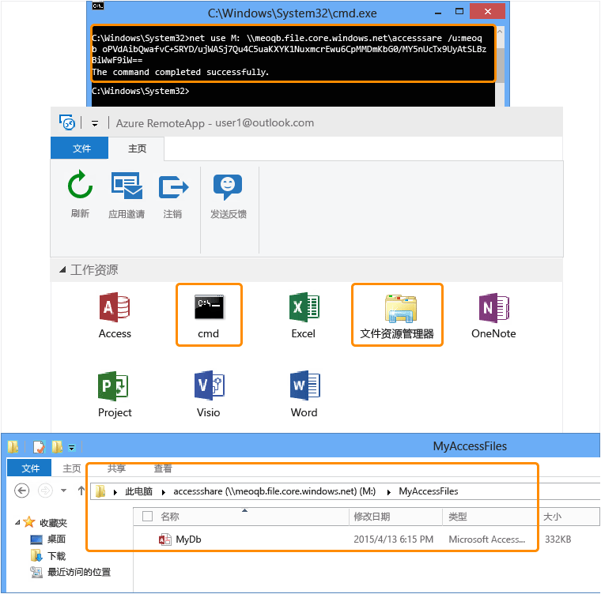
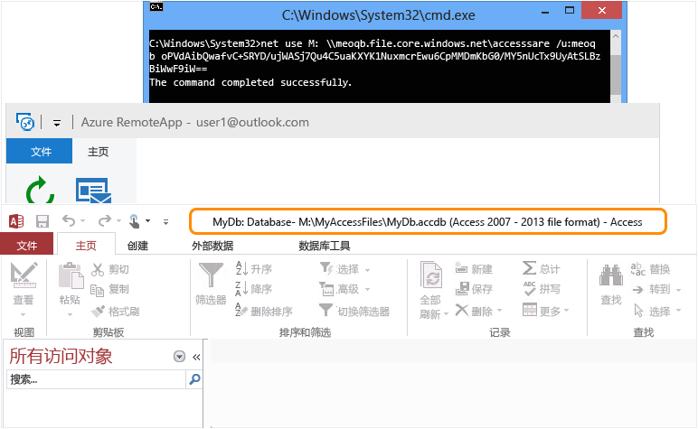

<properties
   pageTitle="使用 Azure RemoteApp 在任何设备上运行任何 Windows 应用 | Microsoft Azure"
   description="了解如何使用 Azure RemoteApp 与用户共享任何 Windows 应用。"
   services="remoteapp"
   documentationCenter=""
   authors="lizap"
   manager="mbaldwin"
   editor=""/>

<tags
   ms.service="remoteapp"
   ms.devlang="na"
   ms.topic="hero-article"
   ms.tgt_pltfrm="na"
   ms.workload="compute"
   ms.date="08/15/2016"
   ms.author="elizapo"/>

# 使用 Azure RemoteApp 在任何设备上运行任何 Windows 应用

> [AZURE.IMPORTANT]
Azure RemoteApp 将要停用。阅读[公告](https://go.microsoft.com/fwlink/?linkid=821148)了解详细信息。

现在可以在任何设备上的任意位置运行 Windows 应用程序，真的 - 只需使用 Azure RemoteApp。无论是 10 年前编写的自定义应用程序还是 Office 应用，用户不再需要为这几个应用程序绑定到特定操作系统（如 Windows XP）。

有了 Azure RemoteApp，用户还可以使用他们自己的 Android 或 Apple 设备获得他们在 Windows（或 Windows Phone）上获得的相同体验。这是通过在 Azure 的一组 Windows 虚拟机上托管 Windows 应用程序实现的 - 用户可以从具有 Internet 连接的任意位置访问这些应用程序。

下面将举例说明如何执行此操作。

在本文中，我们将与所有用户共享 Access。但是，你可以使用任何应用。只要可以在 Windows Server 2012 R2 计算机上安装应用，就可以使用以下步骤共享它。可以查看[应用要求](remoteapp-appreqs.md)以确保应用可以正常工作。

请注意，由于 Access 是一个数据库，我们希望该数据库非常有用，因此我们将执行一些额外步骤来让用户访问 Access 数据共享。如果你的应用不是数据库，或者不需要用户能够访问文件共享，可以跳过本教程中的这些步骤

> [AZURE.NOTE]  你需要一个 Azure 帐户才能完成本教程：
> - 可以[免费建立一个 Azure 帐户](https://azure.microsoft.com/free/?WT.mc_id=A261C142F)：获取可用来试用付费版 Azure 服务的信用额度，甚至在用完信用额度后，你仍可以保留帐户和使用免费的 Azure 服务（如网站）。你的信用卡将永远不会付费，除非你显式更改设置并要求付费。
> - 你可以[激活 MSDN 订户权益](https://azure.microsoft.com/pricing/member-offers/msdn-benefits-details/?WT.mc_id=A261C142F)：MSDN 订阅每月为你提供可用来试用付费版 Azure 服务的信用额度。

## 在 RemoteApp 中创建集合

首先，创建集合。集合可作为应用和用户的容器。每个集合均基于映像 - 可以创建自己的映像或使用订阅提供的映像。在本教程中，使用 Office 2013 试用版映像（其中包含要共享的应用）。

1. 在 Azure 门户中，向下滚动左侧的导航树，直到看到 RemoteApp。打开该页。
2. 单击“创建 RemoteApp 集合”。
3. 单击“快速创建”，然后输入集合的名称。
4. 选择要用于创建集合的区域。为获得最佳体验，请选择地理上最接近用户将访问应用的位置的区域。例如，在本教程中，用户位于华盛顿州雷蒙德市。最接近的 Azure 区域是“美国西部”。
5. 选择要使用的计费计划。基本计费计划将 16 个用户置于一个大型 Azure VM 中，而标准计费计划将 10 个用户置于一个大型 Azure VM 中。作为常规示例，基本计划适用于数据条目类型工作流。对于生产力应用（如 Office），可能想要使用标准计划。
6. 最后，选择 Office 2013 Professional 映像。此映像包含 Office 2013 应用。提醒一下 - 此映像仅适用于试用集合和 POC。不能在生产集合中使用此映像。
7. 现在，单击“创建 RemoteApp 集合”。

这将开始创建集合，但可能最多需要一小时。

现在可以添加用户了。

## 与用户共享应用

成功创建集合后，便可以向用户发布 Access 并添加应有权访问它的用户。

如果在创建集合时已离开 Azure RemoteApp 节点，首先要做的是从 Azure 主页导航回该节点。

2. 单击先前创建的集合，访问其他选项并配置该集合。
3. 在“发布”选项卡上，单击屏幕底部的“发布”，然后单击“发布开始菜单程序”。
4. 从列表中选择要发布的应用。出于我们的目的，选择“Access”。单击“完成”。等待应用完成发布。

1. 应用完成发布后，直接转到“用户访问”选项卡，添加需要访问该应用的所有用户。输入用户的用户名（电子邮件地址），然后单击“保存”。

1. 现在，可以告诉用户有关这些新应用的信息以及如何访问这些应用。为此，请向用户发送一封电子邮件，其中引导他们访问远程桌面客户端下载 URL。

## 配置对 Access 的访问权限

通过 RemoteApp 部署后，某些应用需要额外配置。具体来说，对于 Access，要在 Azure 上创建任何用户都可以访问的文件共享。（如果不想这么做，可以创建[混合集合](remoteapp-create-hybrid-deployment.md) [而不是云集合]，让用户访问你的本地网络中的文件和信息。） 然后，需要让用户将其计算机上的本地驱动器映射到 Azure 文件系统。

第一部分你以管理员身份执行。然后，用户需要执行一些步骤。

1. 首先，发布命令行界面 (cmd.exe)。在“发布”选项卡上，选择“cmd”，然后单击“发布”>“使用路径发布程序”。
2. 输入应用的名称和路径。出于我们的目的，使用“File Explorer”作为名称，使用“%SYSTEMDRIVE%\\windows\\explorer.exe”作为路径。
3. 现在，需要创建 Azure [存储帐户](../storage/storage-create-storage-account.md)。我们将其命名为“accessstorage”，因此请选择对你有意义的名称。（若要错误地引用 Highlander，只能有一个“accessstorage”。）
4. 现在，回到仪表板，以便可以获取存储的路径（终结点位置）。将要使用几次此路径，因此请确保将它复制到某个位置。
5. 创建存储帐户后，接下来，需要主访问密钥。单击“管理访问密钥”，然后复制主访问密钥。
6. 现在，设置存储帐户的上下文，并新建 Access 的文件共享。在权限提升的 Windows PowerShell 窗口中运行以下 cmdlet：

        $ctx=New-AzureStorageContext <account name> <account key>
    	$s = New-AzureStorageShare <share name> -Context $ctx

	因此，对于我们的共享，以下是要运行的 cmdlet：

	    $ctx=New-AzureStorageContext accessstorage <key>
    	$s = New-AzureStorageShare <share name> -Context $ctx

现在，轮到用户进行操作了。首先，让用户安装 [RemoteApp 客户端](remoteapp-clients.md)。接下来，用户需要从其帐户将驱动器映射到你创建的 Azure 文件共享，并添加其 Access 文件。以下是用户执行该操作的方法：

1. 在 RemoteApp 客户端中，访问已发布的应用。启动 cmd.exe 程序。
2. 运行以下命令，将计算机中的驱动器映射到文件共享：

		net use z: \<accountname>.file.core.windows.net<share name> /u:<user name> <account key>

	如果将 **/persistent** 参数设为“yes”，则映射的驱动器将在会话之间保持。
1. 现在，从 RemoteApp 启动 File Explorer 应用。将要在共享的应用中使用的任何 Access 文件复制到文件共享。
1. 最后，打开 Access，然后打开刚共享的数据库。应在从云运行的 Access 中看到你的数据。

现在可以在任何设备上使用 Access - 只需确保已安装 RemoteApp 客户端。

<!--Every topic should have next steps and links to the next logical set of content to keep the customer engaged-->
## 后续步骤

已学会创建集合后，请尝试创建[使用 Office 365 的集合](remoteapp-tutorial-o365anywhere.md)。也可以创建能够访问本地网络的[混合集合](remoteapp-create-hybrid-deployment.md)。

<!--Image references-->
 

<!---HONumber=AcomDC_0921_2016-->