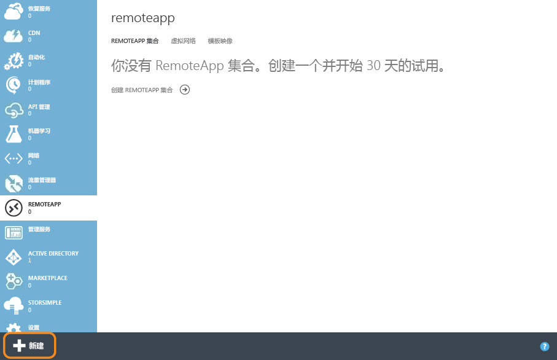
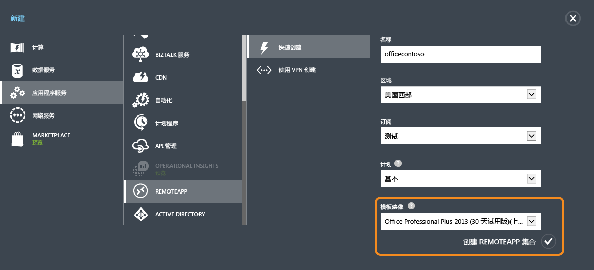
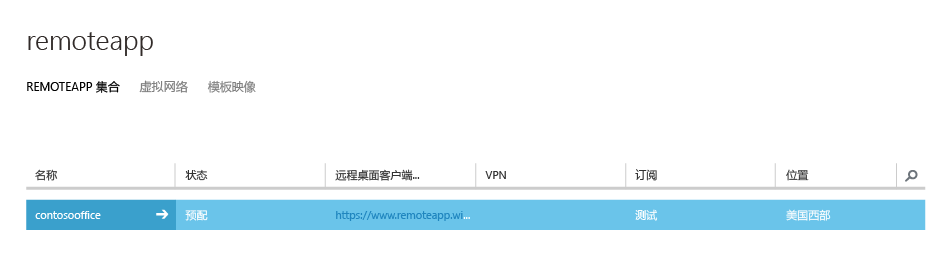
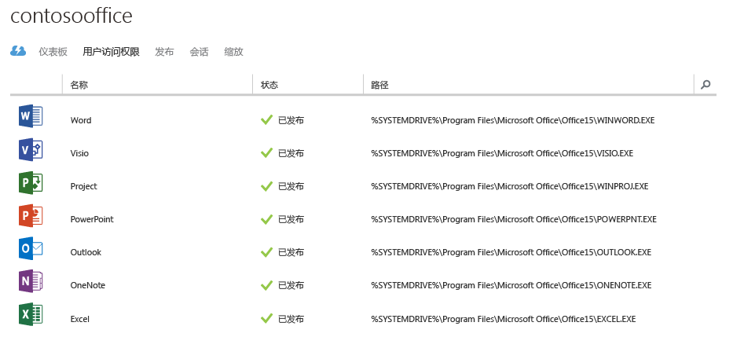
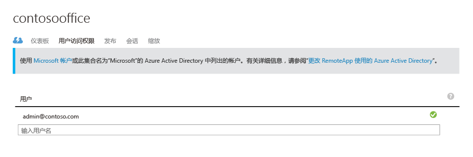
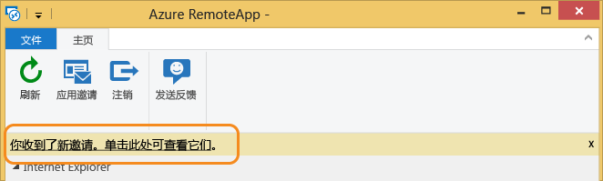
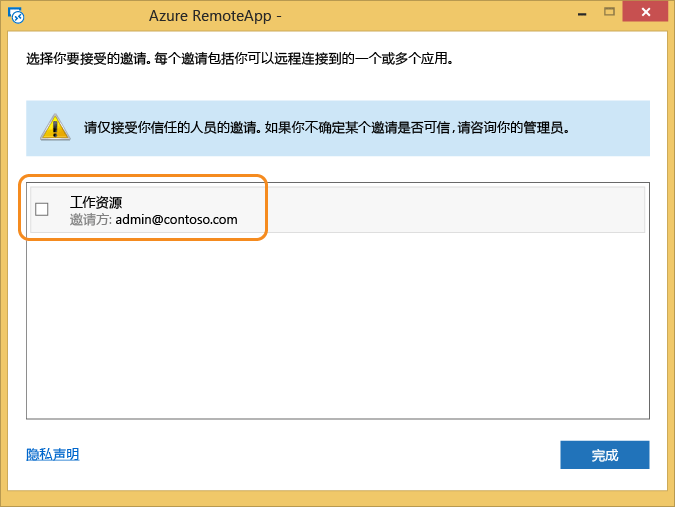
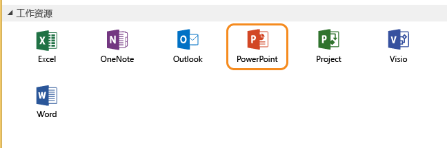
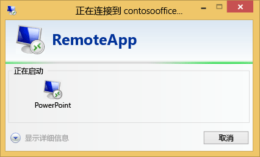
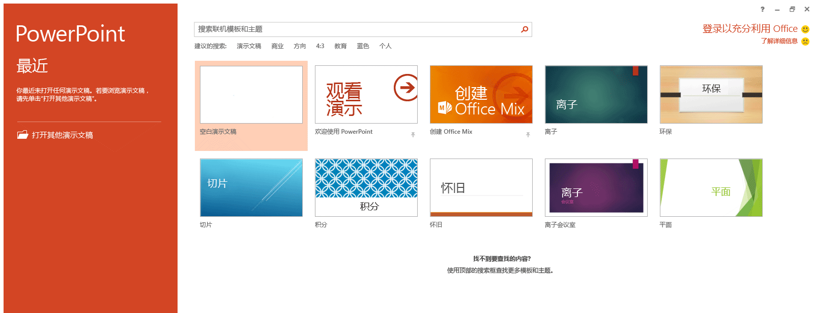

<properties
   pageTitle="使用 Azure RemoteApp 在任何设备上获取相同的 Office 365 体验 | Microsoft Azure"
   description="了解如何通过 Azure RemoteApp 与你的用户共享任何 Office 365 应用。"
   services="remoteapp"
   documentationCenter=""
   authors="guscatalano"
   manager="mbaldwin"
   editor=""/>

<tags
   ms.service="remoteapp"
   ms.devlang="na"
   ms.topic="hero-article"
   ms.tgt_pltfrm="na"
   ms.workload="compute"
   ms.date="08/15/2016"
   ms.author="guscatal;elizapo"/>

# 使用 Azure RemoteApp 在任何设备上获取相同的 Office 365 体验

> [AZURE.IMPORTANT]
正在中断 Azure RemoteApp。请阅读[公告](https://go.microsoft.com/fwlink/?linkid=821148)了解详细信息。

本文将介绍如何在你公司的任何设备上部署 Office 365。你的用户可以在 Android、Apple 和 Windows 设备上获取相同的功能和用户界面体验。

我们将在用户可连接到的 Azure 中，将 Office 365 托管到可扩展的虚拟上，以此来通过 Azure RemoteApp 实现此目标。我们将此组虚拟机称为“云集合”。

## 创建云集合

首次创建一个 Azure 帐户后，单击左侧的链接导航到 **RemoteApp**。

然后继续单击底部的“**新建**”并快速创建一个集合。提供名称、区域、订阅、计划和我们提供的映像“Office Proffesional 2013”。

完成这个表单后，即启动集合创建过程。这可能需要一个小时左右。

完成该过程后，它将如下所示。如果单击“**发布**”可看到大多数 Office 应用程序已发布。

此时，你可以通过单击“**用户访问**”添加有权访问此集合的更多用户。

现在让我们来尝试连接到 Office 365！

## 连接到 Office 365

我们将转到 [https://www.remoteapp.windowsazure.com/](https://www.remoteapp.windowsazure.com/)，向下滚动并单击“**下载客户端**”以在你使用的设备上安装 Azure RemoteApp 客户端。下面的屏幕截图适用于 Windows。

应用程序启动后，系统将要求你使用 Microsoft 帐户（以前称为“Live ID”）登录，请先将同一个帐户作为你的 Azure 帐户。登录后应会看到一个有关新邀请的通知，单击那里，应会看到一个类似下面的列表。接受与 Azure 帐户所有者电子邮件地址相匹配的邀请。

出现新邀请时的屏幕。

接受邀请后，你应看到 Azure RemoteApp 客户端中的所有 Office 应用程序。

单击任一应用程序，它将在 Azure 虚拟机上启动并完成全部设置！ 请尽情享受其中的乐趣！

<!---HONumber=AcomDC_0921_2016-->