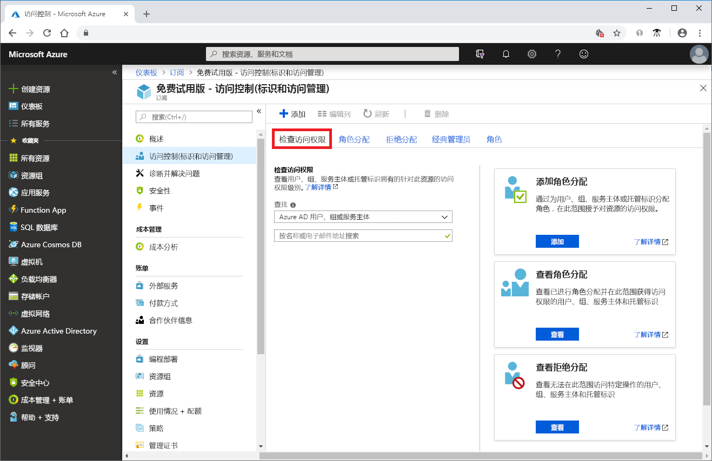
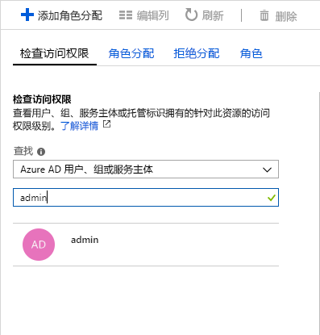
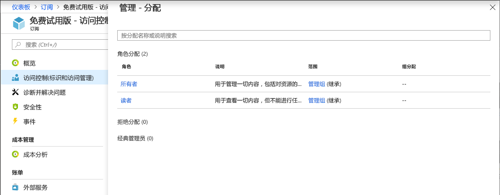

# 快速入门：使用 Azure 门户查看分配给用户的角色

可以使用[基于角色的访问控制 (RBAC)](overview.md) 中的“访问控制(IAM)”边栏选项卡查看多个用户、组、服务主体和托管标识的角色分配，但有时你只需要快速查看单个用户、组、服务主体或托管标识的角色分配。 执行此操作的最简单方法是使用 Azure 门户中的**检查访问权限**功能。

## 查看角色分配

按照以下步骤查看订阅范围内单个用户、组、服务主体或托管标识的角色分配。

1. 在 Azure 门户中，依次单击“所有服务”、“订阅”。

1. 单击你的订阅。

1. 单击“访问控制(IAM)”。

1. 单击“检查访问权限”选项卡。

    

1. 在“查找”列表中，选择要检查访问权限的安全主体类型。

1. 在搜索框中，输入字符串以在目录中搜索显示名称、电子邮件地址或对象标识符。

    

1. 单击安全主体以打开“分配”窗格。

    

    在此窗格中，可以看到分配给所选安全主体和范围的角色。 如果此范围内有任何拒绝分配或继承到此范围的角色，则会将其列出。

## 后续步骤

> [!div class="nextstepaction"]
> [教程：使用 RBAC 和 Azure 门户为用户授予访问权限](quickstart-assign-role-user-portal.md)
