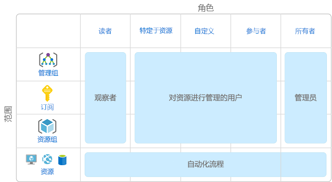
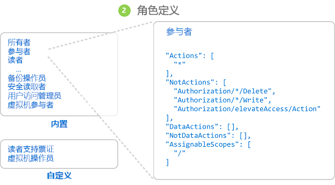
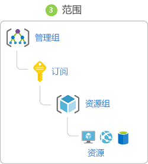
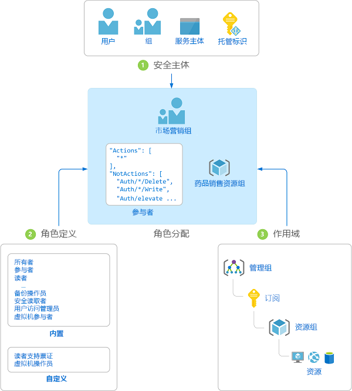
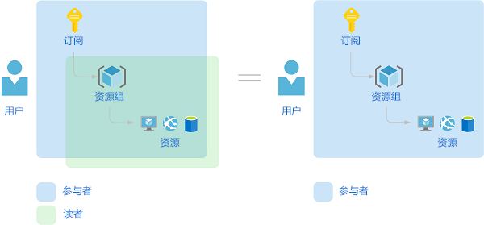

# 什么是 Azure 资源的基于角色的访问控制 (RBAC)？

对于任何使用云的组织而言，云资源的访问权限管理都是一项重要功能。 基于角色的访问控制 (RBAC) 可帮助你管理谁有权访问 Azure 资源、他们可以对这些资源执行哪些操作以及他们有权访问哪些区域。

RBAC 是在 [Azure 资源管理器](../azure-resource-manager/resource-group-overview.md)基础上构建的授权系统，针对 Azure 资源提供精细的访问权限管理。

## RBAC 的作用是什么？

下面是 RBAC 的作用的一些示例：

- 允许一个用户管理订阅中的虚拟机，并允许另一个用户管理虚拟网络
- 允许 DBA 组管理订阅中的 SQL 数据库
- 允许某个用户管理资源组中的所有资源，例如虚拟机、网站和子网
- 允许某个应用程序访问资源组中的所有资源

## 使用 RBAC 的最佳做法

使用 RBAC，可以在团队中实现职责分离，仅向用户授予执行作业所需的访问权限。 无需向每个人授予 Azure 订阅或资源的无限制权限，可以仅允许在特定的范围执行某些操作。

规划访问控制策略时，最佳做法是授予用户完成工作所需的最低权限。 下图显示了与 RBAC 使用有关的建议模式。

## RBAC 的工作原理

使用 RBAC 控制资源访问权限的方式是创建角色分配。 这是一个需要理解的重要概念 — 它涉及到如何强制实施权限。 角色分配包含三个要素：安全主体、角色订阅和范围。

### 安全主体

安全主体是一个对象，表示请求访问 Azure 资源的用户、组、服务主体或托管标识。 

- 用户 - 在 Azure Active Directory 中具有配置文件的人员。 也可以将角色分配到其他租户中的用户。 有关其他组织中的用户的信息，请参阅 [Azure Active Directory B2B](../active-directory/b2b/what-is-b2b.md)。
- 组 - 在 Azure Active Directory 中创建的一组用户。 将某个角色分配到某个组时，该组中的所有用户都拥有该角色。 
- 服务主体 - 应用程序或服务用来访问特定 Azure 资源的安全标识。 可将服务主体视为应用程序的用户标识（用户名和密码或证书）。 
- 托管标识 - Azure Active Directory 中由 Azure 自动托管的标识。 在开发云应用程序时，通常使用[托管标识](../active-directory/managed-identities-azure-resources/overview.md)来管理用于向 Azure 服务进行身份验证的凭据。

### 角色定义

角色定义是权限的集合。  它通常直接称为“角色”。  角色定义列出可以执行的操作，例如读取、写入和删除。 角色可以是高级别的（例如所有者），也可以是特定的（例如虚拟机读取者）。

Azure 包含多个可用的[内置角色](built-in-roles.md)。 下面列出了四个基本的内置角色。 前三个角色适用于所有资源类型。

- [所有者](built-in-roles.md#owner) - 拥有对所有资源的完全访问权限，包括将访问权限委派给其他用户的权限。
- [参与者](built-in-roles.md#contributor) - 可以创建和管理所有类型的 Azure 资源，但无法将访问权限授予其他用户。
- [读取者](built-in-roles.md#reader) - 可以查看现有的 Azure 资源。
- [用户访问管理员](built-in-roles.md#user-access-administrator) - 允许你管理用户对 Azure 资源的访问。

剩余的内置角色允许管理特定的 Azure 资源。 例如，[虚拟机参与者](built-in-roles.md#virtual-machine-contributor)角色允许用户创建和管理虚拟机。 如果内置角色不能满足组织的特定需求，则可以[为 Azure 资源创建你自己的自定义角色](custom-roles.md)。

Azure 具有数据操作，通过这些操作可以授予对对象内数据的访问权限。 例如，如果某个用户对某个存储帐户拥有读取数据的访问权限，则该用户可以读取该存储帐户中的 Blob 或消息。 有关详细信息，请参阅[了解 Azure 资源的角色定义](role-definitions.md)。

### 范围

范围是访问权限适用于的资源集。  分配角色时，可以通过定义范围来进一步限制允许的操作。 如果你想要将某人分配为[网站参与者](built-in-roles.md#website-contributor)，但只针对一个资源组执行此分配，则使用范围就很有帮助。

在 Azure 中，可在多个级别指定范围：[管理组](../governance/management-groups/overview.md)、订阅、资源组或资源。 范围采用父子关系结构。

在父范围授予访问权限时，这些权限会继承到子范围。 例如：

- 如果将[所有者](built-in-roles.md#owner)角色分配给管理组范围的用户，则该用户可以在管理组中管理所有订阅中的一切内容。
- 如果在订阅范围向某个组分配了[读取者](built-in-roles.md#reader)角色，则该组的成员可以查看订阅中的每个资源组和资源。
- 如果在资源组范围向某个应用程序分配了[参与者](built-in-roles.md#contributor)角色，则该应用程序可以管理该资源组中所有类型的资源，但不能管理订阅中的其他资源组资源。

### 角色分配

角色分配是出于授予访问权限的目的，将角色定义附加到特定范围内的用户、组、服务主体或托管标识的过程。  通过创建角色分配来授予访问权限，通过删除角色分配来撤销访问权限。

下图显示了角色分配的示例。 在此示例中，为“营销”组分配了医药销售资源组的[参与者](built-in-roles.md#contributor)角色。 这意味着，“营销”组中的用户可以在医药销售资源组中创建或管理任何 Azure 资源。 “营销”用户无权访问医药销售资源组外部的资源，除非他们属于另一个角色分配。

可以使用 Azure 门户、Azure CLI、Azure PowerShell、Azure SDK 或 REST API 创建角色分配。 每个订阅中最多可以有 **2000** 个角色分配，每个管理组中最多可以有 **500** 个角色分配。 若要创建和删除角色分配，必须拥有 `Microsoft.Authorization/roleAssignments/*` 权限。 此权限是通过[所有者](built-in-roles.md#owner)或[用户访问管理员](built-in-roles.md#user-access-administrator)角色授予的。

## 多角色分配

如果有多个重叠的角色分配，将会发生什么情况？ RBAC 是一个加法模型，因此，生效的权限是角色分配相加。 请考虑以下示例，其中在订阅范围内向用户授予了“参与者”角色，并且授予了对资源组的“读者”角色。 “参与者”权限与“读者”权限相加实际上是资源组的“参与者”角色。 因此，在这种情况下，“读者”角色分配没有任何影响。

## 拒绝分配

以前，RBAC 是一种仅允许模型，没有拒绝功能，但 RBAC 现在以有限方式支持拒绝分配。 *拒绝分配*类似于角色分配，可将一组拒绝操作附加到特定范围内的用户、组、服务主体或托管标识，以便拒绝访问。 角色分配定义了一组允许  的操作，而拒绝分配定义了一组不允许  的操作。 换而言之，即使角色分配授予用户访问权限，拒绝分配也会阻止用户执行指定的操作。 拒绝分配优先于角色分配。 有关详细信息，请参阅[了解 Azure 资源的拒绝分配](deny-assignments.md)。

## RBAC 如何确定用户是否有权访问资源

以下是 RBAC 用于确定你是否可以访问管理平面上的资源的高级步骤。 如果正在尝试对访问问题进行故障排除，这有助于了解问题。

1. 用户（或服务主体）获取 Azure 资源管理器的令牌。

    令牌包含用户的组成员身份（包括可传递的组成员身份）。

1. 用户使用附加的令牌对 Azure 资源管理器发出 REST API 调用。

1. Azure 资源管理器检索适用于对其执行操作的资源的所有角色分配和拒绝分配。

1. Azure 资源管理器缩小适用于此用户或其组的角色分配范围，并确定用户针对此资源拥有的角色。

1. Azure 资源管理器确定 API 调用中的操作是否包含在用户针对此资源拥有的角色中。

1. 如果用户在请求的范围内没有具有该操作的角色，则不授予访问权限。 否则，Azure 资源管理器会检查是否适用拒绝分配。

1. 如果拒绝分配适用，则阻止访问。 否则授予访问权限。

## 许可要求

[!INCLUDE [Azure AD free license](../../includes/active-directory-free-license.md)]

## 后续步骤

- [快速入门：使用 Azure 门户查看用户对 Azure 资源的访问权限](check-access.md)
- [使用 RBAC 和 Azure 门户管理对 Azure 资源的访问权限](role-assignments-portal.md)
- [了解 Azure 中的不同角色](rbac-and-directory-admin-roles.md)
- [企业云采用：Azure 中的资源访问管理](/azure/cloud-adoption-framework/govern/resource-consistency/resource-access-management)
