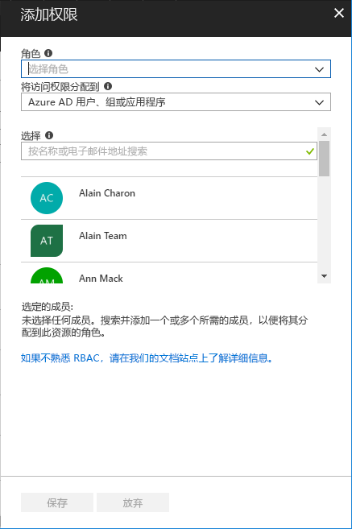

# 快速入门：使用 RBAC 和 Azure 门户为用户授予访问权限

基于角色的访问控制 (RBAC) 是 Azure 中用来管理对资源的访问权限的方式。 在本快速入门中，你将授权用户在某个资源组中创建和管理虚拟机。

如果没有 Azure 订阅，请在开始之前创建一个[免费帐户](https://azure.microsoft.com/free/?WT.mc_id=A261C142F)。

## 登录 Azure

通过 http://portal.azure.com 登录到 Azure 门户。

## 创建资源组

1. 在导航列表中，选择“资源组”。

1. 选择“添加”以打开“资源组”边栏选项卡。

   

1. 对于“资源组名称”，输入 **rbac-quickstart-resource-group**。

1. 选择订阅和位置。

1. 选择“创建”以创建资源组。

1. 选择“刷新”以刷新资源组的列表。

   新资源组将出现在你的资源组列表中。

   

## 授予访问权限

在 RBAC 中，若要授予访问权限，请创建角色分配。

1. 在“资源组”列表中，选择新的 **rbac-quickstart-resource-group** 资源组。

1. 选择“访问控制(IAM)”，以查看当前的角色分配列表。

   

1. 选择“添加”，打开“添加权限”窗格。

   如果无权分配角色，则不会看到“添加”选项。

   

1. 在“角色”下拉列表中，选择“虚拟机参与者”。

1. 在“选择”列表中，选择你自己或其他用户。

1. 选择“保存”，创建角色分配。

   片刻之后，将在 rbac-quickstart-resource-group 资源组作用域为用户分配“虚拟机参与者”角色。

   

## 删除访问权限

在 RBAC 中，若要删除访问权限，请删除角色分配。

1. 在角色分配列表中，选中具有“虚拟机参与者”角色的用户旁边的复选框。

1. 选择“删除”。

   

1. 在显示的“删除角色分配”消息中，选择“是”。

## 清理

1. 在导航列表中，选择“资源组”。

1. 选择 **rbac-quickstart-resource-group** 以打开该资源组。

1. 选择“删除资源组”以删除该资源组。

   

1. 在“是否确定要删除”边栏选项卡上，键入资源组名称：**rbac-quickstart-resource-group**。

1. 选择“删除”以删除该资源组。

## 后续步骤

> [!div class="nextstepaction"]
> [教程：使用 RBAC 和 PowerShell 为用户授予访问权限](tutorial-role-assignments-user-powershell.md)

