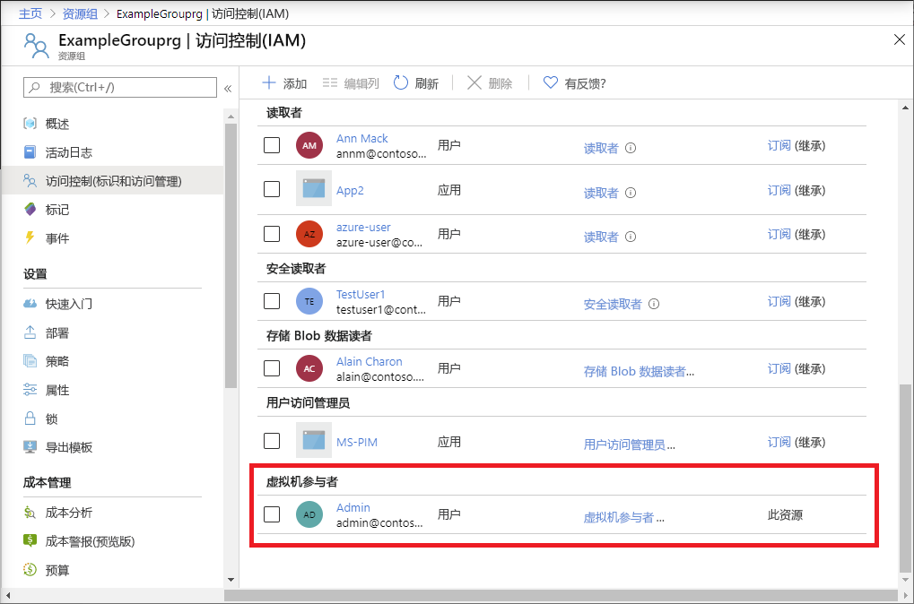

# <a name="quickstart-add-an-azure-role-assignment-using-an-arm-template"></a>快速入门：使用 ARM 模板添加 Azure 角色分配

可以通过 [Azure 基于角色的访问控制 (Azure RBAC)](overview.md) 管理对 Azure 资源的访问权限。 在本快速入门中，你将创建资源组并授予用户在资源组中创建和管理虚拟机的访问权限。 本快速入门使用 Azure 资源管理器模板（ARM 模板）授予访问权限。

[!INCLUDE [About Azure Resource Manager](../../includes/resource-manager-quickstart-introduction.md)]

如果你的环境满足先决条件，并且你熟悉如何使用 ARM 模板，请选择“部署到 Azure”按钮。 Azure 门户中会打开模板。

[](https://portal.azure.com/#create/Microsoft.Template/uri/https%3A%2F%2Fraw.githubusercontent.com%2FAzure%2Fazure-quickstart-templates%2Fmaster%2F101-rbac-builtinrole-resourcegroup%2Fazuredeploy.json)

## <a name="prerequisites"></a>先决条件

若要添加角色分配，必须具有：

- 如果没有 Azure 订阅，请在开始之前创建一个[免费帐户](https://azure.microsoft.com/free/?WT.mc_id=A261C142F)。
- `Microsoft.Authorization/roleAssignments/write` 和 `Microsoft.Authorization/roleAssignments/delete` 权限，例如[用户访问管理员](built-in-roles.md#user-access-administrator)或[所有者](built-in-roles.md#owner)
- 若要添加角色分配，必须指定三个要素：安全主体、角色订阅和范围。 在本快速入门中，安全主体是你或目录中的其他用户，角色定义是[虚拟机参与者](built-in-roles.md#virtual-machine-contributor)，范围是指定的资源组。

## <a name="review-the-template"></a>查看模板

本快速入门中使用的模板来自 [Azure 快速启动模板](https://azure.microsoft.com/resources/templates/101-rbac-builtinrole-resourcegroup/)。 该模板具有三个参数和资源部分。 请注意，资源部分包含角色分配的三个要素：安全主体、角色定义和作用域。

:::code language="json" source="~/quickstart-templates/101-rbac-builtinrole-resourcegroup/azuredeploy.json":::

该模板中定义了以下资源：

- [Microsoft.Authorization/roleAssignments](/azure/templates/Microsoft.Authorization/roleAssignments)

## <a name="deploy-the-template"></a>部署模板

1. 登录 [Azure 门户](https://portal.azure.com)。

1. 确定与 Azure 订阅关联的电子邮件地址。 或确定目录中其他用户的电子邮件地址。

1. 打开适用于 PowerShell 的 Azure Cloud Shell。

1. 复制以下脚本并将其粘贴到 Cloud Shell 中。

    ```azurepowershell
    $resourceGroupName = Read-Host -Prompt "Enter a resource group name (i.e. ExampleGrouprg)"
    $emailAddress = Read-Host -Prompt "Enter an email address for a user in your directory"
    $location = Read-Host -Prompt "Enter a location (i.e. centralus)"
    
    $roleAssignmentName = New-Guid
    $principalId = (Get-AzAdUser -Mail $emailAddress).id
    $roleDefinitionId = (Get-AzRoleDefinition -name "Virtual Machine Contributor").id
    $templateUri = "https://raw.githubusercontent.com/Azure/azure-quickstart-templates/master/101-rbac-builtinrole-resourcegroup/azuredeploy.json"
    
    New-AzResourceGroup -Name $resourceGroupName -Location $location
    New-AzResourceGroupDeployment -ResourceGroupName $resourceGroupName -TemplateUri $templateUri -roleAssignmentName $roleAssignmentName -roleDefinitionID $roleDefinitionId -principalId $principalId
    ```

1. 输入资源组名称，例如 ExampleGrouprg。

1. 输入自己的电子邮件地址或目录中其他用户的电子邮件地址。

1. 输入资源组的位置，例如 centralus。

1. 如有必要，请按 Enter 运行 New-AzResourceGroupDeployment 命令。

    [New-AzResourceGroup](/powershell/module/az.resources/new-azresourcegroup) 命令创建新的资源组，[New-AzResourceGroupDeployment](/powershell/module/az.resources/new-azresourcegroupdeployment) 命令部署模板以添加角色分配。

    应该会看到与下面类似的输出：

    ```azurepowershell
    PS> New-AzResourceGroupDeployment -ResourceGroupName $resourceGroupName -TemplateUri $templateUri -roleAssignmentName $roleAssignmentName -roleDefinitionID $roleDefinitionId -principalId $principalId
    
    DeploymentName          : azuredeploy
    ResourceGroupName       : ExampleGrouprg
    ProvisioningState       : Succeeded
    Timestamp               : 5/22/2020 9:01:30 PM
    Mode                    : Incremental
    TemplateLink            :
                              Uri            : https://raw.githubusercontent.com/Azure/azure-quickstart-templates/master/101-rbac-builtinrole-resourcegroup/azuredeploy.json
                              ContentVersion : 1.0.0.0
    
    Parameters              :
                              Name                  Type                       Value
                              ====================  =========================  ==========
                              roleAssignmentName    String                     {roleAssignmentName}
                              roleDefinitionID      String                     9980e02c-c2be-4d73-94e8-173b1dc7cf3c
                              principalId           String                     {principalId}
    
    Outputs                 :
    DeploymentDebugLogLevel :
    ```

## <a name="review-deployed-resources"></a>查看已部署的资源

1. 在 Azure 门户中打开创建的资源组。

1. 在左侧菜单中，单击“访问控制(IAM)”。

1. 单击“角色分配”选项卡。

1. 验证是否已将“虚拟机参与者”角色分配给指定的用户。

   

## <a name="clean-up-resources"></a>清理资源

若要删除创建的角色分配和资源组，请执行以下步骤。

1. 复制以下脚本并将其粘贴到 Cloud Shell 中。

    ```azurepowershell
    $emailAddress = Read-Host -Prompt "Enter the email address of the user with the role assignment to remove"
    $resourceGroupName = Read-Host -Prompt "Enter the resource group name to remove (i.e. ExampleGrouprg)"
    
    $principalId = (Get-AzAdUser -Mail $emailAddress).id
    
    Remove-AzRoleAssignment -ObjectId $principalId -RoleDefinitionName "Virtual Machine Contributor" -ResourceGroupName $resourceGroupName
    Remove-AzResourceGroup -Name $resourceGroupName
    ```
    
1. 输入用户的电子邮件地址，其中包含要删除的角色分配。

1. 输入要删除的资源组名称，如 ExampleGrouprg。

1. 如有必要，请按 Enter 运行 Remove-AzResourceGroup command 命令。

1. 输入“Y”以确认要删除该资源组。

## <a name="next-steps"></a>后续步骤

> [!div class="nextstepaction"]
> [教程：使用 Azure PowerShell 授予用户对 Azure 资源的访问权限](tutorial-role-assignments-user-powershell.md)