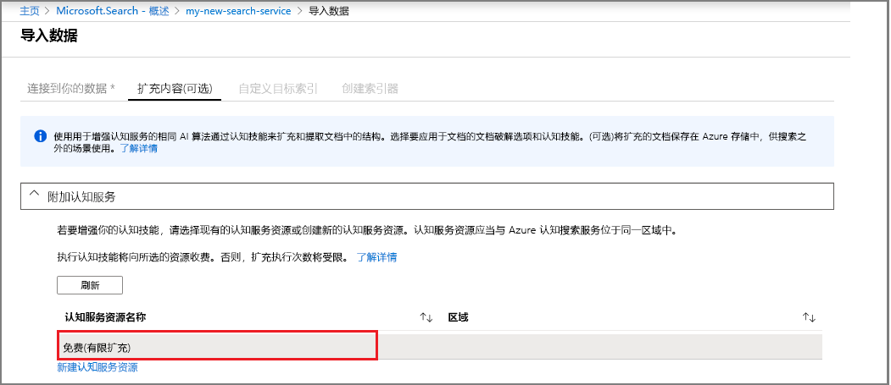

# 快速入门：使用认知技能和示例数据创建 AI 索引管道

Azure 搜索与[认知服务](https://azure.microsoft.com/services/cognitive-services/)相集成，可将内容提取、自然语言处理 (NLP) 和图像处理技能添加到 Azure 搜索索引管道，使不可搜索或非结构化的内容具有更高的可搜索性。 

许多认知服务资源（例如 [OCR](cognitive-search-skill-ocr.md)、[语言检测](cognitive-search-skill-language-detection.md)、[实体识别](cognitive-search-skill-entity-recognition.md)，等等）都可以附加到索引过程。 认知服务的 AI 算法可用于在源数据中查找模式、功能和特征，返回可用于基于 Azure 搜索的全文搜索解决方案的结构和文字内容。

本快速入门介绍如何在编写单行代码之前，在 [Azure 门户](https://portal.azure.com)中创建第一个扩充管道：

> [!div class="checklist"]
> * 从 Azure Blob 存储中的示例数据开始
> * 为认知索引编制和扩充配置[**导入数据**](search-import-data-portal.md)向导 
> * 运行向导（实体技能将检测人员、地点和组织）
> * 使用[**搜索浏览器**](search-explorer.md)查询扩充的数据

本快速入门在免费服务中运行，但免费事务数目限制为每日 20 个文档。 若要在同一天多次运行本快速入门，请使用可以运行更多次的较小文件集。

> [!NOTE]
> 通过增大处理频率、添加更多文档或添加更多 AI 算法来扩大范围时，需要附加可计费的认知服务资源。 调用认知服务中的 API，以及在 Azure 搜索中的文档破解阶段提取图像时，会产生费用。 提取文档中的文本不会产生费用。
>
> 内置技能的执行将按现有[认知服务即用即付价格](https://azure.microsoft.com/pricing/details/cognitive-services/)计费。 图像提取费用将按预览版定价计费，详见 [Azure 搜索定价页](https://go.microsoft.com/fwlink/?linkid=2042400)。 了解[详细信息](cognitive-search-attach-cognitive-services.md)。

如果没有 Azure 订阅，请在开始之前创建一个[免费帐户](https://azure.microsoft.com/free/?WT.mc_id=A261C142F)。

## 先决条件

[创建 Azure 搜索服务](search-create-service-portal.md)或在当前订阅下[查找现有服务](https://ms.portal.azure.com/#blade/HubsExtension/BrowseResourceBlade/resourceType/Microsoft.Search%2FsearchServices)。 可以使用本快速入门的免费服务。

[认知服务](https://azure.microsoft.com/services/cognitive-services/)提供 AI。 本快速入门包含了在指定管道时添加这些内联资源的步骤。 无需提前设置帐户。

需要使用 Azure 服务将输入提供给索引管道。 可以使用 [Azure 搜索索引器](search-indexer-overview.md)支持的任何数据源，但 Azure 表存储除外，因为它不支持 AI 索引。 本快速入门使用 [Azure Blob 存储](https://azure.microsoft.com/services/storage/blobs/)作为源数据文件的容器。 

### 设置 Azure Blob 服务并加载示例数据

1. [下载示例数据](https://1drv.ms/f/s!As7Oy81M_gVPa-LCb5lC_3hbS-4)，其中包括不同类型的小型文件集。 

1. [注册 Azure Blob 存储](https://docs.microsoft.com/azure/storage/common/storage-quickstart-create-account?tabs=azure-portal)，创建存储帐户，打开 Blob 服务页并创建容器。  在 Azure 搜索所在的同一区域创建存储帐户。

1. 在创建的容器中，单击“上传”以上传在上一步中下载的示例文件。

   

## 创建扩充管道

返回到 Azure 搜索服务仪表板页，单击命令栏上的“导入数据”，通过四个步骤设置认知扩充管道。

  

### 步骤 1：创建数据源

在“连接到数据”中，选择“Azure Blob 存储”，再选择创建的帐户和容器。 为数据源命名，并对余下的设置使用默认值。 

  

继续转到下一页。

  

### 步骤 2：添加认知技能

接下来，将扩充步骤添加到索引管道。 如果没有认知服务资源，可以注册每天提供 20 个事务的免费版本。 示例数据包含 14 个文件，因此运行此向导后，将最大程度使用完每日分配。

1. 展开“附加认服务”以查看用于向认知服务 API 提供资源的选项。 在本教程中，你可以使用“免费”资源。

   

2. 展开“添加扩充”并选择执行自然语言处理的技能。 在本快速入门中，我们针对人员、组织和地点选择了实体识别。

   

   门户提供了用于 OCR 处理和文本分析的内置技能。 在门户中，技能集针对单个源字段运行。 这看上去像是一个小目标，但对于 Azure Blob 而言，`content` 字段包含大部分 Blob 文档（例如，Word 文档或 PowerPoint 幻灯片）。 因此，此字段是理想的输入，因为 Blob 的所有内容都包含在其中。

3. 继续转到下一页。

   

> [!NOTE]
> 自然语言处理技能针对示例数据集中的文本内容运行。 由于我们未选择 OCR 选项，因此，本快速入门不会处理示例数据集中的 JPEG 和 PNG 文件。 

### 步骤 3：配置索引

该向导通常可以推断出默认索引。 在此步骤中，你可以查看已生成的索引架构，有时还能修改任何设置。 以下是为演示 Blob 数据集创建的默认索引。

在本快速入门中，向导能够很好地设置合理的默认值： 

+ 基于数据源类型，默认名称为 *azureblob-index*。 

+ 默认字段基于原始源数据字段 (`content`)，以及认知管道创建的输出字段（`people`、`organizations` 和 `locations`）。 默认数据类型从元数据和数据采样推断。

+ 默认密钥是 metadata_storage_path（此字段包含唯一值）。

+ 这些字段的默认属性**可检索**且**可搜索**。 Searchable 表示字段可搜索。 Retrievable 表示可以在结果中返回该字段。 向导假设你希望这些字段可检索且可搜索，因为它们是通过技能集创建的。

  

请注意 `content` 字段旁边的 **Retrievable** 属性带有删除线和问号。 对于包含大量的文本的 Blob 文档，`content` 字段包含文件主体，因此可能包含数千行。 如果需要将文件内容传递到客户端代码，请确保 **Retrievable** 保持选定状态。 否则，如果提取的元素（`people`、`organizations` 和 `locations`）足以满足需要，请考虑在 `content` 中清除此属性。

将某个字段标记为 **Retrievable** 并不意味着该字段一定会出现在搜索结果中。 可以使用 **$select** 查询参数指定要包含的字段，来精确控制搜索结果的构成。 对于包含大量文本的字段（例如 `content`），可以使用 **$select** 参数向应用程序的用户提供可管理的搜索结果，同时确保客户端代码可以通过 **Retrievable** 属性访问全部所需信息。
  
继续转到下一页。

  

### 步骤 4：配置索引器

索引器是推动索引过程的高级资源。 它指定数据源名称、目标索引和执行频率。 “导入数据”向导的最终结果始终是一个可以反复运行的索引器。

在“索引器”页中，可以接受默认名称并使用“立即运行”计划选项来立即运行它。 

  

单击“提交”以创建并同时运行索引器。

## 监视索引

完成扩充步骤所用的时间比完成编制典型的基于文本的索引所用的时间更长。 向导应在概述页打开索引器列表，以便你能够跟踪进度。 若要进行自导航，请转到“概述”页，然后单击“索引器”。

由于 JPG 和 PNG 文件都是图像文件，并且我们忽略了来自此管道的 OCR 技能，因此会出现警告。 此外，还会出现截断通知。 Azure 搜索将“免费层”的提取字符数限制为 32,000 个字符。

  

索引编制和扩充可能需要一段时间，正因如此，我们建议事先探索小型数据集。 

## 搜索浏览器中的查询

创建索引后，可以提交查询以返回索引中的文档。 在门户中，使用“搜索浏览器”来运行查询并查看结果。 

1. 在搜索服务仪表板页上，单击命令栏上的“搜索浏览器”。

1. 选择顶部的“更改索引”，选择创建的索引。

1. 输入要在其中查询索引的搜索字符串，例如 `search=Microsoft&searchFields=organizations`。

随后会返回 JSON 格式的结果。这些结果可能非常冗长且难以阅读，尤其是出现在源自 Azure Blob 的大型文档中时。 如果无法轻松扫描结果，请使用 CTRL-F 在文档中搜索。 对于此查询，可以搜索 JSON 中的特定术语。 

CTRL-F 还有助于确定有多少个文档包含在给定的结果集中。 对于 Azure Blob，门户会选择“metadata_storage_path”作为键，因为每个值是文档的唯一值。 使用 CTRL-F 搜索“metadata_storage_path”，获取文档的计数。 

  

## 要点

现已完成第一个认知扩充索引练习。 本快速入门旨在介绍重要概念，并引导你完成向导中的操作，以便使用自己的数据为认知搜索解决方案快速建立原型。

我们希望学习的某些重要概念也涉及到了 Azure 数据源的依赖关系。 认知搜索扩充与索引器密切相关，而索引器特定于 Azure 和源。 尽管本快速入门使用的是 Azure Blob 存储，但也可以使用其他 Azure 数据源。 有关详细信息，请参阅 [Azure 搜索中的索引器](search-indexer-overview.md)。

另一个重要概念是技能针对输入字段运行。 在门户中，必须为所有技能选择单个源字段。 在代码中，输入可以是其他字段，或上游技能的输出。

 技能的输入将映射到索引中的输出字段。 在内部，门户将设置[批注](cognitive-search-concept-annotations-syntax.md)并定义[技能集](cognitive-search-defining-skillset.md)，以建立操作顺序和常规流。 这些步骤隐藏在门户中，但开始编写代码时，这些概念就很重要。

最后，本快速入门提到可以通过查询索引来查看结果。 Azure 搜索最终提供的结果是一个可搜索的索引，可以[简单](https://docs.microsoft.com/rest/api/searchservice/simple-query-syntax-in-azure-search)或[全面扩展的查询语法](https://docs.microsoft.com/rest/api/searchservice/lucene-query-syntax-in-azure-search)来查询它。 包含扩充字段的索引与其他任何索引类似。 若要合并标准或[自定义分析器](search-analyzers.md)、[评分配置文件](https://docs.microsoft.com/rest/api/searchservice/add-scoring-profiles-to-a-search-index)、[同义词](search-synonyms.md)、[分面筛选器](search-filters-facets.md)、异地搜索或其他任何 Azure 搜索功能，完全可以这样做。

## 清理资源

完成探索后，最快的清理方式是删除包含 Azure 搜索服务和 Azure Blob 服务的资源组。  

假设已将这两个服务放在同一个组中，则删除该资源组会永久删除其中的所有内容，包括在本练习中创建的服务和任何存储内容。 在门户中，资源组名称显示在每个服务的“概述”页上。

## 后续步骤

根据预配认知服务资源的方式，可以结合不同的技能和源数据字段，通过重新运行该向导来体验索引和扩充功能。 若要重复步骤，请删除索引和索引器，然后使用新的选项组合重新创建索引器。

+ 在“概述” > “索引”中选择创建的索引，然后单击“删除”。

+ 在“概述”中，双击“索引器”磁贴。 找到创建的索引器并将其删除。

或者，重复使用示例数据和创建的服务，通过下一篇教程了解如何以编程方式执行相同的任务。 

> [!div class="nextstepaction"]
> [教程：了解认知搜索 REST API](cognitive-search-tutorial-blob.md)
