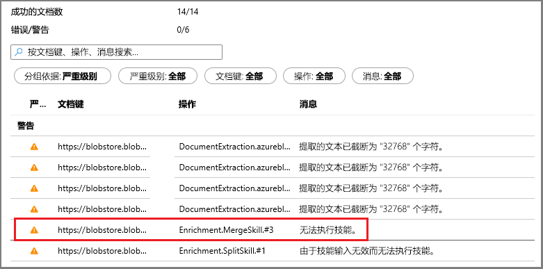
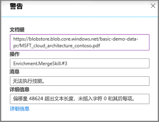

# 快速入门：在 Azure 门户中创建 Azure 认知搜索认知技能集

技能集是一项 AI 功能，它可以从大型的无差别文本或图像文件提取信息和结构，使其可编制索引并可供 Azure 认知搜索中的全文搜索查询搜索。 

在本快速入门中，你将合并 Azure 云中的服务和数据以创建技能集。 一切准备就绪后，可在门户中运行“导入数据”向导，以将这些数据提取到一起。  最终结果是一个可在门户（[搜索资源管理器](search-explorer.md)）中查询的可搜索索引，其中填充了 AI 处理功能创建的数据。

如果没有 Azure 订阅，请在开始之前创建一个[免费帐户](https://azure.microsoft.com/free/?WT.mc_id=A261C142F)。

## 创建服务并加载数据

本快速入门使用 Azure 认知搜索、[Azure Blob 存储](https://docs.microsoft.com/azure/storage/blobs/)和用于 AI 的 [Azure 认知服务](https://azure.microsoft.com/services/cognitive-services/)。 

由于工作负荷很小，因此，在从 Azure 认知搜索调用认知服务时，认知服务在幕后会抽调一部分算力来免费处理事务（每天每个索引器最多 20 个）。 只要你使用我们提供的示例数据，就可以跳过创建或附加认知服务资源的过程。

1. [下载示例数据](https://1drv.ms/f/s!As7Oy81M_gVPa-LCb5lC_3hbS-4)，其中包括不同类型的小型文件集。 解压缩文件。

1. [创建 Azure 存储帐户](https://docs.microsoft.com/azure/storage/common/storage-quickstart-create-account?tabs=azure-portal)或[查找现有帐户](https://ms.portal.azure.com/#blade/HubsExtension/BrowseResourceBlade/resourceType/Microsoft.Storage%2storageAccounts/)。 

   选择 Azure 认知搜索所在的同一区域，以避免带宽费用。 
   
   如果你希望以后在另一篇演练中试用知识存储功能，请选择 StorageV2（常规用途 V2）帐户类型。 否则请选择任意类型。

1. 打开 Blob 服务页并创建一个容器。 可以使用默认的公共访问级别。 

1. 在容器中，单击“上传”以上传在第一个步骤中下载的示例文件。  请注意，内容类型非常广泛，其中包括图像和应用程序文件，而这些内容在使用其本机格式时不支持全文搜索。

   

1. [创建 Azure 认知搜索服务](search-create-service-portal.md)或[查找现有服务](https://ms.portal.azure.com/#blade/HubsExtension/BrowseResourceBlade/resourceType/Microsoft.Search%2FsearchServices)。 可以使用本快速入门的免费服务。

现在可以在“导入数据”向导中转到下一步。

## 运行“导入数据”向导

在搜索服务的“概述”页中，单击命令栏上的“导入数据”，通过四个步骤设置认知扩充  。

  

### 步骤 1 - 创建数据源

1. 在“连接到数据”中选择“Azure Blob 存储”，然后选择创建的存储帐户和容器   。 为数据源命名，并对余下的设置使用默认值。 

   

    继续转到下一页。

### 步骤 2 - 添加认知技能

接下来，配置 AI 扩充来调用 OCR、图像分析和自然语言处理。 

1. 本快速入门将使用**免费**的认知服务资源。 示例数据包括 14 个文件，因此，认知服务免费提供的 20 个事务配额足以完成本快速入门。 

   

1. 展开“添加扩充”，进行四个选择。  

   启用 OCR，将图像分析技能添加到向导页。

   将“粒度”设置为“页面”，以将文本拆分为较小的区块。 几种文本技能仅限 5 KB 输入。

   选择实体识别（人员、组织和位置）和图像分析技能。

   

   继续转到下一页。

### 步骤 3 - 配置索引

索引包含可搜索的内容，“导入数据”向导通常可以通过对数据源采样来创建架构。  在此步骤中查看生成的架构，并根据情况修改任何设置。 以下是为演示 Blob 数据集创建的默认架构。

在本快速入门中，向导能够很好地设置合理的默认值：  

+ 默认字段基于现有 blob 的属性以及包含扩充输出的新字段（例如 `people`、`organizations`、`locations`）。 数据类型从元数据和数据采样推断。

+ 默认文档键是 *metadata_storage_path*（由于字段包含唯一值，因此选择了此键）。

+ 默认属性为**可检索**和**可搜索**。 **可搜索**允许对字段进行全文搜索。 **可检索**意味着可以在结果中返回字段值。 向导假设你希望这些字段可检索且可搜索，因为它们是通过技能集创建的。

  

请注意 `content` 字段旁边的 **Retrievable** 属性带有删除线和问号。 对于包含大量的文本的 Blob 文档，`content` 字段包含文件主体，因此可能包含数千行。 此类字段在搜索结果中不实用，应在此演示中排除它。 

但是，如果需要将文件内容传递到客户端代码，请确保“可检索”  保持选定状态。 否则，如果提取的元素（例如，`people`、`organizations`、`locations` 等）可以满足需要，请考虑在 `content` 中清除此属性。

将某个字段标记为 **Retrievable** 并不意味着该字段一定会出现在搜索结果中。  可以使用 **$select** 查询参数指定要包含的字段，来精确控制搜索结果的构成。 对于包含大量文本的字段（例如 `content`），可以使用 **$select** 参数向应用程序的用户提供可管理的搜索结果，同时确保客户端代码可以通过 **Retrievable** 属性访问全部所需信息。
  
继续转到下一页。

### 步骤 4 - 配置索引器

索引器是推动索引过程的高级资源。 它指定数据源名称、目标索引和执行频率。 “导入数据”向导将创建多个对象，其中始终包括一个可以重复运行的索引器。 

1. 在“索引器”页中，可以接受默认名称并单击“一次”计划选项来立即运行该索引器   。 

   

1. 单击“提交”以创建并同时运行索引器  。

## 监视状态

与典型的基于文本的索引相比，认知技能索引编制需要花费更长的时间才能完成，OCR 和图像分析尤其如此。 若要监视进度，请转到“概述”页，然后单击页面中间的“索引器”。 

  

由于内容类型广泛，因此警告很常见。 某些内容类型对于特定技能并不有效，在较低层级上，常常会遇到[索引器限制](search-limits-quotas-capacity.md#indexer-limits)。 例如，32,000 字符的截断通知是“免费”层级上的索引器限制。 如果在更高的层级上运行此演示，许多截断警告会消失。

若要检查警告或错误，请在“索引器”列表中单击“警告”状态以打开“执行历史记录”页。

在该页上再次单击“警告”状态以查看警告列表，如下所示。 

  

单击特定的状态行时将显示详细信息。 此警告表明合并在达到最大阈值（此特定 PDF 较大）后停止。

  

## 搜索浏览器中的查询

创建索引后，可以运行查询以返回结果。 为完成此任务，请在门户中使用**搜索浏览器**。 

1. 在搜索服务仪表板页上，单击命令栏上的“搜索浏览器”  。

1. 选择顶部的“更改索引”，选择创建的索引  。

1. 输入要在其中查询索引的搜索字符串，例如 `search=Microsoft&$select=people,organizations,locations,imageTags`。

随后会返回 JSON 格式的结果。这些结果可能非常冗长且难以阅读，尤其是出现在源自 Azure Blob 的大型文档中时。 在此工具中搜索时，可以借鉴一些提示，其中包括以下技术：

+ 追加 `$select`，以指定要包含在结果中的字段。 
+ 使用 CTRL-F 在 JSON 中搜索特定属性或术语。

查询字符串区分大小写，因此如果收到“未知字段”消息，请检查“字段”  或“索引定义(JSON)”  以验证名称和大小写。 

  

## 要点

现在，你已创建第一个技能集并了解了一些重要概念，这些概念可帮助你使用自己的数据为扩充的搜索解决方案制作原型。

我们希望学习的某些重要概念也涉及到了 Azure 数据源的依赖关系。 技能集绑定到索引器，索引器特定于 Azure 和源。 尽管本快速入门使用的是 Azure Blob 存储，但也可以使用其他 Azure 数据源。 有关详细信息，请参阅 [Azure 认知搜索中的索引器](search-indexer-overview.md)。 

另一个重要概念是技能针对内容类型运行，因此在处理异源内容时，会跳过某些输入。 而且，大型文件或字段可能会超出服务层级的索引器限制。 正常情况下，在发生这些事件时会看到警告。 

输出将定向到搜索索引，在编制索引期间创建的名称/值对与索引中的各个字段之间存在映射关系。 在内部，门户将设置[批注](cognitive-search-concept-annotations-syntax.md)并定义[技能集](cognitive-search-defining-skillset.md)，以建立操作顺序和常规流。 这些步骤隐藏在门户中，但开始编写代码时，这些概念就很重要。

最后，你已了解可以通过查询索引来验证内容。 Azure 认知搜索最终提供的结果是一个可搜索的索引，可以[简单](https://docs.microsoft.com/rest/api/searchservice/simple-query-syntax-in-azure-search)或[全面扩展的查询语法](https://docs.microsoft.com/rest/api/searchservice/lucene-query-syntax-in-azure-search)来查询它。 包含扩充字段的索引与其他任何索引类似。 若要合并标准或[自定义分析器](search-analyzers.md)、[评分配置文件](https://docs.microsoft.com/rest/api/searchservice/add-scoring-profiles-to-a-search-index)、[同义词](search-synonyms.md)、[分面筛选器](search-filters-facets.md)、异地搜索或其他任何 Azure 认知搜索功能，完全可以这样做。

## 清理资源

在自己的订阅中操作时，最好在项目结束时确定是否仍需要已创建的资源。 持续运行资源可能会产生费用。 可以逐个删除资源，也可以删除资源组以删除整个资源集。

可以使用左侧导航窗格中的“所有资源”或“资源组”链接   ，在门户中查找和管理资源。

如果使用的是免费服务，请记住只能设置三个索引、索引器和数据源。 可以在门户中删除单个项目，以不超出此限制。 

> [!Tip]
> 若要重复此练习或尝试其他 AI 扩充演练，请在门户中删除该索引器。 删除该索引器会将认知服务处理功能的每日免费事务计数器重置为零。

## 后续步骤

可以使用门户、.NET SDK 或 REST API 创建技能集。 若要学习更多的知识，请使用 Postman 和更多示例数据来尝试运行 REST API。

> [!div class="nextstepaction"]
> [教程：使用 REST API 从 JSON blob 提取文本和结构](cognitive-search-tutorial-blob.md)