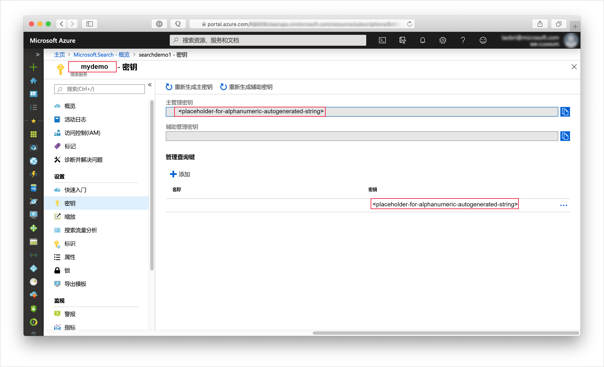

# <a name="tutorial-use-python-and-ai-to-generate-searchable-content-from-azure-blobs"></a>教程：使用 Python 和 AI 从 Azure Blob 生成可搜索的内容

如果在 Azure Blob 存储中有使用非结构化文本或图像，则 [AI 扩充管道](cognitive-search-concept-intro.md)可以提取信息，并创建可用于全文搜索或知识挖掘方案的新内容。 尽管管道可以处理图像，但本 Python 教程侧重于如何分析文本、应用语言检测和自然语言处理，以创建可在查询、分面和筛选器中利用的新字段。

本教程使用 Python 和[搜索 REST API](https://docs.microsoft.com/rest/api/searchservice/) 执行以下任务：

> [!div class="checklist"]
> * 从整个文档（非结构化文本，例如 Azure Blob 存储中的 PDF、HTML、DOCX 和 PPTX）着手。
> * 定义一个管道，用于提取文本、检测语言、识别实体和检测关键短语。
> * 定义用于存储输出（原始内容，加上管道生成的名称/值对）的索引。
> * 执行管道以开始转换和分析，以及创建和加载索引。
> * 使用全文搜索和丰富的查询语法浏览结果。

如果你没有 Azure 订阅，请在开始之前建立一个[免费帐户](https://azure.microsoft.com/free/?WT.mc_id=A261C142F)。

## <a name="prerequisites"></a>先决条件

+ [Azure 存储](https://azure.microsoft.com/services/storage/)
+ [Anaconda 3.7](https://www.anaconda.com/distribution/#download-section)
+ [创建](search-create-service-portal.md)或[查找现有搜索服务](https://ms.portal.azure.com/#blade/HubsExtension/BrowseResourceBlade/resourceType/Microsoft.Search%2FsearchServices) 

> [!Note]
> 可在本教程中使用免费服务。 免费搜索服务限制为三个索引、三个索引器和三个数据源。 本教程每样创建一个。 在开始之前，请确保服务中有足够的空间可接受新资源。

## <a name="download-files"></a>下载文件

1. 打开此 [OneDrive 文件夹](https://1drv.ms/f/s!As7Oy81M_gVPa-LCb5lC_3hbS-4)，然后单击左上角的“下载”将文件复制到计算机。  

1. 右键单击 zip 文件并选择“全部提取”。  有 14 个不同类型的文件。 本练习将使用其中的 7 个文件。

## <a name="1---create-services"></a>1 - 创建服务

本教程使用 Azure 认知搜索编制索引和进行查询、使用后端的认知服务进行 AI 扩充，并使用 Azure Blob 存储提供数据。 本教程使用的认知服务不超过每日为每个索引器免费分配 20 个事务这一限制，因此，只需要创建搜索和存储服务。

如果可能，请在同一区域和资源组中创建这两个服务，使它们相互靠近并易于管理。 在实践中，Azure 存储帐户可位于任意区域。

### <a name="start-with-azure-storage"></a>从 Azure 存储开始

1. [登录到 Azure 门户](https://portal.azure.com/)并单击“+ 创建资源”。 

1. 搜索“存储帐户”，并选择“Microsoft 的存储帐户”产品/服务。 

   

1. 在“基本信息”选项卡中，必须填写以下项。 对于其他任何字段，请接受默认设置。

   + 资源组  。 选择现有的资源组或创建新资源组，但对于所有服务请使用相同的组，以便可以统一管理这些服务。

   + **存储帐户名称**。 如果你认为将来可能会用到相同类型的多个资源，请使用名称来区分类型和区域，例如 *blobstoragewestus*。 

   + **位置**。 如果可能，请选择 Azure 认知搜索和认知服务所用的相同位置。 使用一个位置可以避免带宽费用。

   + **帐户类型**。 选择默认设置“StorageV2 (常规用途 v2)”  。

1. 单击“查看 + 创建”以创建服务。 

1. 创建后，单击“转到资源”打开“概述”页。 

1. 单击“Blob”服务。 

1. 单击“+ 容器”创建容器，并将其命名为 *cog-search-demo*。 

1. 选择“cog-search-demo”，然后单击“上传”打开下载文件所保存到的文件夹。   选择所有的非图像文件。 应有 7 个文件。 单击“确定”以上传。 

   

1. 在退出 Azure 存储之前获取一个连接字符串，以便可以在 Azure 认知搜索中构建连接。 

   1. 向后浏览到存储帐户的“概述”页（我们使用了 *blobstragewestus* 作为示例）。 
   
   1. 在左侧导航窗格中，选择“访问密钥”并复制其中一个连接字符串。  

   连接字符串是类似于以下示例的 URL：

      ```http
      DefaultEndpointsProtocol=https;AccountName=cogsrchdemostorage;AccountKey=<your account key>;EndpointSuffix=core.windows.net
      ```

1. 将连接字符串保存到记事本中。 稍后在设置数据源连接时需要用到它。

### <a name="cognitive-services"></a>认知服务

AI 扩充由认知服务（包括用于自然语言和图像处理的文本分析与计算机视觉）提供支持。 如果你的目标是完成实际原型或项目，则此时应预配认知服务（在 Azure 认知搜索所在的同一区域中），以便可将认知服务附加到索引操作。

但是，对于本练习，可以跳过资源预配，因为 Azure 认知搜索在幕后可以连接到认知服务，并为每个索引器运行提供 20 个免费事务。 由于本教程使用 7 个事务，因此免费的分配已足够。 对于大型项目，请计划在即用即付 S0 层预配认知服务。 有关详细信息，请参阅[附加认知服务](cognitive-search-attach-cognitive-services.md)。

### <a name="azure-cognitive-search"></a>Azure 认知搜索

第三个组件是可以[在门户中创建](search-create-service-portal.md)的 Azure 认知搜索。 可使用免费层完成本演练。 

与处理 Azure Blob 存储时一样，请花片刻时间来收集访问密钥。 此外，在开始构建请求时，需要提供终结点和管理 API 密钥用于对每个请求进行身份验证。

### <a name="get-an-admin-api-key-and-url-for-azure-cognitive-search"></a>获取 Azure 认知搜索的管理 API 密钥和 URL

1. [登录到 Azure 门户](https://portal.azure.com/)，在搜索服务的“概述”页中获取搜索服务的名称。  可以通过查看终结点 URL 来确认服务名称。 如果终结点 URL 为 `https://mydemo.search.windows.net`，则服务名称为 `mydemo`。

2. 在“设置” > “密钥”中，获取有关该服务的完全权限的管理员密钥   。 有两个可交换的管理员密钥，为保证业务连续性而提供，以防需要滚动一个密钥。 可以在请求中使用主要或辅助密钥来添加、修改和删除对象。

   此外，获取查询密钥。 最好使用只读权限发出查询请求。

   

所有请求要求在发送到服务的每个请求的标头中指定 API 密钥。 具有有效的密钥可以在发送请求的应用程序与处理请求的服务之间建立信任关系，这种信任关系以每个请求为基础。

## <a name="2---start-a-notebook"></a>2 - 启动笔记本

按照以下说明创建笔记本，或者从 [Azure-Search-python-samples 存储库](https://github.com/Azure-Samples/azure-search-python-samples/tree/master/Tutorial-AI-Enrichment)下载已完成的笔记本。

使用 Anaconda 导航器启动 Jupyter Notebook，并创建新的 Python 3 笔记本。

在笔记本中，运行此脚本以加载用于处理 JSON 和构建 HTTP 请求的库。

```python
import json
import requests
from pprint import pprint
```

在同一笔记本中，定义数据源、索引、索引器和技能集的名称。 运行此脚本以设置本教程中的名称。

```python
# Define the names for the data source, skillset, index and indexer
datasource_name = "cogsrch-py-datasource"
skillset_name = "cogsrch-py-skillset"
index_name = "cogsrch-py-index"
indexer_name = "cogsrch-py-indexer"
```

在以下脚本中，替换搜索服务 (YOUR-SEARCH-SERVICE-NAME) 和管理员 API 密钥 (YOUR-ADMIN-API-KEY) 的占位符，然后运行脚本以设置搜索服务终结点。

```python
# Setup the endpoint
endpoint = 'https://<YOUR-SEARCH-SERVICE-NAME>.search.windows.net/'
headers = {'Content-Type': 'application/json',
           'api-key': '<YOUR-ADMIN-API-KEY>'}
params = {
    'api-version': '2019-05-06'
}
```

## <a name="3---create-the-pipeline"></a>3 - 创建管道

在 Azure 认知搜索中，AI 处理是在索引编制（或数据引入）期间发生的。 本演练部分将创建四个对象：数据源、索引定义、技能集和索引器。 

### <a name="step-1-create-a-data-source"></a>步骤 1：创建数据源

[数据源对象](https://docs.microsoft.com/rest/api/searchservice/create-data-source)为包含文件的 Blob 容器提供连接字符串。

在以下脚本中，将占位符 YOUR-BLOB-RESOURCE-CONNECTION-STRING 替换为上一步中创建的 blob 的连接字符串。 请替换容器的占位符文本。 然后，运行该脚本以创建一个名为 `cogsrch-py-datasource` 的数据源。

```python
# Create a data source
datasourceConnectionString = "<YOUR-BLOB-RESOURCE-CONNECTION-STRING>"
datasource_payload = {
    "name": datasource_name,
    "description": "Demo files to demonstrate cognitive search capabilities.",
    "type": "azureblob",
    "credentials": {
        "connectionString": datasourceConnectionString
    },
    "container": {
        "name": "<YOUR-BLOB-CONTAINER-NAME>"
    }
}
r = requests.put(endpoint + "/datasources/" + datasource_name,
                 data=json.dumps(datasource_payload), headers=headers, params=params)
print(r.status_code)
```

请求应返回状态代码 201，确认成功。

在 Azure 门户中，在搜索服务仪表板页面上，验证 cogsrch-py-datasource 是否出现在“数据源”列表中  。 单击“刷新”更新页面  。


### <a name="step-2-create-a-skillset"></a>步骤 2：创建技能集

在此步骤中，你将定义一组要应用到数据的扩充步骤。 每个扩充步骤称为“技能”，一组扩充步骤称为“技能集”。   本教程对技能集使用以下[内置认知技能](cognitive-search-predefined-skills.md)：

+ [实体识别](cognitive-search-skill-entity-recognition.md)：从 Blob 容器中的内容提取组织名称。

+ [语言检测](cognitive-search-skill-language-detection.md)：识别内容的语言。

+ [文本拆分](cognitive-search-skill-textsplit.md)：将大段内容拆分为较小区块，然后调用关键短语提取技能。 关键短语提取接受不超过 50,000 个字符的输入。 有几个示例文件需要拆分才能保留在此限制范围内。

+ [关键短语提取](cognitive-search-skill-keyphrases.md)：取出最关键的短语。 

运行以下脚本以创建名为 `cogsrch-py-skillset` 的技能组。

```python
# Create a skillset
skillset_payload = {
    "name": skillset_name,
    "description":
    "Extract entities, detect language and extract key-phrases",
    "skills":
    [
        {
            "@odata.type": "#Microsoft.Skills.Text.EntityRecognitionSkill",
            "categories": ["Organization"],
            "defaultLanguageCode": "en",
            "inputs": [
                {
                    "name": "text", "source": "/document/content"
                }
            ],
            "outputs": [
                {
                    "name": "organizations", "targetName": "organizations"
                }
            ]
        },
        {
            "@odata.type": "#Microsoft.Skills.Text.LanguageDetectionSkill",
            "inputs": [
                {
                    "name": "text", "source": "/document/content"
                }
            ],
            "outputs": [
                {
                    "name": "languageCode",
                    "targetName": "languageCode"
                }
            ]
        },
        {
            "@odata.type": "#Microsoft.Skills.Text.SplitSkill",
            "textSplitMode": "pages",
            "maximumPageLength": 4000,
            "inputs": [
                {
                    "name": "text",
                    "source": "/document/content"
                },
                {
                    "name": "languageCode",
                    "source": "/document/languageCode"
                }
            ],
            "outputs": [
                {
                    "name": "textItems",
                    "targetName": "pages"
                }
            ]
        },
        {
            "@odata.type": "#Microsoft.Skills.Text.KeyPhraseExtractionSkill",
            "context": "/document/pages/*",
            "inputs": [
                {
                    "name": "text", "source": "/document/pages/*"
                },
                {
                    "name": "languageCode", "source": "/document/languageCode"
                }
            ],
            "outputs": [
                {
                    "name": "keyPhrases",
                    "targetName": "keyPhrases"
                }
            ]
        }
    ]
}

r = requests.put(endpoint + "/skillsets/" + skillset_name,
                 data=json.dumps(skillset_payload), headers=headers, params=params)
print(r.status_code)
```

请求应返回状态代码 201，确认成功。

将对每个页面应用关键短语提取技能。 将上下文设置为 `"document/pages/*"`，对文档/页面数组的每个成员运行此扩充器（适用于文档中的每个页面）。

每个技能会针对文档的内容执行。 在处理期间，Azure 认知搜索会解码每个文档，以从不同的文件格式读取内容。 从源文件中找到的文本将放入 `content` 字段（每个文档对应一个字段）。 因此，请将输入设置为 `"/document/content"`。

技能集的图形表示形式如下所示。


输出可以映射到索引、用作下游技能的输入，或者既映射到索引又用作输入（在语言代码中就是这样）。 在索引中，语言代码可用于筛选。 文本分析技能使用语言代码作为输入来告知有关断字的语言规则。

若要详细了解技能集的基础知识，请参阅[如何定义技能集](cognitive-search-defining-skillset.md)。

### <a name="step-3-create-an-index"></a>步骤 3：创建索引

在本部分，你将通过指定要包含到可搜索索引中的字段并为每个字段设置搜索属性来定义索引架构。 字段具有某种类型，并可以采用特性来确定字段的使用方式（可搜索、可排序，等等）。 索引中的字段名称不一定要与源中的字段名称完全匹配。 在稍后的步骤中，我们将在索引器中添加字段映射以连接源-目标字段。 针对此步骤，请使用搜索应用程序相关的字段命名约定来定义索引。

本演练使用以下字段和字段类型：

| field-names: | id         | content   | languageCode | keyPhrases         | 组织     |
|--------------|----------|-------|----------|--------------------|-------------------|
| field-types: | Edm.String|Edm.String| Edm.String| List<Edm.String>  | List<Edm.String>  |

运行此脚本以创建名为 `cogsrch-py-index` 索引。

```python
# Create an index
index_payload = {
    "name": index_name,
    "fields": [
        {
            "name": "id",
            "type": "Edm.String",
            "key": "true",
            "searchable": "true",
            "filterable": "false",
            "facetable": "false",
            "sortable": "true"
        },
        {
            "name": "content",
            "type": "Edm.String",
            "sortable": "false",
            "searchable": "true",
            "filterable": "false",
            "facetable": "false"
        },
        {
            "name": "languageCode",
            "type": "Edm.String",
            "searchable": "true",
            "filterable": "false",
            "facetable": "false"
        },
        {
            "name": "keyPhrases",
            "type": "Collection(Edm.String)",
            "searchable": "true",
            "filterable": "false",
            "facetable": "false"
        },
        {
            "name": "organizations",
            "type": "Collection(Edm.String)",
            "searchable": "true",
            "sortable": "false",
            "filterable": "false",
            "facetable": "false"
        }
    ]
}

r = requests.put(endpoint + "/indexes/" + index_name,
                 data=json.dumps(index_payload), headers=headers, params=params)
print(r.status_code)
```

请求应返回状态代码 201，确认成功。

若要详细了解如何定义索引，请参阅[创建索引（Azure 认知搜索 REST API）](https://docs.microsoft.com/rest/api/searchservice/create-index)。

### <a name="step-4-create-and-run-an-indexer"></a>步骤 4：创建并运行索引器

[索引器](https://docs.microsoft.com/rest/api/searchservice/create-indexer)驱动管道。 到目前为止创建的三个组件（数据源、技能集、索引）是索引器的输入。 在 Azure 认知搜索中创建索引器是运转整个管道的事件。 

要在索引器中将这些对象捆绑在一起，必须定义字段映射。

+ 先处理 fieldMapping，再处理技能集；将数据源中的源字段映射到索引中的目标字段。 如果两端的字段名称和类型相同，则无需映射。

+ 先处理技能集，再处理 outputFieldMapping；引用不存在的 sourceFieldName，直到文档破解或扩充功能创建了它们。 targetFieldName 是索引中的字段。

除了将输入挂接到输出以外，还可以使用字段映射来平展数据结构。 有关详细信息，请参阅[如何将扩充字段映射到可搜索索引](cognitive-search-output-field-mapping.md)。

运行此脚本以创建名为 `cogsrch-py-indexer` 索引器。

```python
# Create an indexer
indexer_payload = {
    "name": indexer_name,
    "dataSourceName": datasource_name,
    "targetIndexName": index_name,
    "skillsetName": skillset_name,
    "fieldMappings": [
        {
            "sourceFieldName": "metadata_storage_path",
            "targetFieldName": "id",
            "mappingFunction":
            {"name": "base64Encode"}
        },
        {
            "sourceFieldName": "content",
            "targetFieldName": "content"
        }
    ],
    "outputFieldMappings":
    [
        {
            "sourceFieldName": "/document/organizations",
            "targetFieldName": "organizations"
        },
        {
            "sourceFieldName": "/document/pages/*/keyPhrases/*",
            "targetFieldName": "keyPhrases"
        },
        {
            "sourceFieldName": "/document/languageCode",
            "targetFieldName": "languageCode"
        }
    ],
    "parameters":
    {
        "maxFailedItems": -1,
        "maxFailedItemsPerBatch": -1,
        "configuration":
        {
            "dataToExtract": "contentAndMetadata",
            "imageAction": "generateNormalizedImages"
        }
    }
}

r = requests.put(endpoint + "/indexers/" + indexer_name,
                 data=json.dumps(indexer_payload), headers=headers, params=params)
print(r.status_code)
```

请求应很快返回状态代码 201，但是，处理可能需要几分钟才能完成。 尽管数据集很小，但分析技能（如图像分析）属于计算密集型任务，需要时间。

可以[监视索引器状态](#check-indexer-status)，以确定索引器运行或完成的时间。

> [!TIP]
> 创建索引器会调用管道。 如果访问数据、映射输入和输出或操作顺序出现问题，此阶段会显示这些问题。 要结合代码或脚本更改重新运行管道，可能需要先删除对象。 有关详细信息，请参阅[重置并重新运行](#reset)。

#### <a name="about-the-request-body"></a>关于请求正文

脚本将 `"maxFailedItems"` 设置为 -1，指示索引引擎在数据导入期间忽略错误。 此设置非常有用，因为演示数据源中的文档很少。 对于更大的数据源，请将值设置为大于 0。

另请注意配置参数中的 `"dataToExtract":"contentAndMetadata"` 语句。 该语句告知索引器从不同的文件格式以及与每个文件相关的元数据中提取内容。

提取内容后，可以设置 `imageAction`，以从数据源中的图像提取文本。 `"imageAction":"generateNormalizedImages"` 配置与 OCR 技能和文本合并技能相结合，告知索引器从图像中提取文本（例如，禁行交通标志中的单词“stop”），并将其嵌入到内容字段中。 此行为将应用到文档中嵌入的图像（例如 PDF 中的图像），以及数据源（例如 JPG 文件）中的图像。

<a name="check-indexer-status"></a>

## <a name="4---monitor-indexing"></a>4 - 监视索引

定义索引器后，提交请求时会自动运行索引器。 根据定义的认知技能，索引编制花费的时间可能会超出预期。 要了解索引器处理是否已完成，请运行以下脚本。

```python
# Get indexer status
r = requests.get(endpoint + "/indexers/" + indexer_name +
                 "/status", headers=headers, params=params)
pprint(json.dumps(r.json(), indent=1))
```

在响应中，监视 lastResult 的 status 和 endTime 值。 定期运行脚本以检查状态。 索引器完成后，状态将设置为 success ，将指定 endTime，响应将包括在扩充期间发生的任何错误和警告。


处理某些源文件和技能的组合时经常会出现警告，这并不总是意味着出现了问题。 许多警告是良性的。 例如，如果为不包含文本的 JPEG 文件编制索引，则会看到此屏幕截图中所示的警告。


## <a name="5---search"></a>5 - 搜索

索引编制完成后，运行可返回各个字段的内容的查询。 默认情况下，Azure 认知搜索返回前 50 条结果。 由于样本数据较小，因此使用默认设置即可正常操作。 但是，在处理较大的数据集时，可能需要在查询字符串中包含参数来返回更多结果。 有关说明，请参阅[如何将 Azure 认知搜索中的结果分页](search-pagination-page-layout.md)。

作为验证步骤，请获取显示所有字段的索引定义。

```python
# Query the service for the index definition
r = requests.get(endpoint + "/indexes/" + index_name,
                 headers=headers, params=params)
pprint(json.dumps(r.json(), indent=1))
```

最终结果如以下示例所示。 屏幕截图仅显示响应的一部分。


输出是索引架构，其中包含每个字段的名称、类型和特性。

针对 `"*"` 提交另一个查询，以返回单个字段的所有内容，例如 `organizations`。

```python
# Query the index to return the contents of organizations
r = requests.get(endpoint + "/indexes/" + index_name +
                 "/docs?&search=*&$select=organizations", headers=headers, params=params)
pprint(json.dumps(r.json(), indent=1))
```

最终结果如以下示例所示。 屏幕截图仅显示响应的一部分。


针对本练习中的其他字段（content、languageCode、keyPhrases 和 organizations）重复上述步骤。 可以使用逗号分隔列表通过 `$select` 返回多个字段。

可以根据查询字符串的复杂性和长度，使用 GET 或 POST。 有关详细信息，请参阅[使用 REST API 进行查询](https://docs.microsoft.com/rest/api/searchservice/search-documents)。

<a name="reset"></a>

## <a name="reset-and-rerun"></a>重置并重新运行

在开发的前期试验阶段，设计迭代的最实用方法是，删除 Azure 认知搜索中的对象，并允许代码重新生成它们。 资源名称是唯一的。 删除某个对象后，可以使用相同的名称重新创建它。

可以使用门户来删除索引、索引器、数据源和技能集。 删除索引器时，可以根据需要选择同时删除索引、技能组和数据源。


还可以使用脚本删除它们。 以下脚本演示如何删除技能集。 

```python
# delete the skillset
r = requests.delete(endpoint + "/skillsets/" + skillset_name,
                    headers=headers, params=params)
pprint(json.dumps(r.json(), indent=1))
```

成功删除后会返回状态代码 204。

## <a name="takeaways"></a>要点

本教程演示了通过创建组件部件（数据源、技能集、索引和索引器）生成扩充索引管道的基本步骤。

其中介绍了[内置技能组](cognitive-search-predefined-skills.md)、技能组定义，以及通过输入和输出将技能链接在一起的方式。 此外，还提到需要使用索引器定义中的 `outputFieldMappings`，将管道中的扩充值路由到 Azure 认知搜索服务中的可搜索索引。

最后，介绍了如何测试结果并重置系统以进一步迭代。 本教程提到，针对索引发出查询会返回扩充的索引管道创建的输出。 在此版本中，可以通过某个机制来查看内部构造（系统创建的扩充文档）。 此外，本教程还介绍了如何检查索引器状态，以及在重新运行管道之前必须删除的对象。

## <a name="clean-up-resources"></a>清理资源

在自己的订阅中操作时，最好在项目结束时删除不再需要的资源。 持续运行资源可能会产生费用。 可以逐个删除资源，也可以删除资源组以删除整个资源集。

可以使用左侧导航窗格中的“所有资源”或“资源组”链接在门户中查找和管理资源。

## <a name="next-steps"></a>后续步骤

熟悉 AI 扩充管道中的所有对象后，接下来让我们更详细地了解技能集定义和各项技能。

> [!div class="nextstepaction"]
> [如何创建技能集](cognitive-search-defining-skillset.md)
