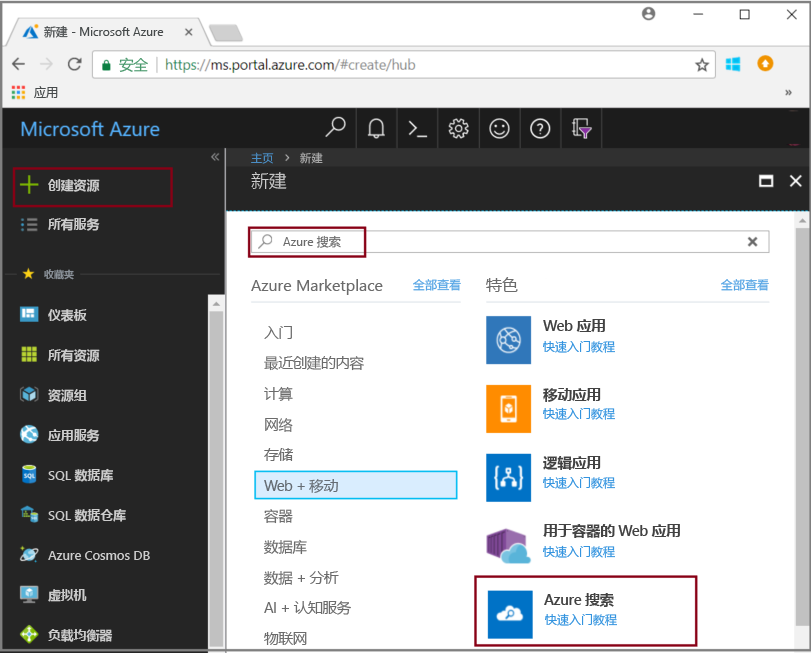
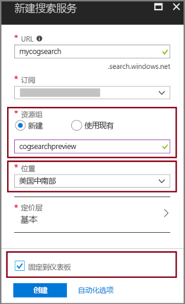

# <a name="tutorial-learn-how-to-call-cognitive-search-apis-preview"></a>教程：了解如何调用认知搜索 API（预览版）

本教程介绍使用认知技能在 Azure 搜索中扩充编程数据的机制。 认知技能属于自然语言处理 (NLP) 和图像分析操作，它们可以提取文本和图像的文本表示形式，以及检测语言、实体、关键短语等内容。 最终结果是在认知搜索索引管道创建的 Azure 搜索索引中提供丰富的附加内容。 

在本教程中，我们将发出 REST API 调用来执行以下任务：

> [!div class="checklist"]
> * 创建一个索引管道，用于扩充索引路由中的示例数据
> * 应用内置技能：实体识别、语言检测、文本处理、关键短语提取
> * 了解如何通过在技能集中将输入映射到输出来链接技能
> * 执行请求并查看结果
> * 重置索引和索引器以进一步开发

输出是 Azure 搜索中的全文搜索索引。 可以使用[同义词](search-synonyms.md)、[评分配置文件](https://docs.microsoft.com/rest/api/searchservice/add-scoring-profiles-to-a-search-index)、[分析器](search-analyzers.md)和[筛选器](search-filters.md)等其他标准功能来增强索引。

如果没有 Azure 订阅，请在开始之前创建一个[免费帐户](https://azure.microsoft.com/free/?WT.mc_id=A261C142F)。

## <a name="prerequisites"></a>先决条件

不太熟悉认知搜索？ 请阅读[什么是认知搜索？](cognitive-search-concept-intro.md) 来熟悉该服务，或尝试阅读[门户快速入门](cognitive-search-quickstart-blob.md)获取重要概念的简介和实践。

若要对 Azure 搜索发出 REST 调用，请使用 PowerShell 或 Web 测试工具（例如 Telerik Fiddler 或 Postman）来构建 HTTP 请求。 如果你不熟悉这些工具，请参阅[使用 Fiddler 或 Postman 探索 Azure 搜索 REST API](search-fiddler.md)。

使用 [Azure 门户](https://portal.azure.com/)创建端到端工作流中使用的服务。 

### <a name="set-up-azure-search"></a>设置 Azure 搜索

首先注册 Azure 搜索服务。 

1. 转到 [Azure 门户](https://portal.azure.com)，使用 Azure 帐户登录。

1. 单击“创建资源”，搜索“Azure 搜索”，然后单击“创建”。 首次设置搜索服务时，请参阅[在门户中创建 Azure 搜索服务](search-create-service-portal.md)。

  

1. 对于“资源组”，请创建一个资源组用于包含本教程中创建的所有资源。 这样可以在完成本教程后更轻松地清理资源。

1. 对于“位置”，请选择“美国中南部”或“西欧”。 预览版目前只能在这些区域使用。

1. 对于“定价层”，可以创建“免费”服务来完成教程和快速入门。 若要使用自己的数据进行更深入的调查，请创建一个[付费服务](https://azure.microsoft.com/pricing/details/search/)，例如“基本”或“标准”层的服务。 

  “免费”服务限制为 3 个索引、最大 16 MB 的 Blob 和 2 分钟的索引，这不足以演练认知搜索的完整功能。 若要查看不同层的限制，请参阅[服务限制](search-limits-quotas-capacity.md)。

  > [!NOTE]
  > 认知搜索目前为公共预览版。 技能集执行目前已在所有层中推出，包括免费层。 我们日后会公布此功能的定价。

1. 将服务固定到仪表板，以快速访问服务信息。

  

1. 创建服务后，收集以下信息：“概述”页中的“URL”，以及“密钥”页中的 **api-key**（主密钥或辅助密钥）。

  

### <a name="set-up-azure-blob-service-and-load-sample-data"></a>设置 Azure Blob 服务并加载示例数据

扩充管道从 Azure 数据源提取数据。 源数据必须源自受支持的 [Azure 搜索索引器](search-indexer-overview.md)数据源类型。 本演练使用 Blob 存储来展示多种内容类型。

1. [下载示例数据](https://1drv.ms/f/s!As7Oy81M_gVPa-LCb5lC_3hbS-4)。 示例数据包括不同类型的小型文件集。 

1. 注册 Azure Blob 存储，创建存储帐户，登录到存储资源管理器，并创建名为 `basicdemo` 的容器。 有关所有步骤的说明，请参阅 [Azure 存储资源管理器快速入门](../storage/blobs/storage-quickstart-blobs-storage-explorer.md)。

1. 使用 Azure 存储资源管理器，在创建的 `basicdemo` 容器中单击“上传”以上传示例文件。

1. 加载示例文件后，获取 Blob 存储的容器名称和连接字符串。 为此，请在 Azure 门户中导航到你的存储帐户。 在“访问密钥”中，复制“连接字符串”字段值。

  存储连接字符串应是类似于以下示例的 URL：

      ```http
      DefaultEndpointsProtocol=https;AccountName=cogsrchdemostorage;AccountKey=<your account key>;EndpointSuffix=core.windows.net
      ```

可通过其他方式指定连接字符串，例如，提供共享访问签名。 若要详细了解数据源凭据，请参阅[为 Azure Blob 存储编制索引](search-howto-indexing-azure-blob-storage.md#Credentials)。

## <a name="create-a-data-source"></a>创建数据源

准备好服务和源文件后，开始汇编索引管道的组件。 首先创建一个[数据源对象](https://docs.microsoft.com/rest/api/searchservice/create-data-source)，该对象告知 Azure 搜索如何检索外部源数据。

本教程使用 REST API 以及一个可以构建和发送 HTTP 请求的工具，例如 PowerShell、Postman 或 Fiddler。 在请求标头中，提供创建 Azure 搜索服务时使用的服务名称，以及为搜索服务生成的 api-key。 在请求正文中，指定 Blob 容器名称和连接字符串。

### <a name="sample-request"></a>示例请求
```http
POST https://[service name].search.windows.net/datasources?api-version=2017-11-11-Preview
Content-Type: application/json  
api-key: [admin key]  
```
#### <a name="request-body-syntax"></a>请求正文语法
```json
{   
    "name" : "demodata",  
    "description" : "Demo files to demonstrate cognitive search capabilities.",  
    "type" : "azureblob",
    "credentials" :
    { "connectionString" :
      "DefaultEndpointsProtocol=https;AccountName=<your account name>;AccountKey=<your account key>;"
    },  
    "container" : { "name" : "<your blob container name>" }
}  
```
发送请求。 Web 测试工具应返回状态代码 201，确认请求成功。 

由于这是发出的第一个请求，请检查 Azure 门户，确认是否在 Azure 搜索中创建了数据源。 在搜索服务的仪表板页上，检查“数据源”磁贴中是否包含一个新项。 可能需要等待几分钟让门户页刷新。 

  

如果收到 403 或 404 错误，请检查请求构造：`api-version=2017-11-11-Preview` 应位于终结点上，`api-key` 应位于标头中的 `Content-Type` 后面，并且其值必须对搜索服务有效。 可对本教程中的剩余步骤重复使用该标头。

> [!TIP]
> 在接下来要执行大量工作之前，现在非常适合验证该搜索服务是否在提供预览功能的某个受支持位置（美国中南部或西欧）运行。

## <a name="create-a-skillset"></a>创建技能集

此步骤定义一组要应用到数据的扩充步骤。 每个扩充步骤称为“技能”，一组扩充步骤称为“技能集”。 本教程对技能集使用以下[预定义的认知技能](cognitive-search-predefined-skills.md)：

+ [语言检测](cognitive-search-skill-language-detection.md)：识别内容的语言。

+ [文本拆分](cognitive-search-skill-textsplit.md)：将大段内容拆分为较小区块，然后调用关键短语提取技能。 关键短语提取接受不超过 50,000 个字符的输入。 有几个示例文件需要拆分才能保留在此限制范围内。

+ [命名实体识别](cognitive-search-skill-named-entity-recognition.md)：从 Blob 容器中的内容提取组织名称。

+ [关键短语提取](cognitive-search-skill-keyphrases.md)：取出最关键的短语。 

### <a name="sample-request"></a>示例请求
发出此 REST 调用之前，如果每次调用后工具不会保留请求标头，请记得替换以下请求中的服务名称和管理密钥。 

此请求创建技能集。 本教程的余下内容将此技能集称作 ```demoskillset```。

```http
PUT https://[servicename].search.windows.net/skillsets/demoskillset?api-version=2017-11-11-Preview
api-key: [admin key]
Content-Type: application/json
```
#### <a name="request-body-syntax"></a>请求正文语法
```json
{
  "description": 
  "Extract entities, detect language and extract key-phrases",
  "skills":
  [
    {
      "@odata.type": "#Microsoft.Skills.Text.NamedEntityRecognitionSkill",
      "categories": [ "Organization" ],
      "defaultLanguageCode": "en",
      "inputs": [
        {
          "name": "text", "source": "/document/content"
        }
      ],
      "outputs": [
        {
          "name": "organizations", "targetName": "organizations"
        }
      ]
    },
    {
      "@odata.type": "#Microsoft.Skills.Text.LanguageDetectionSkill",
      "inputs": [
        {
          "name": "text", "source": "/document/content"
        }
      ],
      "outputs": [
        {
          "name": "languageCode",
          "targetName": "languageCode"
        }
      ]
    },
    {
      "@odata.type": "#Microsoft.Skills.Text.SplitSkill",
      "textSplitMode" : "pages", 
      "maximumPageLength": 4000,
      "inputs": [
      {
        "name": "text",
        "source": "/document/content"
      },
      { 
        "name": "languageCode",
        "source": "/document/languageCode"
      }
    ],
    "outputs": [
      {
            "name": "textItems",
            "targetName": "pages"
      }
    ]
  },
  {
      "@odata.type": "#Microsoft.Skills.Text.KeyPhraseExtractionSkill",
      "context": "/document/pages/*",
      "inputs": [
        {
          "name": "text", "source": "/document/pages/*"
        },
        {
          "name":"languageCode", "source": "/document/languageCode"
        }
      ],
      "outputs": [
        {
          "name": "keyPhrases",
          "targetName": "keyPhrases"
        }
      ]
    }
  ]
}
```

发送请求。 Web 测试工具应返回状态代码 201，确认请求成功。 

#### <a name="about-the-request"></a>关于请求

注意对每个页面应用关键短语提取技能的方式。 将上下文设置为 ```"document/pages/*"```，对文档/页面数组的每个成员运行此扩充器（适用于文档中的每个页面）。

每个技能会针对文档的内容执行。 在处理期间，Azure 搜索会解码每个文档，以从不同的文件格式读取内容。 从源文件中找到的文本将放入一个生成的 ```content``` 字段（每个文档对应一个字段）。 因此，请将输入设置为 ```"/document/content"```。

技能集的图形表示形式如下所示。 


输出可以映射到索引、用作下游技能的输入，或者既映射到索引又用作输入（在语言代码中就是这样）。 在索引中，语言代码可用于筛选。 文本分析技能使用语言代码作为输入来告知有关断字的语言规则。

若要详细了解技能集的基础知识，请参阅[如何定义技能集](cognitive-search-defining-skillset.md)。

## <a name="create-an-index"></a>创建索引

本部分通过指定要在可搜索索引中包含的字段以及每个字段的搜索特性，来定义索引架构。 字段具有某种类型，并可以采用特性来确定字段的使用方式（可搜索、可排序，等等）。 索引中的字段名称不一定要与源中的字段名称完全匹配。 在稍后的步骤中，我们将在索引器中添加字段映射以连接源-目标字段。 针对此步骤，请使用搜索应用程序相关的字段命名约定来定义索引。

本演练使用以下字段和字段类型：

| field-names: | id       | 内容   | languageCode | keyPhrases         | organizations     |
|--------------|----------|-------|----------|--------------------|-------------------|
| field-types: | Edm.String|Edm.String| Edm.String| List<Edm.String>  | List<Edm.String>  |


### <a name="sample-request"></a>示例请求
发出此 REST 调用之前，如果每次调用后工具不会保留请求标头，请记得替换以下请求中的服务名称和管理密钥。 

此请求创建索引。 本教程的余下内容使用索引名称 ```demoindex```。

```http
PUT https://[servicename].search.windows.net/indexes/demoindex?api-version=2017-11-11-Preview
api-key: [api-key]
Content-Type: application/json
```
#### <a name="request-body-syntax"></a>请求正文语法

```json
{
  "fields": [
    {
      "name": "id",
      "type": "Edm.String",
      "key": true,
      "searchable": true,
      "filterable": false,
      "facetable": false,
      "sortable": true
    },
    {
      "name": "content",
      "type": "Edm.String",
      "sortable": false,
      "searchable": true,
      "filterable": false,
      "facetable": false
    },
    {
      "name": "languageCode",
      "type": "Edm.String",
      "searchable": true,
      "filterable": false,
      "facetable": false
    },
    {
      "name": "keyPhrases",
      "type": "Collection(Edm.String)",
      "searchable": true,
      "filterable": false,
      "facetable": false
    },
    {
      "name": "organizations",
      "type": "Collection(Edm.String)",
      "searchable": true,
      "sortable": false,
      "filterable": false,
      "facetable": false
    }
  ]
}
```
发送请求。 Web 测试工具应返回状态代码 201，确认请求成功。 

若要详细了解如何定义索引，请参阅[创建索引（Azure 搜索 REST API）](https://docs.microsoft.com/rest/api/searchservice/create-index)。


## <a name="create-an-indexer-map-fields-and-execute-transformations"></a>创建索引器，映射字段，并执行转换

到目前为止，我们已创建数据源、技能集和索引。 这三个组件属于某个[索引器](search-indexer-overview.md)，该索引器将每个片段一同提取到单个多阶段操作。 若要在索引器中将这些组件捆绑在一起，必须定义字段映射。 字段映射是索引器定义的一部分，在提交请求时执行转换。

对于未扩充的索引，如果字段名称或数据类型不精确匹配，或者你要使用函数，则索引器定义会提供可选的 *fieldMappings* 节。

对于包含扩充管道的认知搜索工作负荷，索引器需要 *outputFieldMappings*。 当内部进程（扩充管道）是字段值的源时，将使用这些映射。 *outputFieldMappings* 特有的行为包括处理扩充过程中创建的复杂类型的能力（通过整形程序技能）。 此外，每个文档可能有许多元素（例如，文档中的多个组织）。 *outputFieldMappings* 构造可以指示系统将元素集合“平展”成单个记录。

### <a name="sample-request"></a>示例请求

发出此 REST 调用之前，如果每次调用后工具不会保留请求标头，请记得替换以下请求中的服务名称和管理密钥。 

此外，请提供索引器的名称。 对于本教程的余下内容，可将其称为 ```demoindexer```。

```http
PUT https://[servicename].search.windows.net/indexers/demoindexer?api-version=2017-11-11-Preview
api-key: [api-key]
Content-Type: application/json
```
#### <a name="request-body-syntax"></a>请求正文语法

```json
{
  "name":"demoindexer", 
  "dataSourceName" : "demodata",
  "targetIndexName" : "demoindex",
  "skillsetName" : "demoskillset",
  "fieldMappings" : [
        {
          "sourceFieldName" : "metadata_storage_path",
          "targetFieldName" : "id",
          "mappingFunction" : 
            { "name" : "base64Encode" }
        },
        {
          "sourceFieldName" : "content",
          "targetFieldName" : "content"
        }
   ],
  "outputFieldMappings" : 
  [
        {
          "sourceFieldName" : "/document/organizations", 
          "targetFieldName" : "organizations"
        },
        {
          "sourceFieldName" : "/document/pages/*/keyPhrases/*", 
          "targetFieldName" : "keyPhrases"
        },
        {
            "sourceFieldName": "/document/languageCode",
            "targetFieldName": "languageCode"
        }      
  ],
  "parameters":
  {
    "maxFailedItems":-1,
    "maxFailedItemsPerBatch":-1,
    "configuration": 
    {
        "dataToExtract": "contentAndMetadata",
        "imageAction": "generateNormalizedImages"
        }
  }
}
```

发送请求。 Web 测试工具应返回状态代码 201，确认处理成功。 

此步骤预期需要几分钟时间才能完成。 即使数据集较小，分析技能也会消耗大量的计算资源。 某些技能（例如图像分析）会长时间运行。

> [!TIP]
> 创建索引器会调用管道。 如果访问数据、映射输入和输出或操作顺序出现问题，此阶段会显示这些问题。 若要结合代码或脚本更改重新运行管道，可能需要先删除对象。 有关详细信息，请参阅[重置并重新运行](#reset)。

### <a name="explore-the-request-body"></a>浏览请求正文

脚本将 ```"maxFailedItems"``` 设置为 -1，指示索引引擎在数据导入期间忽略错误。 此设置非常有用，因为演示数据源中的文档很少。 对于更大的数据源，请将值设置为大于 0。

另请注意配置参数中的 ```"dataToExtract":"contentAndMetadata"``` 语句。 该语句告知索引器从不同的文件格式以及与每个文件相关的元数据中自动提取内容。 

提取内容后，可以设置 ```ImageAction```，以从数据源中的图像提取文本。 ```"ImageAction":"generateNormalizedImages"``` 告知索引器从图像中提取文本（例如，禁行交通标志中的单词“stop”），并将其嵌入到内容字段中。 此行为将应用到文档中嵌入的图像（例如 PDF 中的图像），以及数据源（例如 JPG 文件）中的图像。

在预览版中，只有 ```"generateNormalizedImages"``` 是 ```"ImageAction"``` 的有效值。

## <a name="check-indexer-status"></a>检查索引器状态

定义索引器后，提交请求时会自动运行索引器。 根据定义的认知技能，索引编制花费的时间可能会超出预期。 若要确定索引器是否仍在运行，请发送以下请求来检查索引器状态。

```http
GET https://[servicename].search.windows.net/indexers/demoindexer/status?api-version=2017-11-11-Preview
api-key: [api-key]
Content-Type: application/json
```

响应会告知索引器是否正在运行。 索引编制完成后，使用 STATUS 终结点的另一个 HTTP GET（如上所述）查看扩充期间发生的所有错误和警告的报告。  

处理某些源文件和技能的组合时经常会出现警告，这并不总是意味着出现了问题。 在本教程中，警告是良性的（例如，JPEG 文件中没有文本输入）。 可以查看状态响应，获取索引编制期间发出的警告的详细信息。
 
## <a name="verify-content"></a>验证内容

索引编制完成后，运行可返回各个字段的内容的查询。 默认情况下，Azure 搜索返回前 50 条结果。 由于样本数据较小，因此使用默认设置即可正常操作。 但是，在处理较大的数据集时，可能需要在查询字符串中包含参数来返回更多结果。 有关说明，请参阅[如何将 Azure 搜索中的结果分页](search-pagination-page-layout.md)。

作为验证步骤，请查询所有字段的索引。

```http
GET https://[servicename].search.windows.net/indexes/demoindex?api-version=2017-11-11-Preview
api-key: [api-key]
Content-Type: application/json
```

输出是索引架构，其中包含每个字段的名称、类型和特性。

针对 `"*"` 提交另一个查询，以返回单个字段的所有内容，例如 `organizations`。

```http
GET https://[servicename].search.windows.net/indexes/demoindex/docs?search=*&$select=organizations&api-version=2017-11-11-Preview
api-key: [api-key]
Content-Type: application/json
```

针对其他字段（本演练中的 content、language、keyphrases 和 organizations）重复上述步骤。 可以使用逗号分隔列表通过 `$select` 返回多个字段。

可以根据查询字符串的复杂性和长度，使用 GET 或 POST。 有关详细信息，请参阅[使用 REST API 进行查询](https://docs.microsoft.com/azure/search/search-query-rest-api)。

<a name="access-enriched-document"></a>

## <a name="accessing-the-enriched-document"></a>访问扩充的文档

认知搜索允许查看扩充文档的结构。 扩充的文档是在扩充期间创建的、然后在完成处理后删除的临时结构。

若要捕获索引编制期间创建的扩充文档的快照，请将名为 ```enriched``` 的字段添加到索引。 索引器将作为该文档的所有扩充项的字符串表示形式自动转储到字段中。

```enriched``` 字段将包含一个字符串，该字符串是内存中扩充文档的 JSON 逻辑表示形式，  但字段值是有效的 JSON 文档。 引号经过转义，因此，需将 `\"` 替换为 `"` 才能查看 JSON 格式的文档。  

```enriched``` 字段用于调试目的，它只能帮助你了解求值表达式所针对的内容的逻辑形状。 它可能是用于了解和调试技能集的有用工具。

重复上一个演练，并包含 `enriched` 字段以捕获扩充文档的内容：

### <a name="request-body-syntax"></a>请求正文语法
```json
{
  "fields": [
    {
      "name": "id",
      "type": "Edm.String",
      "key": true,
      "searchable": true,
      "filterable": false,
      "facetable": false,
      "sortable": true
    },
    {
      "name": "content",
      "type": "Edm.String",
      "sortable": false,
      "searchable": true,
      "filterable": false,
      "facetable": false
    },
    {
      "name": "languageCode",
      "type": "Edm.String",
      "searchable": true,
      "filterable": false,
      "facetable": false
    },
    {
      "name": "keyPhrases",
      "type": "Collection(Edm.String)",
      "searchable": true,
      "filterable": false,
      "facetable": false
    },
    {
      "name": "organizations",
      "type": "Collection(Edm.String)",
      "searchable": true,
      "sortable": false,
      "filterable": false,
      "facetable": false
    },
    {
      "name": "enriched",
      "type": "Edm.String",
      "searchable": false,
      "sortable": false,
      "filterable": false,
      "facetable": false
    }
  ]
}
```
<a name="reset"></a>

## <a name="reset-and-rerun"></a>重置并重新运行

在管道开发的前期试验阶段，设计迭代的最实用方法是删除 Azure 搜索中的对象，并允许代码重新生成这些对象。 资源名称是唯一的。 删除某个对象后，可以使用相同的名称重新创建它。

使用新定义为文档重新编制索引：

1. 删除索引以删除持久保存的数据。 删除索引器，以在服务中重新创建它。
2. 修改技能集和索引定义。
3. 在服务中重新创建索引和索引器，以运行管道。 

可以使用门户删除索引和索引器。 如果决定删除技能集，只能通过 HTTP 命令删除。

```http
DELETE https://[servicename].search.windows.net/skillsets/demoskillset?api-version=2017-11-11-Preview
api-key: [api-key]
Content-Type: application/json
```

成功删除后会返回状态代码 204。

随着代码的成熟，可能需要优化重新生成策略。 有关详细信息，请参阅[如何重新生成索引](search-howto-reindex.md)。

## <a name="takeaways"></a>要点

本教程演示了通过创建组件部件（数据源、技能集、索引和索引器）生成扩充索引管道的基本步骤。

其中介绍了[预定义的技能集](cognitive-search-predefined-skills.md)、技能集定义，以及通过输入和输出将技能链接在一起的机制。 此外，还提到需要使用索引器定义中的 `outputFieldMappings`，将管道中的扩充值路由到 Azure 搜索服务中的可搜索索引。

最后，介绍了如何测试结果并重置系统以进一步迭代。 本教程提到，针对索引发出查询会返回扩充的索引管道创建的输出。 在此版本中，可以通过某个机制来查看内部构造（系统创建的扩充文档）。 此外，本教程还介绍了如何检查索引器状态，以及在重新运行管道之前要删除的对象。

## <a name="clean-up-resources"></a>清理资源

完成本教程后，最快的清理方式是删除包含 Azure 搜索服务和 Azure Blob 服务的资源组。 假设已将这两个服务放在同一个组中，则删除该资源组会永久删除其中的所有内容，包括在本教程中创建的服务和任何存储内容。 在门户中，资源组名称显示在每个服务的“概述”页上。

## <a name="next-steps"></a>后续步骤

使用自定义技能自定义或扩展管道。 创建自定义技能并将其添加到技能集可以载入自己编写的文本或图像分析代码。 

> [!div class="nextstepaction"]
> [示例：创建自定义技能](cognitive-search-create-custom-skill-example.md)
