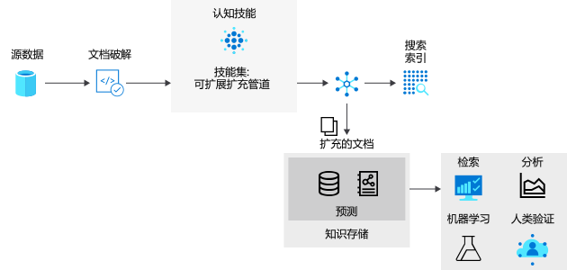

# <a name="introduction-to-knowledge-stores-in-azure-cognitive-search"></a>Azure 认知搜索中的知识存储简介

> [!IMPORTANT] 
> 知识存储目前以公开预览版提供。 提供的预览版功能不附带服务级别协议，我们不建议将其用于生产工作负荷。 有关详细信息，请参阅 [Microsoft Azure 预览版补充使用条款](https://azure.microsoft.com/support/legal/preview-supplemental-terms/)。 [REST API 版本 2019-05-06-Preview](search-api-preview.md) 提供预览版功能。 目前提供有限的门户支持，不提供 .NET SDK 支持。

"知识库" 是 Azure 认知搜索的一项功能，可保留[AI 扩充管道](cognitive-search-concept-intro.md)的输出以进行独立的分析或下游处理。 扩充文档是管道的输出，是基于使用 AI 流程提取、结构化和分析的内容创建的。** 在标准的 AI 管道中，扩充文档是临时的，仅在编制索引期间使用，然后被丢弃。 扩充文档将通过知识存储保存起来。 

如果你过去使用过认知技能，你已经知道*技能集*通过一系列根据移动文档。 结果可以是搜索索引，也可以是知识存储中的投影（此预览版中新增的）。 两个输出，搜索索引和知识存储都是同一管道的产品;派生自相同的输入，但会生成以非常不同的方式进行结构化、存储和使用的输出。

在物理上，知识存储是一个 [Azure 存储](https://docs.microsoft.com/azure/storage/common/storage-account-overview)，可以是 Azure 表存储和/或 Azure Blob 存储。 任何可以连接到 Azure 存储的工具或进程都可以使用知识存储的内容。


> [!VIDEO https://www.youtube.com/embed/XWzLBP8iWqg?version=3&start=235&end=426]




## <a name="benefits-of-knowledge-store"></a>知识存储的优势

知识存储为您提供了结构、上下文和实际内容-从非结构化和半结构化数据文件（如 blob、已经历过分析的图像文件，甚至是结构化数据）的搜集。 在分步[演练](knowledge-store-create-rest.md)中，你可以看到密集 JSON 文档如何分区到子结构中、重建为新结构，并以其他方式提供给下游流程，如机器学习和数据科学工作负荷。

尽管查看 AI 扩充管道可产生的功能非常有用，但知识存储的实际潜能就是能够改变数据的形状。 你可以从基本技能集入手，然后循环访问它以添加越来越多的结构级别，这样就能将它们合并成新结构，可用于除 Azure 认知搜索以外的其他应用。

知识存储的优势已枚举如下：

+ 在除搜索以外的[分析和报表工具](#tools-and-apps)中使用扩充文档。 使用 Power Query 的 Power BI 是一个极具吸引力的选择，但任何可以连接到 Azure 存储的工具或应用都可以从你创建的知识存储中拉取。

+ 优化 AI 索引管道，同时调试步骤和技能集定义。 知识存储展示 AI 索引管道中的技能集定义的结果。 这些结果可用于设计更好的技能集，因为你可以清楚地看到扩充是什么样的。 可以使用 Azure 存储中的[存储资源管理器](https://docs.microsoft.com/azure/vs-azure-tools-storage-manage-with-storage-explorer?tabs=windows)来查看知识存储的内容。

+ 将数据整形到新表单中。 整形在技能集中编码化，但重点是技能集现在可以提供此功能。 Azure 认知搜索中的[整形程序技能](cognitive-search-skill-shaper.md)已扩展为包含此任务。 通过整形，可以定义与数据预期用途保持一致的投影，同时保留关系。

> [!Note]
> 熟悉 AI 扩充和认知技能？ Azure 认知搜索与认知服务视觉和语言功能集成，以对图像文件使用光学字符识别 (OCR)、对文本文件使用实体识别和关键短语提取等来提取和扩充源数据。 有关详细信息，请参阅 [Azure 认知搜索中的 AI 扩充](cognitive-search-concept-intro.md)。

## <a name="physical-storage"></a>物理存储


> [!VIDEO https://www.youtube.com/embed/XWzLBP8iWqg?version=3&start=455&end=542]


通过技能组合中`projections` `knowledgeStore`定义的元素清楚表述知识存储区的物理表达式。 投影定义输出的结构，使其与预期用途匹配。

可以将投影表述为表、对象或文件。

```json
"knowledgeStore": { 
    "storageConnectionString": "<YOUR-AZURE-STORAGE-ACCOUNT-CONNECTION-STRING>", 
    "projections": [ 
        { 
            "tables": [ ], 
            "objects": [ ], 
            "files": [ ]
        },
                { 
            "tables": [ ], 
            "objects": [ ], 
            "files": [ ]
        }
```

在此结构中指定的投影类型确定了知识存储使用的存储类型。

+ 在定义`tables`时使用表存储。 当需要用于分析工具输入的表格报告结构或作为数据帧导出到其他数据存储区时，定义表投影。 您可以指定多`tables`个来获取已扩充文档的子集或交叉部分。 在同一投影组内，将保留表关系，以便可以使用它们。

+ 定义`objects`或`files`时，使用 Blob 存储。 的物理表示形式`object`是一种分层 JSON 结构，它表示已扩充的文档。 `file`是从文档中提取并原样传输到 Blob 存储中的图像。

在许多情况下，单个投影对象`tables`包含`objects`一`files`组、、和，创建一个投影可能就足够了。 

`table` - `object` - `file`但是，可以创建多组投影，如果需要不同的数据关系，也可以这样做。 在集内，数据是相关的，假设这些关系存在并且可以检测到它们。 如果创建其他集，则每个组中的文档将永远不相关。 使用多个投影组的一个示例可能是，如果你想要将相同的数据与你的在线系统一起使用，并且需要以特定的方式表示，则还需要在表示不同的数据科学管道中使用的相同数据。

## <a name="requirements"></a>要求 

需要[Azure 存储空间](https://docs.microsoft.com/azure/storage/)。 它提供物理存储。 你可以使用 Blob 存储和/或表存储。 Blob 存储用于不完整的已进行的文档，通常在输出转到下游进程时使用。 表存储用于已丰富的文档的切片，通常用于分析和报告。

[技能组合](cognitive-search-working-with-skillsets.md)是必需的。 它包含`knowledgeStore`定义，并确定已扩充文档的结构和组合。 不能使用空的技能组合创建知识库。 技能组合中必须至少有一项技能。

需要[索引器](search-indexer-overview.md)。 技能组合由索引器调用，该索引器驱动执行。 索引器附带其自己的要求和属性集。 其中的一些属性对知识店有直接的关系：

+ 索引器需要[受支持的 azure 数据源](search-indexer-overview.md#supported-data-sources)（最终创建知识库的管道将通过从 Azure 支持的源中提取数据开始）。 

+ 索引器需要搜索索引。 索引器需要提供索引架构，即使您从未计划使用它也是如此。 最小索引具有一个指定为键的字符串字段。

+ 索引器提供可选的字段映射，用于将源字段别名为目标字段。 如果需要修改默认字段映射（若要使用其他名称或类型），可以在索引器中创建[字段映射](search-indexer-field-mappings.md)。 对于知识存储输出，目标可以是 blob 对象或表中的字段。

+ 索引器具有计划和其他属性（如各种数据源提供的更改检测机制），也可应用于知识存储。 例如，可以按固定间隔[计划](search-howto-schedule-indexers.md)扩充以刷新内容。 

## <a name="how-to-create-a-knowledge-store"></a>如何创建知识库

若要创建知识库，请使用门户或预览 REST API （`api-version=2019-05-06-Preview`）。

### <a name="use-the-azure-portal"></a>使用 Azure 门户

**导入数据**向导包含用于创建知识库的选项。 对于初始探索，请[在四个步骤中创建第一个知识库](knowledge-store-connect-power-bi.md)。

1. 选择受支持的数据源。

1. 指定 "扩充：附加资源"、"选择技能" 和 "指定知识存储"。 

1. 创建索引架构。 向导需要它，可以为您推断一个。

1. 运行该向导。 在最后一步中，将进行提取、扩充和存储操作。

### <a name="use-create-skillset-and-the-preview-rest-api"></a>使用 Create 技能组合和 preview REST API

在技能组合中定义，而[索引器则由索引器](search-indexer-overview.md)调用。 [skillset](cognitive-search-working-with-skillsets.md) `knowledgeStore` 在扩充期间，Azure 认知搜索会在你的 Azure 存储帐户中创建一个空间，并将已扩充的文档作为 blob 或表投影，具体取决于你的配置。

目前，预览版 REST API 是可通过编程方式创建知识库的唯一机制。 一种简单的浏览方法是[使用 Postman 和 REST API 创建您的第一个知识存储](knowledge-store-create-rest.md)。

此预览功能的参考内容位于本文的[API 参考](#kstore-rest-api)部分。 

<a name="tools-and-apps"></a>

## <a name="how-to-connect-with-tools-and-apps"></a>如何与工具和应用程序连接

只要扩充存在于存储中，连接到 Azure Blob 存储或表存储的任何工具或技术，都可用于浏览、分析或使用内容。 请从以下列表入手：

+ [存储资源管理器](knowledge-store-view-storage-explorer.md)：用于查看扩充文档的结构和内容。 将这视为用于查看知识存储内容的基线工具。

+ 用于报告和分析的[Power BI](knowledge-store-connect-power-bi.md) 。 

+ [Azure 数据工厂](https://docs.microsoft.com/azure/data-factory/)：用于进一步操作。

<a name="kstore-rest-api"></a>

## <a name="api-reference"></a>API 参考

REST API 版本`2019-05-06-Preview`通过技能集上的其他定义提供知识库。 除引用外，有关如何调用 Api 的详细信息，请参阅[使用 Postman 创建知识库](knowledge-store-create-rest.md)。

+ [创建技能组 (api-version=2019-05-06-Preview)](https://docs.microsoft.com/rest/api/searchservice/2019-05-06-preview/create-skillset) 
+ [Update 技能组合（api 版本 = 2019-05-06-01.5.1）](https://docs.microsoft.com/rest/api/searchservice/2019-05-06-preview/update-skillset) 


## <a name="next-steps"></a>后续步骤

知识存储提供扩充文档的持久性，在设计技能集，或者在创建新的结构和内容供可访问 Azure 存储帐户的任何客户端应用程序使用时，知识存储非常有用。

最简单的方法是[通过门户](knowledge-store-create-portal.md)创建丰富的文档，但您也可以使用 Postman 和 REST API，这在您希望深入了解如何创建和引用对象时更有用。

> [!div class="nextstepaction"]
> [使用 Postman 和 REST 创建知识库](knowledge-store-create-rest.md)

若要了解有关投影的详细信息，请参阅这些功能以及如何[在技能组合中对其进行定义](knowledge-store-projection-overview.md)

> [!div class="nextstepaction"]
> [知识存储中的投影](knowledge-store-projection-overview.md)

有关涉及切片、内联造型和关系等高级投影概念的教程，请从[在知识存储中定义投影](knowledge-store-projections-examples.md)开始

> [!div class="nextstepaction"]
> [定义知识库中的投影](knowledge-store-projections-examples.md)