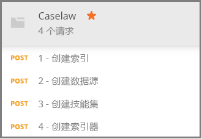

# <a name="how-to-get-started-with-knowledge-store-in-azure-search"></a>如何开始使用 Azure 搜索中的知识存储

> [!Note]
> 知识存储目前为预览版，不适合在生产环境中使用。 [REST API 版本 2019-05-06-Preview](search-api-preview.md) 提供了此功能。 目前不支持 .NET SDK。
>
[知识存储](knowledge-store-concept-intro.md)将在编制索引期间创建的 AI 扩充文档保存到你的 Azure 存储帐户以在其他应用中进行下游数据挖掘。 还可以使用已保存的扩充来了解和优化 Azure 搜索索引管道。 

知识存储由技能集定义，由索引器创建。   通过用于确定存储中数据结构的投影来指定知识存储的物理表达形式。  完成本演练后，即已创建所有这些对象，到时你就知道如何将它们拟合到一起。 

在本练习中，你将从示例数据、服务和工具入手，了解创建和使用首个知识存储的基本工作流（以技能集定义为重点）。

## <a name="prerequisites"></a>先决条件

知识存储处于多个服务的中心，在这些服务中，Azure Blob 存储和 Azure 表存储提供物理存储，Azure 搜索和认知服务用于创建和更新对象。 必须熟悉[基本体系结构](knowledge-store-concept-intro.md)才能完成本演练。

本快速入门使用以下服务和工具。 

+ [获取 Postman 桌面应用](https://www.getpostman.com/)，以便将 HTTP 请求发送到 Azure 搜索。

+ [创建一个 Azure 存储帐户](https://docs.microsoft.com/azure/storage/common/storage-quickstart-create-account)用于存储示例数据和知识存储。 知识存储位于 Azure 存储中。

+ 在 S0 即用即付层[创建认知服务资源](https://docs.microsoft.com/azure/cognitive-services/cognitive-services-apis-create-account)，用于广泛访问 AI 扩充中使用的一整套技能。 认知服务和 Azure 搜索服务需位于同一区域。

+ [创建 Azure 搜索服务](search-create-service-portal.md)或在当前订阅下[查找现有服务](https://ms.portal.azure.com/#blade/HubsExtension/BrowseResourceBlade/resourceType/Microsoft.Search%2FsearchServices)。 可在本教程中使用免费服务。 

还需要获取示例 JSON 文档和 Postman 集合文件。 [准备示例数据](#prepare-sample-data)部分提供了有关查找和加载补充文件的说明。

## <a name="get-a-key-and-url"></a>获取密钥和 URL

REST 调用需要在每个请求中使用服务 URL 和访问密钥。 搜索服务是使用这二者创建的，因此，如果向订阅添加了 Azure 搜索，则请按以下步骤获取必需信息：

1. [登录到 Azure 门户](https://portal.azure.com/)，在搜索服务的“概述”页中获取 URL。  示例终结点可能类似于 `https://mydemo.search.windows.net`。

1. 在“设置” > “密钥”中，获取有关该服务的完全权限的管理员密钥   。 有两个可交换的管理员密钥，为保证业务连续性而提供，以防需要滚动一个密钥。 可以在请求中使用主要或辅助密钥来添加、修改和删除对象。

    

所有请求对发送到服务的每个请求都需要 API 密钥。 你将在以下部分所述的每个 HTTP 请求中提供服务名称和 API 密钥。

<a name="prepare-sample-data"></a>

## <a name="prepare-sample-data"></a>准备示例数据

知识存储包含扩充管道的输出。 输入包括“不可用的”数据，随着管道操作的不断进行，这些数据最终会变成“可用”数据。 不可用数据的示例可能包括，需要在其中分析文本或图像特征的图像文件，或者可在其中分析实体、关键短语或情绪的密集文本文件。 

本练习使用源自于[判例法访问项目](https://case.law/bulk/download/)公共批量数据下载页的密集文本文件（判例法信息）。 对于本练习，我们将包含 10 个文档的示例上传到了 GitHub 中。 

在此任务中，你将为用作管道输入的这些文档创建一个 Azure Blob 容器。 

1. 下载并提取 [Azure 搜索示例数据](https://github.com/Azure-Samples/azure-search-sample-data/tree/master/caselaw)存储库以获取[判例法数据集](https://github.com/Azure-Samples/azure-search-sample-data/tree/master/caselaw)。 

1. [登录到 Azure 门户](https://portal.azure.com)，导航到你的 Azure 存储帐户，单击“Blob”，然后单击“+ 容器”   。

1. [创建一个 Blob 容器](https://docs.microsoft.com/azure/storage/blobs/storage-quickstart-blobs-portal)用于包含示例数据： 

   1. 将该容器命名为 `caselaw-test`。 
   
   1. 将“公共访问级别”设为任何有效值。

1. 创建容器后，将其打开，然后在命令栏中选择“上传”  。

   

1. 转到包含 caselaw-sample.json  示例文件的文件夹。 选择此文件，再单击“上传”  。

1. 在 Azure 存储中获取连接字符串和容器名称。  稍后在[创建数据源](#create-data-source)时需要使用这两个字符串：

   1. 在概述页中单击“访问密钥”并复制一个连接字符串。   该字符串以 `DefaultEndpointsProtocol=https;` 开头，以 `EndpointSuffix=core.windows.net` 结尾。 帐户名和密钥位于该字符串的中间。 

   1. 容器名称应为 `caselaw-test` 或你分配的任意名称。


## <a name="set-up-postman"></a>设置 Postman

Postman 是用于向 Azure 搜索发送请求和 JSON 文档的客户端应用。 只需使用本文中的信息即可构建多个请求。 但是，有两个最大请求（创建索引、创建技能集）包含的详细 JSON 太多，无法在文章中嵌入。 

为使所有 JSON 文档和请求完全可用，我们创建了一个 Postman 集合文件。 下载然后导入此文件是设置客户端的第一项任务。

1. 下载并解压缩 [Azure 搜索 Postman 示例](https://github.com/Azure-Samples/azure-search-postman-samples)存储库。

1. 启动 Postman 并导入判例法 Postman 集合：

   1. 单击“导入” > “导入文件” > “选择文件”。    

   1. 导航到 \azure-search-postman-samples-master\azure-search-postman-samples-master\Caselaw 文件夹。

   1. 选择“Caselaw.postman_collection_v2.json”。  在该集合中应会看到四个 **POST** 请求。

   
   

## <a name="create-an-index"></a>创建索引
    
第一个请求使用[创建索引 API](https://docs.microsoft.com/rest/api/searchservice/create-data-source)，以创建可存储所有可搜索数据的 Azure 搜索索引。 索引指定所有字段、参数和属性。

不一定需要索引才能进行知识挖掘，但只有提供索引，才能运行索引器。 

1. 在 URL `https://YOUR-AZURE-SEARCH-SERVICE-NAME.search.windows.net/indexes?api-version=2019-05-06-Preview` 中，请将 `YOUR-AZURE-SEARCH-SERVICE-NAME` 替换为搜索服务的名称。 

1. 在 Header 节中，将 `<YOUR AZURE SEARCH ADMIN API-KEY>` 替换为 Azure 搜索的管理员 API 密钥。

1. 在 Body 节中，JSON 文档为索引架构。 为方便查看，索引的外壳已折叠，它由以下元素组成。 fields 集合对应于判例法数据集中的字段。

   ```json
   {
      "name": "caselaw",
      "defaultScoringProfile": null,
      "fields": [],
      "scoringProfiles": [],
      "corsOptions": null,
      "suggesters": [],
      "analyzers": [],
      "tokenizers": [],
      "tokenFilters": [],
      "charFilters": [],
      "encryptionKey": null
   }
   ```

1. 展开 `fields` 集合。 其中包含大量的索引定义，由简单字段、包含嵌套子结构的[复杂字段](search-howto-complex-data-types.md)和集合组成。

   请花点时间查看第 302-384 行中的 `casebody` 复杂字段的字段定义。 请注意，如果需要分层表示形式，复杂字段中可能有其他复杂字段。 可按此处所示在索引中为层次结构建模；也可以在技能集中将层次结构建模为投影，从而在知识存储中创建嵌套的数据结构。

   ```json
   {
    "name": "casebody",
    "type": "Edm.ComplexType",
    "fields": [
        {
            "name": "status",
            "type": "Edm.String",
            "searchable": true,
            "filterable": true,
            "retrievable": true,
            "sortable": true,
            "facetable": true,
            "key": false,
            "indexAnalyzer": null,
            "searchAnalyzer": null,
            "analyzer": null,
            "synonymMaps": []
        },
        {
            "name": "data",
            "type": "Edm.ComplexType",
            "fields": [
                {
                    "name": "head_matter",
                    "type": "Edm.String",
                    "searchable": true,
                    "filterable": false,
                    "retrievable": true,
                    "sortable": false,
                    "facetable": false,
                    "key": false,
                    "indexAnalyzer": null,
                    "searchAnalyzer": null,
                    "analyzer": null,
                    "synonymMaps": []
                },
                {
                    "name": "opinions",
                    "type": "Collection(Edm.ComplexType)",
                    "fields": [
                        {
                            "name": "author",
                            "type": "Edm.String",
                            "searchable": true,
                            "filterable": true,
                            "retrievable": true,
                            "sortable": false,
                            "facetable": true,
                            "key": false,
                            "indexAnalyzer": null,
                            "searchAnalyzer": null,
                            "analyzer": null,
                            "synonymMaps": []
                        },
                        {
                            "name": "text",
                            "type": "Edm.String",
                            "searchable": true,
                            "filterable": false,
                            "retrievable": true,
                            "sortable": false,
                            "facetable": false,
                            "key": false,
                            "indexAnalyzer": null,
                            "searchAnalyzer": null,
                            "analyzer": null,
                            "synonymMaps": []
                        },
                        {
                            "name": "type",
                            "type": "Edm.String",
                            "searchable": true,
                            "filterable": true,
                            "retrievable": true,
                            "sortable": false,
                            "facetable": true,
                            "key": false,
                            "indexAnalyzer": null,
                            "searchAnalyzer": null,
                            "analyzer": null,
                            "synonymMaps": []
                        }
                    ]
                },
    . . .
   ```

1. 单击“发送”以执行请求。   应会看到“状态:  201 已创建”响应消息。

<a name="create-data-source"></a>

## <a name="create-a-data-source"></a>创建数据源

第二个请求使用[创建数据源 API](https://docs.microsoft.com/rest/api/searchservice/create-data-source) 连接到 Azure Blob 存储。 

1. 在 URL `https://YOUR-AZURE-SEARCH-SERVICE-NAME.search.windows.net/datasources?api-version=2019-05-06-Preview` 中，请将 `YOUR-AZURE-SEARCH-SERVICE-NAME` 替换为搜索服务的名称。 

1. 在 Header 节中，将 `<YOUR AZURE SEARCH ADMIN API-KEY>` 替换为 Azure 搜索的管理员 API 密钥。

1. 在 Body 节中，JSON 文档包含你的存储帐户连接字符串和 Blob 容器名称。 可以在 Azure 门户中存储帐户的“访问密钥”内找到连接字符串。  

    ```json
    {
        "name": "caselaw-ds",
        "description": null,
        "type": "azureblob",
        "subtype": null,
        "credentials": {
            "connectionString": "DefaultEndpointsProtocol=https;AccountName=<YOUR-STORAGE-ACCOUNT>;AccountKey=<YOUR-STORAGE-KEY>;EndpointSuffix=core.windows.net"
        },
        "container": {
            "name": "<YOUR-BLOB-CONTAINER-NAME>",
            "query": null
        },
        "dataChangeDetectionPolicy": null,
        "dataDeletionDetectionPolicy": null
    }
    ```

1. 单击“发送”以执行请求。   应会看到“状态:  201 已创建”响应消息。


<a name="create-skillset"></a>

## <a name="create-a-skillset-and-knowledge-store"></a>创建技能集和知识存储

第三个请求使用[创建技能集 API](https://docs.microsoft.com/rest/api/searchservice/create-skillset) 创建 Azure 搜索对象，用于指定要调用的认知技能、如何将技能链接在一起，以及如何指定知识存储（这也是本演练最重要的部分）。

1. 在 URL `https://YOUR-AZURE-SEARCH-SERVICE-NAME.search.windows.net/skillsets?api-version=2019-05-06-Preview` 中，请将 `YOUR-AZURE-SEARCH-SERVICE-NAME` 替换为搜索服务的名称。 

1. 在 Header 节中，将 `<YOUR AZURE SEARCH ADMIN API-KEY>` 替换为 Azure 搜索的管理员 API 密钥。

1. 在 Body 节中，JSON 文档为技能集定义。 为方便查看，技能集的外壳已折叠，它由以下元素组成。 `skills` 集合定义内存中扩充，而 `knowledgeStore` 定义则指定如何存储输出。 `cognitiveServices` 定义是与 AI 扩充引擎的连接。

   ```json
   {
    "name": "caselaw-ss",
    "description": null,
    "skills": [],
    "cognitiveServices": [],
    "knowledgeStore": []
   }
   ```

1. 展开 `cognitiveServices` 和 `knowledgeStore`，以便可以提供连接信息。 在此示例中，这些字符串位于技能集定义后面，靠近请求正文末尾。 

   对于 `cognitiveServices`，请在 Azure 搜索所在的同一区域中的 S0 层预配一个资源。 可以从 Azure 门户中的同一页获取 cognitiveServices 名称和密钥。 
   
   对于 `knowledgeStore`，可以使用判例法 Blob 容器所用的同一连接字符串。

    ```json
    "cognitiveServices": {
        "@odata.type": "#Microsoft.Azure.Search.CognitiveServicesByKey",
        "description": "YOUR-SAME-REGION-S0-COGNITIVE-SERVICES-RESOURCE",
        "key": "YOUR-COGNITIVE-SERVICES-KEY"
    },
    "knowledgeStore": {
        "storageConnectionString": "YOUR-STORAGE-ACCOUNT-CONNECTION-STRING",
    ```

1. 展开技能集合，特别是第 85 行和第 179 行中的整形程序技能。 整形程序技能非常重要，因为它汇编要用于知识挖掘的数据结构。 在技能集执行期间，这些结构仅在内存中，但在转到下一步时，你便会了解如何将此输出保存到知识存储中，以供进一步探索。

   下面的代码片段截取自第 217 行。 

    ```json
    "name": "Opinions",
    "source": null,
    "sourceContext": "/document/casebody/data/opinions/*",
    "inputs": [
        {
            "name": "Text",
            "source": "/document/casebody/data/opinions/*/text"
        },
        {
            "name": "Author",
            "source": "/document/casebody/data/opinions/*/author"
        },
        {
            "name": "Entities",
            "source": null,
            "sourceContext": "/document/casebody/data/opinions/*/text/pages/*/entities/*",
            "inputs": [
                {
                    "name": "Entity",
                    "source": "/document/casebody/data/opinions/*/text/pages/*/entities/*/value"
                },
                {
                    "name": "EntityType",
                    "source": "/document/casebody/data/opinions/*/text/pages/*/entities/*/category"
                }
            ]
        }
    ]
   . . .
   ```

1. 展开 `knowledgeStore` 中的 `projections` 元素（从第 262 行开始）。 投影指定知识存储组合。 投影是在表对象对中进行指定，但目前一次只能指定一个。 正如首个投影所示，`tables` 已指定，但 `objects` 未指定。 在第二个投影中，正好相反。

   在 Azure 存储中，表是在你创建的每个表的表存储中进行创建，并且每个对象在 Blob 存储中都有一个容器。

   Blob 对象通常包含扩充的完整表达式。 表通常包含部分扩充，采用按特定用途排列的组合形式。 此示例显示了 Cases 表和 Opinions 表，但未显示 Entities、Attorneys、Judges 和 Parties 等其他表。

    ```json
    "projections": [
        {
            "tables": [
                {
                    "tableName": "Cases",
                    "generatedKeyName": "CaseId",
                    "source": "/document/Case"
                },
                {
                    "tableName": "Opinions",
                    "generatedKeyName": "OpinionId",
                    "source": "/document/Case/OpinionsSnippets/*"
                }
            ],
            "objects": []
        },
        {
            "tables": [],
            "objects": [
                {
                    "storageContainer": "enrichedcases",
                    
                    "source": "/document/CaseFull"
                }
            ]
        }
    ]
    ```

1. 单击“发送”以执行请求。  响应应为“201”  ，如下面的示例（展示响应的第一个部分）所示。

    ```json
    {
    "name": "caselaw-ss",
    "description": null,
    "skills": [
        {
            "@odata.type": "#Microsoft.Skills.Text.SplitSkill",
            "name": "SplitSkill#1",
            "description": null,
            "context": "/document/casebody/data/opinions/*/text",
            "defaultLanguageCode": "en",
            "textSplitMode": "pages",
            "maximumPageLength": 5000,
            "inputs": [
                {
                    "name": "text",
                    "source": "/document/casebody/data/opinions/*/text
                }
            ],
            "outputs": [
                {
                    "name": "textItems",
                    "targetName": "pages"
                }
            ]
        },
        . . .
    ```

## <a name="create-and-run-an-indexer"></a>创建并运行索引器

第四个请求使用[创建索引器 API](https://docs.microsoft.com/rest/api/searchservice/create-indexer) 创建 Azure 搜索索引器。 索引器是索引管道的执行引擎。 到目前为止已创建的所有定义都是通过这一步进行实现。

1. 在 URL `https://YOUR-AZURE-SEARCH-SERVICE-NAME.search.windows.net/indexers?api-version=2019-05-06-Preview` 中，请将 `YOUR-AZURE-SEARCH-SERVICE-NAME` 替换为搜索服务的名称。 

1. 在 Header 节中，将 `<YOUR AZURE SEARCH ADMIN API-KEY>` 替换为 Azure 搜索的管理员 API 密钥。

1. 在 Body 节中，JSON 文档指定索引器名称。 数据源和索引是索引器所必需的。 技能集对索引器是可选的，但对 AI 扩充是必需的。

    ```json
    {
        "name": "caselaw-idxr",
        "description": null,
        "dataSourceName": "caselaw-ds",
        "skillsetName": "caselaw-ss",
        "targetIndexName": "caselaw",
        "disabled": null,
        "schedule": null,
        "parameters": { },
        "fieldMappings": [],
        "outputFieldMappings": [ ]
    ```

1. 展开 outputFieldMappings。 fieldMappings 用于在数据源中的字段与索引中的字段之间建立自定义映射，而 outputFieldMappings 用于将管道创建和填充的扩充字段映射到索引或投影中的输出字段。

    ```json
    "outputFieldMappings": [
        {
            "sourceFieldName": "/document/casebody/data/opinions/*/text/pages/*/people/*",
            "targetFieldName": "people",
            "mappingFunction": null
        },
        {
            "sourceFieldName": "/document/casebody/data/opinions/*/text/pages/*/organizations/*",
            "targetFieldName": "orginizations",
            "mappingFunction": null
        },
        {
            "sourceFieldName": "/document/casebody/data/opinions/*/text/pages/*/locations/*",
            "targetFieldName": "locations",
            "mappingFunction": null
        },
        {
            "sourceFieldName": "/document/Case/OpinionsSnippets/*/Entities/*",
            "targetFieldName": "entities",
            "mappingFunction": null
        },
        {
            "sourceFieldName": "/document/casebody/data/opinions/*/text/pages/*/keyPhrases/*",
            "targetFieldName": "keyPhrases",
            "mappingFunction": null
        }
    ]
    ```

1. 单击“发送”以执行请求。  响应应为“201”  ，并且响应正文应与你提供的请求有效负载看起来几乎完全相同（为简单起见，已经过剪裁）。

    ```json
    {
        "name": "caselaw-idxr",
        "description": null,
        "dataSourceName": "caselaw-ds",
        "skillsetName": "caselaw-ss",
        "targetIndexName": "caselaw",
        "disabled": null,
        "schedule": null,
        "parameters": { },
        "fieldMappings": [],
        "outputFieldMappings": [ ]
    }
    ```

## <a name="explore-knowledge-store"></a>浏览知识存储

导入首个文档后，可立即开始浏览。 对于此任务，请使用门户中的[存储资源管理器  ](https://docs.microsoft.com/azure/storage/blobs/storage-quickstart-blobs-storage-explorer)。

知识存储已从 Azure 搜索完全分离，认识到这一点很重要。 Azure 搜索索引和知识存储都包含数据表示形式和内容，但除此之外均不相同。 索引用于全文搜索、筛选搜索，以及 Azure 搜索支持的所有方案。 或者，仅使用知识存储更进一步，同时附加其他工具来分析内容。

## <a name="takeaways"></a>要点

至此，已在 Azure 存储中创建首个知识存储，并使用存储资源管理器来查看扩充。 这是处理已存储扩充的基本体验。 

## <a name="next-steps"></a>后续步骤

整形程序技能为你省却一切麻烦，让你能轻松创建可组合成新形状的具体数据表单。 下一步是，查看此技能的参考页，以详细了解它的使用方法。

> [!div class="nextstepaction"]
> [整形程序技能参考](cognitive-search-skill-shaper.md)


<!---
## Keep This

How to convert unformatted JSON into an indented JSON document structure that allows you to quickly identify nested structures. Useful for creating an index that includes complex types.

1. Use Visual Studio Code.
2. Open data.jsonl
--->
