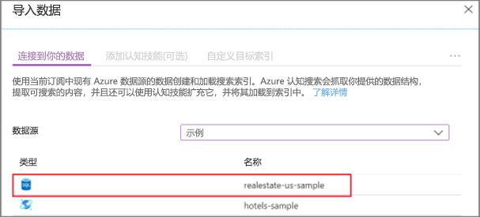
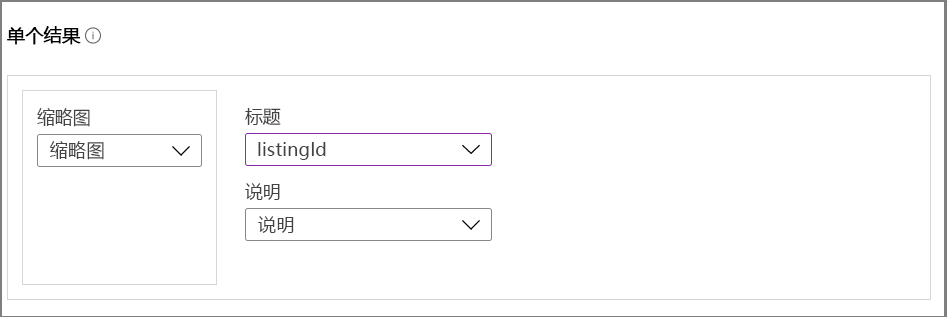
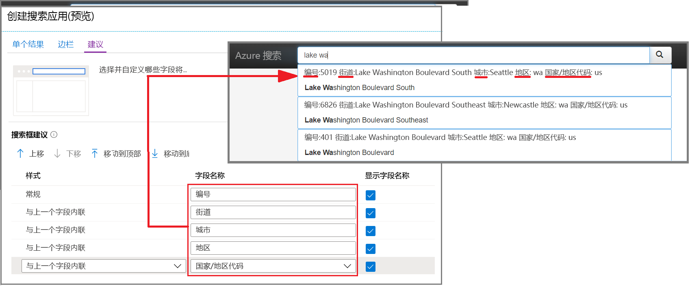
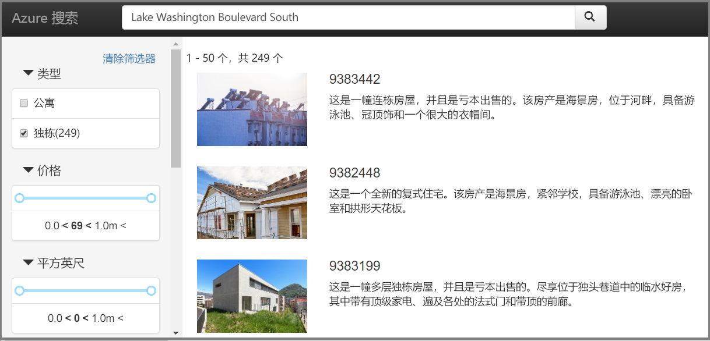

# 快速入门：在门户中创建搜索应用（Azure 认知搜索）

使用门户的“创建搜索应用”向导生成可在浏览器中运行的、可供下载的“localhost”样式 Web 应用。  根据其配置，生成的应用在首次使用时就能正常运行，并与远程索引建立有效连接。 默认应用可以包含搜索栏、结果区域、边栏筛选器和自动提示支持。

如果没有 Azure 订阅，请在开始之前创建一个[免费帐户](https://azure.microsoft.com/free/?WT.mc_id=A261C142F)。 

## 先决条件

[创建 Azure 认知搜索服务](search-create-service-portal.md)或在当前订阅下[查找现有服务](https://ms.portal.azure.com/#blade/HubsExtension/BrowseResourceBlade/resourceType/Microsoft.Search%2FsearchServices)。 可以使用本快速入门的免费服务。 

[创建一个索引](search-create-index-portal.md)用作应用程序的基础。 

本快速入门使用内置的“房地产”示例数据和索引，因为该示例包含缩略图。 若要创建本练习中使用的索引，请运行“导入数据”向导，并选择“realestate-us-sample”数据源。  

索引可供使用后，转到下一步。

## 启动向导

1. 登录到 [Azure 门户](https://portal.azure.com)并[找到你的搜索服务](https://ms.portal.azure.com/#blade/HubsExtension/BrowseResourceBlade/resourceType/Microsoft.Search%2FsearchServices)。

1. 在“概述”页中间的链接中，选择“索引”。  

1. 从现有索引的列表中选择“realestate-us-sample-index”。 

1. 在索引页的顶部，选择“创建搜索应用(预览版)”以启动向导。 

1. 在第一个向导页上，选择“启用跨源资源共享(CORS)”以将 CORS 支持添加到索引定义。  此步骤是可选的，但如果不执行此步骤，本地 Web 应用无法连接到远程索引。

## 配置搜索结果

向导将为呈现的搜索结果提供一个基本布局，其中包含缩略图、标题和说明的空间。 其中的每个元素由索引中一个提供数据的字段赋值。 

1. 在“缩略图”中，选择“realestate-us-sample”索引中的“thumbnail”字段。   此示例正好包含 URL 定址图像形式的缩略图，这些缩略图存储在名为 *thumbnail* 的字段中。 如果索引中没有图像，请将此字段留空。

1. 在“标题”中，选择能够表达每个文档的唯一性的字段。 在此示例中，列表 ID 是合理的选择。

1. 在“说明”中，选择一个提供详细信息的字段，这些信息可以帮助用户确定是否要单击进入特定的文档。

## 添加边栏

搜索服务支持分面导航（通常以边栏的形式呈现）。 分面基于可筛选且可分面的字段，在索引架构中表示。

在 Azure 认知搜索中，分面导航是一种累积筛选体验。 在一个类别中选择多个筛选器会展开结果（例如，在“城市”中选择“西雅图”和“贝尔维尤”）。 跨类别选择多个筛选器会缩小结果范围。

> [!TIP]
> 可以在门户中查看整个索引架构。 在每个索引的概述页中，找到“索引定义(JSON)”链接。  符合分面导航要求的字段具有“filterable: true”和“facetable: true”属性。

接受当前所做的分面选择，然后转到下一页。

## 添加自动提示功能

自动提示功能以自动完成和查询建议的形式提供。 向导支持查询建议。 根据用户提供的击键输入，搜索服务将返回可选作输入的“已完成”查询字符串列表。

在特定的字段定义中启用建议。 向导提供相应的选项用于配置要在建议中包含的信息量。 

以下屏幕截图显示了向导中的选项，同时显示了应用中呈现的页面。 其中展示了如何使用字段选项，以及如何使用“显示字段名称”在建议中包含或排除标签。

## 创建、下载和执行

1. 选择“创建搜索应用”生成 HTML 文件。 

1. 出现提示时，请选择“下载应用”以下载文件。 

1. 打开 文件。 应会看到类似于以下屏幕截图的页面。 输入一个搜索词，然后使用筛选器来缩小结果范围。 

基础索引由虚构生成的、已在不同文档中复制的数据构成，说明有时与图像不符。 如果基于自己的索引创建应用，则预期会获得更有整体性的体验。

## 清理资源

在自己的订阅中操作时，最好在项目结束时确定是否仍需要已创建的资源。 持续运行资源可能会产生费用。 可以逐个删除资源，也可以删除资源组以删除整个资源集。

可以使用左侧导航窗格中的“所有资源”或“资源组”链接   ，在门户中查找和管理资源。

如果使用的是免费服务，请记住只能设置三个索引、索引器和数据源。 可以在门户中删除单个项目，以不超出此限制。 

## 后续步骤

默认应用对于初始探索和小任务非常有用，而尽早查看 API 有助于更深入地了解概念和工作流：

> [!div class="nextstepaction"]
> [使用 .NET SDK 创建索引](https://docs.microsoft.com/azure/search/search-create-index-dotnet)